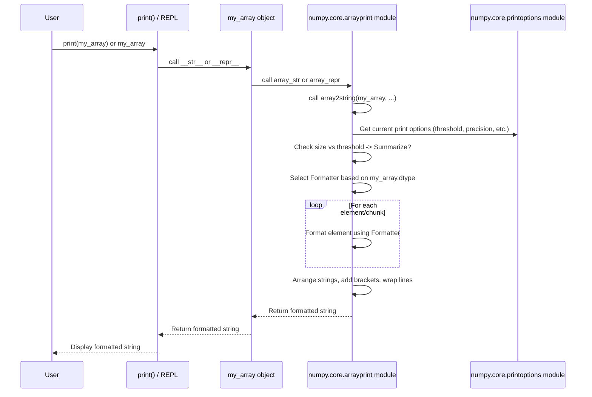

# Chapter 5: Array Printing (`arrayprint`)

In the previous chapter, [Chapter 4: Numeric Types (`numerictypes`)](04_numeric_types___numerictypes__.md), we explored the different kinds of data NumPy can store in its arrays, like `int32`, `float64`, and more. Now that we know about the arrays ([`ndarray`](01_ndarray__n_dimensional_array_.md)), their data types ([`dtype`](02_dtype__data_type_object_.md)), the functions that operate on them ([`ufunc`](03_ufunc__universal_function_.md)), and the specific number types (`numerictypes`), a practical question arises: How do we actually *look* at these arrays, especially if they are very large?

## What Problem Does `arrayprint` Solve? Making Arrays Readable

Imagine you have a NumPy array representing a large image, maybe with millions of pixel values. Or perhaps you have simulation data with thousands of temperature readings.

```python
import numpy as np

# Imagine this is a huge array, maybe thousands of numbers
large_array = np.arange(2000)

# If Python just tried to print every single number...
# it would flood your screen and be impossible to read!
# print(list(large_array)) # <-- Don't run this! It would be too long.
```

If NumPy just dumped *all* the numbers onto your screen whenever you tried to display a large array, it would be overwhelming and useless. We need a way to show the array's contents in a concise, human-friendly format. How can we get a *sense* of the array's data without printing every single element?

This is the job of NumPy's **array printing** mechanism, often referred to internally by the name of its main Python module, `arrayprint`.

## What is Array Printing (`arrayprint`)?

`arrayprint` is NumPy's **"pretty printer"** for `ndarray` objects. It's responsible for converting a NumPy array into a nicely formatted string representation that's easy to read and understand when you display it (e.g., in your Python console, Jupyter notebook, or using the `print()` function).

Think of it like getting a summary report instead of the raw database dump. `arrayprint` intelligently decides how to show the array, considering things like:

*   **Summarization:** For large arrays, it shows only the beginning and end elements, using ellipsis (`...`) to indicate the omitted parts.
*   **Precision:** It controls how many decimal places are shown for floating-point numbers.
*   **Line Wrapping:** It breaks long rows of data into multiple lines to fit within a certain width.
*   **Special Values:** It uses consistent strings for "Not a Number" (`nan`) and infinity (`inf`).
*   **Customization:** It allows you to change these settings to suit your needs.

Let's see it in action with our `large_array`:

```python
import numpy as np

large_array = np.arange(2000)

# Let NumPy's array printing handle it
print(large_array)
```

**Output:**

```
[   0    1    2 ... 1997 1998 1999]
```

Instead of 2000 numbers flooding the screen, NumPy smartly printed only the first three and the last three, with `...` in between. This gives us a good idea of the array's contents (a sequence starting from 0) without being overwhelming.

## Key Features and Options

`arrayprint` has several options you can control to change how arrays are displayed.

### 1. Summarization (`threshold` and `edgeitems`)

*   `threshold`: The total number of array elements that triggers summarization. If the array's `size` is greater than `threshold`, the array gets summarized. (Default: 1000)
*   `edgeitems`: When summarizing, this is the number of items shown at the beginning and end of each dimension. (Default: 3)

Let's try printing a smaller array and then changing the threshold:

```python
import numpy as np

# An array with 10 elements
arr = np.arange(10)
print("Original:")
print(arr)

# Temporarily set the threshold lower (e.g., 5)
# We use np.printoptions as a context manager for temporary settings
with np.printoptions(threshold=5):
  print("\nWith threshold=5:")
  print(arr)

# Change edgeitems too
with np.printoptions(threshold=5, edgeitems=2):
  print("\nWith threshold=5, edgeitems=2:")
  print(arr)
```

**Output:**

```
Original:
[0 1 2 3 4 5 6 7 8 9]

With threshold=5:
[0 1 2 ... 7 8 9]

With threshold=5, edgeitems=2:
[0 1 ... 8 9]
```
You can see how lowering the `threshold` caused the array (size 10) to be summarized, and `edgeitems` controlled how many elements were shown at the ends.

### 2. Floating-Point Precision (`precision` and `suppress`)

*   `precision`: Controls the number of digits displayed after the decimal point for floats. (Default: 8)
*   `suppress`: If `True`, prevents NumPy from using scientific notation for very small numbers and prints them as zero if they are smaller than the current precision. (Default: False)

```python
import numpy as np

# An array with floating-point numbers
float_arr = np.array([0.123456789, 1.5e-10, 2.987])
print("Default precision:")
print(float_arr)

# Set precision to 3
with np.printoptions(precision=3):
  print("\nWith precision=3:")
  print(float_arr)

# Set precision to 3 and suppress small numbers
with np.printoptions(precision=3, suppress=True):
  print("\nWith precision=3, suppress=True:")
  print(float_arr)
```

**Output:**

```
Default precision:
[1.23456789e-01 1.50000000e-10 2.98700000e+00]

With precision=3:
[1.235e-01 1.500e-10 2.987e+00]

With precision=3, suppress=True:
[0.123 0.    2.987]
```
Notice how `precision` changed the rounding, and `suppress=True` made the very small number (`1.5e-10`) display as `0.` and switched from scientific notation to fixed-point for the others. There's also a `floatmode` option for more fine-grained control over float formatting (e.g., 'fixed', 'unique').

### 3. Line Width (`linewidth`)

*   `linewidth`: The maximum number of characters allowed per line before wrapping. (Default: 75)

```python
import numpy as np

# A 2D array
arr2d = np.arange(12).reshape(3, 4) * 0.1
print("Default linewidth:")
print(arr2d)

# Set a narrow linewidth
with np.printoptions(linewidth=30):
  print("\nWith linewidth=30:")
  print(arr2d)
```

**Output:**

```
Default linewidth:
[[0.  0.1 0.2 0.3]
 [0.4 0.5 0.6 0.7]
 [0.8 0.9 1.  1.1]]

With linewidth=30:
[[0.  0.1 0.2 0.3]
 [0.4 0.5 0.6 0.7]
 [0.8 0.9 1.  1.1]]
```
*(Note: The output might not actually wrap here because the lines are short. If the array was wider, you'd see the rows break across multiple lines with the narrower `linewidth` setting.)*

### 4. Other Options

*   `nanstr`: String representation for Not a Number. (Default: 'nan')
*   `infstr`: String representation for Infinity. (Default: 'inf')
*   `sign`: Control sign display for floats ('-', '+', or ' ').
*   `formatter`: A dictionary to provide completely custom formatting functions for specific data types (like bool, int, float, datetime, etc.). This is more advanced.

## Using and Customizing Array Printing

You usually interact with array printing implicitly just by displaying an array:

```python
import numpy as np
arr = np.linspace(0, 1, 5)

# These both use NumPy's array printing behind the scenes
print(arr)         # Calls __str__ -> array_str -> array2string
arr                # In interactive sessions, calls __repr__ -> array_repr -> array2string
```

To customize the output, you can use:

1.  **`np.set_printoptions(...)`:** Sets options globally (for your entire Python session).
2.  **`np.get_printoptions()`:** Returns a dictionary of the current settings.
3.  **`np.printoptions(...)`:** A context manager to set options *temporarily* within a `with` block (as used in the examples above). This is often the preferred way to avoid changing settings permanently.
4.  **`np.array2string(...)`:** A function to get the string representation directly, allowing you to override options just for that one call.

```python
import numpy as np
import sys # Needed for sys.maxsize

arr = np.random.rand(10, 10) * 1000

# --- Global Setting ---
print("--- Setting threshold globally ---")
original_options = np.get_printoptions() # Store original settings
np.set_printoptions(threshold=50)
print(arr)
np.set_printoptions(**original_options) # Restore original settings

# --- Temporary Setting (Context Manager) ---
print("\n--- Setting precision temporarily ---")
with np.printoptions(precision=2, suppress=True):
    print(arr)
print("\n--- Back to default precision ---")
print(arr) # Options are automatically restored outside the 'with' block

# --- Direct Call with Overrides ---
print("\n--- Using array2string with summarization off ---")
# Use sys.maxsize to effectively disable summarization
arr_string = np.array2string(arr, threshold=sys.maxsize, precision=1)
# print(arr_string) # This might still be very long! Let's just print the first few lines
print('\n'.join(arr_string.splitlines()[:5]) + '\n...')
```

**Output (will vary due to random numbers):**

```
--- Setting threshold globally ---
[[992.84337197 931.73648142 119.68616987 ... 305.61919366 516.97897205
  707.69140878]
 [507.45895986 253.00740626 739.97091378 ... 755.69943511 813.11931119
   19.84654589]
 [941.25264871 689.43209981 820.11954711 ... 709.83933545 192.49837505
  609.30358618]
 ...
 [498.86686503 872.79555956 401.19333028 ... 552.97492858 303.59379464
  308.61881807]
 [797.51920685 427.86020151 783.2019203  ... 511.63382762 322.52764881
  778.22766019]
 [ 54.84391309 938.24403397 796.7431406  ... 495.90873227 267.16620292
  409.51491904]]

--- Setting precision temporarily ---
[[992.84 931.74 119.69 ... 305.62 516.98 707.69]
 [507.46 253.01 739.97 ... 755.7  813.12  19.85]
 [941.25 689.43 820.12 ... 709.84 192.5  609.3 ]
 ...
 [498.87 872.8  401.19 ... 552.97 303.59 308.62]
 [797.52 427.86 783.2  ... 511.63 322.53 778.23]
 [ 54.84 938.24 796.74 ... 495.91 267.17 409.51]]

--- Back to default precision ---
[[992.84337197 931.73648142 119.68616987 ... 305.61919366 516.97897205
  707.69140878]
 [507.45895986 253.00740626 739.97091378 ... 755.69943511 813.11931119
   19.84654589]
 [941.25264871 689.43209981 820.11954711 ... 709.83933545 192.49837505
  609.30358618]
 ...
 [498.86686503 872.79555956 401.19333028 ... 552.97492858 303.59379464
  308.61881807]
 [797.51920685 427.86020151 783.2019203  ... 511.63382762 322.52764881
  778.22766019]
 [ 54.84391309 938.24403397 796.7431406  ... 495.90873227 267.16620292
  409.51491904]]

--- Using array2string with summarization off ---
[[992.8 931.7 119.7 922.  912.2 156.5 459.4 305.6 517.  707.7]
 [507.5 253.  740.  640.3 420.3 652.1 197.  755.7 813.1  19.8]
 [941.3 689.4 820.1 125.8 598.2 219.3 466.7 709.8 192.5 609.3]
 [ 32.  855.2 362.1 434.9 133.5 148.1 522.6 725.1 395.5 377.9]
 [332.7 782.2 587.3 320.3 905.5 412.8 378.  911.9 972.1 400.2]
...
```

## A Glimpse Under the Hood

What happens when you call `print(my_array)`?

1.  Python calls the `__str__` method of the `ndarray` object.
2.  NumPy's `ndarray.__str__` method typically calls the internal function `_array_str_implementation`.
3.  `_array_str_implementation` checks for simple cases (like 0-dimensional arrays) and then calls the main workhorse: `array2string`.
4.  **`array2string`** (defined in `numpy/core/arrayprint.py`) takes the array and any specified options (like `precision`, `threshold`, etc.). It also reads the current default print options (managed by `numpy/core/printoptions.py` using context variables).
5.  It determines if the array needs **summarization** based on its `size` and the `threshold` option.
6.  It figures out the **correct formatting function** for the array's `dtype` (e.g., `IntegerFormat`, `FloatingFormat`, `DatetimeFormat`). These formatters handle details like precision, sign, and scientific notation for individual elements. `FloatingFormat`, for example, might use the efficient `dragon4` algorithm (implemented in C) to convert floats to strings accurately.
7.  It recursively processes the array's dimensions:
    *   For each element (or summarized chunk), it calls the chosen formatting function to get its string representation.
    *   It arranges these strings, adding separators (like spaces or commas) and brackets (`[` `]`).
    *   It checks the `linewidth` and inserts line breaks and indentation as needed.
    *   If summarizing, it inserts the ellipsis (`...`) string (`summary_insert`).
8.  Finally, `array2string` returns the complete, formatted string representation of the array.



The core logic resides in `numpy/core/arrayprint.py`. This file contains `array2string`, `array_repr`, `array_str`, and various formatter classes (`FloatingFormat`, `IntegerFormat`, `BoolFormat`, `ComplexFloatingFormat`, `DatetimeFormat`, `TimedeltaFormat`, `StructuredVoidFormat`, etc.). The global print options themselves are managed using Python's `contextvars` in `numpy/core/printoptions.py`, allowing settings to be changed globally or temporarily within a context.

## Conclusion

You've now learned how NumPy takes potentially huge and complex arrays and turns them into readable string representations using its `arrayprint` mechanism. Key takeaways:

*   `arrayprint` is NumPy's "pretty printer" for arrays.
*   It uses **summarization** (`threshold`, `edgeitems`) for large arrays.
*   It controls **formatting** (like `precision`, `suppress` for floats) and **layout** (`linewidth`).
*   You can customize printing **globally** (`set_printoptions`), **temporarily** (`printoptions` context manager), or for **single calls** (`array2string`).
*   The core logic resides in `numpy/core/arrayprint.py`, using formatters tailored to different dtypes and reading options from `numpy/core/printoptions.py`.

Understanding array printing helps you effectively inspect and share your NumPy data.

Next, we'll start looking at the specific C and Python modules that form the core of NumPy's implementation, beginning with the central [Chapter 6: multiarray Module](06_multiarray_module.md).

---

Generated by [AI Codebase Knowledge Builder](https://github.com/The-Pocket/Tutorial-Codebase-Knowledge)