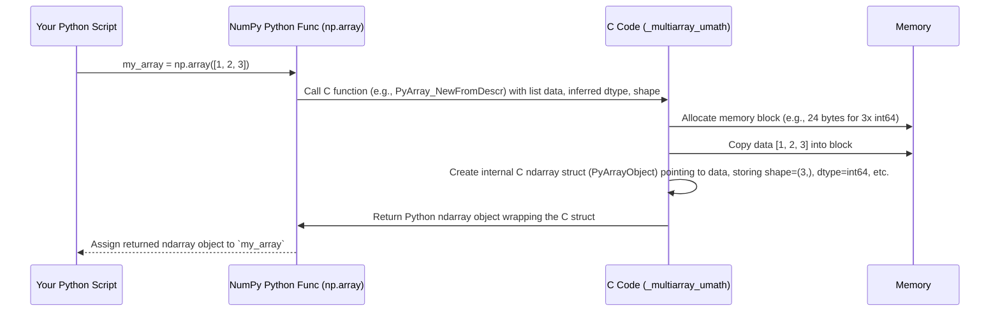

# Chapter 6: multiarray Module

Welcome back! In [Chapter 5: Array Printing (`arrayprint`)](05_array_printing___arrayprint__.md), we saw how NumPy takes complex arrays and presents them in a readable format. We've now covered the array container ([`ndarray`](01_ndarray__n_dimensional_array_.md)), its data types ([`dtype`](02_dtype__data_type_object_.md)), the functions that compute on them ([`ufunc`](03_ufunc__universal_function_.md)), the catalog of types ([`numerictypes`](04_numeric_types___numerictypes__.md)), and how arrays are displayed ([`arrayprint`](05_array_printing___arrayprint__.md)).

Now, let's peek deeper into the engine room. Where does the fundamental `ndarray` object *actually* come from? How are core operations like creating arrays or accessing elements implemented so efficiently? The answer lies largely within the C code associated with the concept of the `multiarray` module.

## What Problem Does `multiarray` Solve? Providing the Engine

Think about the very first step in using NumPy: creating an array.

```python
import numpy as np

# How does this seemingly simple line actually work?
my_array = np.array([1, 2, 3, 4, 5])

# How does NumPy know its shape? How is the data stored?
print(my_array)
print(my_array.shape)
```

When you execute `np.array()`, you're using a convenient Python function. But NumPy's speed doesn't come from Python itself. It comes from highly optimized code written in the C programming language. How do these Python functions connect to that fast C code? And where is that C code defined?

The `multiarray` concept represents this core C engine. It's the part of NumPy responsible for:

1.  **Defining the `ndarray` object:** The very structure that holds your data, its shape, its data type ([`dtype`](02_dtype__data_type_object_.md)), and how it's laid out in memory.
2.  **Implementing Fundamental Operations:** Providing the low-level C functions for creating arrays (like allocating memory), accessing elements (indexing), changing the view (slicing, reshaping), and basic mathematical operations.

Think of the Python functions like `np.array`, `np.zeros`, or accessing `arr.shape` as the dashboard and controls of a car. The `multiarray` C code is the powerful engine under the hood that actually makes the car move efficiently.

## What is the `multiarray` Module (Concept)?

Historically, `multiarray` was a distinct C extension module in NumPy. An "extension module" is a module written in C (or C++) that Python can import and use just like a regular Python module. This allows Python code to leverage the speed of C for performance-critical tasks.

More recently (since NumPy 1.16), the C code for `multiarray` was merged with the C code for the [ufunc (Universal Function)](03_ufunc__universal_function_.md) system (which we'll discuss more in [Chapter 7: umath Module](07_umath_module.md)) into a single, larger C extension module typically called `_multiarray_umath.cpython-*.so` (on Linux/Mac) or `_multiarray_umath.pyd` (on Windows).

Even though the C code is merged, the *concept* of `multiarray` remains important. It represents the C implementation layer that provides:

*   The **`ndarray` object type** itself (`PyArrayObject` in C).
*   The **C-API (Application Programming Interface)**: A set of C functions that can be called by other C extensions (and internally by NumPy's Python code) to work with `ndarray` objects. Examples include functions to create arrays from data, get the shape, get the data pointer, perform indexing, etc.
*   Implementations of **core array functionalities**: array creation, data type handling ([`dtype`](02_dtype__data_type_object_.md)), memory layout management (strides), indexing, slicing, reshaping, transposing, and some basic operations.

The Python files you might see in the NumPy source code, like `numpy/core/multiarray.py` and `numpy/core/numeric.py`, often serve as Python wrappers. They provide the user-friendly Python functions (like `np.array`, `np.empty`, `np.dot`) that eventually call the fast C functions implemented within the `_multiarray_umath` extension module.

```python
# numpy/core/multiarray.py - Simplified Example
# This Python file imports directly from the C extension module

from . import _multiarray_umath # Import the compiled C module
from ._multiarray_umath import * # Make C functions available

# Functions like 'array', 'empty', 'dot' that you use via `np.`
# might be defined or re-exported here, ultimately calling C code.
# For example, the `array` function here might parse the Python input
# and then call a C function like `PyArray_NewFromDescr` from _multiarray_umath.
```

This structure gives you the flexibility and ease of Python on the surface, powered by the speed and efficiency of C underneath.

## A Glimpse Under the Hood: Creating an Array

Let's trace what happens when you call `my_array = np.array([1, 2, 3])`:

1.  **Python Call:** You call the Python function `np.array`. This function likely lives in `numpy/core/numeric.py` or is exposed through `numpy/core/multiarray.py`.
2.  **Argument Parsing:** The Python function examines the input `[1, 2, 3]`. It figures out the data type (likely `int64` by default on many systems) and the shape (which is `(3,)`).
3.  **Call C-API Function:** The Python function calls a specific function within the compiled `_multiarray_umath` C extension module. This C function is designed to create a new array. A common one is `PyArray_NewFromDescr` or a related helper.
4.  **Memory Allocation (C):** The C function asks the operating system for a block of memory large enough to hold 3 integers of the chosen type (e.g., 3 * 8 bytes = 24 bytes for `int64`).
5.  **Data Copying (C):** The C function copies the values `1`, `2`, and `3` from the Python list into the newly allocated memory block.
6.  **Create C `ndarray` Struct:** The C function creates an internal C structure (called `PyArrayObject`). This structure stores:
    *   A pointer to the actual data block in memory.
    *   Information about the data type ([`dtype`](02_dtype__data_type_object_.md)).
    *   The shape of the array (`(3,)`).
    *   The strides (how many bytes to jump to get to the next element in each dimension).
    *   Other metadata (like flags indicating if it owns the data, if it's writeable, etc.).
7.  **Wrap in Python Object:** The C function wraps this internal `PyArrayObject` structure into a Python object that Python can understand – the `ndarray` object you interact with.
8.  **Return to Python:** The C function returns this new Python `ndarray` object back to your Python code, which assigns it to the variable `my_array`.

Here's a simplified view of that flow:



**Where is the Code?**

*   **C Implementation:** The core logic is in C files compiled into the `_multiarray_umath` extension module (e.g., parts of `numpy/core/src/multiarray/`). Files like `alloc.c`, `ctors.c` (constructors), `getset.c` (for getting/setting attributes like shape), `item_selection.c` (indexing) contain relevant C code.
*   **Python Wrappers:** `numpy/core/numeric.py` and `numpy/core/multiarray.py` provide many of the familiar Python functions. They import directly from `_multiarray_umath`.
    ```python
    # From numpy/core/numeric.py - Simplified
    from . import multiarray # Imports numpy/core/multiarray.py
    # multiarray.py itself imports from _multiarray_umath
    from .multiarray import (
        array, asarray, zeros, empty, # Functions defined/re-exported
        # ... many others ...
    )
    ```
*   **Initialization:** `numpy/core/__init__.py` helps set up the `numpy.core` namespace, importing from `multiarray` and `umath`.
    ```python
    # From numpy/core/__init__.py - Simplified
    from . import multiarray
    from . import umath
    # ... other imports ...
    from . import numeric
    from .numeric import * # Pulls in functions like np.array, np.zeros
    # ... more setup ...
    ```
*   **C API Definition:** Files like `numpy/core/include/numpy/multiarray.h` define the C structures (`PyArrayObject`) and function prototypes (`PyArray_NewFromDescr`, etc.) that make up the NumPy C-API. Code generators like `numpy/core/code_generators/generate_numpy_api.py` help create tables (`__multiarray_api.h`, `__multiarray_api.c`) that allow other C extensions to easily access these core NumPy C functions.
    ```python
    # Snippet from numpy/core/code_generators/generate_numpy_api.py
    # This script generates C code that defines an array of function pointers
    # making up the C-API.

    # Describes API functions, their index in the API table, return type, args...
    multiarray_funcs = {
        # ... many functions ...
        'NewLikeArray': (10, None, 'PyObject *', (('PyArrayObject *', 'prototype'), ...)),
        'NewFromDescr': (9, None, 'PyObject *', ...),
        'Empty': (8, None, 'PyObject *', ...),
        # ...
    }

    # ... code to generate C header (.h) and implementation (.c) files ...
    # These generated files help expose the C functions consistently.
    ```

## Conclusion

You've now learned about the conceptual `multiarray` module, the C engine at the heart of NumPy.

*   It's implemented in **C** (as part of the `_multiarray_umath` extension module) for maximum **speed and efficiency**.
*   It provides the fundamental **`ndarray` object** structure.
*   It implements **core array operations** like creation, memory management, indexing, and reshaping at a low level.
*   Python modules like `numpy.core.numeric` and `numpy.core.multiarray` provide user-friendly interfaces that call this underlying C code.
*   Understanding this separation helps explain *why* NumPy is so fast compared to standard Python lists for numerical tasks.

While `multiarray` provides the array structure and basic manipulation, the element-wise mathematical operations often rely on another closely related C implementation layer.

Let's explore that next in [Chapter 7: umath Module](07_umath_module.md).

---

Generated by [AI Codebase Knowledge Builder](https://github.com/The-Pocket/Tutorial-Codebase-Knowledge)