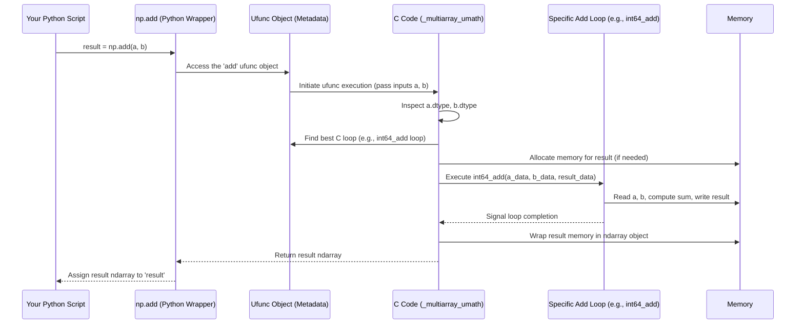

# Chapter 7: umath Module

Welcome to Chapter 7! In [Chapter 6: multiarray Module](06_multiarray_module.md), we explored the core C engine that defines the `ndarray` object and handles fundamental operations like creating arrays and accessing elements. We saw that the actual power comes from C code.

But what about the mathematical operations themselves? When you perform `np.sin(my_array)` or `array1 + array2`, which part of the C engine handles the actual sine calculation or the addition for *every single element*? This is where the concept of the `umath` module comes in.

## What Problem Does `umath` Solve? Implementing Fast Array Math

Remember the [ufunc (Universal Function)](03_ufunc__universal_function_.md) from Chapter 3? Ufuncs are NumPy's special functions designed to operate element-wise on arrays with incredible speed (like `np.add`, `np.sin`, `np.log`).

Let's take a simple example:

```python
import numpy as np

angles = np.array([0, np.pi/2, np.pi])
sines = np.sin(angles) # How is this sine calculated so fast?

print(angles)
print(sines)
```

**Output:**

```
[0.         1.57079633 3.14159265]
[0.0000000e+00 1.0000000e+00 1.2246468e-16] # Note: pi value is approximate
```

The Python function `np.sin` acts as a dispatcher. It needs to hand off the actual, heavy-duty work of calculating the sine for each element in the `angles` array to highly optimized code. Where does this optimized code live?

Historically, the C code responsible for implementing the *loops and logic* of these mathematical ufuncs (like addition, subtraction, sine, cosine, logarithm, etc.) was contained within a dedicated C extension module called `umath`. It provided the fast, element-by-element computational kernels.

## What is the `umath` Module (Concept)?

The `umath` module represents the part of NumPy's C core dedicated to implementing **universal functions (ufuncs)**. Think of it as NumPy's built-in, highly optimized math library specifically designed for element-wise operations on arrays.

**Key Points:**

1.  **Houses ufunc Implementations:** It contains the low-level C code that performs the actual calculations for functions like `np.add`, `np.sin`, `np.exp`, `np.sqrt`, etc.
2.  **Optimized Loops:** This C code includes specialized loops that iterate over the array elements very efficiently, often tailored for specific [dtype (Data Type Object)](02_dtype__data_type_object_.md)s (like a fast loop for adding 32-bit integers, another for 64-bit floats, etc.).
3.  **Historical C Module:** Originally, `umath` was a separate compiled C extension module (`umath.so` or `umath.pyd`).
4.  **Merged with `multiarray`:** Since NumPy 1.16, the C code for `umath` has been merged with the C code for `multiarray` into a single, larger C extension module named `_multiarray_umath`. While they are now in the same compiled file, the *functions and purpose* associated with `umath` (implementing ufunc math) are distinct from those associated with `multiarray` (array object structure and basic manipulation).
5.  **Python Access (`numpy/core/umath.py`):** You don't usually interact with the C code directly. Instead, NumPy provides Python functions (like `np.add`, `np.sin`) in the Python file `numpy/core/umath.py`. These Python functions are wrappers that know how to find and trigger the correct C implementation within the `_multiarray_umath` extension module.

**Analogy:** Imagine `multiarray` builds the car chassis and engine block (`ndarray` structure). `umath` provides specialized, high-performance engine components like the fuel injectors for addition (`np.add`'s C code), the turbocharger for exponentiation (`np.exp`'s C code), and the precise valve timing for trigonometry (`np.sin`'s C code). The Python functions (`np.add`, `np.sin`) are the pedals and buttons you use to activate these components.

## How it Works (Usage Perspective)

As a NumPy user, you typically trigger the `umath` C code indirectly by calling a ufunc:

```python
import numpy as np

a = np.array([1, 2, 3])
b = np.array([10, 20, 30])

# Calling the ufunc np.add
result1 = np.add(a, b) # Triggers the C implementation for addition

# Using the operator '+' which also calls np.add for arrays
result2 = a + b        # Also triggers the C implementation

print(f"Using np.add: {result1}")
print(f"Using + operator: {result2}")
```

**Output:**

```
Using np.add: [11 22 33]
Using + operator: [11 22 33]
```

Both `np.add(a, b)` and `a + b` ultimately lead to NumPy executing the highly optimized C code associated with the addition ufunc, which conceptually belongs to the `umath` part of the core.

## A Glimpse Under the Hood

When you call a ufunc like `np.add(a, b)`:

1.  **Python Call:** You invoke the Python function `np.add` (found in `numpy/core/umath.py` or exposed through `numpy/core/__init__.py`).
2.  **Identify Ufunc Object:** This Python function accesses the corresponding ufunc object (`np.add` itself is a ufunc object). This object holds metadata about the operation.
3.  **Dispatch to C:** The ufunc object mechanism (part of the `_multiarray_umath` C core) takes over.
4.  **Type Resolution & Loop Selection:** The C code inspects the `dtype`s of the input arrays (`a` and `b`). Based on the input types, it looks up an internal table associated with the `add` ufunc to find the *best* matching, pre-compiled C loop. For example, if `a` and `b` are both `int64`, it selects the C function specifically designed for `int64 + int64 -> int64`. This selection process might involve type casting rules (e.g., adding `int32` and `float64` might choose a loop that operates on `float64`).
5.  **Execute C Loop:** The selected C function (the core `umath` implementation for this specific type combination) is executed. This function iterates efficiently over the input array(s) memory, performs the addition element by element, and stores the results in the output array's memory.
6.  **Return Result:** The C machinery wraps the output memory into a new `ndarray` object and returns it back to your Python code.

Here's a simplified sequence diagram:



**Where is the Code?**

*   **C Extension Module:** The compiled code lives in `_multiarray_umath.so` / `.pyd`.
*   **Ufunc Definition & Generation:** The script `numpy/core/code_generators/generate_umath.py` is crucial. It contains definitions (like the `defdict` dictionary) that describe each ufunc: its name, number of inputs/outputs, identity element, the C functions to use for different type combinations (`TD` entries), and associated docstrings. This script generates C code (`__umath_generated.c`, which is then compiled) that sets up the ufunc objects and their internal loop tables.
    ```python
    # Simplified snippet from generate_umath.py's defdict for 'add'
    'add':
        Ufunc(2, 1, Zero, # nin=2, nout=1, identity=0
              docstrings.get('numpy._core.umath.add'), # Docstring reference
              'PyUFunc_AdditionTypeResolver', # Type resolution logic
              TD('?', ...), # Loop for booleans
              TD(no_bool_times_obj, dispatch=[...]), # Loops for numeric types
              # ... loops for datetime, object ...
              ),
    ```
    This definition tells the generator how to build the `np.add` ufunc, including which C functions (often defined in other C files or generated from templates) handle addition for different data types.
*   **C Loop Implementations:** The actual C code performing the math often comes from template files (like `numpy/core/src/umath/loops.c.src`) or CPU-dispatch-specific files (like `numpy/core/src/umath/loops_arithm_fp.dispatch.c.src`). These `.src` files contain templates written in a C-like syntax that get processed to generate specific C code for various data types (e.g., generating `int32_add`, `int64_add`, `float32_add`, `float64_add` from a single addition template). The dispatch files allow NumPy to choose optimized code paths (using e.g., AVX2, AVX512 instructions) based on your CPU's capabilities at runtime.
*   **Python Wrappers:** `numpy/core/umath.py` provides the Python functions like `np.add`, `np.sin` that you call. It primarily imports these functions directly from the `_multiarray_umath` C extension module.
    ```python
    # From numpy/core/umath.py - Simplified
    from . import _multiarray_umath
    from ._multiarray_umath import * # Imports C-defined ufuncs like 'add'

    # Functions like 'add', 'sin', 'log' are now available in this module's
    # namespace, ready to be used via `np.add`, `np.sin`, etc.
    ```
*   **Namespace Setup:** `numpy/core/__init__.py` imports from `numpy.core.umath` (among others) to make functions like `np.add` easily accessible under the main `np` namespace.

## Conclusion

You've now seen that the `umath` concept represents the implementation heart of NumPy's universal functions.

*   It provides the optimized **C code** that performs element-wise mathematical operations.
*   It contains specialized **loops** for different data types, crucial for NumPy's speed.
*   While historically a separate C module, its functionality is now part of the merged `_multiarray_umath` C extension.
*   Python files like `numpy/core/umath.py` provide access, but the real work happens in C, often defined via generators like `generate_umath.py` and implemented in templated `.src` or dispatchable C files.

Understanding `umath` clarifies where the computational power for element-wise operations originates within NumPy's core.

So far, we've focused on NumPy's built-in functions. But how does NumPy interact with other libraries or allow customization of how operations work on its arrays?

Next, we'll explore a powerful mechanism for extending NumPy's reach: [Chapter 8: __array_function__ Protocol / Overrides (`overrides`)](08___array_function___protocol___overrides___overrides__.md).

---

Generated by [AI Codebase Knowledge Builder](https://github.com/The-Pocket/Tutorial-Codebase-Knowledge)
