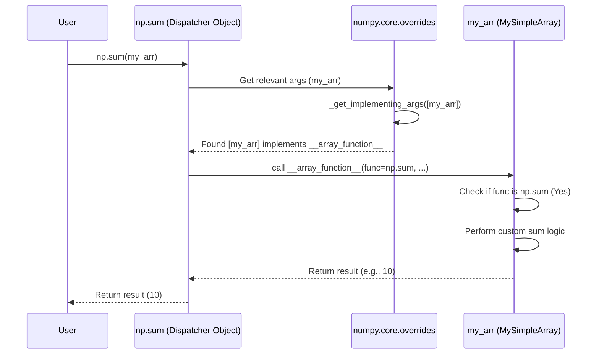

# Chapter 8: __array_function__ Protocol / Overrides (`overrides`)

Welcome to the final chapter of our NumPy Core exploration! In [Chapter 7: umath Module](07_umath_module.md), we learned how NumPy implements its fast, element-wise mathematical functions (`ufuncs`) using optimized C code. We've seen the core components: the `ndarray` container, `dtype` descriptions, `ufunc` operations, numeric types, printing, and the C modules (`multiarray`, `umath`) that power them.

But NumPy doesn't exist in isolation. The Python scientific ecosystem is full of other libraries that also work with array-like data. Think of libraries like Dask (for parallel computing on large datasets that don't fit in memory) or CuPy (for running NumPy-like operations on GPUs). How can these *different* types of arrays work smoothly with standard NumPy functions like `np.sum`, `np.mean`, or `np.concatenate`?

## What Problem Does `__array_function__` Solve? Speaking NumPy's Language

Imagine you have a special type of array, maybe one that lives on a GPU (like a CuPy array) or one that represents a computation spread across many machines (like a Dask array). You want to calculate the sum of its elements.

Ideally, you'd just write:

```python
# Assume 'my_special_array' is an instance of a custom array type
# (e.g., from CuPy or Dask)
result = np.sum(my_special_array)
```

But wait, `np.sum` is a NumPy function, designed primarily for NumPy's `ndarray` ([Chapter 1: ndarray (N-dimensional array)](01_ndarray__n_dimensional_array_.md)). How can it possibly know how to sum elements on a GPU or coordinate a distributed calculation?

Before the `__array_function__` protocol, this was tricky. Either the library (like CuPy) had to provide its *own* complete set of functions (`cupy.sum`), or NumPy would have needed specific code to handle every possible external array type, which is impossible to maintain.

We need a way for NumPy functions to ask the input objects: "Hey, do *you* know how to handle this operation (`np.sum` in this case)?" If the object says yes, NumPy can step back and let the object take control.

This is exactly what the `__array_function__` protocol (defined in NEP-18) allows. It's like a common language or negotiation rule that lets different array libraries "override" or take over the execution of NumPy functions when their objects are involved.

**Analogy:** Think of NumPy functions as a universal remote control. Initially, it only knows how to control NumPy-brand TVs (`ndarray`s). The `__array_function__` protocol is like adding a feature where the remote, when pointed at a different brand TV (like a CuPy array), asks the TV: "Do you understand this button (e.g., 'sum')?" If the TV responds, "Yes, here's how I do 'sum'," the remote lets the TV handle it.

## What is the `__array_function__` Protocol?

The `__array_function__` protocol is a special method that array-like objects can implement. When a NumPy function is called with arguments that include one or more objects defining `__array_function__`, NumPy follows these steps:

1.  **Check Arguments:** NumPy looks at all the input arguments passed to the function (e.g., `np.sum(my_array, axis=0)`).
2.  **Find Overrides:** It identifies which arguments have an `__array_function__` method.
3.  **Prioritize:** It sorts these arguments based on a special attribute (`__array_priority__`) or by their position in the function call if priorities are equal. Subclasses are also considered.
4.  **Negotiate:** It calls the `__array_function__` method of the highest-priority object. It passes two key pieces of information to this method:
    *   The original NumPy function object itself (e.g., `np.sum`).
    *   The arguments (`*args`) and keyword arguments (`**kwargs`) that were originally passed to the NumPy function.
5.  **Delegate:** The object's `__array_function__` method now has control. It can:
    *   Handle the operation itself (e.g., perform a GPU sum if it's a CuPy array) and return the result.
    *   Decide it *cannot* handle this specific function or combination of arguments and return a special value `NotImplemented`. In this case, NumPy tries the `__array_function__` method of the *next* highest-priority object.
    *   Potentially call the original NumPy function on converted inputs if needed.
6.  **Fallback:** If *no* object's `__array_function__` method handles the call (they all return `NotImplemented`), NumPy raises a `TypeError`. *Crucially, NumPy usually does NOT fall back to its own default implementation on the foreign objects unless explicitly told to by the override.*

## Using `__array_function__` (Implementing a Simple Override)

Let's create a very basic array-like class that overrides `np.sum` but lets other functions pass through (by returning `NotImplemented`).

```python
import numpy as np

class MySimpleArray:
    def __init__(self, data):
        # Store data internally, maybe as a NumPy array for simplicity here
        self._data = np.asarray(data)

    # This is the magic method!
    def __array_function__(self, func, types, args, kwargs):
        print(f"MySimpleArray.__array_function__ got called for {func.__name__}")

        if func is np.sum:
            # Handle np.sum ourselves!
            print("-> Handling np.sum internally!")
            # Convert args to NumPy arrays if they are MySimpleArray
            np_args = [a._data if isinstance(a, MySimpleArray) else a for a in args]
            np_kwargs = {k: v._data if isinstance(v, MySimpleArray) else v for k, v in kwargs.items()}
            # Perform the actual sum using NumPy on the internal data
            return np.sum(*np_args, **np_kwargs)
        else:
            # For any other function, say we don't handle it
            print(f"-> Don't know how to handle {func.__name__}, returning NotImplemented.")
            return NotImplemented

    # Make it look a bit like an array for printing
    def __repr__(self):
        return f"MySimpleArray({self._data})"

# --- Try it out ---
my_arr = MySimpleArray([1, 2, 3, 4])
print("Array:", my_arr)

# Call np.sum
print("\nCalling np.sum(my_arr):")
total = np.sum(my_arr)
print("Result:", total)

# Call np.mean (which our class doesn't handle)
print("\nCalling np.mean(my_arr):")
try:
    mean_val = np.mean(my_arr)
    print("Result:", mean_val)
except TypeError as e:
    print("Caught expected TypeError:", e)
```

**Output:**

```
Array: MySimpleArray([1 2 3 4])

Calling np.sum(my_arr):
MySimpleArray.__array_function__ got called for sum
-> Handling np.sum internally!
Result: 10

Calling np.mean(my_arr):
MySimpleArray.__array_function__ got called for mean
-> Don't know how to handle mean, returning NotImplemented.
Caught expected TypeError: no implementation found for 'numpy.mean' on types that implement __array_function__: [<class '__main__.MySimpleArray'>]
```

**Explanation:**

1.  We created `MySimpleArray` which holds some data (here, a standard NumPy array `_data`).
2.  We implemented `__array_function__(self, func, types, args, kwargs)`.
    *   `func`: The NumPy function being called (e.g., `np.sum`, `np.mean`).
    *   `types`: A tuple of unique types implementing `__array_function__` in the arguments.
    *   `args`, `kwargs`: The original arguments passed to `func`.
3.  Inside `__array_function__`, we check if `func` is `np.sum`.
    *   If yes, we print a message, extract the internal `_data` from any `MySimpleArray` arguments, call `np.sum` on that data, and return the result. NumPy uses this returned value directly.
    *   If no (like for `np.mean`), we print a message and return `NotImplemented`.
4.  When we call `np.sum(my_arr)`, NumPy detects `__array_function__` on `my_arr`. It calls it. Our method handles `np.sum` and returns `10`.
5.  When we call `np.mean(my_arr)`, NumPy again calls `__array_function__`. This time, our method returns `NotImplemented`. Since no other arguments handle it, NumPy raises a `TypeError` because it doesn't know how to calculate the mean of `MySimpleArray` by default.

This example demonstrates how an external library object can selectively take control of NumPy functions. Libraries like CuPy or Dask implement `__array_function__` much more thoroughly, handling many NumPy functions to perform operations on their specific data representations (GPU arrays, distributed arrays).

## A Glimpse Under the Hood (`overrides.py`)

How does NumPy actually manage this dispatching process? The logic lives primarily in the `numpy/core/overrides.py` module.

1.  **Decorator:** Many NumPy functions (especially those intended to be public and potentially overridden) are decorated with `@array_function_dispatch(...)` or a similar helper (`@array_function_from_dispatcher`). You can see this decorator used in files like `numpy/core/function_base.py` (for `linspace`, `logspace`, etc.) or `numpy/core/numeric.py` (for `sum`, `mean`, etc. indirectly via ufunc machinery).
    ```python
    # Example from numpy/core/function_base.py (simplified)
    from numpy._core import overrides

    array_function_dispatch = functools.partial(
        overrides.array_function_dispatch, module='numpy')

    def _linspace_dispatcher(start, stop, num=None, ...):
        # This helper identifies arguments relevant for dispatch
        return (start, stop)

    @array_function_dispatch(_linspace_dispatcher) # Decorator applied!
    def linspace(start, stop, num=50, ...):
        # ... Actual implementation for NumPy arrays ...
        pass
    ```
2.  **Dispatcher Class:** The decorator wraps the original function (like `linspace`) in a special callable object, often an instance of `_ArrayFunctionDispatcher`.
3.  **Call Interception:** When you call the decorated NumPy function (e.g., `np.linspace(...)`), you're actually calling the `_ArrayFunctionDispatcher` object.
4.  **Argument Check (`_get_implementing_args`):** The dispatcher object first calls the little helper function provided to the decorator (like `_linspace_dispatcher`) to figure out which arguments are relevant for checking the `__array_function__` protocol. Then, it calls the C helper function `_get_implementing_args` (defined in `numpy/core/src/multiarray/overrides.c`) which efficiently inspects the relevant arguments, finds those with `__array_function__`, and sorts them according to priority and type relationships.
5.  **Delegation Loop:** The dispatcher iterates through the implementing arguments found in step 4 (from highest priority to lowest). For each one, it calls its `__array_function__` method.
6.  **Handle Result:**
    *   If `__array_function__` returns a value other than `NotImplemented`, the dispatcher immediately returns that value to the original caller. The process stops.
    *   If `__array_function__` returns `NotImplemented`, the dispatcher continues to the next implementing argument in the list.
7.  **Error or Default:** If the loop finishes without any override handling the call, a `TypeError` is raised.

Here's a simplified sequence diagram for `np.sum(my_arr)`:



The `numpy/core/overrides.py` file defines the Python-level infrastructure (`array_function_dispatch`, `_ArrayFunctionDispatcher`), while the core logic for efficiently finding and sorting implementing arguments (`_get_implementing_args`) is implemented in C for performance.

## Conclusion

The `__array_function__` protocol is a powerful mechanism that makes NumPy far more extensible and integrated with the wider Python ecosystem. You've learned:

*   It allows objects from **other libraries** (like Dask, CuPy) to **override** how NumPy functions behave when passed instances of those objects.
*   It works via a special method, `__array_function__`, that implementing objects define.
*   NumPy **negotiates** with arguments: it checks for the method and **delegates** the call if an argument handles it.
*   This enables writing code that looks like standard NumPy (`np.sum(my_obj)`) but can operate seamlessly on diverse array types (CPU, GPU, distributed).
*   The dispatch logic is managed primarily by decorators and helpers in `numpy/core/overrides.py`, relying on a C function (`_get_implementing_args`) for efficient argument checking.

This protocol is a key part of why NumPy remains central to scientific computing in Python, allowing it to interact smoothly with specialized array libraries without requiring NumPy itself to know the specifics of each one.

This concludes our tour through the core concepts of NumPy! We hope this journey from the fundamental `ndarray` to the sophisticated `__array_function__` protocol has given you a deeper appreciation for how NumPy works under the hood.

---

Generated by [AI Codebase Knowledge Builder](https://github.com/The-Pocket/Tutorial-Codebase-Knowledge)