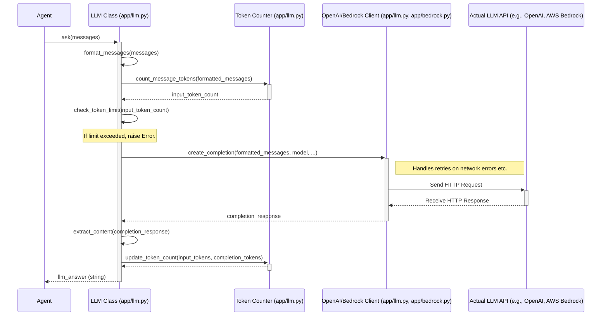

# Chapter 1: The LLM - Your Agent's Brainpower

Welcome to the OpenManus tutorial! We're thrilled to have you on board. Let's start with the absolute core of any intelligent agent: the "brain" that does the thinking and understanding. In OpenManus, this brainpower comes from something called a **Large Language Model (LLM)**, and we interact with it using our `LLM` class.

## What's the Big Deal with LLMs?

Imagine you have access to an incredibly smart expert who understands language, can reason, write, summarize, and even generate creative ideas. That's kind of what an LLM (like GPT-4, Claude, or Llama) is! These are massive AI models trained on vast amounts of text and data, making them capable of understanding and generating human-like text.

They are the engine that drives the "intelligence" in AI applications like chatbots, writing assistants, and, of course, the agents you'll build with OpenManus.

## Why Do We Need an `LLM` Class?

Okay, so LLMs are powerful. Can't our agent just talk directly to them?

Well, it's a bit more complicated than a casual chat. Talking to these big AI models usually involves:

1.  **Complex APIs:** Each LLM provider (like OpenAI, Anthropic, Google, AWS) has its own specific way (an API or Application Programming Interface) to send requests and get responses. It's like needing different phone numbers and dialing procedures for different experts.
2.  **API Keys:** You need secret keys to prove you're allowed to use the service (and get billed for it!). Managing these securely is important.
3.  **Formatting:** You need to structure your questions (prompts) and conversation history in a very specific format the LLM understands.
4.  **Errors & Retries:** Sometimes network connections hiccup, or the LLM service is busy. You need a way to handle these errors gracefully, maybe by trying again.
5.  **Tracking Usage (Tokens):** Using these powerful models costs money, often based on how much text you send and receive (measured in "tokens"). You need to keep track of this.

Doing all this *every time* an agent needs to think would be repetitive and messy!

**This is where the `LLM` class comes in.** Think of it as a super-helpful **translator and network manager** rolled into one.

*   It knows how to talk to different LLM APIs.
*   It securely handles your API keys (using settings from the [Configuration](07_configuration__config_.md)).
*   It formats your messages correctly.
*   It automatically retries if there's a temporary glitch.
*   It helps count the "tokens" used.

It hides all that complexity, giving your agent a simple way to "ask" the LLM something.

**Use Case:** Let's say we want our agent to simply answer the question: "What is the capital of France?" The `LLM` class will handle all the background work to get that answer from the actual AI model.

## How Do Agents Use the `LLM` Class?

In OpenManus, agents (which we'll learn more about in [Chapter 3: BaseAgent](03_baseagent.md)) have an `llm` component built-in. Usually, you don't even need to create it manually; the agent does it for you when it starts up, using settings from your configuration file (`config/config.toml`).

The primary way an agent uses the `LLM` class is through its `ask` method.

Let's look at a simplified example of how you might use the `LLM` class directly (though usually, your agent handles this):

```python
# Import necessary classes
from app.llm import LLM
from app.schema import Message
import asyncio # Needed to run asynchronous code

# Assume configuration is already loaded (API keys, model name, etc.)
# Create an instance of the LLM class (using default settings)
llm_interface = LLM()

# Prepare the question as a list of messages
# (We'll learn more about Messages in Chapter 2)
conversation = [
    Message.user_message("What is the capital of France?")
]

# Define an async function to ask the question
async def ask_question():
    print("Asking the LLM...")
    # Use the 'ask' method to send the conversation
    response = await llm_interface.ask(messages=conversation)
    print(f"LLM Response: {response}")

# Run the async function
asyncio.run(ask_question())
```

**Explanation:**

1.  We import the `LLM` class and the `Message` class (more on `Message` in the [next chapter](02_message___memory.md)).
2.  We create `llm_interface = LLM()`. This sets up our connection to the LLM using settings found in the configuration.
3.  We create a `conversation` list containing our question, formatted as a `Message` object. The `LLM` class needs the input in this list-of-messages format.
4.  We call `await llm_interface.ask(messages=conversation)`. This is the core action! We send our message list to the LLM via our interface. The `await` keyword is used because communicating over the network takes time, so we wait for the response asynchronously.
5.  The `ask` method returns the LLM's text response as a string.

**Example Output (might vary slightly):**

```
Asking the LLM...
LLM Response: The capital of France is Paris.
```

See? We just asked a question and got an answer, without worrying about API keys, JSON formatting, or network errors! The `LLM` class handled it all.

There's also a more advanced method called `ask_tool`, which allows the LLM to use specific [Tools](04_tool___toolcollection.md), but we'll cover that later. For now, `ask` is the main way to get text responses.

## Under the Hood: What Happens When You `ask`?

Let's peek behind the curtain. When your agent calls `llm.ask(...)`, several things happen in sequence:

1.  **Format Messages:** The `LLM` class takes your list of `Message` objects and converts them into the exact dictionary format the specific LLM API (like OpenAI's or AWS Bedrock's) expects. This might involve adding special tags or structuring image data if needed (`llm.py: format_messages`).
2.  **Count Tokens:** It calculates roughly how many "tokens" your input messages will use (`llm.py: count_message_tokens`).
3.  **Check Limits:** It checks if sending this request would exceed any configured token limits (`llm.py: check_token_limit`). If it does, it raises a specific `TokenLimitExceeded` error *before* making the expensive API call.
4.  **Send Request:** It sends the formatted messages and other parameters (like the desired model, `max_tokens`) to the LLM's API endpoint over the internet (`llm.py: client.chat.completions.create` or similar for AWS Bedrock in `bedrock.py`).
5.  **Handle Glitches (Retry):** If the API call fails due to a temporary issue (like a network timeout or the service being momentarily busy), the `LLM` class automatically waits a bit and tries again, up to a few times (thanks to the `@retry` decorator in `llm.py`).
6.  **Receive Response:** Once successful, it receives the response from the LLM API.
7.  **Extract Answer:** It pulls out the actual text content from the API response.
8.  **Update Counts:** It records the number of input tokens used and the number of tokens in the received response (`llm.py: update_token_count`).
9.  **Return Result:** Finally, it returns the LLM's text answer back to your agent.

Here's a simplified diagram showing the flow:



Let's look at a tiny piece of the `ask` method in `app/llm.py` to see the retry mechanism:

```python
# Simplified snippet from app/llm.py

from tenacity import retry, wait_random_exponential, stop_after_attempt, retry_if_exception_type
from openai import OpenAIError

# ... other imports ...

class LLM:
    # ... other methods like __init__, format_messages ...

    @retry( # This decorator handles retries!
        wait=wait_random_exponential(min=1, max=60), # Wait 1-60s between tries
        stop=stop_after_attempt(6), # Give up after 6 tries
        retry=retry_if_exception_type((OpenAIError, Exception)) # Retry on these errors
    )
    async def ask(
        self,
        messages: List[Union[dict, Message]],
        # ... other parameters ...
    ) -> str:
        try:
            # 1. Format messages (simplified)
            formatted_msgs = self.format_messages(messages)

            # 2. Count tokens & Check limits (simplified)
            input_tokens = self.count_message_tokens(formatted_msgs)
            if not self.check_token_limit(input_tokens):
                raise TokenLimitExceeded(...) # Special error, not retried

            # 3. Prepare API call parameters (simplified)
            params = {"model": self.model, "messages": formatted_msgs, ...}

            # 4. Make the actual API call (simplified)
            response = await self.client.chat.completions.create(**params)

            # 5. Process response & update tokens (simplified)
            answer = response.choices[0].message.content
            self.update_token_count(response.usage.prompt_tokens, ...)

            return answer
        except TokenLimitExceeded:
             raise # Don't retry token limits
        except Exception as e:
             logger.error(f"LLM ask failed: {e}")
             raise # Let the @retry decorator handle retrying other errors
```

**Explanation:**

*   The `@retry(...)` part *above* the `async def ask(...)` line is key. It tells Python: "If the code inside this `ask` function fails with certain errors (like `OpenAIError`), wait a bit and try running it again, up to 6 times."
*   Inside the `try...except` block, the code performs the steps we discussed: format, count, check, call the API (`self.client.chat.completions.create`), and process the result.
*   Crucially, it catches the `TokenLimitExceeded` error separately and `raise`s it again immediately – we *don't* want to retry if we know we've run out of tokens!
*   Other errors will be caught by the final `except Exception`, logged, and re-raised, allowing the `@retry` mechanism to decide whether to try again.

This shows how the `LLM` class uses libraries like `tenacity` to add resilience without cluttering the main logic of your agent.

## Wrapping Up Chapter 1

You've learned about the core "brain" – the Large Language Model (LLM) – and why we need the `LLM` class in OpenManus to interact with it smoothly. This class acts as a vital interface, handling API complexities, errors, and token counting, providing your agents with simple `ask` (and `ask_tool`) methods.

Now that we understand how to communicate with the LLM, we need a way to structure the conversation – keeping track of who said what. That's where Messages and Memory come in.

Let's move on to [Chapter 2: Message / Memory](02_message___memory.md) to explore how we represent and store conversations for our agents.

---

Generated by [AI Codebase Knowledge Builder](https://github.com/The-Pocket/Tutorial-Codebase-Knowledge)
