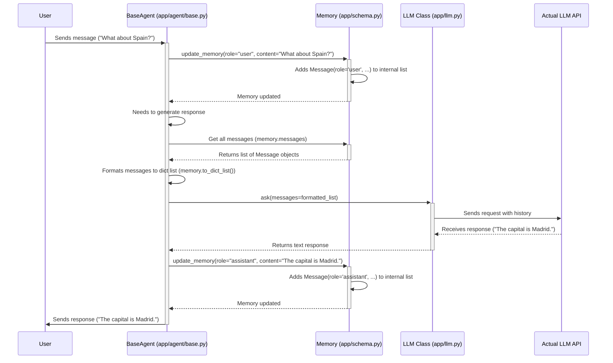

# Chapter 2: Message / Memory - Remembering the Conversation

In [Chapter 1: The LLM - Your Agent's Brainpower](01_llm.md), we learned how our agent uses the `LLM` class to access its "thinking" capabilities. But just like humans, an agent needs to remember what was said earlier in a conversation to make sense of new requests and respond appropriately.

Imagine asking a friend: "What was the first thing I asked you?". If they have no memory, they can't answer! Agents face the same problem. They need a way to store the conversation history.

This is where `Message` and `Memory` come in.

## What Problem Do They Solve?

Think about a simple chat:

1.  **You:** "What's the weather like in London?"
2.  **Agent:** "It's currently cloudy and 15°C in London."
3.  **You:** "What about Paris?"

For the agent to answer your *second* question ("What about Paris?"), it needs to remember that the *topic* of the conversation is "weather". Without remembering the first question, the second question is meaningless.

`Message` and `Memory` provide the structure to:

1.  Represent each individual turn (like your question or the agent's answer) clearly.
2.  Store these turns in order, creating a log of the conversation.

## The Key Concepts: Message and Memory

Let's break these down:

### 1. Message: A Single Turn in the Chat

A `Message` object is like a single speech bubble in a chat interface. It represents one specific thing said by someone (or something) at a particular point in the conversation.

Every `Message` has two main ingredients:

*   **`role`**: *Who* sent this message? This is crucial for the LLM to understand the flow. Common roles are:
    *   `user`: A message from the end-user interacting with the agent. (e.g., "What's the weather?")
    *   `assistant`: A message *from* the agent/LLM. (e.g., "The weather is sunny.")
    *   `system`: An initial instruction to guide the agent's overall behavior. (e.g., "You are a helpful weather assistant.")
    *   `tool`: The output or result from a [Tool / ToolCollection](04_tool___toolcollection.md) that the agent used. (e.g., The raw data returned by a weather API tool).
*   **`content`**: *What* was said? This is the actual text of the message. (e.g., "What's the weather like in London?")

There are also optional parts for more advanced uses, like `tool_calls` (when the assistant decides to use a tool) or `base64_image` (if an image is included in the message), but `role` and `content` are the basics.

### 2. Memory: The Conversation Log

The `Memory` object is simply a container, like a list or a notebook, that holds a sequence of `Message` objects.

*   It keeps track of the entire conversation history (or at least the recent parts).
*   It stores messages in the order they occurred.
*   Agents look at the `Memory` before deciding what to do next, giving them context.

Think of `Memory` as the agent's short-term memory for the current interaction.

## How Do We Use Them?

Let's see how you'd typically work with `Message` and `Memory` in OpenManus (often, the agent framework handles some of this automatically, but it's good to understand the pieces).

**1. Creating Messages:**

The `Message` class in `app/schema.py` provides handy shortcuts to create messages with the correct role:

```python
# Import the Message class
from app.schema import Message

# Create a message from the user
user_q = Message.user_message("What's the capital of France?")

# Create a message from the assistant (agent's response)
assistant_a = Message.assistant_message("The capital of France is Paris.")

# Create a system instruction
system_instruction = Message.system_message("You are a helpful geography expert.")

print(f"User Message: Role='{user_q.role}', Content='{user_q.content}'")
print(f"Assistant Message: Role='{assistant_a.role}', Content='{assistant_a.content}'")
```

**Explanation:**

*   We import `Message` from `app/schema.py`.
*   `Message.user_message("...")` creates a `Message` object with `role` set to `user`.
*   `Message.assistant_message("...")` creates one with `role` set to `assistant`.
*   `Message.system_message("...")` creates one with `role` set to `system`.
*   Each of these returns a `Message` object containing the role and the text content you provided.

**Example Output:**

```
User Message: Role='user', Content='What's the capital of France?'
Assistant Message: Role='assistant', Content='The capital of France is Paris.'
```

**2. Storing Messages in Memory:**

The `Memory` class (`app/schema.py`) holds these messages. Agents usually have a `memory` attribute.

```python
# Import Memory and Message
from app.schema import Message, Memory

# Create a Memory instance
conversation_memory = Memory()

# Add messages to the memory
conversation_memory.add_message(
    Message.system_message("You are a helpful geography expert.")
)
conversation_memory.add_message(
    Message.user_message("What's the capital of France?")
)
conversation_memory.add_message(
    Message.assistant_message("The capital of France is Paris.")
)
conversation_memory.add_message(
    Message.user_message("What about Spain?")
)


# See the messages stored
print(f"Number of messages in memory: {len(conversation_memory.messages)}")
# Print the last message
print(f"Last message: {conversation_memory.messages[-1].to_dict()}")
```

**Explanation:**

*   We import `Memory` and `Message`.
*   `conversation_memory = Memory()` creates an empty memory store.
*   `conversation_memory.add_message(...)` adds a `Message` object to the end of the internal list.
*   `conversation_memory.messages` gives you access to the list of `Message` objects currently stored.
*   `message.to_dict()` converts a `Message` object into a simple dictionary format, which is often needed for APIs.

**Example Output:**

```
Number of messages in memory: 4
Last message: {'role': 'user', 'content': 'What about Spain?'}
```

**3. Using Memory for Context:**

Now, how does the agent use this? Before calling the [LLM](01_llm.md) to figure out the answer to "What about Spain?", the agent would grab the messages from its `Memory`.

```python
# (Continuing from previous example)

# Agent prepares to ask the LLM
messages_for_llm = conversation_memory.to_dict_list()

print("Messages being sent to LLM for context:")
for msg in messages_for_llm:
    print(f"- {msg}")

# Simplified: Agent would now pass 'messages_for_llm' to llm.ask(...)
# response = await agent.llm.ask(messages=messages_for_llm)
# print(f"LLM would likely respond about the capital of Spain, e.g., 'The capital of Spain is Madrid.'")
```

**Explanation:**

*   `conversation_memory.to_dict_list()` converts all stored `Message` objects into the list-of-dictionaries format that the `llm.ask` method expects (as we saw in Chapter 1).
*   By sending this *entire history*, the LLM sees:
    1.  Its instructions ("You are a helpful geography expert.")
    2.  The first question ("What's the capital of France?")
    3.  Its previous answer ("The capital of France is Paris.")
    4.  The *new* question ("What about Spain?")
*   With this context, the LLM can correctly infer that "What about Spain?" means "What is the capital of Spain?".

## Under the Hood: How It Works

`Memory` is conceptually simple. It's primarily a wrapper around a standard Python list, ensuring messages are stored correctly and providing convenient methods.

Here's a simplified flow of how an agent uses memory:



**Code Glimpse:**

Let's look at the core parts in `app/schema.py`:

```python
# Simplified snippet from app/schema.py

from typing import List, Optional
from pydantic import BaseModel, Field

# (Role enum and other definitions are here)

class Message(BaseModel):
    role: str # Simplified: In reality uses ROLE_TYPE Literal
    content: Optional[str] = None
    # ... other optional fields like tool_calls, name, etc.

    def to_dict(self) -> dict:
        # Creates a dictionary representation, skipping None values
        message_dict = {"role": self.role}
        if self.content is not None:
            message_dict["content"] = self.content
        # ... add other fields if they exist ...
        return message_dict

    @classmethod
    def user_message(cls, content: str) -> "Message":
        return cls(role="user", content=content)

    @classmethod
    def assistant_message(cls, content: Optional[str]) -> "Message":
        return cls(role="assistant", content=content)

    # ... other classmethods like system_message, tool_message ...

class Memory(BaseModel):
    messages: List[Message] = Field(default_factory=list)
    max_messages: int = 100 # Example limit

    def add_message(self, message: Message) -> None:
        """Add a single message to the list."""
        self.messages.append(message)
        # Optional: Trim old messages if limit exceeded
        if len(self.messages) > self.max_messages:
            self.messages = self.messages[-self.max_messages :]

    def to_dict_list(self) -> List[dict]:
        """Convert all stored messages to dictionaries."""
        return [msg.to_dict() for msg in self.messages]

    # ... other methods like clear(), get_recent_messages() ...
```

**Explanation:**

*   The `Message` class uses Pydantic `BaseModel` for structure and validation. It clearly defines `role` and `content`. The classmethods (`user_message`, etc.) are just convenient ways to create instances with the role pre-filled. `to_dict` prepares it for API calls.
*   The `Memory` class also uses `BaseModel`. Its main part is `messages: List[Message]`, which holds the conversation history. `add_message` simply appends to this list (and optionally trims it). `to_dict_list` iterates through the stored messages and converts each one using its `to_dict` method.

And here's how an agent might use its memory attribute (simplified from `app/agent/base.py`):

```python
# Simplified conceptual snippet inspired by app/agent/base.py

from app.schema import Memory, Message, ROLE_TYPE # Simplified imports
from app.llm import LLM

class SimplifiedAgent:
    def __init__(self):
        self.memory = Memory() # Agent holds a Memory instance
        self.llm = LLM() # Agent has access to the LLM

    def add_user_input(self, text: str):
        """Adds user input to memory."""
        user_msg = Message.user_message(text)
        self.memory.add_message(user_msg)
        print(f"Agent Memory Updated with: {user_msg.to_dict()}")

    async def generate_response(self) -> str:
        """Generates a response based on memory."""
        print("Agent consulting memory...")
        messages_for_llm = self.memory.to_dict_list()

        print(f"Sending {len(messages_for_llm)} messages to LLM...")
        # The actual call to the LLM
        response_text = await self.llm.ask(messages=messages_for_llm)

        # Add assistant response to memory
        assistant_msg = Message.assistant_message(response_text)
        self.memory.add_message(assistant_msg)
        print(f"Agent Memory Updated with: {assistant_msg.to_dict()}")

        return response_text

# Example Usage (needs async context)
# agent = SimplifiedAgent()
# agent.add_user_input("What is the capital of France?")
# response = await agent.generate_response() # Gets "Paris"
# agent.add_user_input("What about Spain?")
# response2 = await agent.generate_response() # Gets "Madrid"
```

**Explanation:**

*   The agent has `self.memory`.
*   When input arrives (`add_user_input`), it creates a `Message` and adds it using `self.memory.add_message`.
*   When generating a response (`generate_response`), it retrieves the history using `self.memory.to_dict_list()` and passes it to `self.llm.ask`.
*   It then adds the LLM's response back into memory as an `assistant` message.

## Wrapping Up Chapter 2

You've now learned about `Message` (a single conversational turn with a role and content) and `Memory` (the ordered list storing these messages). Together, they provide the crucial context agents need to understand conversations and respond coherently. They act as the agent's short-term memory or chat log.

We have the brain ([LLM](01_llm.md)) and the memory (`Message`/`Memory`). Now we need something to orchestrate the process – to receive input, consult memory, use the LLM, potentially use tools, and manage its state. That's the job of the Agent itself.

Let's move on to [Chapter 3: BaseAgent](03_baseagent.md) to see how agents are structured and how they use these core components.

---

Generated by [AI Codebase Knowledge Builder](https://github.com/The-Pocket/Tutorial-Codebase-Knowledge)
