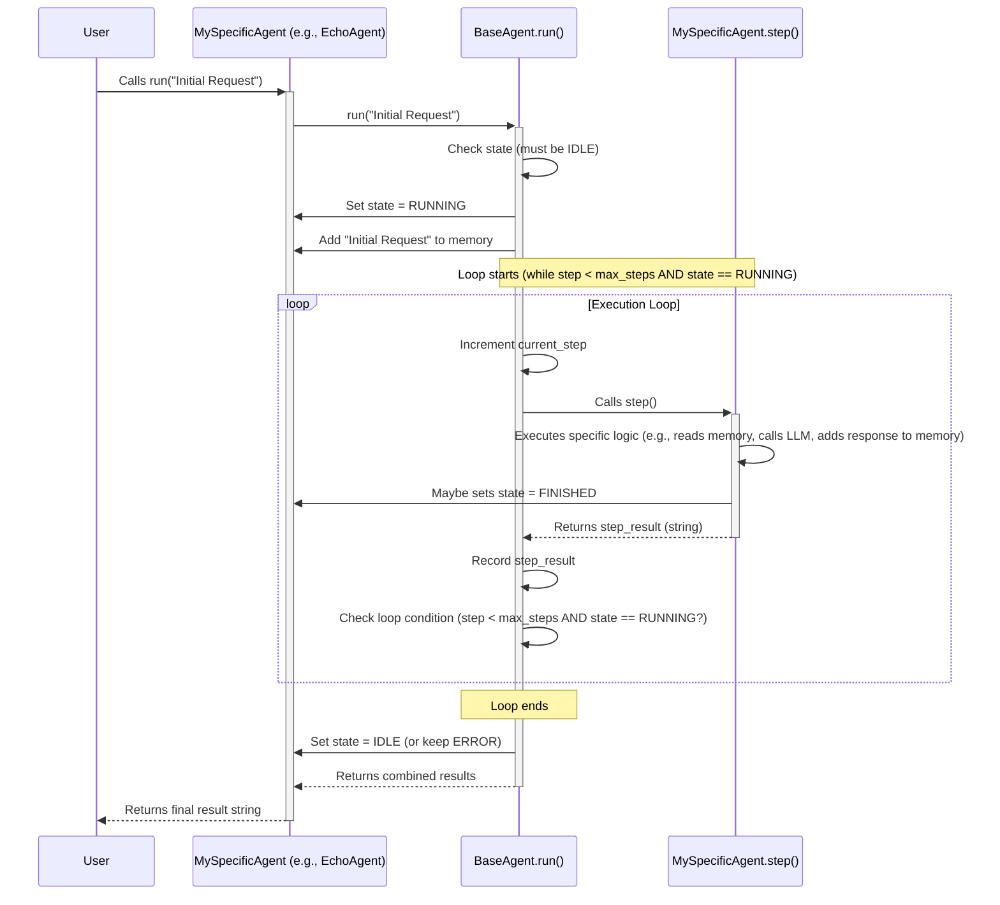

# Chapter 3: BaseAgent - The Agent Blueprint

In the previous chapters, we learned about the "brain" ([Chapter 1: The LLM](01_llm.md)) that powers our agents and how they remember conversations using [Chapter 2: Message / Memory](02_message___memory.md). Now, let's talk about the agent itself!

Imagine you want to build different kinds of digital helpers: one that can browse the web, one that can write code, and maybe one that just answers questions. While they have different jobs, they probably share some basic features, right? They all need a name, a way to remember things, a way to know if they are busy or waiting, and a process to follow when doing their work.

## What Problem Does `BaseAgent` Solve?

Building every agent from scratch, defining these common features over and over again, would be tedious and error-prone. It's like designing a completely new car frame, engine, and wheels every time you want to build a new car model (a sports car, a truck, a sedan). It's inefficient!

This is where `BaseAgent` comes in. Think of it as the **master blueprint** or the standard **chassis and engine design** for *all* agents in OpenManus.

**Use Case:** Let's say we want to create a simple "EchoAgent" that just repeats back whatever the user says. Even this simple agent needs:
*   A name (e.g., "EchoBot").
*   Memory to store what the user said.
*   A state (is it idle, or is it working on echoing?).
*   A way to run and perform its simple "echo" task.

Instead of defining all these basics for EchoAgent, and then again for a "WeatherAgent", and again for a "CodeWriterAgent", we define them *once* in `BaseAgent`.

## Key Concepts: The Building Blocks of an Agent

`BaseAgent` (`app/agent/base.py`) defines the fundamental properties and abilities that *all* agents built using OpenManus must have. It ensures consistency and saves us from repeating code. Here are the essential parts:

1.  **`name` (str):** A unique name to identify the agent (e.g., "browser_agent", "code_writer").
2.  **`description` (Optional[str]):** A short explanation of what the agent does.
3.  **`state` (AgentState):** The agent's current status. Is it doing nothing (`IDLE`), actively working (`RUNNING`), finished its task (`FINISHED`), or encountered a problem (`ERROR`)?
4.  **`memory` (Memory):** An instance of the `Memory` class we learned about in [Chapter 2: Message / Memory](02_message___memory.md). This is where the agent stores the conversation history (`Message` objects).
5.  **`llm` (LLM):** An instance of the `LLM` class from [Chapter 1: The LLM - Your Agent's Brainpower](01_llm.md). This gives the agent access to the language model for "thinking".
6.  **`run()` method:** The main function you call to start the agent's work. It manages the overall process, like changing the state to `RUNNING` and repeatedly calling the `step()` method.
7.  **`step()` method:** This is the crucial part! `BaseAgent` defines *that* agents must have a `step` method, but it doesn't say *what* the step does. It's marked as `abstract`, meaning **each specific agent type (like our EchoAgent or a BrowserAgent) must provide its own implementation of `step()`**. This method defines the actual work the agent performs in a single cycle.
8.  **`max_steps` (int):** A safety limit on how many `step` cycles the agent can run before stopping automatically. This prevents agents from running forever if they get stuck.

Think of it like this:
*   `BaseAgent` provides the car chassis (`name`, `state`), the engine (`llm`), the fuel tank (`memory`), and the ignition key (`run()`).
*   The `step()` method is like the specific driving instructions (turn left, accelerate, brake) that make a sports car drive differently from a truck, even though they share the same basic parts.

## How Do We Use `BaseAgent`?

You typically don't use `BaseAgent` directly. It's an **abstract** class, meaning it's a template, not a finished product. You **build upon it** by creating new classes that *inherit* from `BaseAgent`.

Let's imagine creating our simple `EchoAgent`:

```python
# Conceptual Example - Not runnable code, just for illustration

# Import BaseAgent and necessary components
from app.agent.base import BaseAgent
from app.schema import Message

class EchoAgent(BaseAgent): # Inherits from BaseAgent!
    """A simple agent that echoes the last user message."""

    name: str = "EchoBot"
    description: str = "Repeats the last thing the user said."

    # THIS IS THE IMPORTANT PART - We implement the abstract 'step' method
    async def step(self) -> str:
        """Perform one step: find the last user message and echo it."""

        last_user_message = None
        # Look backwards through memory to find the last user message
        for msg in reversed(self.memory.messages):
            if msg.role == "user":
                last_user_message = msg
                break

        if last_user_message and last_user_message.content:
            echo_content = f"You said: {last_user_message.content}"
            # Add the echo response to memory as an 'assistant' message
            self.update_memory("assistant", echo_content)
            # The state will be set to FINISHED after this step by run()
            # (Simplified: a real agent might need more complex logic)
            self.state = AgentState.FINISHED # Indicate task is done
            return echo_content # Return the result of this step
        else:
            self.state = AgentState.FINISHED # Nothing to echo, finish
            return "I didn't hear anything from the user to echo."

# How you might conceptually use it:
# echo_bot = EchoAgent()
# # Add a user message to its memory
# echo_bot.update_memory("user", "Hello there!")
# # Start the agent's run loop
# result = await echo_bot.run()
# print(result) # Output would contain: "Step 1: You said: Hello there!"
```

**Explanation:**

1.  `class EchoAgent(BaseAgent):` - We declare that `EchoAgent` is a *type of* `BaseAgent`. It automatically gets all the standard parts like `name`, `memory`, `llm`, `state`, and the `run()` method.
2.  We provide a specific `name` and `description`.
3.  Crucially, we define `async def step(self) -> str:`. This is *our* specific logic for the `EchoAgent`. In this case, it looks through the `memory` (inherited from `BaseAgent`), finds the last user message, and prepares an echo response.
4.  It uses `self.update_memory(...)` (a helper method provided by `BaseAgent`) to add its response to the memory.
5.  It sets its `self.state` to `FINISHED` to signal that its job is done after this one step.
6.  The `run()` method (which we didn't have to write, it's inherited from `BaseAgent`) would handle starting the process, calling our `step()` method, and returning the final result.

This way, we only had to focus on the unique part – the echoing logic inside `step()` – while `BaseAgent` handled the common structure. More complex agents like `BrowserAgent` or `ToolCallAgent` (found in `app/agent/`) follow the same principle but have much more sophisticated `step()` methods, often involving thinking with the [LLM](01_llm.md) and using [Tools](04_tool___toolcollection.md).

## Under the Hood: The `run()` Loop

What actually happens when you call `agent.run()`? The `BaseAgent` provides a standard execution loop:

1.  **Check State:** It makes sure the agent is `IDLE` before starting. You can't run an agent that's already running or has finished.
2.  **Set State:** It changes the agent's state to `RUNNING`. It uses a safety mechanism (`state_context`) to ensure the state is handled correctly, even if errors occur.
3.  **Initialize:** If you provided an initial request (e.g., `agent.run("What's the weather?")`), it adds that as the first `user` message to the `memory`.
4.  **Loop:** It enters a loop that continues as long as:
    *   The agent hasn't reached its `max_steps` limit.
    *   The agent's state is still `RUNNING` (i.e., it hasn't set itself to `FINISHED` or `ERROR` inside its `step()` method).
5.  **Increment Step Counter:** It increases `current_step`.
6.  **Execute `step()`:** This is where it calls the specific `step()` method implemented by the subclass (like our `EchoAgent.step()`). **This is the core of the agent's unique behavior.**
7.  **Record Result:** It stores the string returned by `step()`.
8.  **Repeat:** It goes back to step 4 until the loop condition is false.
9.  **Finalize:** Once the loop finishes (either `max_steps` reached or state changed to `FINISHED`/`ERROR`), it sets the state back to `IDLE` (unless it ended in `ERROR`).
10. **Return Results:** It returns a string summarizing the results from all the steps.

Here's a simplified diagram showing the flow:



## Code Glimpse: Inside `app/agent/base.py`

Let's peek at the `BaseAgent` definition itself.

```python
# Simplified snippet from app/agent/base.py

from abc import ABC, abstractmethod # Needed for abstract classes/methods
from pydantic import BaseModel, Field
from app.llm import LLM
from app.schema import AgentState, Memory, Message

class BaseAgent(BaseModel, ABC): # Inherits from Pydantic's BaseModel and ABC
    """Abstract base class for managing agent state and execution."""

    # Core attributes defined here
    name: str = Field(..., description="Unique name")
    description: Optional[str] = Field(None)
    state: AgentState = Field(default=AgentState.IDLE)
    memory: Memory = Field(default_factory=Memory) # Gets a Memory instance
    llm: LLM = Field(default_factory=LLM) # Gets an LLM instance
    max_steps: int = Field(default=10)
    current_step: int = Field(default=0)

    # ... other config and helper methods like update_memory ...

    async def run(self, request: Optional[str] = None) -> str:
        """Execute the agent's main loop asynchronously."""
        if self.state != AgentState.IDLE:
            raise RuntimeError("Agent not IDLE")

        if request:
            self.update_memory("user", request) # Add initial request

        results = []
        # Simplified: using a context manager for state changes
        # async with self.state_context(AgentState.RUNNING):
        self.state = AgentState.RUNNING
        try:
            while (self.current_step < self.max_steps and self.state == AgentState.RUNNING):
                self.current_step += 1
                # ====> THE CORE CALL <====
                step_result = await self.step() # Calls the subclass's step method
                results.append(f"Step {self.current_step}: {step_result}")
                # (Simplified: actual code has more checks)
        finally:
            # Reset state after loop finishes or if error occurs
            if self.state != AgentState.ERROR:
                self.state = AgentState.IDLE

        return "\n".join(results)

    @abstractmethod # Marks this method as needing implementation by subclasses
    async def step(self) -> str:
        """Execute a single step in the agent's workflow. Must be implemented by subclasses."""
        pass # BaseAgent provides no implementation for step()

    def update_memory(self, role: str, content: str, ...) -> None:
        """Helper to add messages to self.memory easily."""
        # ... implementation uses Message.user_message etc. ...
        self.memory.add_message(...)
```

**Explanation:**

*   `class BaseAgent(BaseModel, ABC):` declares it as both a Pydantic model (for data validation) and an Abstract Base Class.
*   Fields like `name`, `state`, `memory`, `llm`, `max_steps` are defined. `default_factory=Memory` means each agent gets its own fresh `Memory` instance when created.
*   The `run()` method contains the loop logic we discussed, crucially calling `await self.step()`.
*   `@abstractmethod` above `async def step(self) -> str:` signals that any class inheriting from `BaseAgent` *must* provide its own version of the `step` method. `BaseAgent` itself just puts `pass` (do nothing) there.
*   Helper methods like `update_memory` are provided for convenience.

## Wrapping Up Chapter 3

We've learned about `BaseAgent`, the fundamental blueprint for all agents in OpenManus. It provides the common structure (`name`, `state`, `memory`, `llm`) and the core execution loop (`run()`), freeing us to focus on the unique logic of each agent by implementing the `step()` method. It acts as the chassis upon which specialized agents are built.

Now that we have the agent structure, how do agents gain specific skills beyond just talking to the LLM? How can they browse the web, run code, or interact with files? They use **Tools**!

Let's move on to [Chapter 4: Tool / ToolCollection](04_tool___toolcollection.md) to explore how we give agents capabilities to interact with the world.

---

Generated by [AI Codebase Knowledge Builder](https://github.com/The-Pocket/Tutorial-Codebase-Knowledge)