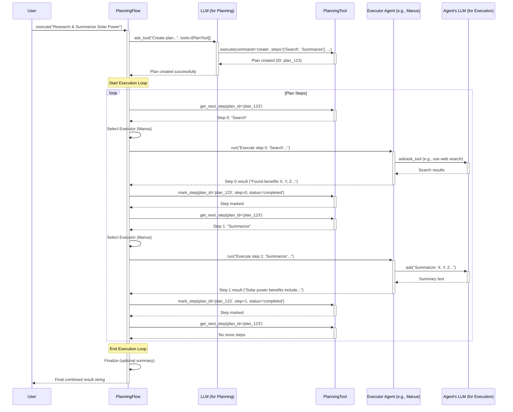

# Chapter 5: BaseFlow - Managing Multi-Step Projects

In [Chapter 4: Tool / ToolCollection](04_tool___toolcollection.md), we saw how to give agents specific skills like web searching or running code using Tools. Now, imagine you have a task that requires multiple steps, maybe even using different skills (tools) or agents along the way. How do you coordinate this complex work?

That's where **Flows** come in!

## What Problem Does `BaseFlow` Solve?

Think about a simple agent, maybe one equipped with a web search tool. You could ask it, "What's the capital of France?" and it could use its tool and answer "Paris." That's a single-step task.

But what if you ask something more complex, like: "Research the pros and cons of electric cars and then write a short blog post summarizing them."

This isn't a single action. It involves:
1.  **Planning:** Figuring out the steps needed (e.g., search for pros, search for cons, structure blog post, write draft, review draft).
2.  **Executing Step 1:** Using a web search tool to find pros.
3.  **Executing Step 2:** Using a web search tool to find cons.
4.  **Executing Step 3:** Maybe using the [LLM](01_llm.md) brain to outline the blog post.
5.  **Executing Step 4:** Using the LLM to write the post based on the research and outline.
6.  **Executing Step 5:** Perhaps a final review step.

A single [BaseAgent](03_baseagent.md) *might* be able to handle this if it's very sophisticated, but it's often clearer and more manageable to have a dedicated **orchestrator** or **project manager** overseeing the process.

**This is the job of a `Flow`.** Specifically, `BaseFlow` is the blueprint for these orchestrators. It defines a structure that can manage multiple agents and coordinate their work to achieve a larger goal according to a specific strategy (like following a pre-defined plan).

**Use Case:** Let's stick with our "Research and Write" task. We need something to manage the overall process: first the research, then the writing. A `PlanningFlow` (a specific type of Flow built on `BaseFlow`) is perfect for this. It will first create a plan (like the steps above) and then execute each step, potentially assigning different steps to different specialized agents if needed.

## Key Concepts: Flow, Agents, and Strategy

1.  **`BaseFlow` (`app/flow/base.py`):**
    *   This is the **abstract blueprint** for all flows. Think of it as the job description for a project manager – it says a manager needs to know their team (agents) and have a way to run the project (`execute` method), but it doesn't dictate *how* they manage.
    *   It mainly holds a dictionary of available `agents` that can be used within the flow.
    *   You don't use `BaseFlow` directly; you use specific implementations.

2.  **Concrete Flows (e.g., `PlanningFlow` in `app/flow/planning.py`):**
    *   These are the **specific strategies** for managing the project. They *inherit* from `BaseFlow`.
    *   `PlanningFlow` is a key example. Its strategy is:
        1.  Receive the overall goal.
        2.  Use an LLM and a special `PlanningTool` to break the goal down into a sequence of steps (the "plan").
        3.  Execute each step in the plan, one by one, usually by calling the `run()` method of an appropriate [BaseAgent](03_baseagent.md).
        4.  Track the status of each step (e.g., not started, in progress, completed).

3.  **Agents within the Flow:**
    *   These are the "workers" or "specialists" managed by the flow.
    *   A flow holds one or more [BaseAgent](03_baseagent.md) instances.
    *   In a `PlanningFlow`, one agent might be designated as the primary agent (often responsible for helping create the plan), while others (or maybe the same one) act as "executors" for the plan steps. The flow decides which agent is best suited for each step.

Think of it like building a house:
*   `BaseFlow` is the concept of a "General Contractor".
*   `PlanningFlow` is a specific *type* of General Contractor who always starts by creating a detailed architectural plan and then hires specialists for each phase.
*   The `agents` are the specialists: the plumber, the electrician, the carpenter, etc.
*   The overall goal ("Build a house") is given to the `PlanningFlow` (Contractor).
*   The `PlanningFlow` creates the plan (foundation, framing, plumbing, electrical...).
*   The `PlanningFlow` then calls the appropriate `agent` (specialist) for each step in the plan.

## How Do We Use Flows?

You typically use a `FlowFactory` to create a specific type of flow, providing it with the agents it needs.

Let's set up a simple `PlanningFlow` with one agent called "Manus" (which is a general-purpose agent in OpenManus).

```python
# Import necessary classes
from app.agent.manus import Manus # A capable agent
from app.flow.flow_factory import FlowFactory, FlowType
import asyncio # Needed for async execution

# 1. Create the agent(s) we want the flow to manage
# We can give agents specific keys (names) within the flow
agents_for_flow = {
    "research_writer": Manus() # Use Manus agent for all tasks
}

# 2. Create the flow using the factory
# We specify the type (PLANNING) and provide the agents
planning_flow_instance = FlowFactory.create_flow(
    flow_type=FlowType.PLANNING,
    agents=agents_for_flow,
    # Optional: specify which agent is primary (if not first)
    # primary_agent_key="research_writer"
)

print(f"Created a {type(planning_flow_instance).__name__}")
print(f"Primary agent: {planning_flow_instance.primary_agent.name}")

# 3. Define the overall goal for the flow
overall_goal = "Research the main benefits of solar power and write a short summary."

# Define an async function to run the flow
async def run_the_flow():
    print(f"\nExecuting flow with goal: '{overall_goal}'")
    # 4. Execute the flow with the goal
    final_result = await planning_flow_instance.execute(overall_goal)
    print("\n--- Flow Execution Finished ---")
    print(f"Final Result:\n{final_result}")

# Run the async function
# asyncio.run(run_the_flow()) # Uncomment to run
```

**Explanation:**

1.  We import the agent we want to use (`Manus`) and the `FlowFactory` plus `FlowType`.
2.  We create a dictionary `agents_for_flow` mapping a key ("research\_writer") to an instance of our `Manus` agent. This tells the flow which workers are available.
3.  We use `FlowFactory.create_flow()` specifying `FlowType.PLANNING` and passing our `agents_for_flow`. The factory handles constructing the `PlanningFlow` object correctly.
4.  We define the high-level task (`overall_goal`).
5.  We call `await planning_flow_instance.execute(overall_goal)`. This is where the magic happens! The `PlanningFlow` takes over.

**Expected Outcome (High Level):**

When you run this (if uncommented), you won't just get an immediate answer. You'll likely see output indicating:
*   A plan is being created (e.g., Step 1: Search for benefits, Step 2: Synthesize findings, Step 3: Write summary).
*   The agent ("research\_writer") starting to execute Step 1. This might involve output from the agent using its web search tool.
*   The agent moving on to Step 2, then Step 3, potentially showing LLM thinking or writing output.
*   Finally, the `execute` call will return a string containing the results of the steps and possibly a final summary generated by the flow or the agent.

The `PlanningFlow` manages this entire multi-step process automatically based on the initial goal.

## Under the Hood: How `PlanningFlow.execute` Works

Let's peek behind the curtain of the `PlanningFlow`'s `execute` method. What happens when you call it?

**High-Level Walkthrough:**

1.  **Receive Goal:** The `execute` method gets the `input_text` (our overall goal).
2.  **Create Plan (`_create_initial_plan`):**
    *   It constructs messages for the [LLM](01_llm.md), including a system message asking it to act as a planner.
    *   It tells the LLM about the `PlanningTool` (a special [Tool](04_tool___toolcollection.md) designed for creating and managing plans).
    *   It calls the LLM's `ask_tool` method, essentially asking: "Please use the PlanningTool to create a plan for this goal: *{input\_text}*".
    *   The `PlanningTool` (when called by the LLM) stores the generated steps (e.g., ["Search benefits", "Write summary"]) associated with a unique `plan_id`.
3.  **Execution Loop:** The flow enters a loop to execute the plan steps.
    *   **Get Next Step (`_get_current_step_info`):** It checks the stored plan (using the `PlanningTool`) to find the first step that isn't marked as "completed". It gets the step's text and index.
    *   **Check for Completion:** If no non-completed steps are found, the plan is finished! The loop breaks.
    *   **Select Executor (`get_executor`):** It determines which agent should perform the current step. In our simple example, it will always select our "research\_writer" agent. More complex flows could choose based on step type (e.g., a "[CODE]" step might go to a coding agent).
    *   **Execute Step (`_execute_step`):**
        *   It prepares a prompt for the selected executor agent, including the current plan status and the specific instruction for the current step (e.g., "You are working on step 0: 'Search benefits'. Please execute this step.").
        *   It calls the executor agent's `run()` method with this prompt: `await executor.run(step_prompt)`. The agent then does its work (which might involve using its own tools, memory, and LLM).
        *   It gets the result back from the agent's `run()`.
    *   **Mark Step Complete (`_mark_step_completed`):** It tells the `PlanningTool` to update the status of the current step to "completed".
    *   **Loop:** Go back to find the next step.
4.  **Finalize (`_finalize_plan`):** Once the loop finishes, it might generate a final summary of the completed plan (potentially using the LLM again).
5.  **Return Result:** The accumulated results from executing all the steps are returned as a string.

**Sequence Diagram:**

Here's a simplified view of the process:



**Code Glimpse:**

Let's look at simplified snippets from the flow files.

*   **`app/flow/base.py`:** The blueprint just holds agents.

```python
# Simplified snippet from app/flow/base.py
from abc import ABC, abstractmethod
from typing import Dict, List, Optional, Union
from pydantic import BaseModel
from app.agent.base import BaseAgent

class BaseFlow(BaseModel, ABC):
    """Base class for execution flows supporting multiple agents"""
    agents: Dict[str, BaseAgent] # Holds the agents
    primary_agent_key: Optional[str] = None # Key for the main agent

    # ... __init__ handles setting up the agents dictionary ...

    @property
    def primary_agent(self) -> Optional[BaseAgent]:
        """Get the primary agent for the flow"""
        return self.agents.get(self.primary_agent_key)

    @abstractmethod # Subclasses MUST implement execute
    async def execute(self, input_text: str) -> str:
        """Execute the flow with given input"""
        pass
```

*   **`app/flow/flow_factory.py`:** Creates the specific flow.

```python
# Simplified snippet from app/flow/flow_factory.py
from enum import Enum
from app.agent.base import BaseAgent
from app.flow.base import BaseFlow
from app.flow.planning import PlanningFlow # Import specific flows

class FlowType(str, Enum):
    PLANNING = "planning" # Add other flow types here

class FlowFactory:
    @staticmethod
    def create_flow(flow_type: FlowType, agents, **kwargs) -> BaseFlow:
        flows = { # Maps type enum to the actual class
            FlowType.PLANNING: PlanningFlow,
        }
        flow_class = flows.get(flow_type)
        if not flow_class:
            raise ValueError(f"Unknown flow type: {flow_type}")
        # Creates an instance of PlanningFlow(agents, **kwargs)
        return flow_class(agents, **kwargs)
```

*   **`app/flow/planning.py`:** The core planning and execution logic.

```python
# Simplified snippets from app/flow/planning.py
from app.flow.base import BaseFlow
from app.tool import PlanningTool
from app.agent.base import BaseAgent
from app.schema import Message # Assuming Message is imported

class PlanningFlow(BaseFlow):
    planning_tool: PlanningTool = Field(default_factory=PlanningTool)
    # ... other fields like llm, active_plan_id ...

    async def execute(self, input_text: str) -> str:
        """Execute the planning flow with agents."""
        # 1. Create the plan if input is provided
        if input_text:
            await self._create_initial_plan(input_text)
            # Check if plan exists...

        result_accumulator = ""
        while True:
            # 2. Get the next step to execute
            step_index, step_info = await self._get_current_step_info()

            # 3. Exit if no more steps
            if step_index is None:
                result_accumulator += await self._finalize_plan()
                break

            # 4. Get the agent to execute the step
            executor_agent = self.get_executor(step_info.get("type"))

            # 5. Execute the step using the agent
            step_result = await self._execute_step(executor_agent, step_info)
            result_accumulator += step_result + "\n"

            # Mark step as completed (done inside _execute_step or here)
            # await self._mark_step_completed(step_index) # Simplified

            # Maybe check if agent finished early...

        return result_accumulator

    async def _create_initial_plan(self, request: str):
        """Uses LLM and PlanningTool to create the plan."""
        logger.info(f"Creating plan for: {request}")
        system_msg = Message.system_message("You are a planner...")
        user_msg = Message.user_message(f"Create a plan for: {request}")

        # Ask LLM to use the planning tool
        response = await self.llm.ask_tool(
            messages=[user_msg],
            system_msgs=[system_msg],
            tools=[self.planning_tool.to_param()], # Provide the tool spec
            # Force LLM to use a tool (often planning tool)
            # tool_choice=ToolChoice.AUTO # Or specify planning tool name
        )

        # Process LLM response to execute the planning tool call
        # Simplified: Assume LLM calls planning_tool.execute(...)
        # to store the plan steps.
        # ... logic to handle response and tool execution ...
        logger.info("Plan created.")


    async def _execute_step(self, executor: BaseAgent, step_info: dict) -> str:
        """Execute a single step using the executor agent."""
        step_text = step_info.get("text", "Current step")
        plan_status = await self._get_plan_text() # Get current plan state

        # Construct prompt for the agent
        step_prompt = f"Current Plan:\n{plan_status}\n\nYour Task:\nExecute step: {step_text}"

        # Call the agent's run method!
        step_result = await executor.run(step_prompt)

        # Mark step completed after execution
        await self._mark_step_completed()

        return step_result

    async def _mark_step_completed(self):
        """Update the planning tool state for the current step."""
        if self.current_step_index is not None:
            await self.planning_tool.execute(
                command="mark_step",
                plan_id=self.active_plan_id,
                step_index=self.current_step_index,
                step_status="completed" # Simplified status
            )
            logger.info(f"Step {self.current_step_index} marked complete.")

    # ... other helper methods like _get_current_step_info, get_executor ...
```

**Explanation of Snippets:**

*   `BaseFlow` defines the `agents` dictionary and the abstract `execute` method.
*   `FlowFactory` looks at the requested `FlowType` and returns an instance of the corresponding class (`PlanningFlow`).
*   `PlanningFlow.execute` orchestrates the overall process: create plan, loop through steps, get executor, execute step via `agent.run()`, mark complete.
*   `_create_initial_plan` shows interaction with the [LLM](01_llm.md) and the `PlanningTool` to generate the initial steps.
*   `_execute_step` shows how the flow prepares a prompt and then delegates the actual work for a specific step to an agent by calling `executor.run()`.
*   `_mark_step_completed` updates the plan state using the `PlanningTool`.

## Wrapping Up Chapter 5

We've seen that `BaseFlow` provides a way to manage complex, multi-step tasks that might involve multiple agents or tools. It acts as an orchestrator or project manager. We focused on `PlanningFlow`, a specific strategy where a plan is created first, and then each step is executed sequentially by designated agents. This allows OpenManus to tackle much larger and more complex goals than a single agent could handle alone.

So far, we've covered the core components: LLMs, Memory, Agents, Tools, and Flows. But how do we define the structure of data that these components pass around, like the format of tool parameters or agent configurations? That's where schemas come in.

Let's move on to [Chapter 6: Schema](06_schema.md) to understand how OpenManus defines and validates data structures.

---

Generated by [AI Codebase Knowledge Builder](https://github.com/The-Pocket/Tutorial-Codebase-Knowledge)