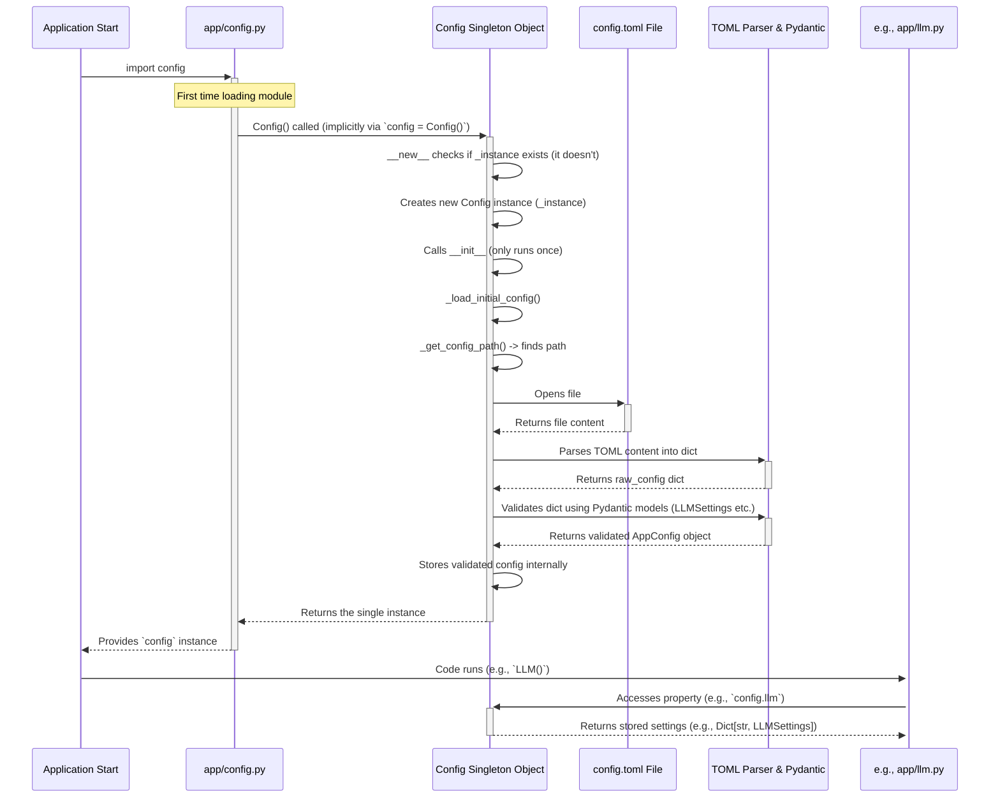

# Chapter 7: Configuration (Config)

Welcome to Chapter 7! In [Chapter 6: Schema](06_schema.md), we learned how OpenManus uses schemas to define the structure of data passed between different components, like official forms ensuring everyone fills them out correctly.

Now, think about setting up a new application. You often need to tell it *how* to behave.
*   Which AI model should it use?
*   What's the secret key to access that AI?
*   Should it run code in a restricted "sandbox" environment?
*   Which search engine should it prefer?

These are all **settings** or **configurations**. This chapter explores how OpenManus manages these settings using the `Config` system.

## What Problem Does Config Solve?

Imagine you're building a simple app that uses an AI service. You need an API key to access it. Where do you put this key?

*   **Option 1: Hardcode it directly in the code.**
    ```python
    # Bad idea! Don't do this!
    api_key = "MY_SUPER_SECRET_API_KEY_12345"
    # ... rest of the code uses api_key ...
    ```
    This is a terrible idea! Your secret key is exposed in the code. Sharing the code means sharing your secret. Changing the key means editing the code. What if multiple parts of the code need the key? You'd have it scattered everywhere!

*   **Option 2: Use a Configuration System.**
    Keep all settings in a separate, easy-to-read file. The application reads this file when it starts and makes the settings available wherever they're needed.

OpenManus uses Option 2. It keeps settings in a file named `config.toml` and uses a special `Config` object to manage them.

**Use Case:** Let's say we want our [LLM](01_llm.md) component to use the "gpt-4o" model and a specific API key. Instead of writing "gpt-4o" and the key directly into the `LLM` class code, the `LLM` class will *ask* the `Config` system: "What model should I use?" and "What's the API key?". The `Config` system provides the answers it read from `config.toml`.

## Key Concepts: The Settings File and Manager

### 1. The Settings File (`config.toml`)

This is a simple text file located in the `config/` directory of your OpenManus project. It uses the TOML format (Tom's Obvious, Minimal Language), which is designed to be easy for humans to read.

It contains sections for different parts of the application. Here's a highly simplified snippet:

```toml
# config/config.toml (Simplified Example)

[llm] # Settings for the Large Language Model
model = "gpt-4o"
api_key = "YOUR_OPENAI_API_KEY_HERE" # Replace with your actual key
base_url = "https://api.openai.com/v1"
api_type = "openai"

[sandbox] # Settings for the code execution sandbox
use_sandbox = true
image = "python:3.12-slim"
memory_limit = "256m"

[search_config] # Settings for web search
engine = "DuckDuckGo"

[browser_config] # Settings for the browser tool
headless = false
```

**Explanation:**
*   `[llm]`, `[sandbox]`, etc., define sections.
*   `model = "gpt-4o"` assigns the value `"gpt-4o"` to the `model` setting within the `llm` section.
*   `api_key = "YOUR_..."` stores your secret key (you should put your real key here and **never** share this file publicly if it contains secrets!).
*   `use_sandbox = true` sets a boolean (true/false) value.

This file acts as the central "control panel" list for the application's behavior.

### 2. The Settings Manager (`Config` class in `app/config.py`)

Okay, we have the settings file. How does the application *use* it?

OpenManus has a special Python class called `Config` (defined in `app/config.py`). Think of this class as the **Settings Manager**. Its job is:

1.  **Read the File:** When the application starts, the `Config` manager reads the `config.toml` file.
2.  **Parse and Store:** It understands the TOML format and stores the settings internally, often using the Pydantic [Schemas](06_schema.md) we learned about (like `LLMSettings`, `SandboxSettings`) to validate the data.
3.  **Provide Access:** It offers a way for any other part of the application to easily ask for a specific setting (e.g., "Give me the LLM model name").

### 3. The Singleton Pattern: One Manager to Rule Them All

The `Config` class uses a special design pattern called a **Singleton**. This sounds fancy, but the idea is simple: **There is only ever *one* instance (object) of the `Config` manager in the entire application.**

*Analogy:* Think of the principal's office in a school. There's only one principal's office. If any teacher or student needs official school-wide information (like the date of the next holiday), they go to that single, central office. They don't each have their own separate, potentially conflicting, information source.

The `Config` object is like that principal's office. When any part of OpenManus (like the [LLM](01_llm.md) class or the [DockerSandbox](08_dockersandbox.md) class) needs a setting, it asks the *same*, single `Config` instance. This ensures everyone is using the same configuration values that were loaded at the start.

## How Do We Use It? (Accessing Settings)

Because `Config` is a singleton, accessing settings is straightforward. You import the pre-created instance and ask for the setting you need.

The single instance is created automatically when `app/config.py` is first loaded and is made available as `config`.

```python
# Example of how another part of the code might use the config
from app.config import config # Import the singleton instance

# Access LLM settings
default_llm_settings = config.llm.get("default") # Get the 'default' LLM config
if default_llm_settings:
    model_name = default_llm_settings.model
    api_key = default_llm_settings.api_key
    print(f"LLM Model: {model_name}")
    # Don't print the API key in real code! This is just for illustration.
    # print(f"LLM API Key: {api_key[:4]}...{api_key[-4:]}")

# Access Sandbox settings
use_sandbox_flag = config.sandbox.use_sandbox
sandbox_image = config.sandbox.image
print(f"Use Sandbox: {use_sandbox_flag}")
print(f"Sandbox Image: {sandbox_image}")

# Access Search settings (check if it exists)
if config.search_config:
    search_engine = config.search_config.engine
    print(f"Preferred Search Engine: {search_engine}")

# Access Browser settings (check if it exists)
if config.browser_config:
    run_headless = config.browser_config.headless
    print(f"Run Browser Headless: {run_headless}")
```

**Explanation:**

1.  `from app.config import config`: We import the single, shared `config` object.
2.  `config.llm`: Accesses the dictionary of all LLM configurations read from the `[llm]` sections in `config.toml`. We use `.get("default")` to get the settings specifically for the LLM named "default".
3.  `default_llm_settings.model`: Accesses the `model` attribute of the `LLMSettings` object. Pydantic ensures this attribute exists and is the correct type.
4.  `config.sandbox.use_sandbox`: Directly accesses the `use_sandbox` attribute within the `sandbox` settings object (`SandboxSettings`).
5.  We check if `config.search_config` and `config.browser_config` exist before accessing them, as they might be optional sections in the `config.toml` file.

**Use Case Example: How `LLM` Gets Its Settings**

Let's revisit our use case. When an `LLM` object is created (often inside a [BaseAgent](03_baseagent.md)), its initialization code (`__init__`) looks something like this (simplified):

```python
# Simplified snippet from app/llm.py __init__ method

from app.config import config, LLMSettings # Import config and the schema
from typing import Optional

class LLM:
    # ... other methods ...
    def __init__(self, config_name: str = "default", llm_config: Optional[LLMSettings] = None):
        # If specific llm_config isn't provided, get it from the global config
        if llm_config is None:
            # Ask the global 'config' object for the settings
            # corresponding to 'config_name' (e.g., "default")
            llm_settings = config.llm.get(config_name)
            if not llm_settings: # Handle case where the name doesn't exist
                 llm_settings = config.llm.get("default") # Fallback to default

        else: # Use the provided config if given
            llm_settings = llm_config


        # Store the settings read from the config object
        self.model = llm_settings.model
        self.api_key = llm_settings.api_key
        self.base_url = llm_settings.base_url
        # ... store other settings like max_tokens, temperature ...

        print(f"LLM initialized with model: {self.model}")
        # Initialize the actual API client using these settings
        # self.client = AsyncOpenAI(api_key=self.api_key, base_url=self.base_url)
        # ... rest of initialization ...
```

**Explanation:**
*   The `LLM` class imports the global `config` object.
*   In its `__init__`, it uses `config.llm.get(config_name)` to retrieve the specific settings (like `model`, `api_key`) it needs.
*   It then uses these retrieved values to configure itself and the underlying API client.

This way, the `LLM` class doesn't need the actual values hardcoded inside it. It just asks the central `Config` manager. If you want to change the model or API key, you only need to update `config.toml` and restart the application!

## Under the Hood: Loading and Providing Settings

What happens when the application starts and the `config` object is first used?

1.  **First Access:** The first time code tries to `import config` from `app.config`, Python runs the code in `app.config.py`.
2.  **Singleton Check:** The `Config` class's special `__new__` method checks if an instance (`_instance`) already exists. If not, it creates a new one. If it *does* exist, it just returns the existing one. This ensures only one instance is ever made.
3.  **Initialization (`__init__`):** The `__init__` method (run only once for the single instance) calls `_load_initial_config`.
4.  **Find File (`_get_config_path`):** It looks for `config/config.toml`. If that doesn't exist, it looks for `config/config.example.toml` as a fallback.
5.  **Read File (`_load_config`):** It opens the found `.toml` file and uses the standard `tomllib` library to read its contents into a Python dictionary.
6.  **Parse & Validate:** `_load_initial_config` takes this raw dictionary and carefully organizes it, using Pydantic models (`LLMSettings`, `SandboxSettings`, `BrowserSettings`, `SearchSettings`, `MCPSettings`, all defined in `app/config.py`) to structure and *validate* the settings. For example, it creates `LLMSettings` objects for each entry under `[llm]`. If a required setting is missing or has the wrong type (e.g., `max_tokens` is text instead of a number), Pydantic will raise an error here, stopping the app from starting with bad configuration.
7.  **Store Internally:** The validated settings (now nicely structured Pydantic objects) are stored within the `Config` instance (in `self._config`).
8.  **Ready for Use:** The `config` instance is now ready. Subsequent accesses simply return the stored, validated settings via properties like `config.llm`, `config.sandbox`, etc.

**Sequence Diagram:**



**Code Glimpse (`app/config.py`):**

Let's look at the key parts:

```python
# Simplified snippet from app/config.py
import threading
import tomllib
from pathlib import Path
from pydantic import BaseModel, Field
# ... other imports like typing ...

# --- Pydantic Models for Settings ---
class LLMSettings(BaseModel): # Defines structure for [llm] section
    model: str
    api_key: str
    # ... other fields like base_url, max_tokens, api_type ...

class SandboxSettings(BaseModel): # Defines structure for [sandbox] section
    use_sandbox: bool
    image: str
    # ... other fields like memory_limit, timeout ...

# ... Similar models for BrowserSettings, SearchSettings, MCPSettings ...

class AppConfig(BaseModel): # Holds all validated settings together
    llm: Dict[str, LLMSettings]
    sandbox: Optional[SandboxSettings]
    browser_config: Optional[BrowserSettings]
    search_config: Optional[SearchSettings]
    mcp_config: Optional[MCPSettings]

# --- The Singleton Config Class ---
class Config:
    _instance = None
    _lock = threading.Lock() # Ensures thread-safety during creation
    _initialized = False

    def __new__(cls): # Controls instance creation (Singleton part 1)
        if cls._instance is None:
            with cls._lock:
                if cls._instance is None:
                    cls._instance = super().__new__(cls)
        return cls._instance

    def __init__(self): # Initializes the instance (runs only once)
        if not self._initialized:
            with self._lock:
                if not self._initialized:
                    self._config: Optional[AppConfig] = None # Where settings are stored
                    self._load_initial_config() # Load from file
                    self._initialized = True

    def _load_config(self) -> dict: # Reads the TOML file
        config_path = self._get_config_path() # Finds config.toml or example
        with config_path.open("rb") as f:
            return tomllib.load(f) # Parses TOML into a dictionary

    def _load_initial_config(self): # Parses dict and validates with Pydantic
        raw_config = self._load_config()
        # ... (logic to handle defaults and structure the raw_config dict) ...
        # ... (creates LLMSettings, SandboxSettings etc. from raw_config) ...

        # Validate the final structured dict using AppConfig
        self._config = AppConfig(**structured_config_dict)

    # --- Properties to Access Settings ---
    @property
    def llm(self) -> Dict[str, LLMSettings]:
        # Provides easy access like 'config.llm'
        return self._config.llm

    @property
    def sandbox(self) -> SandboxSettings:
        # Provides easy access like 'config.sandbox'
        return self._config.sandbox

    # ... Properties for browser_config, search_config, mcp_config ...

# --- Create the Singleton Instance ---
# This line runs when the module is imported, creating the single instance.
config = Config()
```

**Explanation:**
*   The Pydantic models (`LLMSettings`, `SandboxSettings`, `AppConfig`) define the expected structure and types for the settings read from `config.toml`.
*   The `Config` class uses `__new__` and `_lock` to implement the singleton pattern, ensuring only one instance.
*   `__init__` calls `_load_initial_config` only once.
*   `_load_initial_config` reads the TOML file and uses the Pydantic models (within `AppConfig`) to parse and validate the settings, storing the result in `self._config`.
*   `@property` decorators provide clean access (e.g., `config.llm`) to the stored settings.
*   `config = Config()` at the end creates the actual singleton instance that gets imported elsewhere.

## Wrapping Up Chapter 7

We've learned that the `Config` system is OpenManus's way of managing application settings. It reads configurations from the `config.toml` file at startup, validates them using Pydantic [Schemas](06_schema.md), and makes them available throughout the application via a single, shared `config` object (using the singleton pattern). This keeps settings separate from code, making the application more flexible, secure, and easier to manage.

Many components rely on these configurations. For instance, when an agent needs to execute code safely, it might use a `DockerSandbox`. The settings for this sandbox – like which Docker image to use or how much memory to allow – are read directly from the configuration we just discussed.

Let's move on to [Chapter 8: DockerSandbox](08_dockersandbox.md) to see how OpenManus provides a secure environment for running code generated by agents, using settings managed by our `Config` system.

---

Generated by [AI Codebase Knowledge Builder](https://github.com/The-Pocket/Tutorial-Codebase-Knowledge)