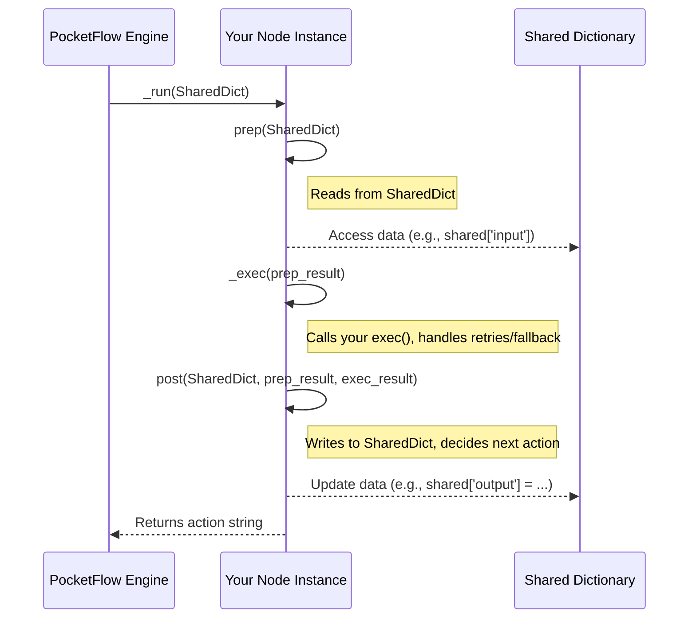

# Chapter 2: Node (`BaseNode`, `Node`, `AsyncNode`)

In [Chapter 1: Shared State (`shared` dictionary)](01_shared_state___shared__dictionary__.md), we learned how different parts of a PocketFlow workflow can communicate using the `shared` dictionary. Now, let's meet the actual "workers" that perform the tasks and use this shared information: **Nodes**.

## What are Nodes and Why Do We Need Them?

Imagine you're building an AI that helps you write a story. This process might involve several steps:
1.  Generate a story idea.
2.  Write an outline based on the idea.
3.  Write the first draft of a chapter using the outline.
4.  Review and edit the chapter.

Each of these steps is a distinct task. In PocketFlow, each such task would be handled by a **Node**.

A **Node** is the fundamental building block in PocketFlow. It represents a single, atomic step in your workflow. Think of it as a highly specialized worker on an assembly line, responsible for one specific job. This job could be:
*   Calling a Large Language Model (LLM) to generate text.
*   Searching the web for information.
*   Making a decision based on some data.
*   Reading user input.
*   Saving results to a file.

By breaking down a complex process into a series of Nodes, we make our AI applications:
*   **Modular:** Each Node focuses on one thing, making it easier to develop, test, and understand.
*   **Reusable:** A Node designed for web search can be used in many different AI applications.
*   **Manageable:** It's easier to build and debug a sequence of simple steps than one giant, monolithic piece of code.

## The Anatomy of a Node: `prep`, `exec`, and `post`

Most Nodes in PocketFlow have a similar structure, typically involving three key methods:

1.  **`prep(self, shared)` (Prepare):**
    *   **Purpose:** This method is called *before* the Node does its main work. Its job is to get any necessary input data from the [shared dictionary](01_shared_state___shared__dictionary__.md).
    *   **Analogy:** An assembly line worker picking up the necessary parts from a shared bin before starting their task.
    *   **Input:** It receives the `shared` dictionary.
    *   **Output:** It usually returns the specific data the Node needs for its core logic.

2.  **`exec(self, prep_res)` (Execute):**
    *   **Purpose:** This is where the Node performs its core task. This is the "brain" or "muscle" of the Node.
    *   **Analogy:** The assembly line worker actually assembling the parts or performing their specialized action.
    *   **Input:** It receives the result from the `prep` method (`prep_res`).
    *   **Output:** It returns the result of its execution (e.g., a summary, search results, a decision).

3.  **`post(self, shared, prep_res, exec_res)` (Post-process):**
    *   **Purpose:** This method is called *after* the Node has finished its main work. Its jobs are:
        *   To process the results from `exec`.
        *   To update the [shared dictionary](01_shared_state___shared__dictionary__.md) with these results or any other new information.
        *   To decide what should happen next in the workflow (this is crucial for [Actions / Transitions](03_actions___transitions_.md), which we'll cover in the next chapter).
    *   **Analogy:** The assembly line worker placing the finished component onto the conveyor belt (updating `shared`) and signaling if the item needs to go to a different station next (deciding the next action).
    *   **Input:** It receives the `shared` dictionary, the result from `prep` (`prep_res`), and the result from `exec` (`exec_res`).
    *   **Output:** It can return an "action" string that tells the [Flow (`Flow`, `AsyncFlow`)](04_flow___flow____asyncflow__.md) which Node to execute next. If it returns nothing (or `None`), a default transition is usually followed.

Let's make this concrete with a simple example: a `SummarizeNode` whose job is to take some text and produce a short summary.

```python
# This is a conceptual Node, actual implementation details might vary slightly
from pocketflow import Node # We'll import the base class

class SummarizeNode(Node):
    def prep(self, shared):
        # 1. Prepare: Get the text to summarize from 'shared'
        print("SummarizeNode: Preparing...")
        text_to_summarize = shared.get("document_text", "No text found.")
        return text_to_summarize

    def exec(self, text_input):
        # 2. Execute: Perform the summarization (e.g., call an LLM)
        print(f"SummarizeNode: Executing with text: '{text_input[:30]}...'")
        if not text_input or text_input == "No text found.":
            return "Cannot summarize empty or missing text."
        # In a real scenario, this would call an LLM or a summarization library
        summary = f"This is a summary of: {text_input[:20]}..."
        return summary

    def post(self, shared, prep_res, exec_res):
        # 3. Post-process: Store the summary in 'shared'
        print(f"SummarizeNode: Posting summary: '{exec_res}'")
        shared["summary_output"] = exec_res
        # We might decide the next step here, e.g., return "summarization_done"
        # For now, we'll just let it end by returning nothing (None)
```

Let's imagine how this `SummarizeNode` would work:

1.  **Initialization:** You'd start with some text in the `shared` dictionary.
    ```python
    shared_data = {"document_text": "PocketFlow is a cool framework for building AI."}
    ```

2.  **Running the Node (simplified):**
    *   **`prep(shared_data)` is called:** It looks into `shared_data` and finds `"PocketFlow is a cool framework for building AI."`. It returns this text.
    *   **`exec("PocketFlow is a cool framework...")` is called:** It takes the text and (in our simplified example) creates a summary like `"This is a summary of: PocketFlow is a cool..."`. It returns this summary.
    *   **`post(shared_data, text_from_prep, summary_from_exec)` is called:** It takes the `shared_data` and the `summary_from_exec`. It then adds a new entry: `shared_data["summary_output"] = "This is a summary of: PocketFlow is a cool..."`.

After the Node runs, `shared_data` would look like this:
```
{
    "document_text": "PocketFlow is a cool framework for building AI.",
    "summary_output": "This is a summary of: PocketFlow is a cool..."
}
```
The summary is now available in the `shared` dictionary for other Nodes or for final output!

## Types of Nodes: `BaseNode`, `Node`, `AsyncNode`

PocketFlow provides a few variations of Nodes, built on top of each other:

*   **`BaseNode`:**
    *   This is the most fundamental type of Node. It provides the basic structure with `prep`, `exec`, and `post` methods.
    *   It's like the basic blueprint for any worker.

*   **`Node` (inherits from `BaseNode`):**
    *   This is the standard synchronous Node you'll often use. "Synchronous" means it performs its task and waits for it to complete before anything else happens.
    *   It adds helpful features on top of `BaseNode`, like automatic **retries** if the `exec` method fails (e.g., a network error when calling an LLM) and an `exec_fallback` method that can be called if all retries fail.
    *   From `cookbook/pocketflow-node/flow.py`, our `Summarize` Node is an example of `Node`:
      ```python
      from pocketflow import Node
      # ... other imports ...

      class Summarize(Node): # Inherits from Node
          # ... prep, exec, post methods ...
          def exec_fallback(self, shared, prep_res, exc):
              """Provide a simple fallback instead of crashing."""
              return "There was an error processing your request."
      ```
      This `Summarize` Node, if its `exec` method fails (e.g., `call_llm` raises an error), will retry (default is 1 retry, but can be configured like `Summarize(max_retries=3)`). If all retries fail, `exec_fallback` is called.

*   **`AsyncNode` (inherits from `Node`):**
    *   This type of Node is for **asynchronous** tasks. Asynchronous tasks are those that might take some time to complete (like waiting for a web request or a user to type something) but don't need to block the entire program while they wait. They can "pause" and let other things run.
    *   `AsyncNode` uses `async` and `await` keywords from Python's `asyncio` library.
    *   It has asynchronous versions of the core methods: `prep_async`, `exec_async`, and `post_async`.
    *   We'll dive much deeper into asynchronous operations in [Chapter 5: Asynchronous Processing (`AsyncNode`, `AsyncFlow`)](05_asynchronous_processing___asyncnode____asyncflow___.md). For now, just know it exists for tasks that involve waiting.
    *   Example from `cookbook/pocketflow-async-basic/nodes.py`:
      ```python
      from pocketflow import AsyncNode
      # ... other imports ...

      class FetchRecipes(AsyncNode): # Inherits from AsyncNode
          async def prep_async(self, shared):
              # ... prepare input asynchronously ...
              ingredient = await get_user_input("Enter ingredient: ") # get_user_input is async
              return ingredient

          async def exec_async(self, ingredient):
              # ... execute task asynchronously ...
              recipes = await fetch_recipes(ingredient) # fetch_recipes is async
              return recipes

          async def post_async(self, shared, prep_res, recipes):
              # ... post-process asynchronously ...
              shared["recipes"] = recipes
              return "suggest" # Action for the next step
      ```
      Notice the `async def` and `await` keywords. This `FetchRecipes` Node can wait for user input and web requests without freezing the application.

## How a Node Runs: Under the Hood (Simplified)

When PocketFlow decides it's time for a particular Node to run (as part of a [Flow (`Flow`, `AsyncFlow`)](04_flow___flow____asyncflow__.md)), it essentially orchestrates the calling of its `prep`, `exec`, and `post` methods in sequence.

Here's a simplified view of what happens when a synchronous `Node`'s internal `_run` method is invoked:

1.  **Call `prep`:** `prep_result = self.prep(shared)`
    *   Your Node's `prep` method is called with the current `shared` dictionary.
    *   Whatever `prep` returns is stored.

2.  **Call `_exec` (which internally calls your `exec` with retries):** `exec_result = self._exec(prep_result)`
    *   The Node's `_exec` method is called with the `prep_result`.
    *   This `_exec` method in the `Node` class handles the retry logic. It will try to call your `exec(prep_result)` method.
    *   If your `exec` succeeds, its result is stored.
    *   If your `exec` raises an exception, `_exec` might wait and try again (up to `max_retries`).
    *   If all retries fail, `exec_fallback(prep_result, exception)` is called, and its result is used as `exec_result`.

3.  **Call `post`:** `action = self.post(shared, prep_result, exec_result)`
    *   Your Node's `post` method is called with the `shared` dictionary, the `prep_result`, and the `exec_result`.
    *   `post` can modify `shared` and returns an action string (or `None`).

4.  **Return Action:** The `action` returned by `post` is then used by the [Flow (`Flow`, `AsyncFlow`)](04_flow___flow____asyncflow__.md) to determine the next Node to run.

Let's visualize this with a sequence diagram:



**Code Glimpse (from `pocketflow/__init__.py`):**

The `BaseNode` class defines the fundamental execution flow in its `_run` method (this is a direct, slightly simplified version):
```python
# Inside BaseNode class from pocketflow/__init__.py
def _run(self, shared):
    prep_output = self.prep(shared)
    exec_output = self._exec(prep_output) # _exec calls self.exec
    action = self.post(shared, prep_output, exec_output)
    return action
```
This is the core loop for a single Node's execution.

The `Node` class (which inherits from `BaseNode`) overrides `_exec` to add retry and fallback logic:
```python
# Simplified concept from Node class in pocketflow/__init__.py
def _exec(self, prep_res):
    for self.cur_retry in range(self.max_retries): # Loop for retries
        try:
            return self.exec(prep_res) # Call your Node's exec method
        except Exception as e:
            if self.cur_retry == self.max_retries - 1: # If last retry
                return self.exec_fallback(prep_res, e) # Call fallback
            if self.wait > 0:
                time.sleep(self.wait) # Wait before retrying
```
This shows how `Node` makes your worker more robust by automatically handling temporary failures.

For `AsyncNode`, the methods are `prep_async`, `exec_async`, `post_async`, and they are `await`ed, allowing other tasks to run while waiting for I/O operations. This will be detailed in [Chapter 5](05_asynchronous_processing___asyncnode____asyncflow___.md).

## Conclusion

You've now been introduced to **Nodes**, the workhorses of PocketFlow!
*   They represent **single, atomic steps** in your workflow.
*   They typically follow a **`prep` -> `exec` -> `post`** lifecycle.
*   `prep` gets data from the [shared dictionary](01_shared_state___shared__dictionary__.md).
*   `exec` performs the core logic.
*   `post` updates the `shared` dictionary and can decide what happens next.
*   **`Node`** provides synchronous execution with retries and fallbacks.
*   **`AsyncNode`** provides asynchronous execution for I/O-bound tasks.

Nodes are the building blocks you'll use to define the individual capabilities of your AI agents and applications. But how do these Nodes connect to form a sequence or a more complex workflow? And how does the `post` method's return value actually control the flow? That's where [Actions / Transitions](03_actions___transitions__.md) come in, which we'll explore in the next chapter!

Next up: [Chapter 3: Actions / Transitions](03_actions___transitions__.md)

---

Generated by [AI Codebase Knowledge Builder](https://github.com/The-Pocket/Tutorial-Codebase-Knowledge)