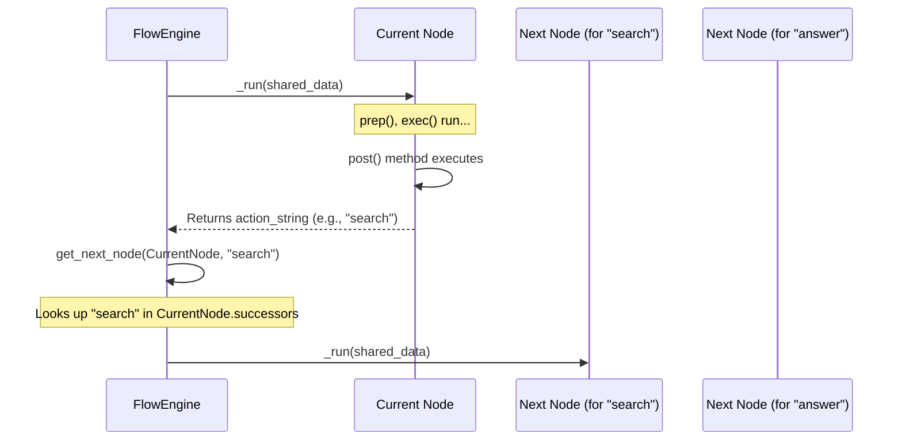

# Chapter 3: Actions / Transitions

In [Chapter 2: Node (`BaseNode`, `Node`, `AsyncNode`)](02_node___basenode____node____asyncnode___.md), we learned that Nodes are the individual workers in our PocketFlow application, each performing a specific task. We also touched upon the `post` method of a Node, mentioning that it can return an "action" string. Now, it's time to explore exactly what these "actions" are and how they create "transitions," guiding the workflow dynamically.

Imagine you're building an AI research assistant. After the AI receives your question, it needs to decide: should it search the web for more information, or does it already have enough context to answer? This decision point, and acting upon it, is where Actions and Transitions shine.

## What are Actions and Transitions?

**Actions** and **Transitions** are the mechanism by which a PocketFlow [Flow (`Flow`, `AsyncFlow`)](04_flow___flow____asyncflow___.md) determines the next [Node (`BaseNode`, `Node`, `AsyncNode`)](02_node___basenode____node____asyncnode___.md) to execute.

*   An **Action** is usually a simple string (e.g., `"search"`, `"answer"`, `"proceed"`) returned by a [Node (`BaseNode`, `Node`, `AsyncNode`)](02_node___basenode____node____asyncnode___.md)'s `post` method after it completes its work. This string signals the outcome or a desired next step.
*   A **Transition** is the rule defined within the [Flow (`Flow`, `AsyncFlow`)](04_flow___flow____asyncflow___.md) that says, "If *this* Node returns *this* action, then go to *that* Node next."

Think of it like a "Choose Your Own Adventure" book. At the end of a section (a [Node (`BaseNode`, `Node`, `AsyncNode`)](02_node___basenode____node____asyncnode___.md) finishing its task), you might be told, "If you want to open the door, turn to page 42. If you want to look under the bed, turn to page 55." The "open the door" part is the "action," and "turn to page 42" is the "transition."

This allows your workflow to be dynamic and intelligent, not just a fixed sequence of steps.

## How to Use Actions and Transitions

Let's break down how you implement this, using our AI research assistant idea from `cookbook/pocketflow-a2a/`.

**1. A Node Returns an Action String**

The `post` method of a [Node (`BaseNode`, `Node`, `AsyncNode`)](02_node___basenode____node____asyncnode___.md) is where the decision for the next action is typically made and returned.

Consider the `DecideAction` [Node (`BaseNode`, `Node`, `AsyncNode`)](02_node___basenode____node____asyncnode___.md) from `cookbook/pocketflow-a2a/nodes.py`. Its job is to decide whether to search the web or try to answer the question directly.

```python
# Inside DecideAction Node class (cookbook/pocketflow-a2a/nodes.py)
# ... (prep and exec methods are here) ...

class DecideAction(Node):
    # ...
    def post(self, shared, prep_res, exec_res):
        """Save the decision and determine the next step in the flow."""
        # 'exec_res' is a dictionary like {"action": "search", "search_query": "..."}
        # or {"action": "answer", "answer": "..."}
        if exec_res["action"] == "search":
            shared["search_query"] = exec_res["search_query"]
            print(f"🔍 Agent decided to search for: {exec_res['search_query']}")
        else:
            # ... store answer if action is "answer" ...
            print(f"💡 Agent decided to answer the question")
        
        # Return the action string to guide the Flow
        return exec_res["action"] # This could be "search" or "answer"
```
In this `post` method:
*   It first updates the [shared dictionary](01_shared_state___shared__dictionary__.md) based on the decision made in `exec_res`.
*   Crucially, it returns `exec_res["action"]`. If the LLM in the `exec` method decided to search, this will be the string `"search"`. If it decided to answer, it will be `"answer"`. This returned string is the **action**.

**2. Defining Transitions in a Flow**

Now that our `DecideAction` [Node (`BaseNode`, `Node`, `AsyncNode`)](02_node___basenode____node____asyncnode___.md) can return an action like `"search"` or `"answer"`, we need to tell the [Flow (`Flow`, `AsyncFlow`)](04_flow___flow____asyncflow___.md) what to do for each of these actions. This is done when you set up your [Flow (`Flow`, `AsyncFlow`)](04_flow___flow____asyncflow___.md).

PocketFlow uses a very intuitive syntax: `current_node - "action_string" >> next_node`.

Let's look at `cookbook/pocketflow-a2a/flow.py`:
```python
# From cookbook/pocketflow-a2a/flow.py
from pocketflow import Flow
from nodes import DecideAction, SearchWeb, AnswerQuestion

# Create instances of each node
decide = DecideAction()
search = SearchWeb()
answer = AnswerQuestion()

# Connect the nodes using actions
# If DecideAction returns "search", go to SearchWeb node
decide - "search" >> search

# If DecideAction returns "answer", go to AnswerQuestion node
decide - "answer" >> answer

# After SearchWeb completes and returns "decide", go back to DecideAction
search - "decide" >> decide

# Create the flow, starting with the DecideAction node
agent_flow = Flow(start=decide)
```
Here's what's happening:
*   `decide - "search" >> search`: This line says, "If the `decide` Node returns the action string `"search"`, then the *next* Node to execute should be the `search` Node."
*   `decide - "answer" >> answer`: Similarly, "If `decide` returns `"answer"`, then go to the `answer` Node."
*   `search - "decide" >> decide`: This creates a loop! After the `search` Node (which performs a web search) completes, its `post` method returns `"decide"`. This transition sends the control *back* to the `decide` Node, perhaps with new search results in the [shared dictionary](01_shared_state___shared__dictionary__.md), to re-evaluate.

When `agent_flow.run(shared_data)` is called:
1.  The `decide` Node runs. Let's say its `post` method returns `"search"`.
2.  The `Flow` sees this action. It looks at the transitions defined for `decide`. It finds `decide - "search" >> search`.
3.  So, the `search` Node runs next.
4.  Let's say the `search` Node's `post` method returns `"decide"`.
5.  The `Flow` sees this. It finds `search - "decide" >> decide`.
6.  The `decide` Node runs again. This time, with the search results in `shared`, it might return `"answer"`.
7.  The `Flow` finds `decide - "answer" >> answer`.
8.  The `answer` Node runs, generates the final answer, and its `post` method might return `"done"` (or `None`). If `"done"` isn't a defined transition for the `answer` Node, the flow might end.

**3. Default Transitions**

What if a Node's `post` method returns `None` (i.e., nothing), or it returns an action string for which you haven't defined a specific transition (e.g., `decide` returns `"unknown_action"`)?

Often, you'll define a **default transition**. This is like the "else" in an if-else statement. If no specific action matches, the default transition is taken.

The syntax for a default transition is simpler: `current_node >> next_node_for_default_action`.

Let's look at `cookbook/pocketflow-supervisor/flow.py`:
```python
# From cookbook/pocketflow-supervisor/flow.py
# ... (agent_flow is an inner Flow, supervisor is a SupervisorNode) ...

# Connect the components
# After agent_flow completes, go to supervisor (this is a default transition)
agent_flow >> supervisor

# If supervisor rejects the answer (returns "retry"), go back to agent_flow
supervisor - "retry" >> agent_flow

# Create and return the outer flow
supervised_flow = Flow(start=agent_flow)
```
Here:
*   `agent_flow >> supervisor`: If the `agent_flow` (which is treated as a single unit here) completes and its `post` method returns an action that is *not* specifically handled by `agent_flow` itself for transitions *within* it, or if it returns `None`, it will transition to the `supervisor` Node. This is a default transition.
*   `supervisor - "retry" >> agent_flow`: This is a specific action-based transition. If the `supervisor` Node's `post` method returns `"retry"`, the flow goes back to `agent_flow`.

If a Node's `post` returns `None`, and there's a default transition defined (e.g., `node1 >> node2`), then `node2` will be executed. If there's no specific transition for the returned action *and* no default transition, the [Flow (`Flow`, `AsyncFlow`)](04_flow___flow____asyncflow___.md) typically ends for that branch.

## What Happens Under the Hood? (A Simplified View)

1.  **Node Execution:** Your [Flow (`Flow`, `AsyncFlow`)](04_flow___flow____asyncflow___.md) runs a [Node (`BaseNode`, `Node`, `AsyncNode`)](02_node___basenode____node____asyncnode___.md).
2.  **`post` Method Returns Action:** The `post` method of that [Node (`BaseNode`, `Node`, `AsyncNode`)](02_node___basenode____node____asyncnode___.md) completes and returns an action string (e.g., `"search"`).
3.  **Flow Receives Action:** The [Flow (`Flow`, `AsyncFlow`)](04_flow___flow____asyncflow___.md) (specifically, its orchestrator logic) gets this action string.
4.  **Lookup Successor:** The [Flow (`Flow`, `AsyncFlow`)](04_flow___flow____asyncflow___.md) looks at the current [Node (`BaseNode`, `Node`, `AsyncNode`)](02_node___basenode____node____asyncnode___.md) and checks its defined successors. Each [Node (`BaseNode`, `Node`, `AsyncNode`)](02_node___basenode____node____asyncnode___.md) object internally stores a dictionary called `successors`. This dictionary maps action strings to the next [Node (`BaseNode`, `Node`, `AsyncNode`)](02_node___basenode____node____asyncnode___.md) object.
    *   The syntax `node1 - "actionX" >> node2` effectively does `node1.successors["actionX"] = node2`.
    *   The syntax `node1 >> node2` effectively does `node1.successors["default"] = node2`.
5.  **Find Next Node:** The [Flow (`Flow`, `AsyncFlow`)](04_flow___flow____asyncflow___.md) tries to find an entry in `current_node.successors` for the returned action string. If not found, it tries to find an entry for `"default"`.
6.  **Transition or End:**
    *   If a next [Node (`BaseNode`, `Node`, `AsyncNode`)](02_node___basenode____node____asyncnode___.md) is found, the [Flow (`Flow`, `AsyncFlow`)](04_flow___flow____asyncflow___.md) prepares to execute it.
    *   If no matching transition (neither specific nor default) is found, that path of the [Flow (`Flow`, `AsyncFlow`)](04_flow___flow____asyncflow___.md) typically concludes.

Here's a sequence diagram illustrating this:



**Diving into the Code (from `pocketflow/__init__.py`):**

1.  **Storing Transitions:**
    The `BaseNode` class (which all [Nodes (`BaseNode`, `Node`, `AsyncNode`)](02_node___basenode____node____asyncnode___.md) and [Flows (`Flow`, `AsyncFlow`)](04_flow___flow____asyncflow___.md) inherit from) has a `next` method to define successors:
    ```python
    # Inside BaseNode class (pocketflow/__init__.py)
    class BaseNode:
        def __init__(self): 
            self.successors = {} # Stores action -> next_node mapping
            # ... other initializations ...
        
        def next(self, node, action="default"):
            # ... (warning if overwriting) ...
            self.successors[action] = node
            return node # Allows chaining
    ```
    The cool `node - "action" >> next_node` syntax is made possible by Python's special methods (`__sub__` for `-` and `__rshift__` for `>>`):
    ```python
    # Inside BaseNode class (pocketflow/__init__.py)
    def __sub__(self, action_str): # When you do 'node - "action_str"'
        if isinstance(action_str, str):
            return _ConditionalTransition(self, action_str)
        # ... error handling ...

    class _ConditionalTransition: # A temporary helper object
        def __init__(self, src_node, action_name):
            self.src_node, self.action_name = src_node, action_name
        
        def __rshift__(self, target_node): # When you do '... >> target_node'
            return self.src_node.next(target_node, self.action_name)
    ```
    And for the default transition `node1 >> node2`:
    ```python
    # Inside BaseNode class (pocketflow/__init__.py)
    def __rshift__(self, other_node): # When you do 'node1 >> other_node'
        return self.next(other_node) # Calls .next() with action="default"
    ```
    So, these operators are just convenient ways to populate the `successors` dictionary of a [Node (`BaseNode`, `Node`, `AsyncNode`)](02_node___basenode____node____asyncnode___.md).

2.  **Flow Orchestration and Using Actions:**
    The `Flow` class has an `_orch` (orchestration) method that manages running [Nodes (`BaseNode`, `Node`, `AsyncNode`)](02_node___basenode____node____asyncnode___.md) in sequence.
    ```python
    # Inside Flow class (pocketflow/__init__.py)
    class Flow(BaseNode):
        # ...
        def get_next_node(self, current_node, action_str):
            # Tries the specific action, then "default"
            next_node = current_node.successors.get(action_str)
            if not next_node: # If specific action not found
                 next_node = current_node.successors.get("default")

            # ... (warning if action not found and successors exist) ...
            return next_node

        def _orch(self, shared, params=None):
            current_node = self.start_node 
            last_action = None
            while current_node:
                # ... (set params for current_node) ...
                last_action = current_node._run(shared) # Node returns an action
                current_node = self.get_next_node(current_node, last_action)
            return last_action # Returns the last action from the entire flow
    ```
    The `_orch` method:
    *   Starts with the `self.start_node`.
    *   In a loop, it runs the `current_node` (whose `_run` method calls `prep`, `exec`, and `post`). The `post` method's return value becomes `last_action`.
    *   It then calls `self.get_next_node(current_node, last_action)` to determine the next [Node (`BaseNode`, `Node`, `AsyncNode`)](02_node___basenode____node____asyncnode___.md).
    *   If `get_next_node` returns a [Node (`BaseNode`, `Node`, `AsyncNode`)](02_node___basenode____node____asyncnode___.md), the loop continues. If it returns `None` (no transition found), the loop (and thus the flow for that path) ends.

## Analogy: A Mail Sorter

Think of a [Node (`BaseNode`, `Node`, `AsyncNode`)](02_node___basenode____node____asyncnode___.md) as a mail processing station.
*   It receives a package (data via `prep` from the [shared dictionary](01_shared_state___shared__dictionary__.md)).
*   It processes the package (its `exec` method).
*   Then, its `post` method looks at the package and decides which destination bin it should go to next. It writes a "destination code" (the action string like `"LOCAL_DELIVERY"` or `"INTERNATIONAL_FORWARD"`) on the package.
*   The [Flow (`Flow`, `AsyncFlow`)](04_flow___flow____asyncflow___.md) is like the conveyor belt system. It reads the "destination code" and uses its routing rules (the `node - "code" >> next_station` definitions) to send the package to the correct next station. If there's no specific code, it might send it to a "default processing" station.

## Conclusion

Actions and Transitions are the control flow mechanism in PocketFlow. They allow you to build dynamic and responsive workflows where the path of execution can change based on the outcomes of individual [Nodes (`BaseNode`, `Node`, `AsyncNode`)](02_node___basenode____node____asyncnode___.md).
*   A [Node (`BaseNode`, `Node`, `AsyncNode`)](02_node___basenode____node____asyncnode___.md)'s `post` method returns an **action string**.
*   The [Flow (`Flow`, `AsyncFlow`)](04_flow___flow____asyncflow___.md) uses this action string to find a **transition rule** (e.g., `current_node - "action" >> next_node` or a default `current_node >> next_node`).
*   This determines the next [Node (`BaseNode`, `Node`, `AsyncNode`)](02_node___basenode____node____asyncnode___.md) to execute.

By mastering actions and transitions, you can design sophisticated logic for your AI agents, enabling them to make decisions and navigate complex tasks.

Now that we understand how individual [Nodes (`BaseNode`, `Node`, `AsyncNode`)](02_node___basenode____node____asyncnode___.md) are defined, how they share data using the [shared dictionary](01_shared_state___shared__dictionary__.md), and how they connect using Actions and Transitions, we're ready to look at the bigger picture: the container that orchestrates all of this.

Next up: [Chapter 4: Flow (`Flow`, `AsyncFlow`)](04_flow___flow____asyncflow___.md)

---

Generated by [AI Codebase Knowledge Builder](https://github.com/The-Pocket/Tutorial-Codebase-Knowledge)