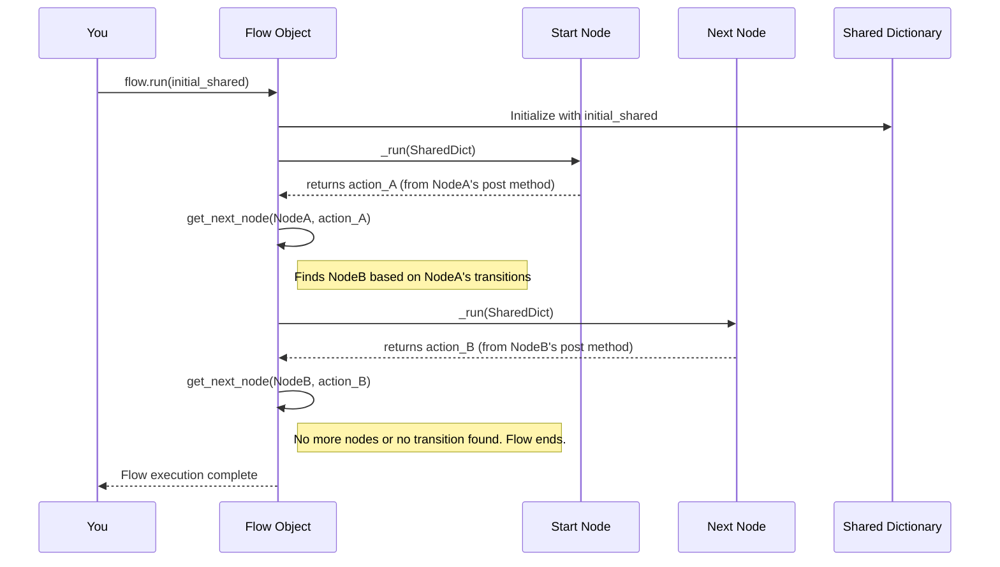

# Chapter 4: Flow (`Flow`, `AsyncFlow`)

In [Chapter 3: Actions / Transitions](03_actions___transitions__.md), we saw how individual [Nodes (`BaseNode`, `Node`, `AsyncNode`)](02_node___basenode____node____asyncnode__.md) can decide what should happen next by returning "action" strings, and how these actions lead to "transitions" between Nodes. But what actually manages this sequence? What's the conductor of this orchestra of Nodes? That's where **Flows** come in!

## What Problem Do Flows Solve? Meet the Orchestrator!

Imagine you're building a simple AI application that interacts with a user:
1.  **Greet User Node**: Displays a welcome message.
2.  **Get Name Node**: Asks the user for their name and stores it.
3.  **Personalized Message Node**: Uses the name to give a personalized response.

Each step is a [Node (`BaseNode`, `Node`, `AsyncNode`)](02_node___basenode____node____asyncnode__.md). But how do you ensure they run in the correct order? How does the "Get Name Node" know to run after "Greet User Node", and how is the name passed along? This is the job of a **Flow**.

A **Flow** is like the **blueprint** or the **manager** of an assembly line. It defines the sequence of operations by connecting multiple [Nodes (`BaseNode`, `Node`, `AsyncNode`)](02_node___basenode____node____asyncnode__.md) into a complete workflow. It dictates:
*   Which [Node (`BaseNode`, `Node`, `AsyncNode`)](02_node___basenode____node____asyncnode__.md) starts the process.
*   How to move from one [Node (`BaseNode`, `Node`, `AsyncNode`)](02_node___basenode____node____asyncnode__.md) to another based on the [Actions / Transitions](03_actions___transitions__.md) we learned about.
*   It ensures the [shared dictionary](01_shared_state___shared__dictionary__.md) is passed along, so all [Nodes (`BaseNode`, `Node`, `AsyncNode`)](02_node___basenode____node____asyncnode__.md) have access to the data they need.

PocketFlow offers two main types of Flows:
*   **`Flow`**: For workflows that consist primarily of synchronous [Nodes (`BaseNode`, `Node`, `AsyncNode`)](02_node___basenode____node____asyncnode__.md) (tasks that run one after another, blocking until complete).
*   **`AsyncFlow`**: For workflows that include asynchronous [Nodes (`BaseNode`, `Node`, `AsyncNode`)](02_node___basenode____node____asyncnode__.md) (tasks that can "pause" and let other operations run, like waiting for user input or a network request).

Let's see how to build and use them!

## Building Your First `Flow`

Let's create a simple text transformation workflow using `Flow`. It will:
1.  Get text input from the user.
2.  Offer transformation choices (uppercase, lowercase, etc.).
3.  Transform the text.
4.  Ask if the user wants to do another transformation or exit.

This example is inspired by `cookbook/pocketflow-flow/flow.py`.

**Step 1: Define Your Nodes**

First, we need our worker [Nodes (`BaseNode`, `Node`, `AsyncNode`)](02_node___basenode____node____asyncnode__.md). (We'll use conceptual Node definitions here for brevity; refer to [Chapter 2](02_node___basenode____node____asyncnode__.md) for Node details).

```python
# Assume these Nodes are defined (simplified from cookbook/pocketflow-flow/flow.py)
# from pocketflow import Node

class TextInput(Node): # Gets input and choice
    def post(self, shared, prep_res, exec_res):
        # ... (gets user input for text and choice) ...
        # shared["text"] = user_text
        # shared["choice"] = user_choice
        if shared["choice"] == "5": # Exit choice
            return "exit"
        return "transform" # Action to proceed to transformation

class TextTransform(Node): # Transforms text based on choice
    def post(self, shared, prep_res, exec_res):
        # ... (transforms text, prints result) ...
        # shared["transformed_text"] = result
        if input("Convert another? (y/n): ") == 'y':
            shared.pop("text", None) # Clear for next input
            return "input" # Action to go back to TextInput
        return "exit" # Action to end

class EndNode(Node): # A simple Node to mark the end
    pass
```
*   `TextInput`: Its `post` method will return `"transform"` to move to the `TextTransform` Node, or `"exit"`.
*   `TextTransform`: Its `post` method will return `"input"` to loop back to `TextInput`, or `"exit"`.

**Step 2: Instantiate Your Nodes**

Create an instance of each Node class:
```python
text_input = TextInput()
text_transform = TextTransform()
end_node = EndNode()
```

**Step 3: Connect Nodes Using Transitions**

Now, tell PocketFlow how these [Nodes (`BaseNode`, `Node`, `AsyncNode`)](02_node___basenode____node____asyncnode__.md) connect based on the actions they return. We learned this in [Chapter 3: Actions / Transitions](03_actions___transitions__.md).

```python
# If text_input returns "transform", go to text_transform
text_input - "transform" >> text_transform
# If text_input returns "exit" (or any other unhandled action by default for this setup)
# we'll eventually want it to go to end_node or the flow just ends.
# For simplicity here, let's make "exit" explicit if we want a dedicated end.
text_input - "exit" >> end_node # Or simply let it end if no "exit" transition

# If text_transform returns "input", go back to text_input
text_transform - "input" >> text_input
# If text_transform returns "exit", go to end_node
text_transform - "exit" >> end_node
```

**Step 4: Create the `Flow`**

Now, create an instance of the `Flow` class, telling it which [Node (`BaseNode`, `Node`, `AsyncNode`)](02_node___basenode____node____asyncnode__.md) to start with.

```python
from pocketflow import Flow

# Create the flow, starting with the text_input node
app_flow = Flow(start=text_input)
```
And that's it! `app_flow` is now a complete, runnable workflow.

**Step 5: Run the `Flow`**

To execute your workflow, you call its `run` method, usually with an initial [shared dictionary](01_shared_state___shared__dictionary__.md).

```python
initial_shared_data = {} # Start with an empty shared dictionary
app_flow.run(initial_shared_data)

# After the flow finishes, initial_shared_data might contain final results
# if your nodes were designed to store them there.
print("Flow finished!")
```
When you run this:
1.  `app_flow` will start with `text_input`.
2.  `text_input` will execute (prompting you for text and choice).
3.  Based on the action returned by `text_input` (e.g., `"transform"`), the `Flow` will look at the transitions you defined and execute the next [Node (`BaseNode`, `Node`, `AsyncNode`)](02_node___basenode____node____asyncnode__.md) (e.g., `text_transform`).
4.  This continues until a [Node (`BaseNode`, `Node`, `AsyncNode`)](02_node___basenode____node____asyncnode__.md) returns an action for which no transition is defined, or it transitions to a [Node (`BaseNode`, `Node`, `AsyncNode`)](02_node___basenode____node____asyncnode__.md) like `end_node` that doesn't lead anywhere else.

## Orchestrating Asynchronous Tasks with `AsyncFlow`

What if your workflow involves tasks that wait for external operations, like fetching data from a website or waiting for a user to type something slowly? If you use a regular `Flow` and synchronous [Nodes (`BaseNode`, `Node`, `AsyncNode`)](02_node___basenode____node____asyncnode__.md) for these, your whole application would freeze during these waits.

This is where `AsyncFlow` and [Asynchronous Processing (`AsyncNode`, `AsyncFlow`)](05_asynchronous_processing___asyncnode____asyncflow___.md) come in. `AsyncFlow` is designed to work with `AsyncNode`s, which can perform tasks asynchronously.

Let's look at a conceptual recipe finder flow (inspired by `cookbook/pocketflow-async-basic/flow.py`).

**Step 1: Define Your AsyncNodes**
You'd define [Nodes (`BaseNode`, `Node`, `AsyncNode`)](02_node___basenode____node____asyncnode__.md) using `AsyncNode` and `async def` methods.

```python
# from pocketflow import AsyncNode, Node

class FetchRecipes(AsyncNode): # Gets ingredient & fetches recipes (async)
    async def post_async(self, shared, prep_res, exec_res):
        # ... (stores recipes in shared) ...
        return "suggest" # Action to suggest a recipe

class SuggestRecipe(Node): # Suggests a recipe (can be sync)
    def post(self, shared, prep_res, exec_res):
        # ... (prints suggestion) ...
        return "approve" # Action to get approval

class GetApproval(AsyncNode): # Gets user approval (async)
    async def post_async(self, shared, prep_res, exec_res):
        # ... (gets approval) ...
        if approved: return "accept"
        return "retry" # Action to suggest another

class EndFlowNode(Node): pass # Simple synchronous end node
```

**Step 2 & 3: Instantiate and Connect**
This is very similar to `Flow`:

```python
fetch_recipes = FetchRecipes()
suggest_recipe = SuggestRecipe()
get_approval = GetApproval()
end_node = EndFlowNode()

fetch_recipes - "suggest" >> suggest_recipe
suggest_recipe - "approve" >> get_approval
get_approval - "retry" >> suggest_recipe # Loop back
get_approval - "accept" >> end_node
```

**Step 4: Create the `AsyncFlow`**

```python
from pocketflow import AsyncFlow

recipe_flow = AsyncFlow(start=fetch_recipes)
```
Notice we use `AsyncFlow` here.

**Step 5: Run the `AsyncFlow`**

Running an `AsyncFlow` involves `async` and `await` because the flow itself is asynchronous.

```python
import asyncio

async def main():
    initial_shared = {}
    await recipe_flow.run_async(initial_shared) # Use run_async()
    print("Recipe flow finished!")

# To run the main async function
# asyncio.run(main())
```
The `AsyncFlow` will manage the `AsyncNode`s, allowing them to `await` their operations without blocking the entire event loop (if you're running other async tasks). We'll explore this more in [Chapter 5: Asynchronous Processing (`AsyncNode`, `AsyncFlow`)](05_asynchronous_processing___asyncnode____asyncflow___.md).

## Nesting Flows: Managing Complexity

What if your workflow becomes very large and complex? You can break it down! A **Flow can itself be treated as a Node and nested within another Flow.** This is like having a project manager who oversees several team leads, and each team lead manages their own team's tasks.

Consider the `cookbook/pocketflow-supervisor/flow.py` example. It has an `agent_inner_flow` which handles research, and then an outer `Flow` that uses this `agent_inner_flow` as a step, followed by a `SupervisorNode` to check the agent's work.

```python
# Conceptual: from cookbook/pocketflow-supervisor/flow.py
# agent_inner_flow is a complete Flow instance itself
agent_inner_flow = create_agent_inner_flow() 
supervisor = SupervisorNode()

# The inner flow is treated like a node in the outer flow's transitions
agent_inner_flow >> supervisor # Default transition
supervisor - "retry" >> agent_inner_flow

supervised_flow = Flow(start=agent_inner_flow)
```
Here, `agent_inner_flow` runs completely. When it finishes, the `supervised_flow` transitions to the `supervisor` Node. This is a powerful way to create hierarchical and modular workflows.

## Under the Hood: How Do Flows Orchestrate?

At its core, a `Flow` (or `AsyncFlow`) runs a loop that:
1.  Identifies the current [Node (`BaseNode`, `Node`, `AsyncNode`)](02_node___basenode____node____asyncnode__.md) to run (starting with its `start_node`).
2.  Executes this [Node (`BaseNode`, `Node`, `AsyncNode`)](02_node___basenode____node____asyncnode__.md) (which involves its `prep`, `exec`, and `post` methods).
3.  Gets the "action" string returned by the Node's `post` method.
4.  Uses this action string to look up the *next* [Node (`BaseNode`, `Node`, `AsyncNode`)](02_node___basenode____node____asyncnode__.md) based on the transitions you defined (e.g., `current_node - "action" >> next_node`).
5.  If a next [Node (`BaseNode`, `Node`, `AsyncNode`)](02_node___basenode____node____asyncnode__.md) is found, it becomes the current [Node (`BaseNode`, `Node`, `AsyncNode`)](02_node___basenode____node____asyncnode__.md), and the loop continues.
6.  If no next [Node (`BaseNode`, `Node`, `AsyncNode`)](02_node___basenode____node____asyncnode__.md) is found (no matching transition), the flow (or that branch of it) ends.

Here's a simplified sequence diagram:



**A Glimpse into the Code (`pocketflow/__init__.py`):**

The `Flow` class inherits from `BaseNode`, so it also has `prep`, `exec`, `post` methods. Its main job is done in its orchestration logic.

1.  **Initialization:** When you create a `Flow`, you give it a starting [Node (`BaseNode`, `Node`, `AsyncNode`)](02_node___basenode____node____asyncnode__.md).
    ```python
    # Inside Flow class
    def __init__(self, start=None):
        super().__init__() # Initialize BaseNode parts
        self.start_node = start # Store the starting node
    ```

2.  **Getting the Next Node:** The `get_next_node` method is crucial. It checks the current node's `successors` dictionary (which was populated by your transition definitions like `nodeA - "action" >> nodeB`).
    ```python
    # Inside Flow class
    def get_next_node(self, current_node, action_str):
        # Try specific action, then "default"
        next_node = current_node.successors.get(action_str)
        if not next_node: # If specific action's successor not found
            next_node = current_node.successors.get("default")
        # ... (warnings if no successor found but some exist) ...
        return next_node
    ```

3.  **The Orchestration Loop (`_orch`):** This is the heart of the `Flow`.
    ```python
    # Inside Flow class (simplified)
    def _orch(self, shared, params=None):
        current_node = self.start_node 
        last_action = None
        while current_node:
            # ... (set parameters for current_node if any) ...
            last_action = current_node._run(shared) # Run the node
            # Get the next node based on the action from the current one
            current_node = self.get_next_node(current_node, last_action)
        return last_action # Returns the very last action from the flow
    ```
    The `current_node._run(shared)` call is what executes the `prep -> exec -> post` cycle of that [Node (`BaseNode`, `Node`, `AsyncNode`)](02_node___basenode____node____asyncnode__.md).

For `AsyncFlow`, the structure is very similar. It has an `_orch_async` method:
```python
# Inside AsyncFlow class (conceptual)
async def _orch_async(self, shared, params=None):
    current_node = self.start_node
    last_action = None
    while current_node:
        # ...
        if isinstance(current_node, AsyncNode):
            last_action = await current_node._run_async(shared) # Await async nodes
        else:
            last_action = current_node._run(shared) # Run sync nodes normally
        current_node = self.get_next_node(current_node, last_action)
    return last_action
```
The key difference is that it `await`s the `_run_async` method of `AsyncNode`s, allowing for non-blocking execution.

## Conclusion

You've now learned about **`Flow`** and **`AsyncFlow`**, the orchestrators that bring your [Nodes (`BaseNode`, `Node`, `AsyncNode`)](02_node___basenode____node____asyncnode__.md) together to form complete, dynamic workflows!
*   Flows define the sequence and logic of how [Nodes (`BaseNode`, `Node`, `AsyncNode`)](02_node___basenode____node____asyncnode__.md) are executed.
*   They use the "action" strings returned by [Nodes (`BaseNode`, `Node`, `AsyncNode`)](02_node___basenode____node____asyncnode__.md) and the transition rules you define (e.g., `nodeA - "action" >> nodeB`) to decide the path of execution.
*   `Flow` is for synchronous workflows, while `AsyncFlow` handles workflows with asynchronous tasks using `AsyncNode`s.
*   Flows can be nested to manage complexity.

With Flows, you can build anything from simple linear sequences to complex, branching, and looping AI applications.

In the next chapter, we'll take a much deeper dive into the world of asynchronous operations specifically, exploring how `AsyncNode` and `AsyncFlow` enable you to build responsive, I/O-bound applications efficiently.

Next up: [Chapter 5: Asynchronous Processing (`AsyncNode`, `AsyncFlow`)](05_asynchronous_processing___asyncnode____asyncflow___.md)

---

Generated by [AI Codebase Knowledge Builder](https://github.com/The-Pocket/Tutorial-Codebase-Knowledge)