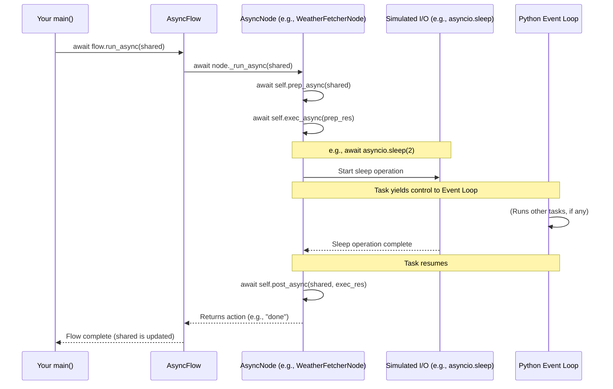

# Chapter 5: Asynchronous Processing (`AsyncNode`, `AsyncFlow`)

In [Chapter 4: Flow (`Flow`, `AsyncFlow`)](04_flow___flow____asyncflow__.md), we learned how `Flow` and `AsyncFlow` orchestrate sequences of [Nodes (`BaseNode`, `Node`, `AsyncNode`)](02_node___basenode____node____asyncnode__.md) to create complete applications. Now, we're going to zoom in on a powerful feature that `AsyncFlow` enables: **Asynchronous Processing**. This is key to building AI applications that feel responsive and can handle tasks that involve waiting, like calling web APIs or interacting with users.

## The Problem: Waiting Can Be Wasteful!

Imagine you're building an AI assistant that needs to:
1.  Ask the user for a city name.
2.  Fetch the current weather for that city from an online weather service (this involves a network request, which can take a few seconds).
3.  Tell the user the weather.

If we build this "synchronously" (one step strictly after the other, waiting for each to finish), your application would *freeze* while it's waiting for the weather service. The user can't do anything else; the app just hangs. This isn't a great experience!

This is where asynchronous processing helps. It's like a skilled chef in a busy kitchen.
*   A **synchronous chef** would prepare one dish from start to finish: chop vegetables, put it on the stove, wait for it to simmer, then plate it. Only *after* that one dish is completely done would they start the next. If simmering takes 20 minutes, they're just standing there waiting!
*   An **asynchronous chef** is much more efficient! They can start chopping vegetables for dish A, put it on the stove to simmer, and *while it's simmering* (a waiting period), they can start preparing dish B, or perhaps clean up. They don't idly wait; they switch to other tasks that can be done.

PocketFlow's `AsyncNode` and `AsyncFlow` let your AI application be like that efficient, asynchronous chef.

## What is Asynchronous Processing?

Asynchronous processing allows your program to start a potentially long-running task (like an API call or waiting for user input) and then, instead of freezing and waiting for it to complete, it can switch to doing other work. When the long-running task eventually finishes, the program can pick up where it left off with that task.

This is especially crucial for **I/O-bound tasks**. "I/O" stands for Input/Output, like:
*   Reading/writing files from a disk.
*   Making requests over a network (e.g., to an LLM API, a database, or a web service).
*   Waiting for user input.

These tasks often involve waiting for something external to the program itself. Asynchronous processing ensures your application remains responsive and can handle multiple things (seemingly) at once, improving overall throughput and user experience.

In Python, this is often achieved using the `async` and `await` keywords.
*   `async def` is used to define an asynchronous function (also called a "coroutine").
*   `await` is used inside an `async` function to pause its execution until an awaited task (another coroutine or an I/O operation) completes. While paused, other asynchronous tasks can run.

## Meet `AsyncNode`: The Asynchronous Worker

In PocketFlow, an `AsyncNode` is a special type of [Node (`BaseNode`, `Node`, `AsyncNode`)](02_node___basenode____node____asyncnode__.md) designed for asynchronous operations. It looks very similar to a regular `Node`, but its core methods (`prep`, `exec`, `post`) are defined as `async` functions:

*   `async def prep_async(self, shared)`
*   `async def exec_async(self, prep_res)`
*   `async def post_async(self, shared, prep_res, exec_res)`

Inside these methods, you can use `await` to call other asynchronous functions or perform non-blocking I/O operations.

Let's create a simple `AsyncNode` that simulates fetching data from a website. We'll use `asyncio.sleep()` to mimic the delay of a network request.

```python
import asyncio
from pocketflow import AsyncNode

class WeatherFetcherNode(AsyncNode):
    async def prep_async(self, shared):
        city = shared.get("city_name", "Unknown city")
        print(f"WeatherFetcherNode: Preparing to fetch weather for {city}.")
        return city

    async def exec_async(self, city):
        print(f"WeatherFetcherNode: Calling weather API for {city}...")
        await asyncio.sleep(2) # Simulate a 2-second API call
        weather_data = f"Sunny in {city}"
        print(f"WeatherFetcherNode: Got weather: {weather_data}")
        return weather_data

    async def post_async(self, shared, prep_res, exec_res):
        shared["weather_report"] = exec_res
        print(f"WeatherFetcherNode: Weather report stored in shared.")
        return "done" # Action to signify completion
```
In this `WeatherFetcherNode`:
*   All methods are `async def`.
*   `exec_async` uses `await asyncio.sleep(2)` to pause for 2 seconds. If this were a real application, it might be `await http_client.get(...)`. While this `await` is active, other asynchronous tasks in your program could run.

## Orchestrating with `AsyncFlow`

To run `AsyncNode`s, you need an `AsyncFlow`. As we saw in [Chapter 4: Flow (`Flow`, `AsyncFlow`)](04_flow___flow____asyncflow__.md), an `AsyncFlow` can manage both `AsyncNode`s and regular `Node`s. When it encounters an `AsyncNode`, it will correctly `await` its asynchronous methods.

Let's set up an `AsyncFlow` to use our `WeatherFetcherNode`.

**1. Instantiate your Node(s):**
```python
weather_node = WeatherFetcherNode()
# You could have other nodes here, sync or async
```

**2. (Optional) Define Transitions:**
If you have multiple nodes, you define transitions as usual. Since we only have one node, its returned action `"done"` will simply end this branch of the flow.

```python
# Example: weather_node - "done" >> some_other_node
# For this example, we'll let it end.
```

**3. Create the `AsyncFlow`:**
```python
from pocketflow import AsyncFlow

weather_flow = AsyncFlow(start=weather_node)
```

**4. Run the `AsyncFlow`:**
Running an `AsyncFlow` requires `await` because the flow itself is an asynchronous operation. You'll typically do this inside an `async` function.

```python
# main.py
import asyncio

# Assume WeatherFetcherNode is defined as above
# Assume weather_flow is created as above

async def main():
    shared_data = {"city_name": "London"}
    print("Starting weather flow...")
    await weather_flow.run_async(shared_data) # Use run_async()
    print("Weather flow finished.")
    print(f"Final shared data: {shared_data}")

if __name__ == "__main__":
    asyncio.run(main()) # Standard way to run an async main function
```

**Expected Output/Behavior:**

When you run `main.py`:
1.  "Starting weather flow..." is printed.
2.  `WeatherFetcherNode: Preparing to fetch weather for London.` is printed.
3.  `WeatherFetcherNode: Calling weather API for London...` is printed.
4.  The program will *pause* here for about 2 seconds (due to `await asyncio.sleep(2)`). If other `async` tasks were scheduled, Python's event loop could run them during this time.
5.  After 2 seconds:
    *   `WeatherFetcherNode: Got weather: Sunny in London` is printed.
    *   `WeatherFetcherNode: Weather report stored in shared.` is printed.
6.  "Weather flow finished." is printed.
7.  `Final shared data: {'city_name': 'London', 'weather_report': 'Sunny in London'}` is printed.

The key is that during the 2-second "API call," a well-structured asynchronous application wouldn't be frozen. It could be handling other user requests, updating a UI, or performing other background tasks.

## What Happens Under the Hood?

When an `AsyncFlow` runs an `AsyncNode`, it leverages Python's `asyncio` event loop.

1.  **`AsyncFlow` starts:** You call `await my_async_flow.run_async(shared)`.
2.  **Node Execution:** The `AsyncFlow`'s orchestrator (`_orch_async`) identifies the current node.
3.  **Calling `_run_async`:** If the current node is an `AsyncNode` (like our `WeatherFetcherNode`), the `AsyncFlow` calls `await current_node._run_async(shared)`.
4.  **Inside `AsyncNode`:**
    *   `_run_async` calls `await self.prep_async(shared)`.
    *   Then, `await self._exec(prep_result)` (which internally calls `await self.exec_async(prep_result)`).
    *   Finally, `await self.post_async(shared, prep_result, exec_result)`.
5.  **The `await` Keyword:** When an `AsyncNode`'s method encounters an `await` statement (e.g., `await asyncio.sleep(2)` or `await some_api_call()`), execution of *that specific node's task* pauses. Control is yielded back to the `asyncio` event loop.
6.  **Event Loop Magic:** The event loop can then run other pending asynchronous tasks. It keeps track of the paused task.
7.  **Task Resumes:** When the awaited operation completes (e.g., `asyncio.sleep(2)` finishes, or the API responds), the event loop resumes the paused `AsyncNode` task from where it left off.
8.  **Action and Next Node:** The `AsyncNode`'s `post_async` eventually returns an action, and the `AsyncFlow` determines the next node, continuing the process.

Here's a sequence diagram to visualize it:



**Diving into PocketFlow's Code (Simplified):**

*   **`AsyncNode`'s Execution (`pocketflow/__init__.py`):**
    The `AsyncNode` has an `_run_async` method:
    ```python
    # Inside AsyncNode class
    async def _run_async(self, shared):
        p = await self.prep_async(shared)
        e = await self._exec(p) # _exec calls exec_async with retries
        return await self.post_async(shared, p, e)
    ```
    And its `_exec` method handles calling `exec_async` (and retries, similar to `Node` but `async`):
    ```python
    # Inside AsyncNode class (simplified _exec)
    async def _exec(self, prep_res): 
        # ... (retry loop) ...
        try:
            return await self.exec_async(prep_res) # Key: await exec_async
        except Exception as e:
            # ... (fallback logic) ...
    ```

*   **`AsyncFlow`'s Orchestration (`pocketflow/__init__.py`):**
    The `AsyncFlow` has an `_orch_async` method that handles running nodes:
    ```python
    # Inside AsyncFlow class
    async def _orch_async(self, shared, params=None):
        curr, p, last_action = self.start_node, (params or {}), None
        while curr:
            # ... (set params for current node) ...
            if isinstance(curr, AsyncNode):
                last_action = await curr._run_async(shared) # AWAIT AsyncNode
            else:
                last_action = curr._run(shared) # Run sync Node normally
            curr = self.get_next_node(curr, last_action)
        return last_action
    ```
    Notice how it checks if `curr` is an `AsyncNode` and uses `await curr._run_async(shared)` if it is. Otherwise, for regular synchronous [Nodes (`BaseNode`, `Node`, `AsyncNode`)](02_node___basenode____node____asyncnode__.md), it calls `curr._run(shared)` directly.

## Benefits of Asynchronous Processing

1.  **Responsiveness:** Your application doesn't freeze while waiting for I/O tasks. This is vital for user interfaces or servers handling multiple requests.
2.  **Improved Throughput:** For applications with many I/O-bound tasks (e.g., making multiple API calls), asynchronous processing allows these tasks to overlap their waiting periods, leading to faster overall completion. Imagine our chef preparing multiple simmering dishes at once!
3.  **Efficient Resource Usage:** Threads can be resource-intensive. `asyncio` often uses a single thread more efficiently by switching between tasks during their I/O wait times.

Use `AsyncNode` and `AsyncFlow` when your workflow involves tasks that spend significant time waiting for external operations.

## Conclusion

You've now unlocked the power of asynchronous processing in PocketFlow with `AsyncNode` and `AsyncFlow`!
*   Asynchronous operations prevent your application from freezing during I/O-bound tasks like API calls.
*   `AsyncNode` defines its logic with `async def` methods (`prep_async`, `exec_async`, `post_async`) and uses `await` for non-blocking waits.
*   `AsyncFlow` orchestrates these `AsyncNode`s (and regular `Node`s) using `await flow.run_async()`.
*   This approach leads to more responsive and efficient applications, especially when dealing with network requests or user interactions.

This "asynchronous chef" model is incredibly useful. What if you have many similar items to process, perhaps even asynchronously and in parallel? That's where batch processing comes in.

Next up: [Chapter 6: Batch Processing (`BatchNode`, `BatchFlow`, `AsyncParallelBatchNode`)](06_batch_processing___batchnode____batchflow____asyncparallelbatchnode___.md)

---

Generated by [AI Codebase Knowledge Builder](https://github.com/The-Pocket/Tutorial-Codebase-Knowledge)