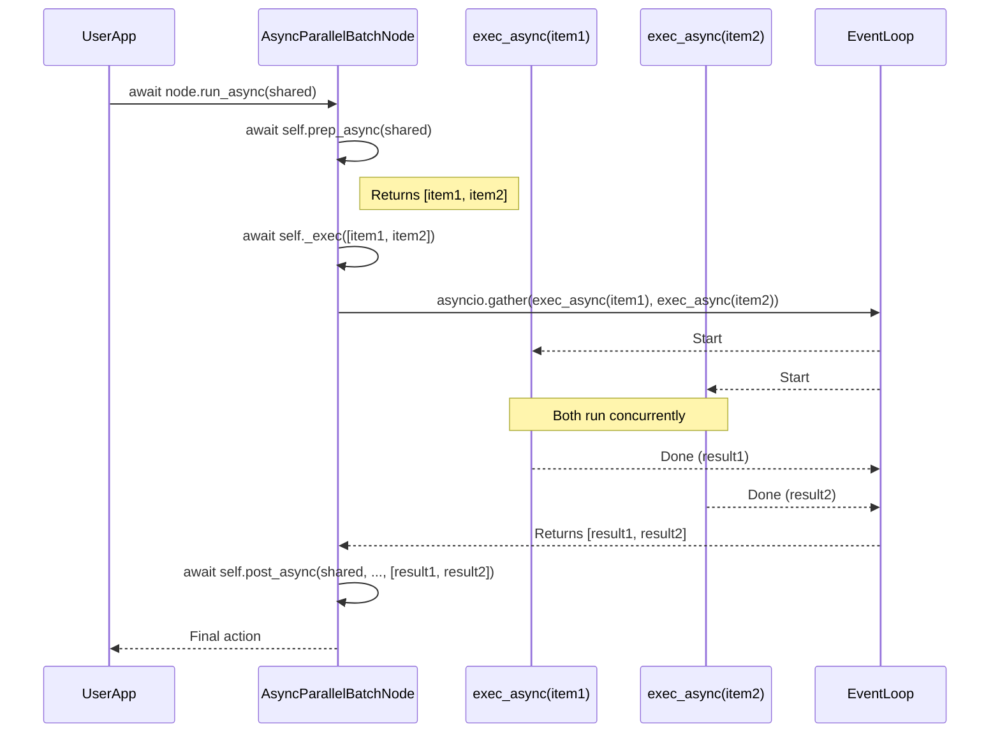
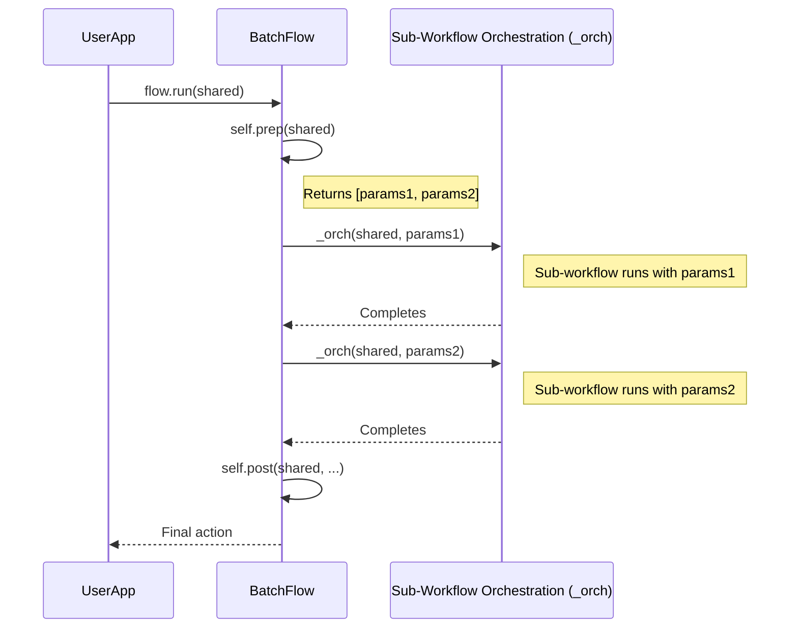

# Chapter 6: Batch Processing (`BatchNode`, `BatchFlow`, `AsyncParallelBatchNode`)

In [Chapter 5: Asynchronous Processing (`AsyncNode`, `AsyncFlow`)](05_asynchronous_processing___asyncnode____asyncflow___.md), we explored how `AsyncNode` and `AsyncFlow` help build responsive applications that can handle waiting for tasks like API calls. Now, what if you need to perform a similar operation on *many* different items? For example, imagine you have a document, and you want to translate it into ten different languages. Doing this one by one, or even coordinating many asynchronous calls manually, can be cumbersome. PocketFlow provides specialized tools for exactly this: **Batch Processing**.

Batch processing in PocketFlow allows you to efficiently apply a piece of logic to a collection of items, simplifying the code and often improving performance, especially with parallel execution.

Our main use case for this chapter will be: **Translating a single document into multiple target languages.**

Let's explore the tools PocketFlow offers for this:

## 1. `BatchNode`: The Sequential Worker for Batches

A `BatchNode` is designed to process a list of items one after the other (sequentially). It's like a meticulous librarian who takes a stack of books and processes each one individually before moving to the next.

**How it Works:**
1.  **`prep(self, shared)`**: This method is responsible for preparing your list of individual items to be processed. It should return an iterable (like a list) where each element is a single item for processing.
2.  **`exec(self, item)`**: This method is called *for each individual item* returned by `prep`. It contains the logic to process that single `item`.
3.  **`post(self, shared, prep_res, exec_res_list)`**: After all items have been processed by `exec`, this method is called. `exec_res_list` will be a list containing the results from each call to `exec`, in the same order as the input items.

**Example: Processing a Large CSV in Chunks**

Let's look at `CSVProcessor` from `cookbook/pocketflow-batch-node/nodes.py`. It reads a large CSV file not all at once, but in smaller "chunks" (batches of rows).

```python
# cookbook/pocketflow-batch-node/nodes.py
import pandas as pd
from pocketflow import BatchNode

class CSVProcessor(BatchNode):
    def __init__(self, chunk_size=1000):
        super().__init__()
        self.chunk_size = chunk_size
    
    def prep(self, shared):
        # Returns an iterator of DataFrame chunks
        chunks = pd.read_csv(
            shared["input_file"], chunksize=self.chunk_size
        )
        return chunks # Each 'chunk' is an item

    def exec(self, chunk): # Called for each chunk
        # Process one chunk (a pandas DataFrame)
        return { "total_sales": chunk["amount"].sum(), # ... more stats ... 
        }

    def post(self, shared, prep_res, exec_res_list):
        # exec_res_list contains results from all chunks
        # ... (combine statistics from all chunks) ...
        shared["statistics"] = { # ... final aggregated stats ... 
        }
        return "show_stats"
```
*   `prep`: Reads the CSV specified in `shared["input_file"]` and returns an iterator where each item is a `DataFrame` (a chunk of rows).
*   `exec`: Takes one `chunk` (a `DataFrame`) and calculates some statistics for it. This method will be called multiple times, once for each chunk from `prep`.
*   `post`: Receives `exec_res_list`, which is a list of dictionaries (one from each `exec` call). It then aggregates these results and stores the final statistics in `shared`.

This `BatchNode` processes each chunk sequentially.

## 2. `AsyncParallelBatchNode`: The Concurrent Worker for Batches

What if processing each item involves waiting (like an API call), and you want to do them concurrently to save time? That's where `AsyncParallelBatchNode` comes in. It's like `BatchNode` but for asynchronous operations that can run in parallel. Imagine a team of librarians, each given a book from the stack, processing them all at the same time.

**How it Works:**
1.  **`async def prep_async(self, shared)`**: Similar to `BatchNode.prep`, but asynchronous. It returns a list of items to be processed.
2.  **`async def exec_async(self, item)`**: This asynchronous method is called for each item. PocketFlow will use `asyncio.gather` to run these `exec_async` calls concurrently for all items.
3.  **`async def post_async(self, shared, prep_res, exec_res_list)`**: Called after all `exec_async` calls have completed. `exec_res_list` contains their results.

**Solving Our Use Case: Translating a Document into Multiple Languages**

The `AsyncParallelBatchNode` is perfect for our document translation task. Let's look at `TranslateTextNodeParallel` from `cookbook/pocketflow-parallel-batch/main.py`.

```python
# cookbook/pocketflow-parallel-batch/main.py (simplified)
from pocketflow import AsyncFlow, AsyncParallelBatchNode
# from utils import call_llm # Assumed async LLM call

class TranslateTextNodeParallel(AsyncParallelBatchNode):
    async def prep_async(self, shared):
        text = shared.get("text", "")
        languages = shared.get("languages", [])
        # Create a list of (text_to_translate, target_language) tuples
        return [(text, lang) for lang in languages]

    async def exec_async(self, data_tuple):
        text, language = data_tuple # One (text, language) pair
        # prompt = f"Translate '{text}' to {language}..."
        # result = await call_llm(prompt) # Call LLM API
        print(f"Translated to {language}") # Simplified
        return {"language": language, "translation": f"Translated: {language}"}

    async def post_async(self, shared, prep_res, exec_res_list):
        # exec_res_list has all translation results
        # ... (code to save each translation to a file) ...
        print(f"All {len(exec_res_list)} translations processed.")
        return "default" # Or some other action

# To run this, you'd typically wrap it in an AsyncFlow:
# translate_node = TranslateTextNodeParallel()
# translation_flow = AsyncFlow(start=translate_node)
# await translation_flow.run_async(shared_data_with_text_and_languages)
```
In this example:
*   `prep_async`: Takes the document `text` and a list of `languages` from `shared`. It returns a list of tuples, e.g., `[(original_text, "Spanish"), (original_text, "French"), ...]`. Each tuple is an "item" for `exec_async`.
*   `exec_async`: Takes one `(text, language)` tuple, calls an asynchronous LLM function (`call_llm`) to perform the translation, and returns a dictionary with the result. Because this is an `AsyncParallelBatchNode`, PocketFlow will try to run these LLM calls for all languages concurrently!
*   `post_async`: Gets the list of all translation results and, in the full example, saves them to files.

This drastically speeds up the overall translation process compared to doing them one by one.

## 3. `BatchFlow`: Running a Sub-Workflow Multiple Times

Sometimes, the "logic" you want to apply to a collection isn't just a single `exec` method, but a whole sub-workflow (which could be a single [Node (`BaseNode`, `Node`, `AsyncNode`)](02_node___basenode____node____asyncnode__.md) or a more complex [Flow (`Flow`, `AsyncFlow`)](04_flow___flow____asyncflow__.md)). You want to run this sub-workflow multiple times, each time with slightly different *parameters*. This is what `BatchFlow` is for.

Think of a film director who has a specific scene (the sub-workflow) and wants to shoot it multiple times, but each time with different actors or lighting (the parameters).

**How it Works:**
1.  The `BatchFlow` is initialized with a `start` component, which is the sub-workflow (a [Node (`BaseNode`, `Node`, `AsyncNode`)](02_node___basenode____node____asyncnode__.md) or [Flow (`Flow`, `AsyncFlow`)](04_flow___flow____asyncflow__.md)) to be run multiple times.
2.  **`prep(self, shared)`**: This method of the `BatchFlow` itself should return a list of parameter dictionaries. Each dictionary represents one "run" of the sub-workflow.
3.  For each parameter dictionary from `prep`, the `BatchFlow` executes its `start` component (the sub-workflow). The parameters from the dictionary are made available to the sub-workflow for that particular run, usually merged into its `shared` context or node `params`.
4.  **`post(self, shared, prep_res, exec_res)`**: This is called after all batch executions of the sub-workflow are done. Note: `exec_res` here is often `None` because the results of each sub-workflow execution are typically handled within those sub-workflows by writing to `shared`.

**Example: Applying Different Filters to Multiple Images**

Consider `cookbook/pocketflow-batch-flow/flow.py`. We want to process several images, applying a different filter to each (or multiple filters to each image).

First, a base [Flow (`Flow`, `AsyncFlow`)](04_flow___flow____asyncflow__.md) defines how to process *one* image with *one* filter:
```python
# cookbook/pocketflow-batch-flow/flow.py (simplified base_flow)
# from pocketflow import Flow
# from nodes import LoadImage, ApplyFilter, SaveImage

def create_base_flow(): # This is our sub-workflow
    load = LoadImage()
    filter_node = ApplyFilter()
    save = SaveImage()
    
    load - "apply_filter" >> filter_node
    filter_node - "save" >> save
    return Flow(start=load) # Base flow for one image-filter pair
```

Now, the `ImageBatchFlow`:
```python
# cookbook/pocketflow-batch-flow/flow.py (ImageBatchFlow)
# from pocketflow import BatchFlow

class ImageBatchFlow(BatchFlow):
    def prep(self, shared):
        images = ["cat.jpg", "dog.jpg"]
        filters = ["grayscale", "blur"]
        params = [] # List of parameter dictionaries
        for img in images:
            for f in filters:
                # Each dict is one set of params for the base_flow
                params.append({"input_image_path": img, "filter_type": f})
        return params

# How to use it:
# base_processing_logic = create_base_flow()
# image_processor = ImageBatchFlow(start=base_processing_logic)
# image_processor.run(initial_shared_data)
```
*   `ImageBatchFlow.prep`: Generates a list of parameter dictionaries. Each dictionary specifies an input image and a filter type, e.g., `[{"input_image_path": "cat.jpg", "filter_type": "grayscale"}, {"input_image_path": "cat.jpg", "filter_type": "blur"}, ...]`.
*   When `image_processor.run()` is called, the `base_processing_logic` ([Flow (`Flow`, `AsyncFlow`)](04_flow___flow____asyncflow__.md)) will be executed for *each* of these parameter dictionaries. The `LoadImage` node inside `base_processing_logic` would then use `params["input_image_path"]`, and `ApplyFilter` would use `params["filter_type"]`.

## 4. `AsyncParallelBatchFlow`: Running Sub-Workflows in Parallel

Just as `AsyncParallelBatchNode` is the concurrent version of `BatchNode`, `AsyncParallelBatchFlow` is the concurrent version of `BatchFlow`. It runs the multiple executions of its sub-workflow *in parallel*.

This is like having multiple film crews, each with their own set, shooting different variations of the same scene (sub-workflow with different parameters) all at the same time.

**How it Works:**
Similar to `BatchFlow`, but:
1.  Uses `async def prep_async(self, shared)` to generate the list of parameter dictionaries.
2.  When run with `await my_flow.run_async()`, it executes the sub-workflow for each parameter set concurrently using `asyncio.gather`.

**Example: Parallel Image Processing with Filters**
The `cookbook/pocketflow-parallel-batch-flow/flow.py` shows an `ImageParallelBatchFlow`.
```python
# cookbook/pocketflow-parallel-batch-flow/flow.py (Conceptual)
# from pocketflow import AsyncParallelBatchFlow
# from nodes import LoadImageAsync, ApplyFilterAsync, SaveImageAsync 
# (assuming async versions of nodes for the base async flow)

# def create_async_base_flow(): ... returns an AsyncFlow ...

class ImageParallelBatchFlow(AsyncParallelBatchFlow):
    async def prep_async(self, shared):
        # ... (generates list of param dicts like before) ...
        # params.append({"image_path": img, "filter": f_type})
        return params

# How to use it:
# async_base_logic = create_async_base_flow() # An AsyncFlow
# parallel_processor = ImageParallelBatchFlow(start=async_base_logic)
# await parallel_processor.run_async(initial_shared_data)
```
This would run the `async_base_logic` for each image-filter combination in parallel, potentially speeding up processing if the sub-workflow involves `await`able operations.

## Under the Hood: A Glimpse

Let's briefly see how these batch components achieve their magic, using simplified logic.

**`BatchNode`**
Its `_exec` method essentially loops through the items from `prep` and calls its parent's `_exec` (which eventually calls your `exec` method) for each one.
```python
# pocketflow/__init__.py (BatchNode simplified)
class BatchNode(Node):
    def _exec(self, items_from_prep):
        results = []
        for item in (items_from_prep or []):
            # Calls Node._exec(item), which calls self.exec(item)
            result_for_item = super(BatchNode, self)._exec(item)
            results.append(result_for_item)
        return results # This list becomes exec_res_list in post()
```

**`AsyncParallelBatchNode`**
Its `_exec` method uses `asyncio.gather` to run the processing of all items concurrently.
```python
# pocketflow/__init__.py (AsyncParallelBatchNode simplified)
class AsyncParallelBatchNode(AsyncNode, BatchNode): # Inherits from AsyncNode
    async def _exec(self, items_from_prep_async):
        tasks = []
        for item in items_from_prep_async:
            # Create a task for super()._exec(item)
            # super()._exec eventually calls self.exec_async(item)
            task = super(AsyncParallelBatchNode, self)._exec(item)
            tasks.append(task)
        return await asyncio.gather(*tasks) # Run all tasks concurrently
```


**`BatchFlow`**
Its `_run` method iterates through the parameter dictionaries from `prep` and, for each one, calls `_orch` (the standard [Flow (`Flow`, `AsyncFlow`)](04_flow___flow____asyncflow__.md) orchestration method) to run its `start` component with those parameters.
```python
# pocketflow/__init__.py (BatchFlow simplified)
class BatchFlow(Flow):
    def _run(self, shared):
        param_list = self.prep(shared) or []
        for param_set in param_list:
            # Run the entire sub-workflow (self.start_node)
            # with current param_set merged.
            # self.params are the BatchFlow's own params.
            merged_params = {**self.params, **param_set}
            self._orch(shared, merged_params) # _orch runs the sub-flow
        return self.post(shared, param_list, None)
```


**`AsyncParallelBatchFlow`**
Its `_run_async` method is similar to `BatchFlow._run` but uses `asyncio.gather` to run all the `_orch_async` calls (for its sub-workflow) in parallel.
```python
# pocketflow/__init__.py (AsyncParallelBatchFlow simplified)
class AsyncParallelBatchFlow(AsyncFlow, BatchFlow):
    async def _run_async(self, shared):
        param_list = await self.prep_async(shared) or []
        tasks = []
        for param_set in param_list:
            merged_params = {**self.params, **param_set}
            # Create a task for each sub-workflow run
            task = self._orch_async(shared, merged_params)
            tasks.append(task)
        await asyncio.gather(*tasks) # Run all sub-workflow instances concurrently
        return await self.post_async(shared, param_list, None)
```

## Conclusion

Batch processing tools in PocketFlow—`BatchNode`, `AsyncParallelBatchNode`, `BatchFlow`, and `AsyncParallelBatchFlow`—provide powerful and convenient ways to handle collections of items or run workflows multiple times with varying parameters.
*   Use **`BatchNode`** for sequential processing of a list of items where `exec` defines the logic for one item.
*   Use **`AsyncParallelBatchNode`** for concurrent processing of items, ideal for I/O-bound tasks like multiple API calls (our translation example).
*   Use **`BatchFlow`** when you have a sub-workflow that needs to be run multiple times sequentially, each time with different parameters.
*   Use **`AsyncParallelBatchFlow`** to run instances of a sub-workflow concurrently with different parameters.

These abstractions help keep your code clean, manage complexity, and leverage concurrency for better performance.

So far, we've seen how individual agents or flows can be constructed. But what if you need multiple, distinct AI agents to collaborate and communicate with each other?

Next up: [Chapter 7: A2A (Agent-to-Agent) Communication Framework](07_a2a__agent_to_agent__communication_framework.md)

---

Generated by [AI Codebase Knowledge Builder](https://github.com/The-Pocket/Tutorial-Codebase-Knowledge)