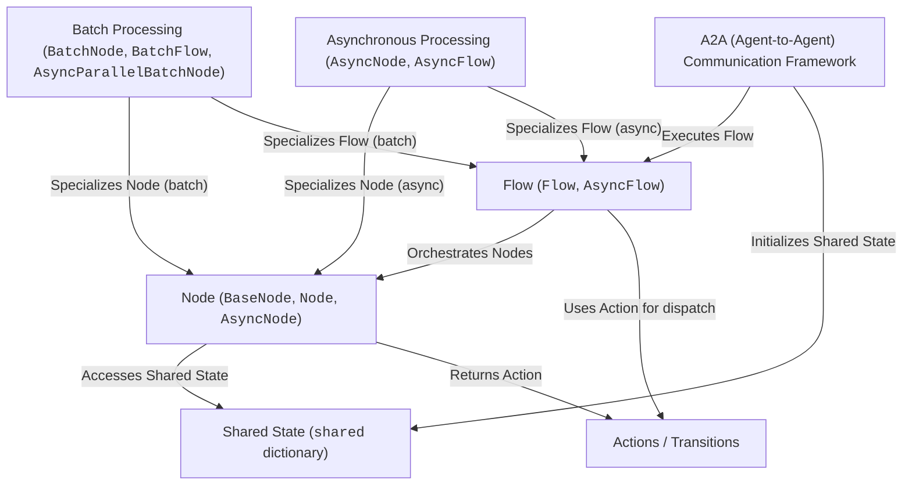

# Tutorial: PocketFlow

> This tutorial is AI-generated! To learn more, check out [AI Codebase Knowledge Builder](https://github.com/The-Pocket/Tutorial-Codebase-Knowledge)

PocketFlow[View Repo](https://github.com/The-Pocket/PocketFlow) is a *Python framework* for building modular workflows and AI agents.
It allows you to define complex processes by connecting individual **Nodes**, which represent *atomic tasks* like calling an LLM or searching the web.
A **Flow** then *orchestrates* these Nodes, guiding the execution sequence based on **Actions** (string identifiers) returned by each Node.
Data is passed between Nodes and managed throughout the workflow execution via a **Shared State** (a Python dictionary).
PocketFlow also offers advanced features like **Batch Processing** for efficiently handling collections of items, and **Asynchronous Processing** for non-blocking operations crucial for I/O-bound tasks.
Additionally, it demonstrates an **A2A (Agent-to-Agent) Communication Framework** to wrap PocketFlow agents, enabling them to communicate with other systems using a standardized JSON-RPC protocol.

---

Generated by [AI Codebase Knowledge Builder](https://github.com/The-Pocket/Tutorial-Codebase-Knowledge)