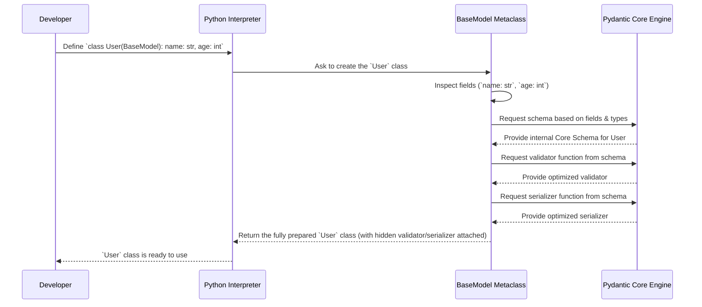

# Chapter 1: BaseModel - Your Data Blueprint

Welcome to the Pydantic tutorial! We're excited to guide you through the powerful features of Pydantic, starting with the absolute core concept: `BaseModel`.

## Why Do We Need Structured Data?

Imagine you're building a web application. You receive data from users – maybe their name and age when they sign up. This data might come as JSON, form data, or just plain Python dictionaries.

```json
// Example user data from an API
{
  "username": "cool_cat_123",
  "age": "28", // Oops, age is a string!
  "email": "cat@example.com"
}
```

How do you make sure this data is correct? Is `username` always provided? Is `age` actually a number, or could it be text like `"twenty-eight"`? Handling all these checks manually can be tedious and error-prone.

This is where Pydantic and `BaseModel` come in!

## Introducing `BaseModel`: The Blueprint

Think of `BaseModel` as a **blueprint** for your data. You define the structure you expect – what fields should exist and what their types should be (like `string`, `integer`, `boolean`, etc.). Pydantic then uses this blueprint to automatically:

1.  **Parse:** Read incoming data (like a dictionary).
2.  **Validate:** Check if the data matches your blueprint (e.g., is `age` really an integer?). If not, it tells you exactly what's wrong.
3.  **Serialize:** Convert your structured data back into simple formats (like a dictionary or JSON) when you need to send it somewhere else.

It's like having an automatic quality checker and translator for your data!

## Defining Your First Model

Let's create a blueprint for a simple `User`. We want each user to have a `name` (which should be text) and an `age` (which should be a whole number).

In Pydantic, you do this by creating a class that inherits from `BaseModel` and using standard Python type hints:

```python
# Import BaseModel from Pydantic
from pydantic import BaseModel

# Define your data blueprint (Model)
class User(BaseModel):
    name: str  # The user's name must be a string
    age: int   # The user's age must be an integer
```

That's it! This simple class `User` is now a Pydantic model. It acts as the blueprint for creating user objects.

## Using Your `BaseModel` Blueprint

Now that we have our `User` blueprint, let's see how to use it.

### Creating Instances (Parsing and Validation)

You create instances of your model just like any regular Python class, passing the data as keyword arguments. Pydantic automatically parses and validates the data against your type hints (`name: str`, `age: int`).

**1. Valid Data:**

```python
# Input data (e.g., from a dictionary)
user_data = {'name': 'Alice', 'age': 30}

# Create a User instance
user_alice = User(**user_data) # The ** unpacks the dictionary

# Pydantic checked that 'name' is a string and 'age' is an integer.
# It worked! Let's see the created object.
print(user_alice)
# Expected Output: name='Alice' age=30
```

Behind the scenes, Pydantic looked at `user_data`, compared it to the `User` blueprint, saw that `'Alice'` is a valid `str` and `30` is a valid `int`, and created the `user_alice` object.

**2. Invalid Data:**

What happens if the data doesn't match the blueprint?

```python
from pydantic import BaseModel, ValidationError

class User(BaseModel):
    name: str
    age: int

# Input data with age as a string that isn't a number
invalid_data = {'name': 'Bob', 'age': 'twenty-eight'}

try:
    user_bob = User(**invalid_data)
except ValidationError as e:
    print(e)
    """
    Expected Output (simplified):
    1 validation error for User
    age
      Input should be a valid integer, unable to parse string as an integer [type=int_parsing, input_value='twenty-eight', input_type=str]
    """
```

Pydantic catches the error! Because `'twenty-eight'` cannot be understood as an `int` for the `age` field, it raises a helpful `ValidationError` telling you exactly which field (`age`) failed and why.

**3. Type Coercion (Smart Conversion):**

Pydantic is often smart enough to convert types when it makes sense. For example, if you provide `age` as a string containing digits:

```python
from pydantic import BaseModel

class User(BaseModel):
    name: str
    age: int

# Input data with age as a numeric string
data_with_string_age = {'name': 'Charlie', 'age': '35'}

# Create a User instance
user_charlie = User(**data_with_string_age)

# Pydantic converted the string '35' into the integer 35!
print(user_charlie)
# Expected Output: name='Charlie' age=35
print(type(user_charlie.age))
# Expected Output: <class 'int'>
```

Pydantic automatically *coerced* the string `'35'` into the integer `35` because the blueprint specified `age: int`. This leniency is often very convenient.

### Accessing Data

Once you have a valid model instance, you access its data using standard attribute access:

```python
# Continuing from the user_alice example:
print(f"User's Name: {user_alice.name}")
# Expected Output: User's Name: Alice

print(f"User's Age: {user_alice.age}")
# Expected Output: User's Age: 30
```

### Serialization (Converting Back)

Often, you'll need to convert your model instance back into a basic Python dictionary (e.g., to send it as JSON over a network). `BaseModel` provides easy ways to do this:

**1. `model_dump()`:** Converts the model to a dictionary.

```python
# Continuing from the user_alice example:
user_dict = user_alice.model_dump()

print(user_dict)
# Expected Output: {'name': 'Alice', 'age': 30}
print(type(user_dict))
# Expected Output: <class 'dict'>
```

**2. `model_dump_json()`:** Converts the model directly to a JSON string.

```python
# Continuing from the user_alice example:
user_json = user_alice.model_dump_json(indent=2) # indent for pretty printing

print(user_json)
# Expected Output:
# {
#   "name": "Alice",
#   "age": 30
# }
print(type(user_json))
# Expected Output: <class 'str'>
```

These methods allow you to easily share your structured data.

## Under the Hood: How Does `BaseModel` Work?

You don't *need* to know the internals to use Pydantic effectively, but a little insight can be helpful!

**High-Level Steps:**

When Python creates your `User` class (which inherits from `BaseModel`), some Pydantic magic happens via its `ModelMetaclass`:

1.  **Inspection:** Pydantic looks at your class definition (`User`), finding the fields (`name`, `age`) and their type hints (`str`, `int`).
2.  **Schema Generation:** It generates an internal "Core Schema". This is a detailed, language-agnostic description of your data structure and validation rules. Think of it as an even more detailed blueprint used internally by Pydantic's fast validation engine (written in Rust!). We'll explore this more in [Chapter 5](05_core_schema___validation_serialization.md).
3.  **Validator/Serializer Creation:** Based on this Core Schema, Pydantic creates highly optimized functions (internally) for validating input data and serializing model instances for *this specific model* (`User`).

Here's a simplified diagram:



**Instantiation and Serialization Flow:**

*   When you call `User(name='Alice', age=30)`, Python calls the `User` class's `__init__` method. Pydantic intercepts this and uses the optimized **validator** created earlier to check the input data against the Core Schema. If valid, it creates the instance; otherwise, it raises `ValidationError`.
*   When you call `user_alice.model_dump()`, Pydantic uses the optimized **serializer** created earlier to convert the instance's data back into a dictionary, again following the rules defined in the Core Schema.

**Code Location:**

Most of this intricate setup logic happens within the `ModelMetaclass` found in `pydantic._internal._model_construction.py`. It coordinates with the `pydantic-core` Rust engine to build the schema and the validation/serialization logic.

```python
# Extremely simplified conceptual view of metaclass action
class ModelMetaclass(type):
    def __new__(mcs, name, bases, namespace, **kwargs):
        # 1. Find fields and type hints in 'namespace'
        fields = {} # Simplified: find 'name: str', 'age: int'
        annotations = {} # Simplified

        # ... collect fields, config, etc. ...

        # 2. Generate Core Schema (pseudo-code)
        # core_schema = pydantic_core.generate_schema(fields, annotations, config)
        # (This happens internally, see Chapter 5)

        # 3. Create validator & serializer (pseudo-code)
        # validator = pydantic_core.SchemaValidator(core_schema)
        # serializer = pydantic_core.SchemaSerializer(core_schema)

        # Create the actual class object
        cls = super().__new__(mcs, name, bases, namespace, **kwargs)

        # Attach the generated validator/serializer (simplified)
        # cls.__pydantic_validator__ = validator
        # cls.__pydantic_serializer__ = serializer
        # cls.__pydantic_core_schema__ = core_schema # Store the schema

        return cls

# class BaseModel(metaclass=ModelMetaclass):
#    ... rest of BaseModel implementation ...
```

This setup ensures that validation and serialization are defined *once* when the class is created, making instance creation (`User(...)`) and dumping (`model_dump()`) very fast.

## Conclusion

You've learned the fundamentals of `pydantic.BaseModel`:

*   It acts as a **blueprint** for your data structures.
*   You define fields and their types using standard **Python type hints**.
*   Pydantic automatically handles **parsing**, **validation** (with helpful errors), and **serialization** (`model_dump`, `model_dump_json`).
*   It uses a powerful internal **Core Schema** and optimized validators/serializers for great performance.

`BaseModel` is the cornerstone of Pydantic. Now that you understand the basics, you might be wondering how to add more specific validation rules (like "age must be positive") or control how fields are handled during serialization.

In the next chapter, we'll dive into customizing fields using the `Field` function.

Next: [Chapter 2: Fields (FieldInfo / Field function)](02_fields__fieldinfo___field_function_.md)

---

Generated by [AI Codebase Knowledge Builder](https://github.com/The-Pocket/Tutorial-Codebase-Knowledge)