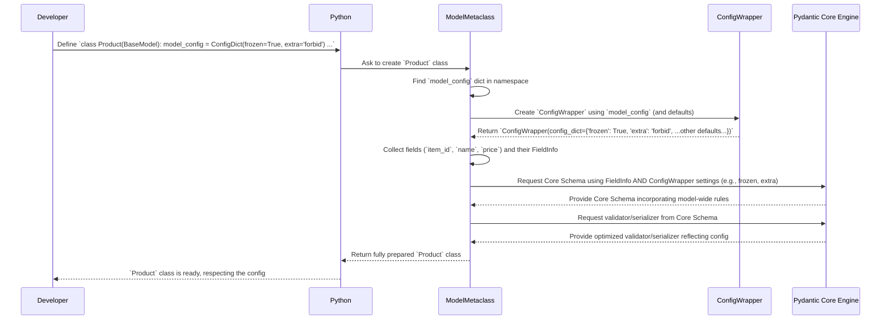

# Chapter 3: Configuring Your Blueprint - Model Settings

In [Chapter 1](01_basemodel.md), we learned about `BaseModel` as our data blueprint, and in [Chapter 2](02_fields__fieldinfo___field_function_.md), we saw how `Field()` lets us add specific notes (like defaults or aliases) to individual rooms (fields) on that blueprint.

But what about instructions that apply to the *entire* blueprint? Imagine needing rules like:

*   "Absolutely no extra furniture allowed that's not in the plan!" (Forbid extra fields)
*   "Once built, nothing inside can be changed!" (Make the model immutable/frozen)
*   "All room names on the final report should be lowercase." (Apply a naming convention during output)

These are model-wide settings, not specific to just one field. Pydantic provides a way to configure this overall behavior using model configuration.

## Why Configure the Whole Model?

Let's consider a simple `Product` model:

```python
from pydantic import BaseModel

class Product(BaseModel):
    item_id: int
    name: str
    price: float | None = None
```

This works, but we might want to enforce stricter rules or change default behaviors:

1.  **Strictness:** What if we receive data like `{'item_id': 123, 'name': 'Thingy', 'color': 'blue'}`? By default, Pydantic ignores the extra `color` field. We might want to *reject* data with unexpected fields.
2.  **Immutability:** What if, once a `Product` object is created, we want to prevent accidental changes like `product.price = 99.99`?
3.  **Naming Conventions:** What if our API expects JSON keys in `camelCase` (like `itemId`) instead of Python's standard `snake_case` (`item_id`)?

These global behaviors are controlled via Pydantic's configuration system.

## Introducing `ConfigDict` and `model_config`

Pydantic allows you to customize model behavior by adding a special class attribute called `model_config`. This attribute should be assigned a dictionary-like object called `ConfigDict`.

Think of `model_config = ConfigDict(...)` as the **master instruction sheet** or the **global settings panel** attached to your `BaseModel` blueprint. It provides overarching rules for how Pydantic should handle the model.

**`ConfigDict`:** A special dictionary (specifically, a `TypedDict`) provided by Pydantic where you specify configuration options using key-value pairs.
**`model_config`:** The class attribute on your `BaseModel` where you assign your `ConfigDict`.

Let's add some configuration to our `Product` model:

```python
# Import ConfigDict
from pydantic import BaseModel, ConfigDict

class Product(BaseModel):
    # Define model-wide settings here
    model_config = ConfigDict(
        frozen=True,             # Setting 1: Make instances immutable
        extra='forbid',          # Setting 2: Forbid extra fields during input validation
        validate_assignment=True # Setting 3: Re-validate fields when they are assigned a new value
    )

    item_id: int
    name: str
    price: float | None = None

# --- How these settings affect behavior ---

# 1. Forbid Extra Fields ('extra=forbid')
try:
    # Input data has an extra 'color' field
    product_data_extra = {'item_id': 123, 'name': 'Thingy', 'color': 'blue'}
    Product(**product_data_extra)
except Exception as e:
    print(f"Error on extra field:\n{e}")
    # Expected Output (simplified):
    # Error on extra field:
    # 1 validation error for Product
    # color
    #   Extra inputs are not permitted [type=extra_forbidden, ...]

# 2. Immutability ('frozen=True')
product = Product(item_id=456, name="Gadget")
print(f"Initial product: {product}")
# Expected Output: Initial product: item_id=456 name='Gadget' price=None

try:
    # Attempt to change a field on the frozen instance
    product.name = "New Gadget"
except Exception as e:
    print(f"\nError on assignment to frozen model:\n{e}")
    # Expected Output (simplified):
    # Error on assignment to frozen model:
    # 1 validation error for Product
    # name
    #   Instance is frozen [type=frozen_instance, ...]

# 3. Validate Assignment ('validate_assignment=True')
product_mutable = Product.model_construct(item_id=789, name="Widget") # Use model_construct to bypass initial __init__ validation for demo
try:
    # Attempt to assign an invalid type (int instead of str)
    product_mutable.name = 999
except Exception as e:
    print(f"\nError on invalid assignment:\n{e}")
    # Expected Output (simplified):
    # Error on invalid assignment:
    # 1 validation error for Product
    # name
    #  Input should be a valid string [type=string_type, input_value=999, input_type=int]
```

By adding the `model_config` dictionary, we changed the fundamental behavior of our `Product` model without altering the field definitions themselves.

## Common Configuration Options

Here are a few more useful options you can set in `ConfigDict`:

*   **`alias_generator`**: Automatically generate aliases for fields. Often used to convert between `snake_case` and `camelCase`.
    ```python
    from pydantic import BaseModel, ConfigDict
    from pydantic.alias_generators import to_camel # Import a helper

    class User(BaseModel):
        user_id: int
        first_name: str

        model_config = ConfigDict(
            alias_generator=to_camel, # Use the camelCase generator
            populate_by_name=True # Allow using EITHER alias or python name for input (see warning below)
                                  # Replaced by validate_by_name=True + validate_by_alias=True
        )

    # Input using camelCase aliases
    user_data_camel = {'userId': 1, 'firstName': 'Arthur'}
    user = User(**user_data_camel)
    print(f"User created from camelCase: {user}")
    # Expected Output: User created from camelCase: user_id=1 first_name='Arthur'

    # Output (dumping) using aliases requires `by_alias=True`
    print(f"Dumped with aliases: {user.model_dump(by_alias=True)}")
    # Expected Output: Dumped with aliases: {'userId': 1, 'firstName': 'Arthur'}

    print(f"Dumped without aliases: {user.model_dump()}")
    # Expected Output: Dumped without aliases: {'user_id': 1, 'first_name': 'Arthur'}
    ```
    *   **Modern Alias Control (Pydantic >= v2.11):** Instead of `populate_by_name`, use `validate_by_alias`, `validate_by_name`, and `serialize_by_alias` for finer control:
        ```python
        from pydantic import BaseModel, ConfigDict
        from pydantic.alias_generators import to_camel

        class UserV2(BaseModel):
            user_id: int
            first_name: str

            model_config = ConfigDict(
                alias_generator=to_camel,
                validate_by_name=True,     # Allow input using 'user_id', 'first_name'
                validate_by_alias=True,    # Allow input using 'userId', 'firstName' (default is True)
                serialize_by_alias=True    # Use aliases ('userId', 'firstName') when dumping by default
            )

        user_data_camel = {'userId': 1, 'firstName': 'Zaphod'}
        user_camel = UserV2(**user_data_camel)
        print(f"User from camel: {user_camel}")
        # > User from camel: user_id=1 first_name='Zaphod'

        user_data_snake = {'user_id': 2, 'first_name': 'Ford'}
        user_snake = UserV2(**user_data_snake)
        print(f"User from snake: {user_snake}")
        # > User from snake: user_id=2 first_name='Ford'

        # serialize_by_alias=True means model_dump() uses aliases by default
        print(f"Dumped (default alias): {user_camel.model_dump()}")
        # > Dumped (default alias): {'userId': 1, 'firstName': 'Zaphod'}
        print(f"Dumped (force no alias): {user_camel.model_dump(by_alias=False)}")
        # > Dumped (force no alias): {'user_id': 1, 'first_name': 'Zaphod'}
        ```

*   **`use_enum_values`**: When serializing (e.g., with `model_dump`), use the *value* of an enum member instead of the member itself.
    ```python
    from enum import Enum
    from pydantic import BaseModel, ConfigDict

    class Status(Enum):
        PENDING = "pending"
        PROCESSING = "processing"
        COMPLETE = "complete"

    class Order(BaseModel):
        order_id: int
        status: Status

        model_config = ConfigDict(
            use_enum_values=True # Use the string value of Status
        )

    order = Order(order_id=101, status=Status.PROCESSING)
    print(f"Order object status type: {type(order.status)}")
    # Expected Output: Order object status type: <enum 'Status'>

    print(f"Order dumped: {order.model_dump()}")
    # Expected Output: Order dumped: {'order_id': 101, 'status': 'processing'}
    # Note: 'status' is the string "processing", not Status.PROCESSING
    ```

*   **`str_strip_whitespace` / `str_to_lower` / `str_to_upper`**: Automatically clean string inputs.
    ```python
    from pydantic import BaseModel, ConfigDict

    class Comment(BaseModel):
        text: str
        author: str

        model_config = ConfigDict(
            str_strip_whitespace=True, # Remove leading/trailing whitespace
            str_to_lower=True          # Convert to lowercase
        )

    comment_data = {'text': '  Hello World!  ', 'author': ' ALICE '}
    comment = Comment(**comment_data)
    print(comment)
    # Expected Output: text='hello world!' author='alice'
    ```

You can find the full list of configuration options in the Pydantic documentation for [`ConfigDict`](https://docs.pydantic.dev/latest/api/config/#pydantic.config.ConfigDict).

**Important Note:** Configuration set in `model_config` generally applies *during validation and serialization*. For example, `alias_generator` helps Pydantic understand incoming data with aliases and optionally use aliases when producing output, but the internal attribute name in your Python code remains the Python name (e.g., `user_id`).

## What About `ConfigWrapper`? (Internal Detail)

You might see `ConfigWrapper` mentioned in Pydantic's internal code or documentation.

**Analogy:** If `ConfigDict` is the settings form you fill out (`frozen=True`, `extra='forbid'`), then `ConfigWrapper` is the internal manager object that Pydantic creates *from* your form. This manager holds onto your settings, knows the default values for settings you *didn't* specify, and provides a consistent way for the rest of Pydantic (like the schema builder) to ask "Is this model frozen?" or "What should happen with extra fields?".

**Key Point:** As a user writing Pydantic models, you almost always interact with **`ConfigDict`** via the `model_config` attribute. You generally don't need to create or use `ConfigWrapper` directly. It's an internal helper that makes Pydantic's life easier.

## Under the Hood: How Configuration is Applied

Let's refine our understanding of how a `BaseModel` class gets created, now including configuration.

**High-Level Steps:**

When Python creates your `Product` class:

1.  **Inspection:** Pydantic's `ModelMetaclass` inspects the class definition. It finds the fields (`item_id: int`, etc.) and also looks for the `model_config` attribute.
2.  **Config Processing:** If `model_config` (a `ConfigDict`) is found, Pydantic uses it (along with config from any parent classes) to create an internal `ConfigWrapper` instance. This wrapper standardizes access to all config settings, applying defaults for any missing options.
3.  **FieldInfo Creation:** It processes field definitions, potentially using `Field()` as discussed in [Chapter 2](02_fields__fieldinfo___field_function_.md), creating `FieldInfo` objects.
4.  **Schema Generation:** Pydantic now uses *both* the `FieldInfo` objects *and* the settings from the `ConfigWrapper` to generate the detailed internal [Core Schema](05_core_schema___validation_serialization.md). For example, if the `ConfigWrapper` says `frozen=True`, this instruction is baked into the Core Schema.
5.  **Validator/Serializer Creation:** Optimized validator and serializer functions are created based on this final Core Schema.

**Sequence Diagram:**

This diagram shows how `model_config` influences the process:



The `ConfigWrapper` acts as a bridge, translating the user-friendly `ConfigDict` into instructions the Core Engine understands when building the schema and validators.

**Code Location:**

*   `ConfigDict`: Defined in `pydantic/config.py`. It's essentially a `TypedDict` listing all valid configuration keys.
*   `ConfigWrapper`: Defined in `pydantic._internal._config.py`. Its `__init__` takes the config dictionary. The `ConfigWrapper.for_model` class method is used by the metaclass to gather configuration from base classes and the current class definition. Its `core_config` method translates the stored config into the format needed by `pydantic-core`.
*   `ModelMetaclass`: In `pydantic._internal._model_construction.py`, the `__new__` method calls `ConfigWrapper.for_model` and passes the resulting wrapper to `build_schema_generator` and ultimately `complete_model_class`, which coordinates schema and validator/serializer creation.

```python
# Simplified view from pydantic/config.py
# ConfigDict is a TypedDict listing allowed keys and their types
class ConfigDict(TypedDict, total=False):
    frozen: bool
    extra: Literal['allow', 'ignore', 'forbid'] | None
    alias_generator: Callable[[str], str] | None
    # ... many more options

# Simplified view from pydantic._internal._config.py
class ConfigWrapper:
    config_dict: ConfigDict # Stores the actual config values

    def __init__(self, config: ConfigDict | dict[str, Any] | type[Any] | None, *, check: bool = True):
        # Simplification: Stores the input config, potentially validating keys
        self.config_dict = prepare_config(config) # prepare_config handles defaults/deprecation

    # Provides attribute access like wrapper.frozen, falling back to defaults
    def __getattr__(self, name: str) -> Any:
        try:
            return self.config_dict[name]
        except KeyError:
            # Fallback to default values defined in config_defaults
            # return config_defaults[name] # Simplified
            pass # Actual implementation is more complex

    # Used during model creation to gather config from all sources
    @classmethod
    def for_model(cls, bases: tuple[type[Any], ...], namespace: dict[str, Any], kwargs: dict[str, Any]) -> Self:
        config_new = ConfigDict()
        # 1. Inherit config from base classes
        # 2. Get config from 'model_config' in the current class namespace
        # 3. Get config from kwargs passed during class definition (e.g., class Model(BaseModel, frozen=True): ...)
        # ... logic to merge these sources ...
        return cls(config_new) # Return a wrapper with the final merged config

    # Creates the config dictionary specifically for pydantic-core
    def core_config(self, title: str | None) -> core_schema.CoreConfig:
         # Extracts relevant keys from self.config_dict and maps them
         # to the names expected by pydantic_core.CoreConfig
         # e.g., {'extra': 'forbid'} becomes {'extra_fields_behavior': 'forbid'}
         core_options = { ... }
         return core_schema.CoreConfig(**core_options)

# Simplified view from pydantic._internal._model_construction.py (ModelMetaclass.__new__)
def __new__(mcs, name, bases, namespace, **kwargs):
    # ... lots of setup ...

    # Step 1: Gather configuration
    config_wrapper = ConfigWrapper.for_model(bases, namespace, kwargs) # Merges config from bases, class def, kwargs

    # Step 2: Prepare schema generator using the config
    schema_generator = build_schema_generator(
        cls, # The class being built
        config_wrapper,
        # ... other args ...
    )

    # Step 3: Build core schema, validator, serializer (using schema_generator which uses config_wrapper)
    # core_schema = schema_generator.generate_schema(cls) # Simplified
    # validator = SchemaValidator(core_schema, config_wrapper.core_config()) # Simplified
    # serializer = SchemaSerializer(core_schema, config_wrapper.core_config()) # Simplified

    # ... attach schema, validator, serializer to the class ...
    cls = super().__new__(mcs, name, bases, namespace, **kwargs)
    # cls.__pydantic_validator__ = validator
    # ...

    return cls
```

This setup ensures that the model-wide rules defined in `model_config` are consistently applied during both validation (creating model instances) and serialization (dumping model instances).

## Conclusion

You've learned how to configure the overall behavior of your `BaseModel` blueprints:

*   Use the `model_config` class attribute, assigning it a `ConfigDict`.
*   `ConfigDict` acts as the **master instruction sheet** or **settings panel** for the model.
*   Common settings include `frozen`, `extra`, `alias_generator`, `use_enum_values`, and string cleaning options.
*   Pydantic uses this configuration, often via the internal `ConfigWrapper`, to tailor the validation and serialization logic defined in the [Core Schema](05_core_schema___validation_serialization.md).

With `BaseModel`, `Field`, and `ConfigDict`, you have powerful tools to define the structure, field-specific details, and overall behavior of your data models.

But what if you need logic that goes beyond simple configuration? What if you need custom validation rules that depend on multiple fields, or complex transformations before or after validation/serialization? That's where Pydantic's decorators come in.

Next: [Chapter 4: Custom Logic (Decorators & Annotated Helpers)](04_custom_logic__decorators___annotated_helpers_.md)

---

Generated by [AI Codebase Knowledge Builder](https://github.com/The-Pocket/Tutorial-Codebase-Knowledge)