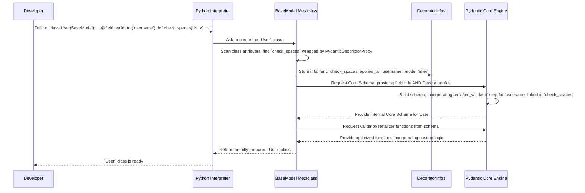
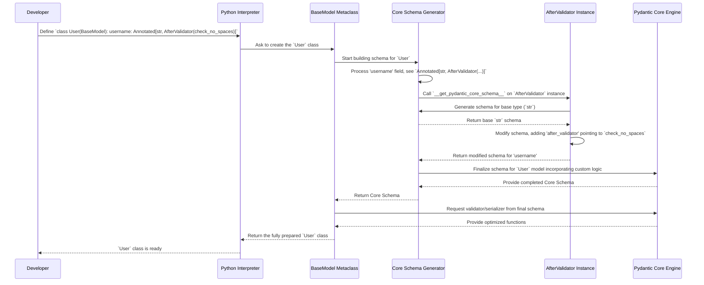

# Chapter 4: Custom Logic (Decorators & Annotated Helpers)

In [Chapter 3: Configuration (ConfigDict / ConfigWrapper)](03_configuration__configdict___configwrapper_.md), we learned how to set global rules for our data blueprints using `model_config`. But what if we need more specific, custom rules or transformations that go beyond simple settings?

Imagine you need rules like:
*   "This username must not contain any spaces."
*   "The `end_date` must always be later than the `start_date`."
*   "When sending this data as JSON, format this specific date field as `YYYY-MM-DD`."
*   "When validating, convert incoming usernames to lowercase automatically."

These require custom code logic. Pydantic provides flexible ways to inject this custom logic directly into the validation and serialization processes.

## Why Custom Logic?

Standard type hints (`str`, `int`), [Fields](02_fields__fieldinfo___field_function_.md) (`Field(gt=0)`), and [Configuration](03_configuration__configdict___configwrapper_.md) (`ConfigDict(extra='forbid')`) cover many common cases. However, sometimes the rules are more complex or specific to your application's needs.

For example, checking if a password meets complexity requirements (length, uppercase, numbers, symbols) or ensuring consistency between multiple fields (`start_date < end_date`) requires writing your own Python functions.

Pydantic offers two main ways to add this custom logic:
1.  **Decorators:** Special markers (`@...`) you put above methods in your `BaseModel` class.
2.  **`Annotated` Helpers:** Using Python's `typing.Annotated` along with special Pydantic classes to attach logic directly to a type hint.

**Analogy:** Think of these as adding custom steps to the construction (validation) and reporting (serialization) process for your data blueprint.
*   **Validators** are like adding extra *inspection checks* at different stages of construction (before basic checks, after basic checks, or wrapping the entire process).
*   **Serializers** are like specifying custom *formatting rules* for the final report (converting your data back to simple types like dicts or JSON).

Let's explore these mechanisms.

## Decorators: Adding Logic via Methods

Decorators are a standard Python feature. They are functions that modify or enhance other functions or methods. Pydantic uses decorators to let you designate specific methods in your `BaseModel` as custom validators or serializers.

### `@field_validator`: Checking Individual Fields

The `@field_validator` decorator lets you add custom validation logic for one or more specific fields *after* Pydantic has performed its initial type checks and coercion.

**Use Case:** Let's ensure a `username` field doesn't contain spaces.

```python
from pydantic import BaseModel, field_validator, ValidationError

class UserRegistration(BaseModel):
    username: str
    email: str

    # This method will be called automatically for the 'username' field
    # AFTER Pydantic checks it's a string.
    @field_validator('username')
    @classmethod # Field validators should usually be class methods
    def check_username_spaces(cls, v: str) -> str:
        print(f"Checking username: '{v}'")
        if ' ' in v:
            # Raise a ValueError if the rule is broken
            raise ValueError('Username cannot contain spaces')
        # Return the valid value (can also modify it here if needed)
        return v

# --- Try it out ---

# Valid username
user_ok = UserRegistration(username='cool_cat123', email='cat@meow.com')
print(f"Valid user created: {user_ok}")
# Expected Output:
# Checking username: 'cool_cat123'
# Valid user created: username='cool_cat123' email='cat@meow.com'

# Invalid username
try:
    UserRegistration(username='cool cat 123', email='cat@meow.com')
except ValidationError as e:
    print(f"\nValidation Error:\n{e}")
    # Expected Output (simplified):
    # Checking username: 'cool cat 123'
    # Validation Error:
    # 1 validation error for UserRegistration
    # username
    #   Value error, Username cannot contain spaces [type=value_error, ...]
```

**Explanation:**
1.  We defined a `check_username_spaces` method inside our `UserRegistration` model.
2.  We decorated it with `@field_validator('username')`. This tells Pydantic: "After you validate `username` as a `str`, call this method with the value."
3.  The `@classmethod` decorator is typically used so the method receives the class (`cls`) as the first argument instead of an instance (`self`).
4.  Inside the method, `v` holds the value of the `username` field *after* Pydantic's basic `str` validation.
5.  We check our custom rule (`' ' in v`).
6.  If the rule is violated, we raise a `ValueError` (Pydantic catches this and wraps it in a `ValidationError`).
7.  If the value is okay, we **must return it**. You could also transform the value here (e.g., `return v.lower()`).

`@field_validator` has a `mode` argument (`'before'` or `'after'`, default is `'after'`). `'after'` (as shown) runs *after* Pydantic's internal validation for the field type. `'before'` runs *before*, giving you the raw input value.

### `@model_validator`: Checking the Whole Model

Sometimes, validation depends on multiple fields interacting. The `@model_validator` decorator lets you run logic that involves the entire model's data.

**Use Case:** Ensure `end_date` is after `start_date`.

```python
from datetime import date
from pydantic import BaseModel, model_validator, ValidationError
from typing import Self # Used for type hint in Python 3.11+

class Trip(BaseModel):
    start_date: date
    end_date: date
    destination: str

    # This method runs AFTER the model fields are validated individually
    @model_validator(mode='after')
    def check_dates(self) -> Self: # Use 'Self' or 'Trip' as return hint
        print(f"Checking dates: start={self.start_date}, end={self.end_date}")
        if self.start_date >= self.end_date:
            raise ValueError('End date must be after start date')
        # Return the validated model instance
        return self

# --- Try it out ---

# Valid dates
trip_ok = Trip(start_date=date(2024, 7, 1), end_date=date(2024, 7, 10), destination='Beach')
print(f"Valid trip: {trip_ok}")
# Expected Output:
# Checking dates: start=2024-07-01, end=2024-07-10
# Valid trip: start_date=datetime.date(2024, 7, 1) end_date=datetime.date(2024, 7, 10) destination='Beach'

# Invalid dates
try:
    Trip(start_date=date(2024, 7, 10), end_date=date(2024, 7, 1), destination='Mountains')
except ValidationError as e:
    print(f"\nValidation Error:\n{e}")
    # Expected Output (simplified):
    # Checking dates: start=2024-07-10, end=2024-07-01
    # Validation Error:
    # 1 validation error for Trip
    #   Value error, End date must be after start date [type=value_error, ...]
```

**Explanation:**
1.  We defined a `check_dates` method.
2.  We decorated it with `@model_validator(mode='after')`. This tells Pydantic: "After validating all individual fields and creating the model instance, call this method."
3.  In `'after'` mode, the method receives `self` (the model instance). We can access all fields like `self.start_date`.
4.  We perform our cross-field check.
5.  If invalid, raise `ValueError`.
6.  If valid, **must return `self`** (the model instance).

`@model_validator` also supports `mode='before'`, where the method runs *before* individual field validation. In `'before'` mode, the method receives the class (`cls`) and the raw input data (usually a dictionary) and must return the (potentially modified) data dictionary to be used for further validation.

### `@field_serializer`: Customizing Field Output

This decorator lets you control how a specific field is converted (serialized) when you call methods like `model_dump()` or `model_dump_json()`.

**Use Case:** Serialize a `date` object as a simple `"YYYY-MM-DD"` string.

```python
from datetime import date
from pydantic import BaseModel, field_serializer

class Event(BaseModel):
    name: str
    event_date: date

    # Customize serialization for the 'event_date' field
    @field_serializer('event_date')
    def serialize_date(self, dt: date) -> str:
        # Return the custom formatted string
        return dt.strftime('%Y-%m-%d')

# --- Try it out ---
event = Event(name='Party', event_date=date(2024, 12, 25))

# Default dump (dictionary)
print(f"Model object: {event}")
# Expected Output: Model object: name='Party' event_date=datetime.date(2024, 12, 25)

dumped_dict = event.model_dump()
print(f"Dumped dict: {dumped_dict}")
# Expected Output: Dumped dict: {'name': 'Party', 'event_date': '2024-12-25'}

dumped_json = event.model_dump_json(indent=2)
print(f"Dumped JSON:\n{dumped_json}")
# Expected Output:
# Dumped JSON:
# {
#   "name": "Party",
#   "event_date": "2024-12-25"
# }
```

**Explanation:**
1.  We defined `serialize_date` and decorated it with `@field_serializer('event_date')`.
2.  The method receives `self` (the instance) and `dt` (the value of the `event_date` field). You can also add an optional `info: SerializationInfo` argument for more context.
3.  It returns the desired serialized format (a string in this case).
4.  When `model_dump()` or `model_dump_json()` is called, Pydantic uses this method for the `event_date` field instead of its default date serialization.

### `@model_serializer`: Customizing Model Output

This allows custom logic for serializing the entire model object.

**Use Case:** Add a calculated `duration_days` field during serialization.

```python
from datetime import date, timedelta
from pydantic import BaseModel, model_serializer
from typing import Dict, Any

class Trip(BaseModel):
    start_date: date
    end_date: date
    destination: str

    # Customize the entire model's serialization
    @model_serializer
    def serialize_with_duration(self) -> Dict[str, Any]:
        # Start with the default field values
        data = {'start_date': self.start_date, 'end_date': self.end_date, 'destination': self.destination}
        # Calculate and add the custom field
        duration = self.end_date - self.start_date
        data['duration_days'] = duration.days
        return data

# --- Try it out ---
trip = Trip(start_date=date(2024, 8, 1), end_date=date(2024, 8, 5), destination='Lake')

print(f"Model object: {trip}")
# Expected Output: Model object: start_date=datetime.date(2024, 8, 1) end_date=datetime.date(2024, 8, 5) destination='Lake'

dumped_dict = trip.model_dump()
print(f"Dumped dict: {dumped_dict}")
# Expected Output: Dumped dict: {'start_date': datetime.date(2024, 8, 1), 'end_date': datetime.date(2024, 8, 5), 'destination': 'Lake', 'duration_days': 4}

dumped_json = trip.model_dump_json(indent=2)
print(f"Dumped JSON:\n{dumped_json}")
# Expected Output:
# Dumped JSON:
# {
#   "start_date": "2024-08-01",
#   "end_date": "2024-08-05",
#   "destination": "Lake",
#   "duration_days": 4
# }
```

**Explanation:**
1.  We decorated `serialize_with_duration` with `@model_serializer`.
2.  The default `mode='plain'` means this method *replaces* the standard model serialization. It receives `self`.
3.  We manually construct the dictionary we want as output, adding our calculated `duration_days`.
4.  This dictionary is used by `model_dump()` and `model_dump_json()`.

There's also a `mode='wrap'` for `@model_serializer` (and `@field_serializer`) which is more advanced. It gives you a `handler` function to call the *next* serialization step (either Pydantic's default or another wrapper), allowing you to modify the result *around* the standard logic.

## `Annotated` Helpers: Attaching Logic to Type Hints

Python's `typing.Annotated` allows adding extra metadata to type hints. Pydantic leverages this to let you attach validation and serialization logic directly inline with your field definitions.

**Analogy:** Instead of separate instruction sheets (decorators), this is like putting specific instruction tags directly onto an item in the blueprint.

Common helpers include:
*   **Validators:** `BeforeValidator`, `AfterValidator`, `PlainValidator`, `WrapValidator`
*   **Serializers:** `PlainSerializer`, `WrapSerializer`

Let's see how `AfterValidator` compares to `@field_validator`.

**Use Case:** Ensure `username` has no spaces, using `Annotated`.

```python
from typing import Annotated
from pydantic import BaseModel, Field, ValidationError
# Import the helper
from pydantic.functional_validators import AfterValidator

# Define the validation function (can be outside the class)
def check_no_spaces(v: str) -> str:
    print(f"Checking username via Annotated: '{v}'")
    if ' ' in v:
        raise ValueError('Username cannot contain spaces')
    return v

class UserRegistrationAnnotated(BaseModel):
    # Attach the validator function directly to the type hint
    username: Annotated[str, AfterValidator(check_no_spaces)]
    email: str

# --- Try it out ---

# Valid username
user_ok = UserRegistrationAnnotated(username='another_cat', email='cat@meow.com')
print(f"Valid user: {user_ok}")
# Expected Output:
# Checking username via Annotated: 'another_cat'
# Valid user: username='another_cat' email='cat@meow.com'

# Invalid username
try:
    UserRegistrationAnnotated(username='another cat', email='cat@meow.com')
except ValidationError as e:
    print(f"\nValidation Error:\n{e}")
    # Expected Output (simplified):
    # Checking username via Annotated: 'another cat'
    # Validation Error:
    # 1 validation error for UserRegistrationAnnotated
    # username
    #   Value error, Username cannot contain spaces [type=value_error, ...]
```

**Explanation:**
1.  We import `Annotated` from `typing` and `AfterValidator` from Pydantic.
2.  We define a standalone function `check_no_spaces` (it doesn't need to be a method).
3.  In the model, we define `username` as `Annotated[str, AfterValidator(check_no_spaces)]`. This tells Pydantic: "The type is `str`, and after validating it as a string, apply the `check_no_spaces` function."
4.  The behavior is identical to the `@field_validator` example, but the logic is attached differently.

Similarly, you can use `BeforeValidator` (runs before Pydantic's type validation) or `PlainSerializer` / `WrapSerializer` to attach serialization logic.

**Use Case:** Serialize `date` as `"YYYY-MM-DD"` using `Annotated` and `PlainSerializer`.

```python
from datetime import date
from typing import Annotated
from pydantic import BaseModel
# Import the helper
from pydantic.functional_serializers import PlainSerializer

# Define the serializer function
def format_date_yyyymmdd(dt: date) -> str:
    return dt.strftime('%Y-%m-%d')

class EventAnnotated(BaseModel):
    name: str
    # Attach the serializer function directly to the type hint
    event_date: Annotated[date, PlainSerializer(format_date_yyyymmdd)]

# --- Try it out ---
event = EventAnnotated(name='Conference', event_date=date(2024, 10, 15))

print(f"Model object: {event}")
# Expected Output: Model object: name='Conference' event_date=datetime.date(2024, 10, 15)

dumped_dict = event.model_dump()
print(f"Dumped dict: {dumped_dict}")
# Expected Output: Dumped dict: {'name': 'Conference', 'event_date': '2024-10-15'}

dumped_json = event.model_dump_json(indent=2)
print(f"Dumped JSON:\n{dumped_json}")
# Expected Output:
# Dumped JSON:
# {
#   "name": "Conference",
#   "event_date": "2024-10-15"
# }
```

This achieves the same result as the `@field_serializer` example, but by attaching the logic via `Annotated`.

**Which to choose? Decorators vs. Annotated Helpers:**
*   **Decorators (`@field_validator`, etc.):** Keep logic tightly coupled with the model class definition. Good if the logic intrinsically belongs to the model or needs access to `cls` or `self`. Can feel more object-oriented.
*   **`Annotated` Helpers (`AfterValidator`, etc.):** Allow defining reusable validation/serialization functions outside the model. Good for applying the same logic across different models or fields. Can make type hints more verbose but keeps the model body cleaner.

## Under the Hood: Wiring Up the Logic

How does Pydantic discover and apply this custom logic?

**Decorators:**
1.  **Class Creation:** When Python creates your `BaseModel` class (like `UserRegistration`), Pydantic's `ModelMetaclass` scans the class attributes.
2.  **Decorator Detection:** It finds methods decorated with Pydantic decorators (`@field_validator`, `@model_serializer`, etc.). It uses helper classes like `PydanticDescriptorProxy` (from `pydantic._internal._decorators`) to wrap these methods and store metadata about the decorator (like which fields it applies to, the mode, etc., using internal classes like `FieldValidatorDecoratorInfo`).
3.  **Info Storage:** Information about all found decorators is collected and stored internally, often associated with the class (e.g., in a hidden `__pydantic_decorators__` attribute holding a `DecoratorInfos` object).
4.  **Schema Integration:** When generating the [Core Schema](05_core_schema___validation_serialization.md) for the model, Pydantic consults this stored decorator information. It translates the decorator rules (e.g., "run `check_username_spaces` after validating `username`") into corresponding schema components (like `after_validator_function`). The core validation/serialization engine then uses this schema.



**`Annotated` Helpers:**
1.  **Field Processing:** During class creation, when Pydantic processes a field like `username: Annotated[str, AfterValidator(check_no_spaces)]`, it analyzes the `Annotated` metadata.
2.  **Helper Recognition:** It recognizes Pydantic helper classes like `AfterValidator`. These helpers often implement a special method `__get_pydantic_core_schema__`.
3.  **Schema Generation:** Pydantic's schema generation logic (often involving `GetCoreSchemaHandler` from `pydantic.annotated_handlers`) calls `AfterValidator.__get_pydantic_core_schema__`. This method tells the handler how to integrate the custom logic (`check_no_spaces`) into the [Core Schema](05_core_schema___validation_serialization.md) being built for the `username` field.
4.  **Schema Integration:** The handler modifies the schema-in-progress to include the custom logic (e.g., adding an `after_validator_function` component pointing to `check_no_spaces`). The final schema used by the core engine contains this logic directly associated with the field.



**Code Location:**
*   Decorator logic (detection, storage, proxy): `pydantic._internal._decorators.py`
*   `Annotated` helper classes (`AfterValidator`, `PlainSerializer`, etc.): `pydantic.functional_validators.py`, `pydantic.functional_serializers.py`
*   Schema generation integrating these: Primarily involves internal schema builders calling `__get_pydantic_core_schema__` on annotated types/metadata, often orchestrated via `pydantic._internal._generate_schema.GenerateSchema`. The `GetCoreSchemaHandler` from `pydantic.annotated_handlers.py` is passed around to facilitate this.

```python
# Simplified concept from pydantic.functional_validators.py

@dataclasses.dataclass(frozen=True)
class AfterValidator:
    func: Callable # The user's validation function

    # This method is called by Pydantic during schema building
    def __get_pydantic_core_schema__(
        self,
        source_type: Any, # The base type (e.g., str)
        handler: GetCoreSchemaHandler # Helper to get schema for base type
    ) -> core_schema.CoreSchema:
        # 1. Get the schema for the base type (e.g., str_schema())
        schema = handler(source_type)
        # 2. Wrap it with an 'after_validator' step using self.func
        info_arg = _inspect_validator(self.func, 'after') # Check signature
        if info_arg:
            # Use core_schema function for validators with info arg
            return core_schema.with_info_after_validator_function(
                self.func, schema=schema
            )
        else:
            # Use core_schema function for validators without info arg
            return core_schema.no_info_after_validator_function(
                self.func, schema=schema
            )

# Simplified concept from pydantic._internal._decorators.py

@dataclass
class FieldValidatorDecoratorInfo: # Stores info about @field_validator
    fields: tuple[str, ...]
    mode: Literal['before', 'after', 'wrap', 'plain']
    # ... other options

@dataclass
class PydanticDescriptorProxy: # Wraps the decorated method
    wrapped: Callable
    decorator_info: FieldValidatorDecoratorInfo | ... # Stores the info object

# Simplified concept from ModelMetaclass during class creation

# ... scan class attributes ...
decorators = DecoratorInfos() # Object to hold all found decorators
for var_name, var_value in vars(model_cls).items():
    if isinstance(var_value, PydanticDescriptorProxy):
        info = var_value.decorator_info
        # Store the decorator info (function, fields, mode, etc.)
        # in the appropriate category within 'decorators' object
        if isinstance(info, FieldValidatorDecoratorInfo):
            decorators.field_validators[var_name] = Decorator(
                func=var_value.wrapped, info=info # Simplified
            )
        # ... handle other decorator types ...

# ... later, when building the core schema ...
# schema_generator uses the 'decorators' object to add validation/serialization
# steps to the core schema based on the stored decorator info.
```

Both decorators and `Annotated` helpers ultimately achieve the same goal: embedding custom Python functions into the Pydantic validation and serialization pipeline by modifying the underlying [Core Schema](05_core_schema___validation_serialization.md).

## Conclusion

You've learned two powerful ways to add custom logic to your Pydantic models:

*   **Decorators** (`@field_validator`, `@model_validator`, `@field_serializer`, `@model_serializer`) allow you to designate methods within your model class for custom validation or serialization tasks, applying logic to specific fields or the entire model.
*   **`Annotated` Helpers** (`BeforeValidator`, `AfterValidator`, `PlainSerializer`, etc.) let you attach validation or serialization functions directly to a field's type hint using `typing.Annotated`, often promoting reusable logic functions.

These tools give you fine-grained control over how your data is processed, going beyond basic type checks and configuration. They are essential for handling real-world data validation and formatting complexities.

Understanding how these mechanisms work often involves looking at the internal representation Pydantic uses: the Core Schema. In the next chapter, we'll delve into what this schema looks like and how Pydantic uses it.

Next: [Chapter 5: Core Schema & Validation/Serialization](05_core_schema___validation_serialization.md)

---

Generated by [AI Codebase Knowledge Builder](https://github.com/The-Pocket/Tutorial-Codebase-Knowledge)