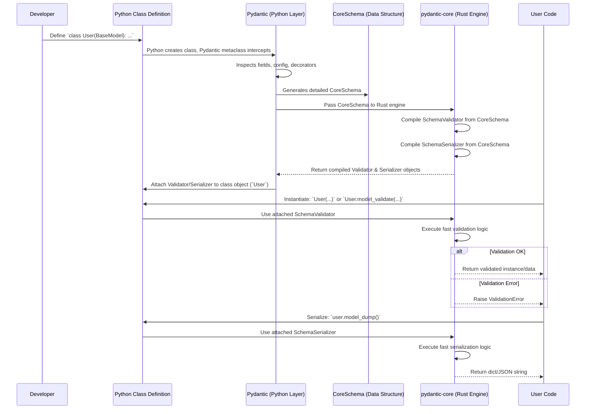

# Chapter 5: Core Schema & Validation/Serialization

In the previous chapters, we've seen how to define data structures using [BaseModel](01_basemodel.md), customize fields with [Field()](02_fields__fieldinfo___field_function_.md), set model-wide behavior with [Configuration](03_configuration__configdict___configwrapper_.md), and even add [Custom Logic](04_custom_logic__decorators___annotated_helpers_.md) using decorators. You might be wondering: how does Pydantic take all these Python definitions and use them to perform such fast and reliable validation and serialization?

The secret lies in an internal representation called the **Core Schema** and a high-performance engine called `pydantic-core`. Let's peek under the hood!

## Why Look Under the Hood?

Imagine you've designed a beautiful blueprint for a house (your Pydantic `BaseModel`). You've specified room sizes (type hints), special fixtures (`Field` constraints), and overall building codes (`ConfigDict`). You've even added custom inspection notes (decorators).

Now, how does the construction crew actually *build* the house and check everything rigorously? They don't just glance at the user-friendly blueprint. They work from a highly detailed **technical specification** derived from it. This spec leaves no room for ambiguity.

In Pydantic, the **`CoreSchema`** is that technical specification, and the **`pydantic-core`** engine (written in Rust) is the super-efficient construction crew that uses it. Understanding this helps explain:

*   **Speed:** Why Pydantic is so fast.
*   **Consistency:** How validation and serialization rules are strictly enforced.
*   **Power:** How complex requirements are translated into concrete instructions.

## What is the Core Schema? The Technical Specification

When Pydantic processes your `BaseModel` definition (including type hints, `Field` calls, `ConfigDict`, decorators, etc.), it translates all that information into an internal data structure called the **Core Schema**.

Think of the Core Schema as:

1.  **The Bridge:** It connects your user-friendly Python code to the high-performance Rust engine (`pydantic-core`).
2.  **The Detailed Plan:** It's a precise, language-agnostic description of your data structure and all associated rules. It's like a very detailed dictionary or JSON object.
3.  **The Single Source of Truth:** It captures *everything* needed for validation and serialization:
    *   Field types (`str`, `int`, `datetime`, nested models, etc.)
    *   Constraints (`min_length`, `gt`, `pattern`, etc. from `Field()`)
    *   Aliases (`alias='userName'` from `Field()`)
    *   Defaults (from `Field()` or `= default_value`)
    *   Model-wide settings (`extra='forbid'`, `frozen=True` from `ConfigDict`)
    *   Custom logic (references to your `@field_validator`, `@field_serializer` functions, etc.)

**Analogy:** Your Python `BaseModel` is the architect's blueprint. The `CoreSchema` is the exhaustive technical specification document derived from that blueprint, detailing every material, dimension, and construction step.

### A Glimpse of the Schema (Conceptual)

You don't normally interact with the Core Schema directly, but let's imagine what a simplified piece might look like for a field `name: str = Field(min_length=3)`.

```python
# Conceptual representation - the actual structure is more complex!
name_field_schema = {
  'type': 'str',          # The basic type expected
  'min_length': 3,        # Constraint from Field(min_length=3)
  'strict': False,        # Default strictness mode from config
  'strip_whitespace': None # Default string handling from config
  # ... other settings relevant to strings
}

# A schema for a whole model wraps field schemas:
model_schema = {
    'type': 'model',
    'cls': YourModelClass, # Reference to the Python class
    'schema': {
        'type': 'model-fields',
        'fields': {
            'name': { 'type': 'model-field', 'schema': name_field_schema },
            # ... schema for other fields ...
        },
        # ... details about custom model validators ...
    },
    'config': { # Merged config settings
        'title': 'YourModelClass',
        'extra_behavior': 'ignore',
        'frozen': False,
        # ...
    },
    # ... details about custom serializers ...
}
```

This internal schema precisely defines what `pydantic-core` needs to know to handle the `name` field and the overall model during validation and serialization.

**Inspecting the Real Schema:**

Pydantic actually stores this generated schema on your model class. You can (carefully) inspect it:

```python
from pydantic import BaseModel, Field

class User(BaseModel):
    id: int
    username: str = Field(min_length=5, alias='userName')

# Access the generated core schema
# Warning: Internal structure, subject to change!
print(User.__pydantic_core_schema__)
# Output will be a complex dictionary representing the detailed schema
# (Output is large and complex, not shown here for brevity)
```

While you *can* look at `__pydantic_core_schema__`, treat it as an internal implementation detail. Its exact structure might change between Pydantic versions.

## What is `pydantic-core`? The Efficient Construction Crew

`pydantic-core` is the heart of Pydantic's performance. It's a separate library, written in Rust (a language known for speed and safety), that does the heavy lifting of validation and serialization.

**How it Works:**

1.  **Input:** When your `BaseModel` class is first defined, Pydantic generates the `CoreSchema` (as described above).
2.  **Compilation:** This `CoreSchema` is passed to the `pydantic-core` engine. The engine takes this schema and *compiles* it into highly optimized, specialized validator and serializer functions *specifically for your model*. Think of this as the crew studying the spec and preparing the exact tools needed for *this specific house*.
3.  **Storage:** These compiled Rust objects are attached to your Python model class, typically as `__pydantic_validator__` and `__pydantic_serializer__`.

```python
# You can access these too (again, internal details!)
print(User.__pydantic_validator__)
# Output: <SchemaValidator 'User' ...> (a pydantic-core object)

print(User.__pydantic_serializer__)
# Output: <SchemaSerializer 'User' ...> (a pydantic-core object)
```

This "compilation" step happens only *once* when the class is created. This makes subsequent validation and serialization extremely fast.

## Validation Flow: Checking Incoming Materials

When you create an instance of your model or validate data:

```python
# Example: Validation
try:
    user_data = {'id': 1, 'userName': 'validUser'}
    user = User(**user_data) # Calls __init__ -> pydantic validation
    # or: user = User.model_validate(user_data)
except ValidationError as e:
    print(e)
```

Here's what happens behind the scenes:

1.  **Call:** Your Python code triggers validation (e.g., via `__init__` or `model_validate`).
2.  **Delegate:** Pydantic passes the input data (`user_data`) to the pre-compiled `User.__pydantic_validator__` (the Rust object).
3.  **Execute:** The `pydantic-core` validator executes its optimized Rust code, guided by the rules baked in from the `CoreSchema`. It checks:
    *   Types (is `id` an `int`? is `userName` a `str`?)
    *   Coercion (can `'1'` be turned into `1` for `id`?)
    *   Constraints (is `len('validUser') >= 5`?)
    *   Aliases (use `userName` from input for the `username` field)
    *   Required fields (is `id` present?)
    *   Extra fields (handle according to `model_config['extra']`)
    *   Custom validators (`@field_validator`, etc. are called back into Python if needed, though core logic is Rust)
4.  **Result:**
    *   If all checks pass, the validator returns the validated data, which Pydantic uses to create/populate the `User` instance.
    *   If any check fails, the Rust validator gathers detailed error information and raises a `pydantic_core.ValidationError`, which Pydantic surfaces to your Python code.

**Analogy:** The construction crew takes the delivery of materials (`user_data`) and uses the technical spec (`CoreSchema` baked into the validator) to rigorously check if everything is correct (right type, right size, etc.). If not, they issue a detailed non-compliance report (`ValidationError`).

## Serialization Flow: Generating Reports

When you dump your model instance:

```python
# Example: Serialization
user = User(id=1, username='validUser')
user_dict = user.model_dump()
# or: user_json = user.model_dump_json()
```

Here's the flow:

1.  **Call:** Your Python code calls `model_dump()` or `model_dump_json()`.
2.  **Delegate:** Pydantic passes the model instance (`user`) to the pre-compiled `User.__pydantic_serializer__` (the Rust object).
3.  **Execute:** The `pydantic-core` serializer executes its optimized Rust code, again guided by the `CoreSchema`. It:
    *   Iterates through the fields specified by the schema.
    *   Applies serialization rules (e.g., use aliases if `by_alias=True`).
    *   Handles `include`, `exclude`, `exclude_unset`, `exclude_defaults`, `exclude_none` logic efficiently.
    *   Formats values for the target output (Python objects for `model_dump`, JSON types for `model_dump_json`).
    *   Calls custom serializers (`@field_serializer`, etc.) back into Python if needed.
4.  **Result:** The serializer returns the final dictionary or JSON string.

**Analogy:** The crew uses the technical spec (`CoreSchema` baked into the serializer) to generate a standardized report (`dict` or JSON) about the constructed house (`model instance`), formatting details (like using aliases) as requested.

## Under the Hood: The Assembly Line

Let's visualize the entire process from defining a class to using it.

**Step-by-Step:**

1.  **Definition:** You define your `class User(BaseModel): ...` in Python.
2.  **Metaclass Magic:** When Python creates the `User` class, Pydantic's `ModelMetaclass` intercepts.
3.  **Inspection:** The metaclass inspects the class definition: fields, type hints, `Field()` calls, `model_config`, decorators.
4.  **Schema Generation (Python):** This information is fed into Pydantic's Python-based schema generation logic (`pydantic._internal._generate_schema`).
5.  **CoreSchema Creation:** The generator produces the detailed `CoreSchema` data structure.
6.  **Hand-off to Rust:** This `CoreSchema` is passed to the `pydantic-core` Rust library.
7.  **Compilation (Rust):** `pydantic-core` creates optimized `SchemaValidator` and `SchemaSerializer` instances based *specifically* on that schema.
8.  **Attachment:** These Rust-backed objects are attached to the `User` class as `__pydantic_validator__` and `__pydantic_serializer__`.
9.  **Ready:** The `User` class is now fully prepared.
10. **Usage (Validation):** Calling `User(...)` uses `User.__pydantic_validator__` (Rust) to process input.
11. **Usage (Serialization):** Calling `user.model_dump()` uses `User.__pydantic_serializer__` (Rust) to generate output.

**Sequence Diagram:**



**Code Location:**

*   **Metaclass & Orchestration:** `pydantic._internal._model_construction.py` (handles class creation)
*   **Schema Generation (Python side):** `pydantic._internal._generate_schema.py` (builds the schema structure)
*   **Core Engine:** The `pydantic-core` library (Rust code, compiled). You interact with it via the `SchemaValidator` and `SchemaSerializer` objects attached to your models.
*   **Schema Representation:** The `CoreSchema` itself is defined using types from `pydantic_core.core_schema`.

## Conclusion

You've now seen the engine behind Pydantic's power!

*   Pydantic translates your Python model definitions (`BaseModel`, `Field`, `ConfigDict`, decorators) into a detailed, internal **`CoreSchema`**.
*   This `CoreSchema` acts as the **technical specification** for your data.
*   The high-performance **`pydantic-core`** engine (written in Rust) takes this schema and "compiles" it into optimized `SchemaValidator` and `SchemaSerializer` objects.
*   These specialized objects perform fast **validation** (checking input) and **serialization** (dumping output) according to the rules defined in the schema.

This combination of a clear Python API and a powerful Rust core allows Pydantic to be both user-friendly and incredibly performant.

What if you want to leverage this powerful validation and serialization engine for types that *aren't* full `BaseModel` classes? Maybe just validate a standalone `list[int]` or serialize a `datetime` object according to specific rules? That's where `TypeAdapter` comes in handy.

Next: [Chapter 6: TypeAdapter](06_typeadapter.md)

---

Generated by [AI Codebase Knowledge Builder](https://github.com/The-Pocket/Tutorial-Codebase-Knowledge)