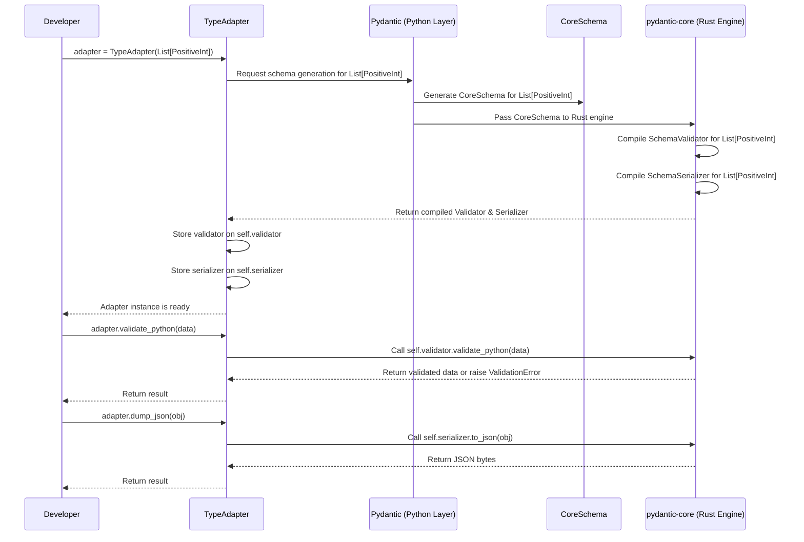

# Chapter 6: TypeAdapter - Your Universal Data Handler

Welcome to the final chapter of our Pydantic Core tutorial! In [Chapter 5: Core Schema & Validation/Serialization](05_core_schema___validation_serialization.md), we dove deep into how Pydantic uses the `CoreSchema` and the `pydantic-core` engine to efficiently validate and serialize data for your `BaseModel` classes.

But what if you have data that *isn't* structured as a `BaseModel`? Imagine you receive a simple list of product IDs from an API, or you need to validate a function argument that's just a dictionary or a date. You still want Pydantic's powerful validation and maybe its smart serialization, but creating a whole `BaseModel` just for `list[int]` seems like overkill.

This is exactly where `TypeAdapter` comes in!

## The Problem: Handling Simple Types

Let's say you're working with a function that expects a list of user IDs, which should all be positive integers:

```python
# Our expected data structure: a list of positive integers
# Example: [101, 205, 300]

# Incoming data might be messy:
raw_data_ok = '[101, "205", 300]' # Comes as JSON string, contains string number
raw_data_bad = '[101, -5, "abc"]' # Contains negative number and non-number string

def process_user_ids(user_ids: list[int]):
    # How do we easily validate 'raw_data' conforms to list[int]
    # AND ensure all IDs are positive *before* this function runs?
    # And how do we handle the string "205"?
    for user_id in user_ids:
        print(f"Processing user ID: {user_id}")
        # We assume user_ids is already clean list[int] here
```

Manually parsing the JSON, checking the type of the list and its elements, converting strings like `"205"` to integers, and validating positivity can be tedious and error-prone. We want Pydantic's magic for this simple list!

## Introducing `TypeAdapter`: The Universal Handler

`TypeAdapter` provides Pydantic's validation and serialization capabilities for **arbitrary Python types**, not just `BaseModel` subclasses.

**Analogy:** Think of `TypeAdapter` as a **universal quality checker and packager**. Unlike `BaseModel` (which is like a specific blueprint for a complex object), `TypeAdapter` can handle *any* kind of item – a list, a dictionary, an integer, a date, a union type, etc. – as long as you tell it the **type specification** the item should conform to.

It acts as a lightweight wrapper around Pydantic's core validation and serialization engine for any type hint you give it.

## Creating a `TypeAdapter`

You create a `TypeAdapter` by simply passing the Python type you want to handle to its initializer.

Let's create one for our `list[int]` requirement, but let's add the positivity constraint using `PositiveInt` from Pydantic's types.

```python
from typing import List
from pydantic import TypeAdapter, PositiveInt

# Define the specific type we want to validate against
# This can be any Python type hint Pydantic understands
UserIdListType = List[PositiveInt]

# Create the adapter for this type
user_id_list_adapter = TypeAdapter(UserIdListType)

print(user_id_list_adapter)
# Expected Output: TypeAdapter(<class 'list[pydantic.types.PositiveInt]'>)
```

We now have `user_id_list_adapter`, an object specifically configured to validate data against the `List[PositiveInt]` type and serialize Python lists matching this type.

## Validation with `TypeAdapter`

The primary use case is validation. `TypeAdapter` offers methods similar to `BaseModel`'s `model_validate` and `model_validate_json`.

### `validate_python()`

This method takes a Python object (like a list or dict) and validates it against the adapter's type. It performs type checks, coercion (like converting `"205"` to `205`), and runs any defined constraints (like `PositiveInt`).

```python
from pydantic import ValidationError, PositiveInt, TypeAdapter
from typing import List

UserIdListType = List[PositiveInt]
user_id_list_adapter = TypeAdapter(UserIdListType)

# --- Example 1: Valid data (with coercion needed) ---
python_data_ok = [101, "205", 300] # "205" needs converting to int

try:
    validated_list = user_id_list_adapter.validate_python(python_data_ok)
    print(f"Validation successful: {validated_list}")
    # Expected Output: Validation successful: [101, 205, 300]
    print(f"Types: {[type(x) for x in validated_list]}")
    # Expected Output: Types: [<class 'int'>, <class 'int'>, <class 'int'>]
except ValidationError as e:
    print(f"Validation failed: {e}")

# --- Example 2: Invalid data (negative number) ---
python_data_bad_value = [101, -5, 300] # -5 is not PositiveInt

try:
    user_id_list_adapter.validate_python(python_data_bad_value)
except ValidationError as e:
    print(f"\nValidation failed as expected:\n{e}")
    # Expected Output (simplified):
    # Validation failed as expected:
    # 1 validation error for list[PositiveInt]
    # 1
    #   Input should be greater than 0 [type=greater_than, context={'gt': 0}, input_value=-5, input_type=int]

# --- Example 3: Invalid data (wrong type) ---
python_data_bad_type = [101, "abc", 300] # "abc" cannot be int

try:
    user_id_list_adapter.validate_python(python_data_bad_type)
except ValidationError as e:
    print(f"\nValidation failed as expected:\n{e}")
    # Expected Output (simplified):
    # Validation failed as expected:
    # 1 validation error for list[PositiveInt]
    # 1
    #   Input should be a valid integer, unable to parse string as an integer [type=int_parsing, input_value='abc', input_type=str]
```

Just like with `BaseModel`, `TypeAdapter` gives you clear validation errors pinpointing the exact location and reason for the failure. It also handles useful type coercion automatically.

### `validate_json()`

If your input data is a JSON string (or bytes/bytearray), you can use `validate_json()` to parse and validate in one step.

```python
# Continuing from above...

# Input as a JSON string
raw_data_ok_json = '[101, "205", 300]'
raw_data_bad_json = '[101, -5, "abc"]'

# Validate the good JSON
try:
    validated_list_from_json = user_id_list_adapter.validate_json(raw_data_ok_json)
    print(f"\nValidated from JSON: {validated_list_from_json}")
    # Expected Output: Validated from JSON: [101, 205, 300]
except ValidationError as e:
    print(f"\nJSON validation failed: {e}")

# Validate the bad JSON
try:
    user_id_list_adapter.validate_json(raw_data_bad_json)
except ValidationError as e:
    print(f"\nJSON validation failed as expected:\n{e}")
    # Expected Output (simplified):
    # JSON validation failed as expected:
    # 1 validation error for list[PositiveInt]
    # 1
    #   Input should be greater than 0 [type=greater_than, context={'gt': 0}, input_value=-5, input_type=int]
```

This is extremely handy for validating raw API request bodies or data loaded from JSON files without needing to parse the JSON yourself first.

## Serialization with `TypeAdapter`

`TypeAdapter` can also serialize Python objects according to the rules of its associated type, similar to `BaseModel.model_dump()` and `model_dump_json()`.

### `dump_python()`

Converts a Python object into a "dumped" representation (often simpler Python types). This is most useful when the type involves Pydantic models or types with custom serialization logic (like datetimes, enums, etc.). For simple types like `list[int]`, it might not change much.

Let's use a slightly more complex example: `List[datetime]`.

```python
from datetime import datetime
from typing import List
from pydantic import TypeAdapter

datetime_list_adapter = TypeAdapter(List[datetime])

# A list of datetime objects
dt_list = [datetime(2023, 1, 1, 12, 0, 0), datetime(2024, 7, 15, 9, 30, 0)]

# Dump to Python objects (datetimes remain datetimes by default)
dumped_python = datetime_list_adapter.dump_python(dt_list)
print(f"Dumped Python: {dumped_python}")
# Expected Output: Dumped Python: [datetime.datetime(2023, 1, 1, 12, 0), datetime.datetime(2024, 7, 15, 9, 30)]

# To get JSON-compatible types (strings), use mode='json'
dumped_for_json = datetime_list_adapter.dump_python(dt_list, mode='json')
print(f"Dumped for JSON: {dumped_for_json}")
# Expected Output: Dumped for JSON: ['2023-01-01T12:00:00', '2024-07-15T09:30:00']
```

### `dump_json()`

Directly serializes the Python object into a JSON string, using Pydantic's encoders (e.g., converting `datetime` to ISO 8601 strings).

```python
# Continuing with datetime_list_adapter and dt_list...

# Dump directly to a JSON string
dumped_json_str = datetime_list_adapter.dump_json(dt_list, indent=2)
print(f"\nDumped JSON:\n{dumped_json_str.decode()}") # .decode() to convert bytes to string for printing
# Expected Output:
# Dumped JSON:
# [
#   "2023-01-01T12:00:00",
#   "2024-07-15T09:30:00"
# ]
```

This uses the same powerful serialization engine as `BaseModel`, ensuring consistent output formats.

## Getting JSON Schema

You can also generate a [JSON Schema](https://json-schema.org/) for the type handled by the adapter using the `json_schema()` method.

```python
# Using our user_id_list_adapter from before...
# UserIdListType = List[PositiveInt]
# user_id_list_adapter = TypeAdapter(UserIdListType)

schema = user_id_list_adapter.json_schema()

import json
print(f"\nJSON Schema:\n{json.dumps(schema, indent=2)}")
# Expected Output:
# JSON Schema:
# {
#   "items": {
#     "exclusiveMinimum": 0,
#     "type": "integer"
#   },
#   "title": "List[PositiveInt]",
#   "type": "array"
# }
```

This schema accurately describes the expected data: an array (`"type": "array"`) where each item (`"items"`) must be an integer (`"type": "integer"`) that is greater than 0 (`"exclusiveMinimum": 0`).

## Under the Hood: Direct Line to the Core

How does `TypeAdapter` work? It acts as a direct interface to the validation and serialization machinery we discussed in [Chapter 5](05_core_schema___validation_serialization.md).

**Step-by-Step:**

1.  **Instantiation:** When you create `adapter = TypeAdapter(MyType)`, Pydantic immediately analyzes `MyType`.
2.  **Schema Generation:** It generates the internal `CoreSchema` specifically for `MyType`, just like it would for a field within a `BaseModel`.
3.  **Core Engine:** This `CoreSchema` is passed to the `pydantic-core` Rust engine.
4.  **Compilation:** `pydantic-core` compiles and creates optimized `SchemaValidator` and `SchemaSerializer` objects based *only* on the `CoreSchema` for `MyType`.
5.  **Storage:** These compiled validator and serializer objects are stored directly on the `TypeAdapter` instance (e.g., as `adapter.validator` and `adapter.serializer`).
6.  **Usage:** When you call `adapter.validate_python(data)` or `adapter.dump_json(obj)`, the `TypeAdapter` simply delegates the call directly to its stored `SchemaValidator` or `SchemaSerializer`.

**Sequence Diagram:**



Unlike `BaseModel`, where the validator/serializer are attached to the *class*, with `TypeAdapter`, they are attached to the *instance* of the adapter. This makes `TypeAdapter` a neat, self-contained tool for handling specific types.

**Code Location:**

*   The main logic is in `pydantic/type_adapter.py`.
*   The `TypeAdapter.__init__` method orchestrates the process:
    *   It determines the correct Python namespaces for resolving type hints.
    *   It calls internal schema generation logic (`pydantic._internal._generate_schema.GenerateSchema`) to build the `CoreSchema` for the given type.
    *   It uses `pydantic_core.SchemaValidator(core_schema, config)` and `pydantic_core.SchemaSerializer(core_schema, config)` to create the core engine objects.
    *   These are stored on the instance as `self.validator` and `self.serializer`.
*   Methods like `validate_python`, `dump_json`, etc., are thin wrappers that call the corresponding methods on `self.validator` or `self.serializer`.

```python
# Simplified conceptual view from pydantic/type_adapter.py

from pydantic_core import SchemaValidator, SchemaSerializer, CoreSchema
# ... other imports

class TypeAdapter(Generic[T]):
    core_schema: CoreSchema
    validator: SchemaValidator | PluggableSchemaValidator # Actually uses PluggableSchemaValidator internally
    serializer: SchemaSerializer

    def __init__(self, type: Any, *, config: ConfigDict | None = None, ...):
        self._type = type
        self._config = config
        # ... (fetch parent frame namespaces) ...
        ns_resolver = _namespace_utils.NsResolver(...)

        # ... Call internal _init_core_attrs ...
        self._init_core_attrs(ns_resolver=ns_resolver, force=True)

    def _init_core_attrs(self, ns_resolver, force, raise_errors=False):
        # ... Simplified schema generation ...
        config_wrapper = _config.ConfigWrapper(self._config)
        schema_generator = _generate_schema.GenerateSchema(config_wrapper, ns_resolver)
        try:
            core_schema = schema_generator.generate_schema(self._type)
            self.core_schema = schema_generator.clean_schema(core_schema)
            core_config = config_wrapper.core_config(None)

            # Create and store validator and serializer
            # Note: Actual code uses create_schema_validator for plugin support
            self.validator = SchemaValidator(self.core_schema, core_config)
            self.serializer = SchemaSerializer(self.core_schema, core_config)
            self.pydantic_complete = True

        except Exception:
            # Handle errors, potentially set mocks if build fails
            # ...
            pass

    def validate_python(self, object: Any, /, **kwargs) -> T:
        # Directly delegates to the stored validator
        return self.validator.validate_python(object, **kwargs)

    def validate_json(self, data: str | bytes | bytearray, /, **kwargs) -> T:
        # Directly delegates to the stored validator
        return self.validator.validate_json(data, **kwargs)

    def dump_python(self, instance: T, /, **kwargs) -> Any:
        # Directly delegates to the stored serializer
        return self.serializer.to_python(instance, **kwargs)

    def dump_json(self, instance: T, /, **kwargs) -> bytes:
        # Directly delegates to the stored serializer
        return self.serializer.to_json(instance, **kwargs)

    def json_schema(self, **kwargs) -> dict[str, Any]:
        # Generates schema based on self.core_schema
        schema_generator_instance = GenerateJsonSchema(**kwargs)
        return schema_generator_instance.generate(self.core_schema, mode=kwargs.get('mode', 'validation'))

```

## Conclusion

Congratulations! You've learned about `TypeAdapter`, a flexible tool for applying Pydantic's validation and serialization to any Python type, not just `BaseModel`s.

*   It's ideal for validating simple types, function arguments, or data structures where a full `BaseModel` isn't necessary.
*   You create it by passing the target type: `TypeAdapter(YourType)`.
*   It provides `.validate_python()`, `.validate_json()`, `.dump_python()`, `.dump_json()`, and `.json_schema()` methods.
*   It works by generating a `CoreSchema` for the target type and using dedicated `SchemaValidator` and `SchemaSerializer` instances from `pydantic-core`.

`TypeAdapter` completes our tour of the essential concepts in Pydantic V2. You've journeyed from the basic `BaseModel` blueprint, through customizing fields and configuration, adding custom logic, understanding the core schema engine, and finally, applying these powers universally with `TypeAdapter`.

We hope this tutorial has given you a solid foundation for using Pydantic effectively to build robust, reliable, and well-defined data interfaces in your Python applications. Happy coding!

---

Generated by [AI Codebase Knowledge Builder](https://github.com/The-Pocket/Tutorial-Codebase-Knowledge)