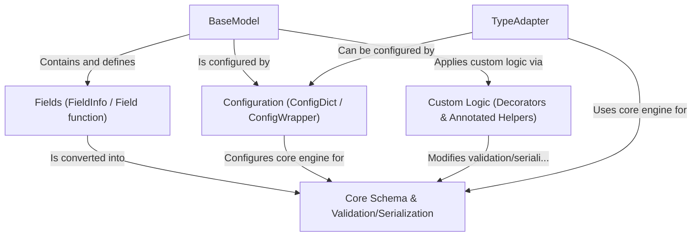

# Tutorial: Pydantic Core

> This tutorial is AI-generated! To learn more, check out [AI Codebase Knowledge Builder](https://github.com/The-Pocket/Tutorial-Codebase-Knowledge)

Pydantic Core[View Repo](https://github.com/pydantic/pydantic/tree/6c38dc93f40a47f4d1350adca9ec0d72502e223f/pydantic) provides the fundamental machinery for **data validation**, **parsing**, and **serialization** in Pydantic. It takes Python *type hints* and uses them to define how data should be structured and processed. Users typically interact with it by defining classes that inherit from `BaseModel`, which automatically gets validation and serialization capabilities based on its annotated fields. Pydantic Core ensures data conforms to the defined types and allows converting between Python objects and formats like JSON efficiently, leveraging Rust for performance.

