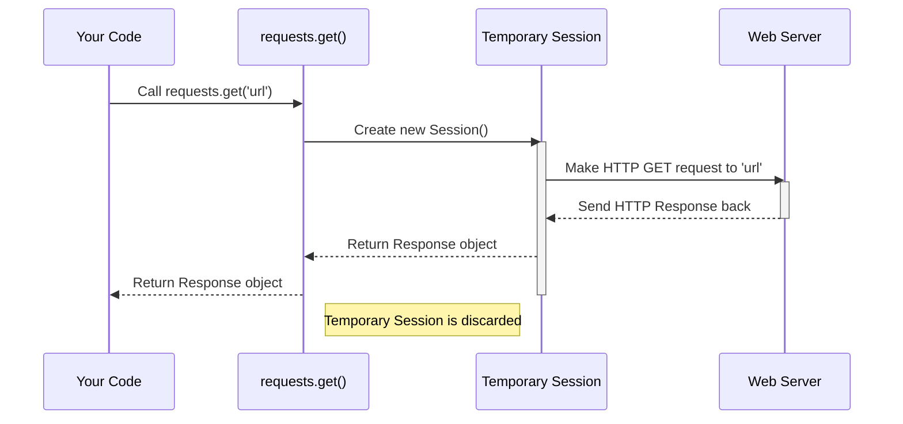

# Chapter 1: The Simplest Way - The Functional API

Welcome to the world of `Requests`! If you need to get information from a website or interact with a web service using Python, `Requests` is your friendly helper.

Imagine you just want to quickly grab the content of a webpage, maybe check the latest news headlines from a site, or send a simple piece of data to an online service. How do you do that without getting bogged down in complex details?

That's where the **Functional API** of `Requests` comes in. It's the most straightforward way to start making web requests.

## What's the Functional API?

Think of the Functional API as a set of handy, ready-to-use tools right at the top level of the `requests` library. You don't need to set anything up; you just call a function like `requests.get()` to fetch data or `requests.post()` to send data.

**Analogy:** Ordering Takeout 🍕

Using the Functional API is like using a generic food delivery app (like DoorDash or Uber Eats) to order a pizza from a place you've never ordered from before.

1.  You open the app ( `import requests`).
2.  You find the pizza place and tap "Order" (`requests.get('pizza_place_url')`).
3.  The app handles finding a driver, sending them to the restaurant, picking up the pizza, and delivering it to you (Requests does all the connection and fetching work).
4.  You get your pizza (`Response` object).

It's super convenient for a one-time order!

## Making Your First Request: `requests.get()`

The most common type of request is a `GET` request. It's what your web browser does every time you type a website address and hit Enter. It means "Please *get* me the content of this page."

Let's try it! First, make sure you have `requests` installed (`pip install requests`). Then, in your Python script or interactive session:

```python
import requests # Import the library

# The URL we want to get data from
url = 'https://httpbin.org/get' # A handy website for testing requests

# Use the functional API 'get' function
print(f"Fetching data from: {url}")
response = requests.get(url)

# Check if the request was successful (Status Code 200 means OK)
print(f"Status Code: {response.status_code}")

# Print the first 200 characters of the content we received
print("Response Content (first 200 chars):")
print(response.text[:200])
```

**What happened here?**

1.  `import requests`: We told Python we want to use the `requests` library.
2.  `response = requests.get(url)`: This is the core magic! We called the `get` function directly from the `requests` module, passing the URL we want to visit.
3.  `requests` did all the work: connected to the server, sent the `GET` request, and received the server's reply.
4.  The reply is stored in the `response` variable. This isn't just the text of the page; it's a special `Response` object containing lots of useful information. We'll explore this more in [Request & Response Models](02_request___response_models.md).
5.  `response.status_code`: We checked the status code. `200` is the standard code for "Everything went okay!". Other codes might indicate errors (like `404 Not Found`).
6.  `response.text`: We accessed the main content (usually HTML or JSON) returned by the server as a string.

## Sending Data: `requests.post()`

Sometimes, instead of just getting data, you need to *send* data to a website. This is often done when submitting a form, logging in, or telling an API to perform an action. The `POST` method is commonly used for this.

The Functional API provides `requests.post()` for this purpose.

```python
import requests

# The URL we want to send data to
url = 'https://httpbin.org/post'

# The data we want to send (like form fields)
# We'll use a Python dictionary
payload = {'username': 'tutorial_user', 'action': 'learn_requests'}

print(f"Sending data to: {url}")
# Use the functional API 'post' function, passing the data
response = requests.post(url, data=payload)

# Check the status code
print(f"Status Code: {response.status_code}")

# The response often echoes back the data we sent
print("Response Content:")
print(response.text)
```

**What's new?**

1.  `payload = {...}`: We created a Python dictionary to hold the data we want to send.
2.  `response = requests.post(url, data=payload)`: We called `requests.post()`. Notice the second argument, `data=payload`. This tells `requests` to send our dictionary as form data in the body of the `POST` request.
3.  The `response.text` from `httpbin.org/post` conveniently shows us the data it received, confirming our `payload` was sent correctly.

`Requests` also offers functions for other HTTP methods like `put`, `delete`, `head`, `patch`, and `options`, all working similarly: `requests.put(...)`, `requests.delete(...)`, etc.

## How It Works Under the Hood

You might wonder: if it's so simple, how does `requests.get()` actually connect to the internet and manage the request?

Every time you call one of these functional API methods (like `requests.get` or `requests.post`), `Requests` performs a few steps behind the scenes:

1.  **Creates a temporary `Session` object:** Think of a `Session` as a more advanced way to manage requests, especially when you need to talk to the same website multiple times. We'll learn all about these in the [Session](03_session.md) chapter. For a functional API call, `requests` creates a *brand new, temporary* `Session` just for this single request.
2.  **Uses the `Session`:** This temporary `Session` is then used to actually prepare and send your request (e.g., the `GET` to `https://httpbin.org/get`).
3.  **Gets the `Response`:** The `Session` receives the reply from the server.
4.  **Returns the `Response` to you:** The function gives you back the `Response` object.
5.  **Discards the `Session`:** The temporary `Session` is immediately thrown away. It's gone.

**Analogy Revisited:** The generic delivery app (Functional API) contacts *a* driver (creates a temporary `Session`), tells them the restaurant and your order (sends the request), the driver delivers the food (returns the `Response`), and then the app forgets about that specific driver (discards the `Session`). If you order again 5 minutes later, it starts the whole process over with potentially a different driver.

Here's a simplified diagram of what happens when you call `requests.get()`:



You can see a glimpse of this in the `requests/api.py` code:

```python
# File: requests/api.py (Simplified view)

from . import sessions # Where the Session logic lives

def request(method, url, **kwargs):
    """Internal function that handles all functional API calls."""

    # Creates a temporary Session just for this one call.
    # The 'with' statement ensures it's properly closed afterwards.
    with sessions.Session() as session:
        # The temporary session makes the actual request.
        return session.request(method=method, url=url, **kwargs)

def get(url, params=None, **kwargs):
    """Sends a GET request (functional API)."""
    # This is just a convenient shortcut that calls the main 'request' function.
    return request("get", url, params=params, **kwargs)

def post(url, data=None, json=None, **kwargs):
    """Sends a POST request (functional API)."""
    # Another shortcut calling the main 'request' function.
    return request("post", url, data=data, json=json, **kwargs)

# ... similar functions for put, delete, head, patch, options ...
```

Each function like `get`, `post`, etc., is just a simple wrapper that calls the main `request` function, which in turn creates and uses that temporary `Session`.

## When Is It Good? When Is It Not?

**Good For:**

*   Simple, one-off requests.
*   Quick scripts where performance isn't critical.
*   Learning `Requests` - it's the easiest starting point!

**Not Ideal For:**

*   **Multiple requests to the same website:** Creating and tearing down a connection and a `Session` for *every single request* is inefficient. It's like sending a separate delivery driver for each item you forgot from the grocery store.
*   **Needing persistence:** If the website gives you a cookie (like after logging in) and you want to use it on your *next* request to that same site, the functional API won't remember it because the temporary `Session` (which holds cookies) is discarded after each call.
*   **Fine-grained control:** If you need custom configurations, specific connection pooling, or advanced features, using a `Session` object directly offers more power.

## Conclusion

You've learned about the `Requests` Functional API – the simplest way to make web requests using functions like `requests.get()` and `requests.post()`. It's perfect for quick tasks and getting started. You saw how it works by creating temporary `Session` objects behind the scenes.

While convenient for single shots, remember its limitations for performance and state persistence when dealing with multiple requests to the same site.

Now that you know how to *send* a basic request, what exactly do you get *back*? Let's explore the structure of the requests we send and the powerful `Response` object we receive.

**Next:** [Chapter 2: Request & Response Models](02_request___response_models.md)

---

Generated by [AI Codebase Knowledge Builder](https://github.com/The-Pocket/Tutorial-Codebase-Knowledge)