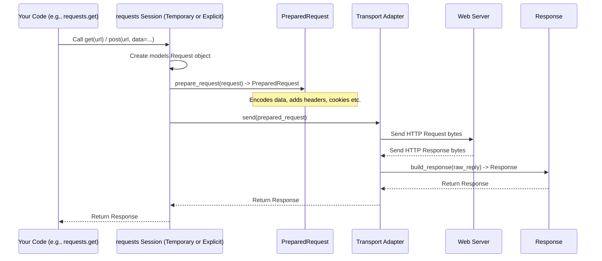

# Chapter 2: What Happens When You Order? Request & Response Models

In [Chapter 1: The Simplest Way - The Functional API](01_functional_api.md), we saw how easy it is to fetch a webpage or send data using simple functions like `requests.get()` and `requests.post()`. We also noticed that these functions return something called a `Response` object.

But what exactly *is* that `Response` object? And what happens behind the scenes when `requests` sends your request? Just like ordering food involves more than just shouting your order and getting a meal, web requests have structured steps and data carriers. Understanding these helps you use `requests` more effectively.

## Why Models? The Need for Structure

Imagine ordering takeout again. You don't just tell the restaurant "food!"; you give them specific details: "One large pepperoni pizza, delivery to 123 Main St." The restaurant then prepares exactly that and delivers it back to you with a receipt.

Web requests work similarly. You need to tell the server:
*   *What* you want (the URL, like `/get` or `/post`).
*   *How* you want to interact (the method, like `GET` or `POST`).
*   *Any extra details* (like headers or data you're sending).

The server then replies with:
*   *If it worked* (a status code, like `200 OK` or `404 Not Found`).
*   *Information about the reply* (headers, like the content type).
*   *The actual stuff* you asked for (the content, like HTML or JSON).

`Requests` uses special Python objects to hold all this information in an organized way. These are the **Request and Response Models**.

## The Main Characters: Request, PreparedRequest, and Response

Think of the process like ordering at a restaurant:

1.  **`Request` Object (Your Order Slip):** This is your initial intention. It holds the basic details of the request you *want* to make: the URL, the method (`GET`, `POST`, etc.), any headers you want to add, and any data you want to send. You usually don't create this object directly when using the simple functional API, but `requests` does it for you internally.
    *   *Analogy:* You write down "Large Pizza, Pepperoni, Extra Cheese" on an order slip.

2.  **`PreparedRequest` Object (The Prepared Tray):** This is the finalized, ready-to-go version of your request. `Requests` takes the initial `Request` object, processes it (encodes data, applies cookies, adds default headers like `User-Agent`), and gets it ready to be sent over the network. It contains the *exact* bytes and final details. This is mostly an internal step.
    *   *Analogy:* The kitchen takes your slip, makes the pizza, puts it in a box, adds napkins and maybe a drink, and puts it all on a tray ready for the delivery driver.

3.  **`Response` Object (The Delivered Meal):** This object represents the server's reply *after* the `PreparedRequest` has been sent and the server has responded. It contains everything the server sent back: the status code (Did the order succeed?), the response headers (What kind of food is this? How was it packaged?), and the actual content (The pizza itself!). This is the object you usually work with directly.
    *   *Analogy:* The delivery driver hands you the tray with the pizza and receipt. You check the receipt (`status_code`, `headers`) and eat the pizza (`content`).

Most of the time, you'll interact primarily with the `Response` object. But knowing about `Request` and `PreparedRequest` helps understand what `requests` is doing for you.

## Working with the `Response` Object

Let's revisit our `requests.get()` example from Chapter 1 and see what useful things are inside the `response` object we get back.

```python
import requests

url = 'https://httpbin.org/get'
print(f"Fetching data from: {url}")
response = requests.get(url)

# --- Exploring the Response Object ---

# 1. Status Code: Was it successful?
print(f"\nStatus Code: {response.status_code}") # A number like 200 (OK) or 404 (Not Found)
print(f"Was it successful (status < 400)? {response.ok}") # A boolean True/False

# 2. Response Headers: Information *about* the response
print(f"\nResponse Headers (Content-Type): {response.headers['Content-Type']}")
# Headers are like a dictionary (Case-Insensitive)
print("All Headers:")
for key, value in response.headers.items():
    print(f"  {key}: {value}")

# 3. Response Content (Body): The actual data!
#    - As text (decoded using guessed encoding):
print("\nResponse Text (first 100 chars):")
print(response.text[:100])

#    - As raw bytes (useful for non-text like images):
print("\nResponse Content (bytes, first 20):")
print(response.content[:20])

# 4. JSON Helper: If the content is JSON
json_url = 'https://httpbin.org/json'
print(f"\nFetching JSON from: {json_url}")
json_response = requests.get(json_url)
if json_response.ok and 'application/json' in json_response.headers.get('Content-Type', ''):
    try:
        data = json_response.json() # Decodes JSON into a Python dict/list
        print("Decoded JSON data:")
        print(data)
        print(f"Value of 'title': {data['slideshow']['title']}")
    except requests.exceptions.JSONDecodeError:
        print("Response was not valid JSON.")
```

**What we learned from the `Response`:**

1.  **`response.status_code`**: A standard HTTP status code number. `200` means "OK". `404` means "Not Found". Many others exist.
2.  **`response.ok`**: A quick boolean check. `True` if the status code is less than 400 (meaning success or redirect), `False` for errors (4xx or 5xx codes).
3.  **`response.headers`**: A dictionary-like object holding the response headers sent by the server (like `Content-Type`, `Date`, `Server`). It's case-insensitive, so `response.headers['content-type']` works too.
4.  **`response.text`**: The response body decoded into a string. `Requests` tries to guess the correct text encoding based on headers, or falls back to a guess based on the content itself. Good for HTML, plain text, etc.
5.  **`response.content`**: The response body as raw bytes, exactly as received from the server. Use this for images, downloads, or when you need precise control over decoding.
6.  **`response.json()`**: A convenient method that tries to parse the `response.text` as JSON and returns a Python dictionary or list. It raises an error if the content isn't valid JSON.

The `Response` object neatly packages all the server's reply information for you to use.

## How It Works Internally: From Request to Response

When you call `requests.get(url)`, the following happens under the hood (simplified):

1.  **Create `Request`:** `Requests` creates a `Request` object containing the method (`'GET'`), the `url`, and any other arguments you provided (like `headers` or `params`). (See `requests/sessions.py` `request` method which creates a `models.Request`)
2.  **Prepare `Request`:** This `Request` object is then passed to a preparation step. Here, it becomes a `PreparedRequest`. This involves:
    *   Merging session-level settings (like default headers or cookies from a [Session](03_session.md), which the functional API uses temporarily).
    *   Encoding parameters (`params`).
    *   Encoding the body (`data` or `json`).
    *   Handling authentication (`auth`).
    *   Adding standard headers (like `User-Agent`, `Accept-Encoding`).
    *   Resolving the final URL.
    (See `requests/sessions.py` `prepare_request` method which calls `PreparedRequest.prepare` in `requests/models.py`)
3.  **Send `PreparedRequest`:** The `PreparedRequest`, now containing the exact bytes and headers, is handed off to a **Transport Adapter** (we'll cover these in [Transport Adapters](07_transport_adapters.md)). The adapter handles the actual network communication (opening connections, sending bytes, dealing with HTTP/HTTPS specifics). (See `requests/sessions.py` `send` method which calls `adapter.send` in `requests/adapters.py`)
4.  **Receive Reply:** The Transport Adapter waits for the server's reply (status line, headers, body).
5.  **Build `Response`:** The adapter takes the raw reply data and uses it to build the `Response` object you receive. It parses the status code, headers, and makes the raw content available. (See `requests/adapters.py` `build_response` method which creates a `models.Response`)
6.  **Return `Response`:** The `send` method returns the fully formed `Response` object back to your code.

Here's a diagram showing the journey:



You can see the definitions for these objects in `requests/models.py`:

```python
# File: requests/models.py (Highly Simplified)

class Request:
    """A user-created Request object. Used to prepare a PreparedRequest."""
    def __init__(self, method=None, url=None, headers=None, files=None,
                 data=None, params=None, auth=None, cookies=None, hooks=None, json=None):
        self.method = method
        self.url = url
        # ... other attributes ...

    def prepare(self):
        """Constructs a PreparedRequest for transmission."""
        p = PreparedRequest()
        p.prepare(
            method=self.method,
            url=self.url,
            # ... pass other attributes ...
        )
        return p

class PreparedRequest:
    """The fully mutable PreparedRequest object, containing the exact bytes
    that will be sent to the server."""
    def __init__(self):
        self.method = None
        self.url = None
        self.headers = None
        self.body = None
        # ... other attributes ...

    def prepare(self, method=None, url=None, headers=None, files=None, data=None,
                params=None, auth=None, cookies=None, hooks=None, json=None):
        """Prepares the entire request."""
        # ... Logic to encode data, set headers, handle auth, etc. ...
        self.method = method
        self.url = # processed url
        self.headers = # final headers
        self.body = # encoded body bytes or stream
        # ...

class Response:
    """Contains a server's response to an HTTP request."""
    def __init__(self):
        self._content = False # Content hasn't been read yet
        self.status_code = None
        self.headers = CaseInsensitiveDict() # Special dictionary for headers
        self.raw = None # The raw stream from the network connection
        self.url = None
        self.encoding = None
        self.history = [] # List of redirects
        self.reason = None # Text reason, e.g., "OK"
        self.cookies = cookiejar_from_dict({})
        self.elapsed = datetime.timedelta(0) # Time taken
        self.request = None # The PreparedRequest that led to this response

    @property
    def content(self):
        """Content of the response, in bytes."""
        # ... logic to read from self.raw if not already read ...
        return self._content

    @property
    def text(self):
        """Content of the response, in unicode."""
        # ... logic to decode self.content using self.encoding or guessed encoding ...
        return decoded_string

    def json(self, **kwargs):
        """Returns the json-encoded content of a response, if any."""
        # ... logic to parse self.text as JSON ...
        return python_object

    # ... other properties like .ok, .is_redirect, and methods like .raise_for_status() ...
```

Understanding these models gives you a clearer picture of how `requests` turns your simple function call into a network operation and packages the result neatly for you.

## Conclusion

You've learned about the core data carriers in `Requests`:
*   `Request`: Your initial intent.
*   `PreparedRequest`: The finalized request ready for sending.
*   `Response`: The server's reply, containing status, headers, and content.

While you mostly interact with the `Response` object after making a request, knowing about the `Request` and `PreparedRequest` helps demystify the process. You saw how to access useful attributes of the `Response` like `status_code`, `headers`, `text`, `content`, and the handy `json()` method.

In Chapter 1, we noted that the functional API creates a temporary setup for each request. This is simple but inefficient if you need to talk to the same website multiple times, perhaps needing to maintain login status or custom settings. How can we do that better?

**Next:** [Chapter 3: Remembering Things - The Session Object](03_session.md)

---

Generated by [AI Codebase Knowledge Builder](https://github.com/The-Pocket/Tutorial-Codebase-Knowledge)