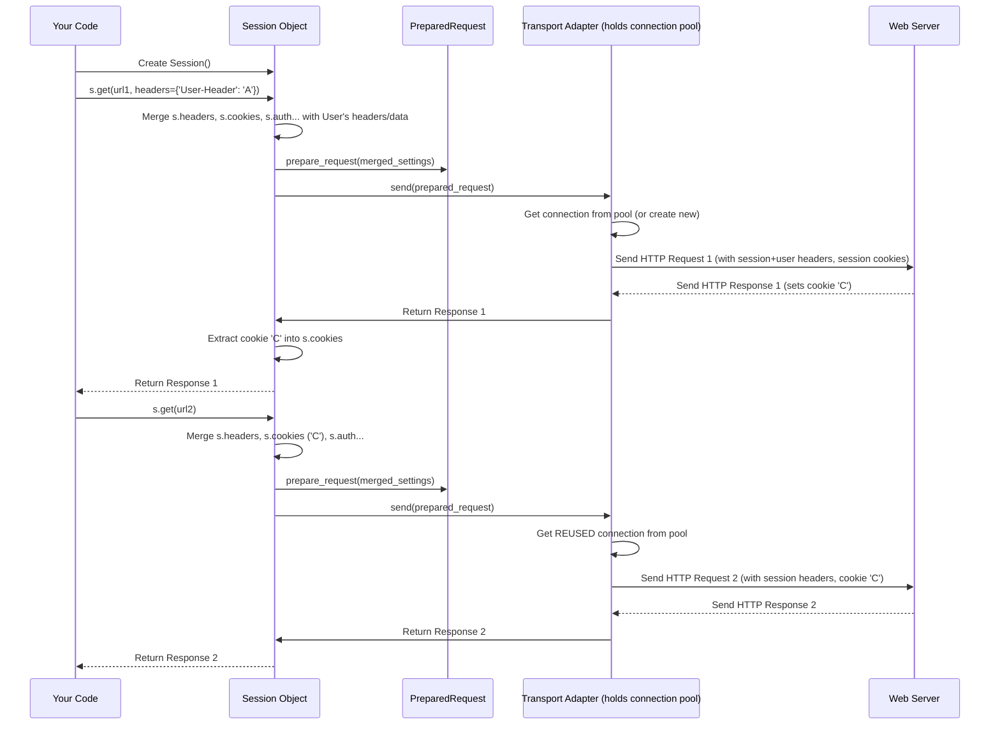

# Chapter 3: Remembering Things - The Session Object

In [Chapter 1](01_functional_api.md), we learned the easiest way to make web requests using functions like `requests.get()`. In [Chapter 2](02_request___response_models.md), we looked at the `Request` and `Response` objects that structure our communication with web servers.

We also saw that the simple functional API methods like `requests.get()` are great for single, one-off requests. But what if you need to talk to the *same website* multiple times? For example, maybe you need to:

1.  Log in to a website (which gives you a "session cookie" to prove you're logged in).
2.  Make several requests to access different pages that *require* you to be logged in (using that cookie).

If you use `requests.get()` for each step, you'll have a problem. Remember how `requests.get()` creates a *temporary* setup for each call and then throws it away? This means it forgets the login cookie immediately after the login request! Your next request will be like visiting the site as a brand new, logged-out user.

How can we make `Requests` remember things between requests, just like your web browser does when you navigate around a logged-in site?

## Meet the `Session` Object: Your Persistent Browser Tab

This is where the `requests.Session` object comes in!

Think of a `Session` object as a dedicated browser tab you've opened just for interacting with a specific website or web service. What does a browser tab do?

*   **Remembers Cookies:** If you log in on a website in one tab, that tab remembers your login cookie. When you click a link *within that same tab*, the browser automatically sends the cookie back, keeping you logged in.
*   **Keeps Connections Warm:** Your browser often keeps the underlying network connection (TCP connection) to the website open for a little while. This makes clicking links and loading subsequent pages much faster because it doesn't have to establish a new connection every single time. This is called **connection pooling**.
*   **Applies Consistent Settings:** You might have browser extensions that add specific headers to your requests, or your browser sends a consistent "User-Agent" string identifying itself.

A `requests.Session` object does all of these things for your Python script:

1.  **Cookie Persistence:** It automatically stores cookies sent by the server and sends them back on subsequent requests to the same domain.
2.  **Connection Pooling:** It reuses the underlying TCP connections for requests to the same host, significantly speeding up multiple requests. This is managed by components called [Transport Adapters](07_transport_adapters.md).
3.  **Default Data:** You can set default headers, authentication details, query parameters, or proxy settings directly on the `Session` object, and they will be applied to all requests made through that session.

## Using a `Session`

Using a `Session` is almost as easy as using the functional API. Instead of calling `requests.get()`, you first create a `Session` object, and then call methods like `get()` or `post()` on *that object*.

```python
import requests

# 1. Create a Session object
s = requests.Session()

# Let's try accessing a page that requires a login (we're not logged in yet)
login_required_url = 'https://httpbin.org/cookies' # This page shows cookies sent to it
print("Trying to access protected page without login...")
response1 = s.get(login_required_url)
print("Cookies sent (should be none):", response1.json()) # httpbin returns JSON

# Now, let's simulate 'logging in' by visiting a page that sets a cookie
cookie_setter_url = 'https://httpbin.org/cookies/set/sessioncookie/123456789'
print("\nSimulating login by getting a cookie...")
response2 = s.get(cookie_setter_url)
# The session automatically stored the cookie! Check the session's cookie jar:
print("Session cookies after setting:", s.cookies.get_dict())

# Now, try accessing the 'protected' page again using the SAME session
print("\nTrying to access protected page AGAIN with the session...")
response3 = s.get(login_required_url)
print("Cookies sent (should have sessioncookie):", response3.json())

# Compare with using the functional API (which forgets cookies)
print("\nTrying the same with functional API (will fail)...")
response4 = requests.get(cookie_setter_url) # Gets cookie, but immediately forgets
response5 = requests.get(login_required_url)
print("Cookies sent via functional API (should be none):", response5.json())
```

**What happened here?**

1.  `s = requests.Session()`: We created our "persistent browser tab".
2.  `response1 = s.get(login_required_url)`: Our first request sent no cookies, as expected.
3.  `response2 = s.get(cookie_setter_url)`: We visited a URL designed to send back a `Set-Cookie` header. The `Session` object automatically noticed this and stored the `sessioncookie` in its internal [Cookie Jar](04_cookie_jar.md).
4.  `s.cookies.get_dict()`: We peeked inside the session's cookie storage and saw the cookie was indeed saved.
5.  `response3 = s.get(login_required_url)`: We made *another* request using the *same* session `s`. This time, the session automatically included the `sessioncookie` in the request headers. The server received it!
6.  The last part shows that if we used `requests.get()` instead, the cookie from `response4` would be lost, and `response5` would fail to send it. The `Session` was crucial for remembering the cookie.

## Persistent Settings: Headers, Auth, etc.

Besides cookies, you can set other things on the `Session` that will apply to all its requests.

```python
import requests
import os # To get environment variables for auth example

s = requests.Session()

# Set a default header for all requests made by this session
s.headers.update({'X-My-Custom-Header': 'HelloSession'})

# Set default authentication (using basic auth from environment variables for example)
# NOTE: Replace with actual username/password or use httpbin's basic-auth endpoint
# For httpbin, the user/pass is 'user'/'pass'
# s.auth = ('user', 'passwd') # Set directly if needed
httpbin_user = os.environ.get("HTTPBIN_USER", "testuser") # Fake user if not set
httpbin_pass = os.environ.get("HTTPBIN_PASS", "testpass") # Fake pass if not set
s.auth = (httpbin_user, httpbin_pass)

# Set default query parameters
s.params.update({'session_param': 'persistent'})

# Now make a request
url = 'https://httpbin.org/get' # Changed endpoint to see params
print(f"Making request with persistent session settings to: {url}")
response = s.get(url)

print(f"\nStatus Code: {response.status_code}")
# Check the response (httpbin.org/get echoes back request details)
response_data = response.json()
print("\nHeaders sent (look for X-My-Custom-Header):")
print(response_data['headers'])
# print("\nAuth info sent (if using httpbin basic-auth):")
# print(response_data.get('authenticated'), response_data.get('user')) # Won't show here for /get
print("\nQuery parameters sent (look for session_param):")
print(response_data['args'])

# Make another request to a different endpoint using the same session
headers_url = 'https://httpbin.org/headers'
print(f"\nMaking request to {headers_url}...")
response_headers = s.get(headers_url)
print("Headers received by second request (still has custom header):")
print(response_headers.json()['headers'])
```

**What we see:**

*   The `X-My-Custom-Header` we set on `s.headers` was automatically added to both requests.
*   The `session_param` we added to `s.params` was included in the query string of the first request.
*   If we had used a real authentication endpoint, the `s.auth` details would have been used automatically.
*   We didn't have to specify these details on each `s.get()` call! The `Session` handled it.

## Using Sessions with `with` (Context Manager)

Sessions manage resources like network connections. It's good practice to explicitly close them when you're done. The easiest way to ensure this happens is to use the `Session` as a context manager with the `with` statement.

```python
import requests

url = 'https://httpbin.org/cookies'

# Use the Session as a context manager
with requests.Session() as s:
    s.get('https://httpbin.org/cookies/set/contextcookie/abc')
    response = s.get(url)
    print("Cookies sent within 'with' block:", response.json())

# After the 'with' block, the session 's' is automatically closed.
# Making a request now might fail or use a new connection pool if s was reused (not recommended)
# print("\nTrying to use session after 'with' block (might not work as expected)...")
# try:
#    response_after = s.get(url)
#    print(response_after.text)
# except Exception as e:
#    print(f"Error using session after close: {e}")

print("\nSession automatically closed after 'with' block.")
```

The `with` statement ensures that `s.close()` is called automatically at the end of the block, even if errors occur. This cleans up the underlying connections managed by the [Transport Adapters](07_transport_adapters.md).

## How It Works Internally

So, how does the `Session` actually achieve this persistence and efficiency?

1.  **State Storage:** The `Session` object itself holds onto configuration like `headers`, `cookies` (in a [Cookie Jar](04_cookie_jar.md)), `auth`, `params`, etc.
2.  **Request Preparation:** When you call a method like `s.get(url, headers=...)`, the `Session` takes your request details *and* its own stored settings and merges them together. It uses these merged settings to create the `PreparedRequest` object we saw in [Chapter 2](02_request___response_models.md). Session cookies and headers get added automatically during this step (`Session.prepare_request`).
3.  **Transport Adapters & Pooling:** The `Session` doesn't directly handle network sockets. It delegates the sending of the `PreparedRequest` to a suitable **Transport Adapter** (usually `HTTPAdapter` for HTTP/HTTPS). Each `Session` typically keeps instances of these adapters. The *adapter* is responsible for managing the pool of underlying network connections (`urllib3`'s connection pool). When you make a request to `https://example.com`, the adapter checks if it already has an open, reusable connection to that host in its pool. If yes, it uses it (much faster!). If not, it creates a new one and potentially adds it to the pool for future reuse.
4.  **Response Processing:** When the adapter receives the response, it builds the `Response` object. The `Session` then gets the `Response` back from the adapter. Crucially, it inspects the response headers (like `Set-Cookie`) and updates its own state (e.g., adds new cookies to its `Cookie Jar`).

Here's a simplified diagram showing two requests using a `Session`:



You can see the core logic in `requests/sessions.py`. The `Session.request` method orchestrates the process:

```python
# File: requests/sessions.py (Simplified View)

# [...] imports and helper functions

class Session(SessionRedirectMixin):
    def __init__(self):
        # Stores persistent headers, cookies, auth, etc.
        self.headers = default_headers()
        self.cookies = cookiejar_from_dict({})
        self.auth = None
        self.params = {}
        # [...] other defaults like verify, proxies, max_redirects
        self.adapters = OrderedDict() # Holds Transport Adapters
        self.mount('https://', HTTPAdapter()) # Default adapter for HTTPS
        self.mount('http://', HTTPAdapter())  # Default adapter for HTTP

    def prepare_request(self, request):
        """Prepares a Request object with Session settings."""
        p = PreparedRequest()

        # MERGE session settings with request settings
        merged_cookies = merge_cookies(RequestsCookieJar(), self.cookies)
        if request.cookies:
            merged_cookies = merge_cookies(merged_cookies, cookiejar_from_dict(request.cookies))

        merged_headers = merge_setting(request.headers, self.headers, dict_class=CaseInsensitiveDict)
        merged_params = merge_setting(request.params, self.params)
        merged_auth = merge_setting(request.auth, self.auth)
        # [...] merge other settings like hooks

        p.prepare(
            method=request.method.upper(),
            url=request.url,
            headers=merged_headers,
            files=request.files,
            data=request.data,
            json=request.json,
            params=merged_params,
            auth=merged_auth,
            cookies=merged_cookies, # Pass merged cookies to PreparedRequest
            hooks=merge_hooks(request.hooks, self.hooks),
        )
        return p

    def request(self, method, url, **kwargs):
        """Constructs a Request, prepares it, sends it."""
        # Create the initial Request object from user args
        req = Request(method=method.upper(), url=url, **kwargs) # Simplified

        # Prepare the request, merging session state
        prep = self.prepare_request(req)

        # Get environment settings (proxies, verify, cert) merged with session settings
        proxies = kwargs.get('proxies') or {}
        settings = self.merge_environment_settings(prep.url, proxies,
                                                  kwargs.get('stream'),
                                                  kwargs.get('verify'),
                                                  kwargs.get('cert'))
        send_kwargs = {'timeout': kwargs.get('timeout'),
                       'allow_redirects': kwargs.get('allow_redirects', True)}
        send_kwargs.update(settings)

        # Send the prepared request using the appropriate adapter
        resp = self.send(prep, **send_kwargs)

        return resp

    def send(self, request, **kwargs):
        """Sends a PreparedRequest object."""
        # [...] set default kwargs if needed

        # Get the right adapter (e.g., HTTPAdapter) based on URL
        adapter = self.get_adapter(url=request.url)

        # The adapter sends the request (using connection pooling)
        r = adapter.send(request, **kwargs)

        # [...] response hook processing

        # IMPORTANT: Extract cookies from the response and store them in the session's cookie jar
        extract_cookies_to_jar(self.cookies, request, r.raw)

        # [...] redirect handling (which also extracts cookies)

        return r

    def get_adapter(self, url):
        """Finds the Transport Adapter for the URL (e.g., HTTPAdapter)."""
        # ... loops through self.adapters ...
        # Simplified: return self.adapters['http://'] or self.adapters['https://']
        for prefix, adapter in self.adapters.items():
            if url.lower().startswith(prefix.lower()):
                return adapter
        raise InvalidSchema(f"No connection adapters were found for {url!r}")

    def mount(self, prefix, adapter):
        """Attaches a Transport Adapter to handle URLs starting with 'prefix'."""
        self.adapters[prefix] = adapter
        # [...] sort adapters by prefix length

    def close(self):
        """Closes the session and all its adapters (and connections)."""
        for adapter in self.adapters.values():
            adapter.close()

    # [...] other methods like get(), post(), put(), delete() which call self.request()
    # [...] redirect handling logic in SessionRedirectMixin
```

The key takeaways are:
*   The `Session` object holds the state (`headers`, `cookies`, `auth`).
*   `prepare_request` merges this state with the details of the specific request you're making.
*   `send` uses a `Transport Adapter` (like `HTTPAdapter`) which handles the actual network communication and connection pooling.
*   After a response is received, `send` (and the redirection logic) updates the `Session`'s cookies.

## Conclusion

You've learned about the `requests.Session` object, a powerful tool for making multiple requests to the same host efficiently. You saw how it automatically handles **cookie persistence** and provides significant performance benefits through **connection pooling** (via [Transport Adapters](07_transport_adapters.md)). You also learned how to set persistent `headers`, `auth`, and other settings on a session. Using a `Session` is the recommended approach when your script needs to interact with a website more than once.

We mentioned that the `Session` stores cookies in a "Cookie Jar". What exactly is that, and can we interact with it more directly? Let's find out.

**Next:** [Chapter 4: The Cookie Jar](04_cookie_jar.md)

---

Generated by [AI Codebase Knowledge Builder](https://github.com/The-Pocket/Tutorial-Codebase-Knowledge)