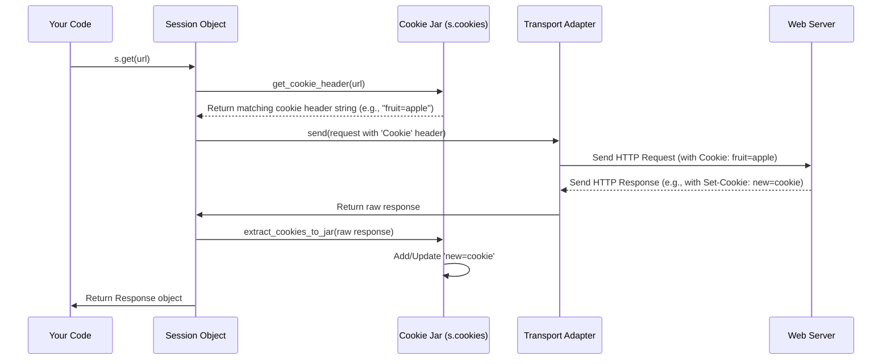

# Chapter 4: The Cookie Jar - Remembering Website Visits

In [Chapter 3: Remembering Things - The Session Object](03_session.md), we saw how `Session` objects are super useful for making multiple requests to the same website. A big reason they work so well is that they automatically remember **cookies** sent by the server, just like your web browser does.

But *how* does a `Session` remember these cookies? Where does it keep them? Welcome to the **Cookie Jar**!

## What's the Problem? Staying Logged In

Imagine you log in to a website. The website usually sends back a special piece of information called a **cookie**. This cookie is like a temporary ID card. When you visit other pages on that *same* website, your browser automatically shows this ID card (sends the cookie back) so the website knows you're still logged in.

If you used the simple `requests.get()` function from [Chapter 1](01_functional_api.md) for each step, it would forget the ID card immediately after logging in. Your next request would be treated as if you were a stranger.

`Session` objects solve this by using a **Cookie Jar** to hold onto those ID cards (cookies) for you.

## What are Cookies (Briefly)?

Think of cookies as little notes or name tags that websites give to your browser (or your `requests` script).

*   **Website:** "Hi, you just logged in. Here's a name tag that says 'User123'." (Sends a `Set-Cookie` header)
*   **Your Browser / Session:** "Okay, I'll keep this 'User123' tag." (Stores the cookie)
*   **You:** (Click on another page on the same website)
*   **Your Browser / Session:** "Hi website, I'd like this page. By the way, here's my name tag: 'User123'." (Sends a `Cookie` header)
*   **Website:** "Ah, User123, I remember you. Here's the page you asked for."

Cookies are used to remember login status, user preferences, items in a shopping cart, etc., between different page visits.

## The Cookie Jar Analogy 🍪

`Requests` uses an object called a `RequestsCookieJar` to store and manage cookies. It's very much like the cookie jar you might have in your kitchen:

1.  **Collects Cookies:** When a website sends you a cookie (like after you log in), the `Session` automatically puts it into its `Cookie Jar`.
2.  **Stores Them Safely:** The jar keeps all the cookies collected from different websites (domains).
3.  **Sends the Right Ones Back:** When you make *another* request to a website using the *same* `Session`, the `Session` looks into the `Cookie Jar`, finds any cookies that belong to that website's domain, and automatically sends them back.

This happens seamlessly when you use a `Session` object.

## Meet `RequestsCookieJar`

The specific object `requests` uses is `requests.cookies.RequestsCookieJar`. It's designed to work just like Python's standard `http.cookiejar.CookieJar` but adds some convenient features, like acting like a dictionary.

Every `Session` object has its own `Cookie Jar` accessible via the `s.cookies` attribute.

Let's see it in action, revisiting the example from Chapter 3:

```python
import requests

# Create a Session object (which has its own empty Cookie Jar)
s = requests.Session()
print(f"Initial session cookies: {s.cookies.get_dict()}")

# Visit a page that sets a cookie
cookie_setter_url = 'https://httpbin.org/cookies/set/fruit/apple'
print(f"\nVisiting {cookie_setter_url}...")
response1 = s.get(cookie_setter_url)

# Check the Session's Cookie Jar - it should have the cookie now!
print(f"Session cookies after setting: {s.cookies.get_dict()}")

# Visit another page on the same domain (httpbin.org)
cookie_viewer_url = 'https://httpbin.org/cookies'
print(f"\nVisiting {cookie_viewer_url}...")
response2 = s.get(cookie_viewer_url)

# This page shows the cookies it received. Let's see if our 'fruit' cookie was sent.
print("Cookies received by the server:")
print(response2.text) # httpbin.org/cookies returns JSON showing received cookies
```

**Output:**

```
Initial session cookies: {}

Visiting https://httpbin.org/cookies/set/fruit/apple...
Session cookies after setting: {'fruit': 'apple'}

Visiting https://httpbin.org/cookies...
Cookies received by the server:
{
  "cookies": {
    "fruit": "apple"
  }
}

```

**Explanation:**

1.  We started with an empty `Session` and an empty cookie jar (`{}`).
2.  We visited `/cookies/set/fruit/apple`. The server sent back a `Set-Cookie: fruit=apple; Path=/` header.
3.  The `Session` object `s` automatically saw this header and stored the `fruit=apple` cookie in its jar (`s.cookies`). We confirmed this by printing `s.cookies.get_dict()`.
4.  We then visited `/cookies` using the *same session* `s`.
5.  The `Session` automatically looked in `s.cookies`, found the `fruit` cookie (since it's for the `httpbin.org` domain), and added a `Cookie: fruit=apple` header to the request.
6.  The server at `/cookies` received this header and echoed it back, confirming our cookie was sent!

The `Session` and its `Cookie Jar` handled the persistence automatically.

## Cookies in the Response

While the `Session` cookie jar (`s.cookies`) holds *all* cookies collected during the session's lifetime, the [Request & Response Models](02_request___response_models.md) also have a `cookies` attribute.

The `response.cookies` attribute (also a `RequestsCookieJar`) contains *only* the cookies that were set or updated by *that specific response*. It doesn't know about cookies from previous responses in the session.

```python
import requests

s = requests.Session()

url_set_a = 'https://httpbin.org/cookies/set/cookieA/valueA'
url_set_b = 'https://httpbin.org/cookies/set/cookieB/valueB'

print(f"Visiting {url_set_a}")
response_a = s.get(url_set_a)
print(f"Cookies SET by response A: {response_a.cookies.get_dict()}")
print(f"ALL session cookies after A: {s.cookies.get_dict()}")

print(f"\nVisiting {url_set_b}")
response_b = s.get(url_set_b)
print(f"Cookies SET by response B: {response_b.cookies.get_dict()}")
print(f"ALL session cookies after B: {s.cookies.get_dict()}")
```

**Output:**

```
Visiting https://httpbin.org/cookies/set/cookieA/valueA
Cookies SET by response A: {'cookieA': 'valueA'}
ALL session cookies after A: {'cookieA': 'valueA'}

Visiting https://httpbin.org/cookies/set/cookieB/valueB
Cookies SET by response B: {'cookieB': 'valueB'}
ALL session cookies after B: {'cookieA': 'valueA', 'cookieB': 'valueB'}
```

**Explanation:**

*   `response_a.cookies` only contains `cookieA`, because that's the cookie set by *that specific response*.
*   `s.cookies` contains `cookieA` after the first request.
*   `response_b.cookies` only contains `cookieB`.
*   `s.cookies` contains *both* `cookieA` and `cookieB` after the second request, because the `Session` accumulates cookies.

## Using the Cookie Jar Like a Dictionary

The `RequestsCookieJar` is extra friendly because you can treat it much like a Python dictionary to access or modify cookies directly.

```python
import requests

jar = requests.cookies.RequestsCookieJar()

# Set cookies using dictionary-like assignment or set()
jar.set('username', 'Nate', domain='httpbin.org', path='/')
jar['session_id'] = 'abcdef123' # Sets for default domain/path ('')

print(f"Jar contents: {jar.get_dict()}")

# Get cookies using dictionary-like access or get()
print(f"Username: {jar['username']}")
print(f"Session ID: {jar.get('session_id')}")
print(f"API Key (default None): {jar.get('api_key', default='NoKey')}")

# Iterate over cookies
print("\nIterating:")
for name, value in jar.items():
    print(f" - {name}: {value}")

# Delete a cookie
del jar['session_id']
print(f"\nJar after deleting session_id: {jar.get_dict()}")
```

**Output:**

```
Jar contents: {'session_id': 'abcdef123', 'username': 'Nate'}
Username: Nate
Session ID: abcdef123
API Key (default None): NoKey

Iterating:
 - session_id: abcdef123
 - username: Nate

Jar after deleting session_id: {'username': 'Nate'}
```

This makes it easy to manually inspect, add, or modify cookies if needed, although the `Session` usually handles the common cases automatically.

**Important Note:** Cookies often have specific `domain` and `path` attributes. If you have multiple cookies with the *same name* but for different domains or paths (e.g., `user=A` for `site1.com` and `user=B` for `site2.com`), using the simple dictionary access `jar['user']` might be ambiguous or raise an error. In such cases, use the `get()` or `set()` methods with the `domain` and `path` arguments for more precision:

```python
jar.set('pref', 'dark', domain='example.com', path='/')
jar.set('pref', 'compact', domain='test.com', path='/')

# Get the specific cookie for example.com
pref_example = jar.get('pref', domain='example.com', path='/')
print(f"Pref for example.com: {pref_example}")

# Simple access might be ambiguous or pick one arbitrarily
# print(jar['pref']) # Could raise CookieConflictError or return one
```

## How It Works Internally

How does the `Session` manage this cookie magic?

1.  **Sending Request:** When you call `s.get(...)` or `s.post(...)`, the `Session.prepare_request` method is called.
    *   It creates a `PreparedRequest` object.
    *   It merges cookies from your request (`cookies=...`), the session (`self.cookies`), and potentially environment settings.
    *   It calls `get_cookie_header(merged_cookies, prepared_request)` (from `requests.cookies`). This function checks the cookie jar for cookies that match the request's domain and path.
    *   It generates the `Cookie` header string (e.g., `Cookie: fruit=apple; username=Nate`) and adds it to the `PreparedRequest.headers`.
    *   The request (with the `Cookie` header) is then sent via a [Transport Adapter](07_transport_adapters.md).

2.  **Receiving Response:** When the [Transport Adapter](07_transport_adapters.md) receives the raw HTTP response from the server:
    *   It builds the `Response` object.
    *   The `Session.send` method (or redirection logic) gets this `Response`.
    *   It calls `extract_cookies_to_jar(self.cookies, request, response.raw)` (from `requests.cookies`). This function looks for `Set-Cookie` headers in the raw response.
    *   It parses any `Set-Cookie` headers and adds/updates the corresponding cookies in the `Session`'s cookie jar (`self.cookies`).
    *   The final `Response` object is returned to you.

Here's a simplified diagram focusing on the cookie flow:



You can see parts of this logic in `requests/sessions.py` and `requests/cookies.py`:

```python
# File: requests/sessions.py (Simplified View)

from .cookies import extract_cookies_to_jar, merge_cookies, RequestsCookieJar, cookiejar_from_dict
from .models import PreparedRequest
from .utils import to_key_val_list
from .structures import CaseInsensitiveDict

class Session:
    def __init__(self):
        # ... other attributes ...
        self.cookies = cookiejar_from_dict({}) # The Session's main Cookie Jar

    def prepare_request(self, request):
        # ... merge headers, params, auth ...

        # Merge session cookies with request-specific cookies
        merged_cookies = merge_cookies(
            merge_cookies(RequestsCookieJar(), self.cookies),
            cookiejar_from_dict(request.cookies or {})
        )

        p = PreparedRequest()
        p.prepare(
            # ... other args ...
            cookies=merged_cookies, # Pass merged jar to PreparedRequest
        )
        return p

    def send(self, request, **kwargs):
        # ... prepare sending ...
        adapter = self.get_adapter(url=request.url)
        response = adapter.send(request, **kwargs) # Adapter gets raw response

        # ... hooks ...

        # EXTRACT cookies from the response and put them in the session jar!
        extract_cookies_to_jar(self.cookies, request, response.raw)

        # ... redirect handling (also extracts cookies) ...

        return response

# --- File: requests/models.py (Simplified View) ---
from .cookies import get_cookie_header, _copy_cookie_jar, cookiejar_from_dict

class PreparedRequest:
    def prepare_cookies(self, cookies):
        # Store the jar potentially passed from Session.prepare_request
        if isinstance(cookies, cookielib.CookieJar):
            self._cookies = cookies
        else:
            self._cookies = cookiejar_from_dict(cookies)

        # Generate the Cookie header string
        cookie_header = get_cookie_header(self._cookies, self)
        if cookie_header is not None:
            self.headers['Cookie'] = cookie_header

class Response:
    def __init__(self):
        # ... other attributes ...
        # This jar holds cookies SET by *this* response only
        self.cookies = cookiejar_from_dict({})

# --- File: requests/cookies.py (Simplified View) ---
import cookielib

class MockRequest: # Helper to adapt requests.Request for cookielib
    # ... implementation ...

class MockResponse: # Helper to adapt response headers for cookielib
    # ... implementation ...

def extract_cookies_to_jar(jar, request, response):
    """Extract Set-Cookie headers from response into jar."""
    if not hasattr(response, '_original_response') or not response._original_response:
        return # Need the underlying httplib response

    req = MockRequest(request) # Adapt request for cookielib
    res = MockResponse(response._original_response.msg) # Adapt headers for cookielib
    jar.extract_cookies(res, req) # Use cookielib's extraction logic

def get_cookie_header(jar, request):
    """Generate the Cookie header string for the request."""
    r = MockRequest(request)
    jar.add_cookie_header(r) # Use cookielib to add the header to the mock request
    return r.get_new_headers().get('Cookie') # Retrieve the generated header

class RequestsCookieJar(cookielib.CookieJar, MutableMapping):
    # Dictionary-like methods (get, set, __getitem__, etc.)
    def get(self, name, default=None, domain=None, path=None):
       # ... find cookie, handle conflicts ...
       pass
    def set(self, name, value, **kwargs):
       # ... create or update cookie ...
       pass
    # ... other dict methods ...
```

The key is that `Session.send` calls `extract_cookies_to_jar` after receiving a response, and `PreparedRequest.prepare_cookies` (called via `Session.prepare_request`) calls `get_cookie_header` before sending the next one.

## Conclusion

You've learned about the **Cookie Jar** (`RequestsCookieJar`), the mechanism `requests` (especially `Session` objects) uses to store and manage cookies. You saw:

*   How `Session` objects automatically use their cookie jar (`s.cookies`) to persist cookies across requests.
*   How `response.cookies` contains cookies set by a specific response.
*   How to interact with a `RequestsCookieJar` using its dictionary-like interface.
*   A glimpse into how `requests` extracts cookies from `Set-Cookie` headers and adds them back via the `Cookie` header.

Understanding the cookie jar helps explain how sessions maintain state and interact with websites that require logins or remember preferences.

Speaking of logging in, while cookies are often involved, sometimes websites require more explicit forms of identification, like usernames and passwords sent directly with the request. How does `requests` handle those?

**Next:** [Chapter 5: Authentication Handlers](05_authentication_handlers.md)

---

Generated by [AI Codebase Knowledge Builder](https://github.com/The-Pocket/Tutorial-Codebase-Knowledge)