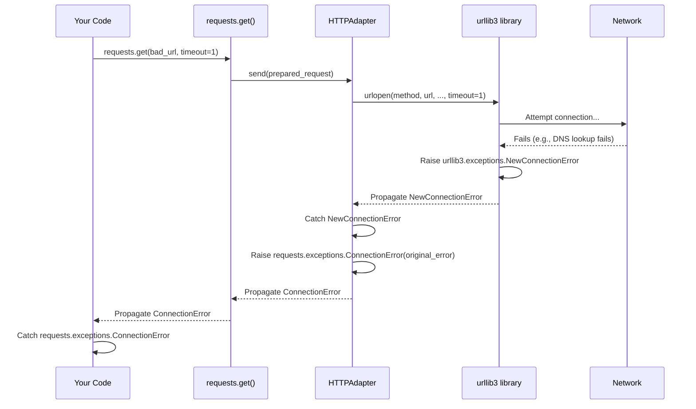

# Chapter 6: When Things Go Wrong - The Exception Hierarchy

In [Chapter 5: Authentication Handlers](05_authentication_handlers.md), we learned how to prove our identity to websites that require login or API keys. We assumed our requests would work if we provided the correct credentials.

But what happens when things *don't* go as planned? The internet isn't always reliable. Websites go down, networks have hiccups, URLs might be typed incorrectly, or servers might just be having a bad day. How does `requests` tell us about these problems, and how can we handle them gracefully in our code?

## The Problem: Dealing with Request Failures

Imagine you're building a script to check the weather using an online weather API. You use `requests.get()` to fetch the weather data. What could go wrong?

*   Your internet connection might be down.
*   The weather API website might be temporarily offline.
*   You might have mistyped the URL.
*   The website might take too long to respond (a timeout).
*   The website might respond, but with an error message (like "404 Not Found" or "500 Server Error").

If any of these happen, `requests` will encounter an error. If you don't prepare for these errors, your script might crash! We need a way to:

1.  **Detect** that an error occurred.
2.  **Understand** *what kind* of error it was (network issue? timeout? bad URL?).
3.  **React** appropriately (e.g., print a helpful message, try again later, use a default value).

## The Solution: A Family Tree of Errors

`Requests` helps us by using a system of specific error messages called **exceptions**. When something goes wrong, `requests` doesn't just give up silently; it **raises an exception**.

Think of it like a doctor diagnosing an illness. A doctor doesn't just say "You're sick." They give a specific diagnosis: "You have the flu," or "You have a broken arm," or "You have allergies." Each diagnosis tells you something specific about the problem and how to treat it.

`Requests` does something similar with its exceptions. It has a main, general exception called `requests.exceptions.RequestException`. All other specific `requests` errors are "children" or "descendants" of this main one, forming an **Exception Hierarchy** (like a family tree).

**Analogy:** The "Sickness" Family Tree 🌳

*   **`RequestException` (The Grandparent):** This is the most general category, like saying "Sickness." If you catch this, you catch *any* problem related to `requests`.
*   **`ConnectionError`, `Timeout`, `HTTPError`, `URLRequired` (The Parents):** These are more specific categories under `RequestException`.
    *   `ConnectionError` is like saying "Infection."
    *   `Timeout` is like saying "Fatigue."
    *   `HTTPError` is like saying "External Injury."
    *   `URLRequired` is like saying "Genetic Condition" (problem with the input itself).
*   **`ConnectTimeout`, `ReadTimeout` (The Children):** These are even *more* specific.
    *   `ConnectTimeout` (child of `Timeout`) is like "Trouble Falling Asleep."
    *   `ReadTimeout` (child of `Timeout`) is like "Waking Up Too Early." Both are types of "Fatigue" (`Timeout`).

This hierarchy allows you to decide how specific you want to be when handling errors.

## Key Members of the Exception Family

All `requests` exceptions live inside the `requests.exceptions` module. You usually import the main `requests` library and access them like `requests.exceptions.ConnectionError`.

Here are some of the most common ones you'll encounter:

*   **`requests.exceptions.RequestException`**: The base exception. Catching this catches *all* exceptions listed below.
*   **`requests.exceptions.ConnectionError`**: Problems connecting to the server. This could be due to:
    *   DNS failure (can't find the server's address).
    *   Refused connection (server is there but not accepting connections).
    *   Network is unreachable.
*   **`requests.exceptions.Timeout`**: The request took too long. This is a parent category for:
    *   **`requests.exceptions.ConnectTimeout`**: Timeout occurred *while trying to establish the connection*.
    *   **`requests.exceptions.ReadTimeout`**: Timeout occurred *after connecting*, while waiting for the server to send data.
*   **`requests.exceptions.HTTPError`**: Raised when the server returns a "bad" status code (4xx for client errors like "404 Not Found", or 5xx for server errors like "500 Internal Server Error"). **Important:** `requests` does *not* automatically raise this just because the status code is bad. You typically need to call the `response.raise_for_status()` method to trigger it.
*   **`requests.exceptions.TooManyRedirects`**: The request exceeded the maximum number of allowed redirects (usually 30).
*   **`requests.exceptions.URLRequired`**: You tried to make a request without providing a URL.
*   **`requests.exceptions.MissingSchema`**: The URL was missing the scheme (like `http://` or `https://`).
*   **`requests.exceptions.InvalidURL`**: The URL was malformed in some way.
*   **`requests.exceptions.InvalidSchema`**: The URL scheme was not recognized (e.g., `ftp://` might not be supported by default).

## Handling Exceptions: The `try...except` Block

How do we use this hierarchy in our code? We use Python's `try...except` block.

1.  Put the code that *might* cause an error (like `requests.get()`) inside the `try:` block.
2.  Follow it with one or more `except:` blocks. Each `except:` block specifies the type of exception it's designed to catch.

**Example 1: Catching Any `requests` Error**

Let's try fetching a URL that doesn't exist and catch the most general exception.

```python
import requests

# A URL that might cause a connection error (e.g., non-existent domain)
bad_url = 'https://this-domain-probably-does-not-exist-asdfghjkl.com'
good_url = 'https://httpbin.org/get'

url_to_try = bad_url # Change to good_url to see success case

print(f"Trying to fetch: {url_to_try}")

try:
    response = requests.get(url_to_try, timeout=5) # Add timeout
    response.raise_for_status() # Check for 4xx/5xx errors
    print("Success! Status Code:", response.status_code)
    # Process the response... (e.g., print response.text)

except requests.exceptions.RequestException as e:
    # This will catch ANY error originating from requests
    print(f"\nOh no! A requests-related error occurred:")
    print(f"Error Type: {type(e).__name__}")
    print(f"Error Details: {e}")

print("\nScript continues after handling the error.")
```

**Possible Output (if `url_to_try = bad_url`):**

```
Trying to fetch: https://this-domain-probably-does-not-exist-asdfghjkl.com

Oh no! A requests-related error occurred:
Error Type: ConnectionError
Error Details: HTTPSConnectionPool(host='this-domain-probably-does-not-exist-asdfghjkl.com', port=443): Max retries exceeded with url: / (Caused by NameResolutionError("<urllib3.connection.HTTPSConnection object at 0x...>: Failed to resolve 'this-domain-probably-does-not-exist-asdfghjkl.com' ([Errno ...)"))

Script continues after handling the error.
```

**Explanation:**

*   We put `requests.get()` and `response.raise_for_status()` inside the `try` block.
*   If `requests.get()` fails (e.g., due to `ConnectionError` or `Timeout`), or if `raise_for_status()` detects a 4xx/5xx code (`HTTPError`), an exception is raised.
*   The `except requests.exceptions.RequestException as e:` block catches it because `ConnectionError`, `Timeout`, and `HTTPError` are all descendants of `RequestException`.
*   We print a helpful message and the details of the error (`e`). Crucially, the script *doesn't crash*.

**Example 2: Catching Specific Errors**

Sometimes, you want to react differently based on the *type* of error. Was it a temporary network glitch, or did the server permanently remove the page?

```python
import requests

# URL that gives a 404 error
not_found_url = 'https://httpbin.org/status/404'
# URL that is slow and might time out
timeout_url = 'https://httpbin.org/delay/5' # Delays response by 5 seconds

url_to_try = timeout_url # Change to not_found_url to see HTTPError

print(f"Trying to fetch: {url_to_try}")

try:
    # Set a short timeout to demonstrate Timeout exception
    response = requests.get(url_to_try, timeout=2)
    response.raise_for_status() # Check for 4xx/5xx status codes
    print("Success! Status Code:", response.status_code)
    # Process response...

except requests.exceptions.ConnectTimeout as e:
    print(f"\nError: Could not connect to the server in time.")
    print(f"Details: {e}")
    # Maybe retry later?

except requests.exceptions.ReadTimeout as e:
    print(f"\nError: Server took too long to send data.")
    print(f"Details: {e}")
    # Maybe the server is slow, could try again?

except requests.exceptions.ConnectionError as e:
    print(f"\nError: Network problem (e.g., DNS error, refused connection).")
    print(f"Details: {e}")
    # Check internet connection?

except requests.exceptions.HTTPError as e:
    print(f"\nError: Bad HTTP status code received from server.")
    print(f"Status Code: {e.response.status_code}")
    print(f"Details: {e}")
    # Was it a 404 Not Found? 500 Server Error?

except requests.exceptions.RequestException as e:
    # Catch any other requests error that wasn't specifically handled above
    print(f"\nAn unexpected requests error occurred:")
    print(f"Error Type: {type(e).__name__}")
    print(f"Details: {e}")

print("\nScript continues...")
```

**Possible Output (if `url_to_try = timeout_url`):**

```
Trying to fetch: https://httpbin.org/delay/5

Error: Server took too long to send data.
Details: HTTPSConnectionPool(host='httpbin.org', port=443): Read timed out. (read timeout=2)

Script continues...
```

**Possible Output (if `url_to_try = not_found_url`):**

```
Trying to fetch: https://httpbin.org/status/404

Error: Bad HTTP status code received from server.
Status Code: 404
Details: 404 Client Error: NOT FOUND for url: https://httpbin.org/status/404

Script continues...
```

**Explanation:**

*   We have multiple `except` blocks, ordered from most specific (`ConnectTimeout`, `ReadTimeout`) to more general (`ConnectionError`, `HTTPError`) and finally the catch-all `RequestException`.
*   Python tries the `except` blocks in order. When an exception occurs, the *first* matching block is executed.
*   If a `ReadTimeout` occurs, the `except requests.exceptions.ReadTimeout` block handles it. It won't fall through to the `except requests.exceptions.ConnectionError` or `except requests.exceptions.RequestException` blocks, even though `ReadTimeout` *is* a type of `RequestException`.
*   This allows us to provide specific feedback or recovery logic for different error scenarios.

**Inheritance Benefit:** If you write `except requests.exceptions.Timeout as e:`, this block will catch *both* `ConnectTimeout` and `ReadTimeout` because they inherit from `Timeout`.

## How It Works Internally: Wrapping Lower-Level Errors

`Requests` doesn't handle network connections directly. It uses a lower-level library called `urllib3` under the hood (managed via [Transport Adapters](07_transport_adapters.md)). When `urllib3` encounters a network problem (like a connection error or timeout), it raises its *own* specific exceptions (e.g., `urllib3.exceptions.MaxRetryError`, `urllib3.exceptions.NewConnectionError`, `urllib3.exceptions.ReadTimeoutError`).

`Requests` catches these `urllib3` exceptions inside its [Transport Adapters](07_transport_adapters.md) (specifically, the `HTTPAdapter.send` method) and then **raises its own corresponding exception** from the `requests.exceptions` hierarchy. This simplifies things for you – you only need to worry about catching `requests` exceptions, not the underlying `urllib3` ones.



Let's look at the definitions in `requests/exceptions.py`. You can see the inheritance structure clearly:

```python
# File: requests/exceptions.py (Simplified View)

from urllib3.exceptions import HTTPError as BaseHTTPError

# The base class for all requests exceptions
class RequestException(IOError):
    """There was an ambiguous exception that occurred while handling your request."""
    # ... (stores request/response objects) ...

# Specific exceptions inheriting from RequestException or other requests exceptions
class HTTPError(RequestException):
    """An HTTP error occurred.""" # Typically raised by response.raise_for_status()

class ConnectionError(RequestException):
    """A Connection error occurred."""

class ProxyError(ConnectionError): # Inherits from ConnectionError
    """A proxy error occurred."""

class SSLError(ConnectionError): # Inherits from ConnectionError
    """An SSL error occurred."""

class Timeout(RequestException): # Inherits directly from RequestException
    """The request timed out."""

class ConnectTimeout(ConnectionError, Timeout): # Inherits from BOTH ConnectionError and Timeout!
    """The request timed out while trying to connect to the remote server."""

class ReadTimeout(Timeout): # Inherits from Timeout
    """The server did not send any data in the allotted amount of time."""

class URLRequired(RequestException):
    """A valid URL is required to make a request."""

class TooManyRedirects(RequestException):
    """Too many redirects."""

# ... other specific errors like MissingSchema, InvalidURL, etc. ...

# Some exceptions might also inherit from standard Python errors
class JSONDecodeError(RequestException, ValueError): # Inherits from RequestException and ValueError
    """Couldn't decode the text into json"""
    # Uses Python's built-in JSONDecodeError capabilities

```

And here's a simplified view of how `requests/adapters.py` (`HTTPAdapter.send`) catches `urllib3` errors and raises `requests` errors:

```python
# File: requests/adapters.py (Simplified View in HTTPAdapter.send method)

from urllib3.exceptions import (
    MaxRetryError, ConnectTimeoutError, NewConnectionError, ResponseError,
    ProxyError as _ProxyError, SSLError as _SSLError, ReadTimeoutError,
    ProtocolError, ClosedPoolError, InvalidHeader as _InvalidHeader
)
from ..exceptions import (
    ConnectionError, ConnectTimeout, ReadTimeout, SSLError, ProxyError,
    RetryError, InvalidHeader, RequestException # And others
)

class HTTPAdapter(BaseAdapter):
    def send(self, request, stream=False, timeout=None, verify=True, cert=None, proxies=None):
        # ... (prepare connection using self.get_connection_with_tls_context) ...
        conn = self.get_connection_with_tls_context(...)
        # ... (verify certs, prepare URL, add headers) ...

        try:
            # === Make the actual request using urllib3 ===
            resp = conn.urlopen(
                method=request.method,
                url=url,
                # ... other args like body, headers ...
                retries=self.max_retries,
                timeout=timeout,
            )

        # === Catch specific urllib3 errors and raise corresponding requests errors ===

        except (ProtocolError, OSError) as err: # General network/protocol errors
            raise ConnectionError(err, request=request)

        except MaxRetryError as e: # urllib3 retried but failed
            if isinstance(e.reason, ConnectTimeoutError):
                raise ConnectTimeout(e, request=request)
            if isinstance(e.reason, ResponseError): # Errors related to retry logic
                raise RetryError(e, request=request)
            if isinstance(e.reason, _ProxyError):
                raise ProxyError(e, request=request)
            if isinstance(e.reason, _SSLError):
                raise SSLError(e, request=request)
            # Fallback for other retry errors
            raise ConnectionError(e, request=request)

        except ClosedPoolError as e: # Connection pool was closed
            raise ConnectionError(e, request=request)

        except _ProxyError as e: # Direct proxy error
            raise ProxyError(e)

        except (_SSLError, ReadTimeoutError, _InvalidHeader) as e: # Other specific errors
            if isinstance(e, _SSLError):
                raise SSLError(e, request=request)
            elif isinstance(e, ReadTimeoutError):
                raise ReadTimeout(e, request=request)
            elif isinstance(e, _InvalidHeader):
                raise InvalidHeader(e, request=request)
            else:
                # Should not happen, but raise generic RequestException if needed
                raise RequestException(e, request=request)

        # ... (build and return the Response object if successful) ...
        return self.build_response(request, resp)
```

This wrapping makes your life easier by providing a consistent set of exceptions (`requests.exceptions`) to handle, regardless of the underlying `urllib3` details.

## Conclusion

You've learned about the `requests` **Exception Hierarchy** – a family tree of error types that `requests` raises when things go wrong.

*   You saw that all `requests` exceptions inherit from the base `requests.exceptions.RequestException`.
*   You learned about key specific exceptions like `ConnectionError`, `Timeout` (and its children `ConnectTimeout`, `ReadTimeout`), and `HTTPError` (raised by `response.raise_for_status()`).
*   You practiced using `try...except` blocks to catch both general (`RequestException`) and specific exceptions, allowing for tailored error handling.
*   You understood that `requests` wraps lower-level errors (from `urllib3`) into its own exception types, simplifying error handling for you.

Understanding this hierarchy is crucial for writing robust Python code that can gracefully handle the inevitable problems that occur when dealing with networks and web services.

So far, we've mostly used the default way `requests` handles connections. But what if we need more control over how connections are made, maybe to configure retries differently, or use different SSL settings? That's where Transport Adapters come in.

**Next:** [Chapter 7: Transport Adapters](07_transport_adapters.md)

---

Generated by [AI Codebase Knowledge Builder](https://github.com/The-Pocket/Tutorial-Codebase-Knowledge)