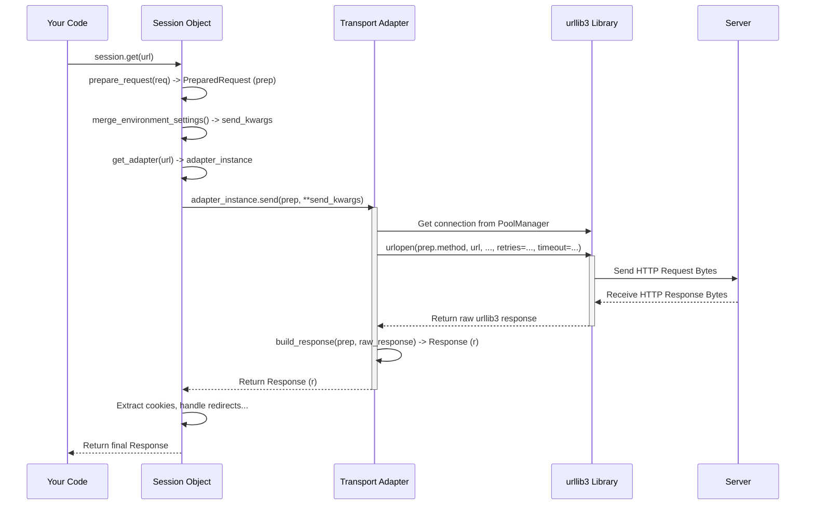

# Chapter 7: Transport Adapters - Custom Delivery Routes

In the previous chapter, [Chapter 6: Exception Hierarchy](06_exception_hierarchy.md), we learned how `requests` signals problems like network errors or bad responses. Most of the time, we rely on the default way `requests` handles sending our requests and managing connections.

But what if the default way isn't quite right for a specific website or service? What if you need to tell `requests` *exactly* how to handle connections or retries for URLs starting with `http://` or `https://`, or maybe even for a completely custom scheme like `myprotocol://`?

## The Problem: Needing Special Handling

Imagine you're interacting with an API that's known to be a bit unreliable. Sometimes requests to it fail temporarily, but succeed if you just try again a second later. The default `requests` behavior might not retry enough times, or maybe you want to retry only on specific error codes.

Or perhaps you need to connect to a server using very specific security settings (SSL/TLS versions or ciphers) that aren't the default.

How can you customize *how* `requests` sends requests and manages connections for specific types of URLs?

## Meet Transport Adapters: The Delivery Services

This is where **Transport Adapters** come in!

Think of a `requests` [Session](03_session.md) object like a customer ordering packages online. The customer (Session) wants to send a package (a web request) to a specific address (a URL).

**Transport Adapters** are like the different **delivery services** (like FedEx, UPS, USPS, or maybe a specialized local courier) that the customer can choose from.

*   Each delivery service specializes in certain types of addresses or delivery methods.
*   When the customer has a package for a specific address (e.g., starting with `https://`), they pick the appropriate delivery service registered for that address type.
*   That delivery service then handles all the details of picking up, transporting, and delivering the package (sending the request, managing connections, handling retries, etc.).

In `requests`, a Transport Adapter defines *how* requests are actually sent and connections are managed for specific **URL schemes** (like `http://` or `https://`).

## The Default Delivery Service: `HTTPAdapter`

By default, when you create a `Session` object, it automatically sets up the standard "delivery services" for web addresses:

*   For URLs starting with `https://`, it uses the built-in `requests.adapters.HTTPAdapter`.
*   For URLs starting with `http://`, it also uses the `requests.adapters.HTTPAdapter`.

This `HTTPAdapter` is the workhorse. It doesn't handle the network sockets directly; instead, it uses another powerful library called `urllib3` under the hood.

The `HTTPAdapter` (via `urllib3`) is responsible for:

1.  **Connection Pooling:** Reusing existing network connections to the same host for better performance (like the delivery service keeping its trucks warm and ready for the next delivery to the same neighborhood). We saw the benefits of this in [Chapter 3: Session](03_session.md).
2.  **HTTP/HTTPS Details:** Handling the specifics of the HTTP and HTTPS protocols.
3.  **SSL Verification:** Making sure the website's security certificate is valid for HTTPS connections.
4.  **Basic Retries:** Handling some low-level connection retries (though often you might want more control).

So, when you use a `Session` and make a `GET` request to `https://example.com`, the Session looks up the adapter for `https://`, finds the default `HTTPAdapter`, and hands the request off to it for delivery.

## Mounting Adapters: Choosing Your Delivery Service

How does a `Session` know which adapter to use for which URL prefix? It uses a mechanism called **mounting**.

Think of it like telling your `Session` customer: "For any address starting with `https://`, use this specific delivery service (adapter)."

A `Session` object has an `adapters` attribute, which is an ordered dictionary. You use the `session.mount(prefix, adapter)` method to register an adapter for a given URL prefix.

```python
import requests
from requests.adapters import HTTPAdapter

# Create a session
s = requests.Session()

# See the default adapters that are already mounted
print("Default Adapters:")
print(s.adapters)

# Create a *new* instance of the default HTTPAdapter
# (Maybe we'll configure it later)
custom_adapter = HTTPAdapter()

# Mount this adapter for a specific website
# Now, any request to this specific host via HTTPS will use our custom_adapter
print("\nMounting custom adapter for https://httpbin.org")
s.mount('https://httpbin.org', custom_adapter)

# Let's mount another one for all HTTP traffic
plain_http_adapter = HTTPAdapter()
print("Mounting another adapter for all http://")
s.mount('http://', plain_http_adapter)

# Check the adapters again (they are ordered by prefix length, longest first)
print("\nAdapters after mounting:")
print(s.adapters)

# When we make a request, the session finds the best matching prefix
print(f"\nAdapter for 'https://httpbin.org/get': {s.get_adapter('https://httpbin.org/get')}")
print(f"Adapter for 'http://example.com': {s.get_adapter('http://example.com')}")
print(f"Adapter for 'https://google.com': {s.get_adapter('https://google.com')}") # Uses default https://
```

**Output:**

```
Default Adapters:
OrderedDict([('https://', <requests.adapters.HTTPAdapter object at 0x...>), ('http://', <requests.adapters.HTTPAdapter object at 0x...>)])

Mounting custom adapter for https://httpbin.org
Mounting another adapter for all http://

Adapters after mounting:
OrderedDict([('https://httpbin.org', <requests.adapters.HTTPAdapter object at 0x...>), ('https://', <requests.adapters.HTTPAdapter object at 0x...>), ('http://', <requests.adapters.HTTPAdapter object at 0x...>)])

Adapter for 'https://httpbin.org/get': <requests.adapters.HTTPAdapter object at 0x...>
Adapter for 'http://example.com': <requests.adapters.HTTPAdapter object at 0x...>
Adapter for 'https://google.com': <requests.adapters.HTTPAdapter object at 0x...>
```

**Explanation:**

1.  Initially, the session has default `HTTPAdapter` instances mounted for `https://` and `http://`.
2.  We created new `HTTPAdapter` instances.
3.  We used `s.mount('https://httpbin.org', custom_adapter)`. Now, requests to `https://httpbin.org/anything` will use `custom_adapter`.
4.  We used `s.mount('http://', plain_http_adapter)`. This *replaced* the original default adapter for `http://`.
5.  Requests to other HTTPS sites like `https://google.com` will still use the original default adapter mounted for the shorter `https://` prefix.
6.  The `s.get_adapter(url)` method shows how the session selects the adapter based on the longest matching prefix.

## Use Case: Customizing Retries

Let's go back to the unreliable API example. We want to configure `requests` to automatically retry requests to `https://flaky-api.example.com` up to 5 times if certain errors occur (like temporary server errors or connection issues).

The `HTTPAdapter`'s retry logic is controlled by a `Retry` object from the underlying `urllib3` library. We can create our own `Retry` object with custom settings and pass it to a *new* `HTTPAdapter` instance.

```python
import requests
from requests.adapters import HTTPAdapter
from urllib3.util.retry import Retry # Import the Retry class

# 1. Configure the retry strategy
#    - total=5: Try up to 5 times in total
#    - backoff_factor=0.5: Wait 0.5s, 1s, 2s, 4s between retries
#    - status_forcelist=[500, 502, 503, 504]: Only retry on these HTTP status codes
#    - allowed_methods=False: Retry for all methods (GET, POST, etc.) by default. Use ["GET", "POST"] to restrict.
retry_strategy = Retry(
    total=5,
    backoff_factor=0.5,
    status_forcelist=[500, 502, 503, 504],
    # allowed_methods=False # Default includes most common methods
)

# 2. Create an HTTPAdapter with this retry strategy
#    The 'max_retries' argument accepts a Retry object
adapter_with_retries = HTTPAdapter(max_retries=retry_strategy)

# 3. Create a Session
session = requests.Session()

# 4. Mount the adapter for the specific API prefix
api_base_url = 'https://flaky-api.example.com/' # Use the base URL prefix
session.mount(api_base_url, adapter_with_retries)

# 5. Now, use the session to make requests to the flaky API
api_endpoint = f"{api_base_url}data"
print(f"Making request to {api_endpoint} with custom retries...")

try:
    # Imagine this API sometimes returns 503 Service Unavailable
    response = session.get(api_endpoint)
    response.raise_for_status() # Check for HTTP errors
    print("Success!")
    # print(response.json()) # Process the successful response
except requests.exceptions.RequestException as e:
    print(f"Request failed after retries: {e}")

# Requests to other domains will use the default adapter/retries
print("\nMaking request to a different site (default retries)...")
try:
    response_other = session.get('https://httpbin.org/get')
    print(f"Status for httpbin: {response_other.status_code}")
except requests.exceptions.RequestException as e:
    print(f"Httpbin request failed: {e}")

```

**Explanation:**

1.  We defined our desired retry behavior using `urllib3.util.retry.Retry`.
2.  We created a *new* `HTTPAdapter`, passing our `retry_strategy` to its `max_retries` parameter during initialization.
3.  We created a `Session`.
4.  Crucially, we `mount`ed our `adapter_with_retries` specifically to the base URL of the flaky API (`https://flaky-api.example.com/`).
5.  When `session.get(api_endpoint)` is called, the Session sees that the URL starts with the mounted prefix, so it uses our `adapter_with_retries`. If the server returns a `503` error, this adapter (using the `Retry` object) will automatically wait and try again, up to 5 times.
6.  Requests to `https://httpbin.org` don't match the specific prefix, so they fall back to the default adapter mounted for `https://`, which has default retry behavior.

This allows fine-grained control over connection handling for different destinations.

## How It Works Internally: The Session-Adapter Dance

Let's trace the steps when you call `session.get(url)`:

1.  **`Session.request`:** Your `session.get(url, ...)` call ends up in the main `Session.request` method.
2.  **Prepare Request:** `Session.request` creates a `Request` object and calls `self.prepare_request(req)` to turn it into a `PreparedRequest`, merging session-level settings like headers and cookies (as seen in [Chapter 3: Session](03_session.md)).
3.  **Merge Environment Settings:** `Session.request` calls `self.merge_environment_settings(...)` to figure out final settings for proxies, SSL verification (`verify`), etc.
4.  **`Session.send`:** The prepared request (`prep`) and final settings (`send_kwargs`) are passed to `self.send(prep, **send_kwargs)`.
5.  **`get_adapter`:** Inside `Session.send`, the first crucial step is `adapter = self.get_adapter(url=request.url)`. This method looks through the `self.adapters` dictionary (which is ordered from longest prefix to shortest) and returns the *first* adapter whose mounted prefix matches the beginning of the request's URL.
6.  **`adapter.send`:** The `Session` then calls the `send` method *on the chosen adapter*: `r = adapter.send(request, **kwargs)`. **This is the handover!** The Session delegates the actual sending to the Transport Adapter.
7.  **Adapter Does the Work:** The adapter (e.g., `HTTPAdapter`) takes over.
    *   It interacts with its `urllib3.PoolManager` to get a connection from the pool (or create one).
    *   It configures SSL/TLS context based on `verify` and `cert` parameters.
    *   It uses `urllib3` to send the actual HTTP request bytes over the network.
    *   It applies retry logic (using the `Retry` object if configured) if `urllib3` reports certain connection errors or status codes.
    *   It receives the raw HTTP response bytes from `urllib3`.
8.  **`adapter.build_response`:** The adapter takes the raw response data from `urllib3` and constructs a `requests.Response` object using its `build_response(request, raw_urllib3_response)` method. This involves parsing status codes, headers, and making the response body available.
9.  **Return Response:** The `adapter.send` method returns the fully formed `Response` object back to the `Session.send` method.
10. **Post-Processing:** `Session.send` does some final steps, like extracting cookies from the response into the session's [Cookie Jar](04_cookie_jar.md) and handling redirects (which might involve calling `send` again).
11. **Final Return:** The final `Response` object is returned to your original `session.get(url)` call.

Here's a simplified diagram:



Let's peek at the relevant code snippets:

```python
# File: requests/sessions.py (Simplified View)

class Session:
    def __init__(self):
        # ... other defaults ...
        self.adapters = OrderedDict() # The mounted adapters
        self.mount('https://', HTTPAdapter()) # Mount default HTTPS adapter
        self.mount('http://', HTTPAdapter())  # Mount default HTTP adapter

    def get_adapter(self, url):
        """Returns the appropriate connection adapter for the given URL."""
        for prefix, adapter in self.adapters.items():
            # Find the longest prefix that matches the URL
            if url.lower().startswith(prefix.lower()):
                return adapter
        # No match found
        raise InvalidSchema(f"No connection adapters were found for {url!r}")

    def mount(self, prefix, adapter):
        """Registers a connection adapter to a prefix."""
        self.adapters[prefix] = adapter
        # Sort adapters by prefix length, descending (longest first)
        # Simplified: Real code sorts keys and rebuilds OrderedDict
        keys_to_move = [k for k in self.adapters if len(k) < len(prefix)]
        for key in keys_to_move:
             self.adapters[key] = self.adapters.pop(key)

    def send(self, request, **kwargs):
        # ... setup kwargs (stream, verify, cert, proxies) ...

        # === GET THE ADAPTER ===
        adapter = self.get_adapter(url=request.url)

        # === DELEGATE TO THE ADAPTER ===
        # Start timer
        start = preferred_clock()
        # Call the adapter's send method
        r = adapter.send(request, **kwargs)
        # Stop timer
        elapsed = preferred_clock() - start
        r.elapsed = timedelta(seconds=elapsed)

        # ... dispatch response hooks ...
        # ... persist cookies (extract_cookies_to_jar) ...
        # ... handle redirects (resolve_redirects, might call send again) ...

        # ... maybe read content if stream=False ...
        return r

# File: requests/adapters.py (Simplified View)

from urllib3.util.retry import Retry
from urllib3.poolmanager import PoolManager # Used internally by HTTPAdapter

class BaseAdapter:
    """The Base Transport Adapter"""
    def send(self, request, stream=False, timeout=None, verify=True, cert=None, proxies=None):
        raise NotImplementedError
    def close(self):
        raise NotImplementedError

class HTTPAdapter(BaseAdapter):
    def __init__(self, pool_connections=10, pool_maxsize=10, max_retries=0, pool_block=False):
        # === STORE RETRY CONFIGURATION ===
        if isinstance(max_retries, Retry):
            self.max_retries = max_retries
        else:
            # Convert integer retries to a basic Retry object
            self.max_retries = Retry(total=max_retries, read=False, connect=max_retries)

        # ... configure pooling options ...

        # === INITIALIZE URLIB3 POOL MANAGER ===
        # This object manages connections using urllib3
        self.poolmanager = PoolManager(num_pools=pool_connections, maxsize=pool_maxsize, block=pool_block)
        self.proxy_manager = {} # For handling proxies

    def send(self, request, stream=False, timeout=None, verify=True, cert=None, proxies=None):
        """Sends PreparedRequest object using urllib3."""
        # ... determine connection pool (conn) based on URL, proxies, SSL context ...
        conn = self.get_connection_with_tls_context(request, verify, proxies=proxies, cert=cert)
        # ... determine URL to use (might be different for proxies) ...
        url = self.request_url(request, proxies)
        # ... configure timeout object for urllib3 ...
        timeout_obj = self._build_timeout(timeout)

        try:
            # === CALL URLIB3 ===
            # This is the core network call
            resp = conn.urlopen(
                method=request.method,
                url=url,
                body=request.body,
                headers=request.headers,
                redirect=False, # Requests handles redirects
                assert_same_host=False,
                preload_content=False, # Requests streams content
                decode_content=False, # Requests handles decoding
                retries=self.max_retries, # Pass configured retries
                timeout=timeout_obj,     # Pass configured timeout
                chunked=... # Determine if chunked encoding is needed
            )

        except (urllib3_exceptions...) as err:
            # === WRAP URLIB3 EXCEPTIONS ===
            # Catch exceptions from urllib3 and raise corresponding
            # requests.exceptions (ConnectionError, Timeout, SSLError, etc.)
            # See Chapter 6 for details.
            raise MappedRequestsException(err, request=request)

        # === BUILD RESPONSE OBJECT ===
        # Convert the raw urllib3 response into a requests.Response
        response = self.build_response(request, resp)

        return response

    def build_response(self, req, resp):
        """Builds a requests.Response from a urllib3 response."""
        response = Response()
        response.status_code = getattr(resp, 'status', None)
        response.headers = CaseInsensitiveDict(getattr(resp, 'headers', {}))
        response.raw = resp # The raw urllib3 response object
        response.reason = response.raw.reason
        response.url = req.url
        # ... extract cookies, set encoding, link request ...
        response.request = req
        response.connection = self # Link back to this adapter
        return response

    def close(self):
        """Close the underlying PoolManager."""
        self.poolmanager.clear()
        # ... close proxy managers ...

    # ... other helper methods (cert_verify, proxy_manager_for, request_url) ...

```

The key idea is that the `Session` finds the right `Adapter` using `mount` prefixes, and then the `Adapter` uses `urllib3` to handle the low-level details of connection pooling, retries, and HTTP communication.

## Other Use Cases

Besides custom retries, you might use Transport Adapters for:

*   **Custom SSL/TLS Contexts:** Create an `HTTPAdapter` and initialize its `PoolManager` with a custom `ssl.SSLContext` for fine-grained control over TLS versions, ciphers, or certificate verification logic.
*   **SOCKS Proxies:** While `requests` doesn't support SOCKS natively, you can install a third-party library (like `requests-socks`) which provides a `SOCKSAdapter` that you can mount onto a session.
*   **Testing:** You could create a custom adapter that doesn't actually make network requests but returns predefined responses, useful for testing your application without hitting real servers.
*   **Custom Protocols:** If you needed to interact with a non-HTTP protocol, you could theoretically write a custom `BaseAdapter` subclass to handle it.

## Conclusion

You've learned about **Transport Adapters**, the pluggable backends that `requests` uses to handle the actual sending of requests and management of connections for different URL schemes (`http://`, `https://`, etc.).

*   You saw the default adapter is `HTTPAdapter`, which uses `urllib3` for connection pooling, retries, and SSL.
*   You learned how `Session` objects `mount` adapters to specific URL prefixes.
*   You practiced customizing retry behavior by creating a new `HTTPAdapter` with a `urllib3.util.retry.Retry` object and mounting it to a session.
*   You traced how a `Session` finds and delegates work to the appropriate adapter via `adapter.send`.

Transport Adapters give you powerful, low-level control over how `requests` interacts with the network, allowing you to tailor its behavior for specific needs.

Adapters let you customize *how* requests are sent. What if you want to simply *react* to a request being sent or a response being received, perhaps to log it or modify it slightly on the fly? `Requests` has another mechanism for that.

**Next:** [Chapter 8: The Hook System](08_hook_system.md)

---

Generated by [AI Codebase Knowledge Builder](https://github.com/The-Pocket/Tutorial-Codebase-Knowledge)