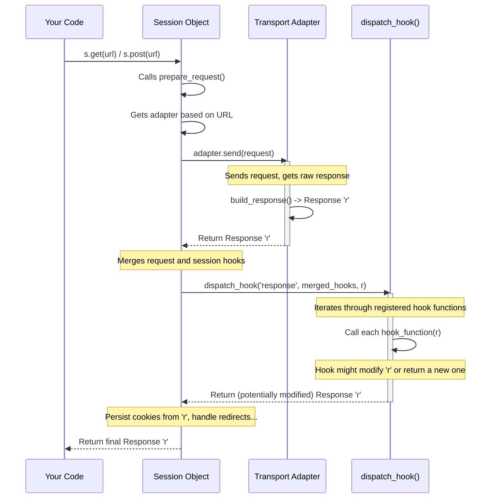

# Chapter 8: The Hook System - Setting Up Checkpoints

In [Chapter 7: Transport Adapters](07_transport_adapters.md), we saw how to customize the low-level details of *how* requests are sent and connections are managed, like setting custom retry strategies. Transport Adapters give you control over the delivery mechanism itself.

But what if you don't need to change *how* the request is sent, but instead want to simply **react** when something happens during the process? For example, maybe you want to log every single response your application receives, or perhaps automatically add a timestamp to every request header just before it goes out (though this specific header example isn't currently supported by the default hooks).

## The Problem: Reacting to Events

Imagine you're building an application that interacts with several different web services. For debugging or monitoring purposes, you want to keep a record of every response you get back – specifically, the URL you requested and the status code the server returned.

You could manually add `print()` statements after every single `requests.get()`, `s.post()`, etc., call throughout your code:

```python
# Manual logging (Repetitive!)
response1 = s.get('https://api.service1.com/data')
print(f"LOG: Got {response1.status_code} for {response1.url}")
# ... process response1 ...

response2 = s.post('https://api.service2.com/action', data={'key': 'value'})
print(f"LOG: Got {response2.status_code} for {response2.url}")
# ... process response2 ...

response3 = s.get('https://api.service1.com/status')
print(f"LOG: Got {response3.status_code} for {response3.url}")
# ... process response3 ...
```

This quickly becomes tedious and error-prone. If you forget to add the logging line, you miss that record. If you want to change the log format, you have to change it everywhere. Isn't there a way to tell `requests` to automatically run your logging code *every time* it gets a response?

## Meet the Hook System: Your Automated Checkpoints

Yes, there is! `Requests` provides a **Hook System** that lets you do just that.

Think of hooks like setting up **checkpoints** in the process of making a request and getting a response. When the process reaches a specific checkpoint, `requests` pauses briefly and calls any custom functions you've registered for that checkpoint.

**Analogy: Package Delivery Checkpoints** 📦

Imagine a package delivery process:
1.  Package picked up.
2.  Package arrives at sorting facility. -> **Checkpoint!** (Maybe run a function to scan the barcode).
3.  Package loaded onto delivery truck.
4.  Package delivered to recipient. -> **Checkpoint!** (Maybe run a function to get a signature).

The Hook System in `requests` works similarly. You can attach your own Python functions (called "hooks") to specific events (checkpoints).

Currently, the main event available is the **`response`** hook.
*   **`response` Hook:** This hook runs *after* a response has been received from the server and the basic `Response` object has been built, but *before* that `Response` object is returned to your code that called `requests.get()` or `s.post()`.

## Using the `response` Hook

Let's solve our logging problem using the `response` hook.

**Step 1: Define the Hook Function**

First, we need to write a Python function that will perform our logging action. This function needs to accept the `Response` object as its first argument. It can also accept optional keyword arguments (`**kwargs`), which `requests` might pass in (though for the `response` hook, the `Response` object is the main thing).

```python
# Our custom hook function for logging
def log_response_details(response, *args, **kwargs):
    """
    This function will be called after each response.
    It logs the request method, URL, and response status code.
    """
    # 'response' is the Response object just received
    request_method = response.request.method # Get the method from the original request
    url = response.url                     # Get the final URL
    status_code = response.status_code       # Get the status code

    print(f"HOOK LOG: Received {status_code} for {request_method} request to {url}")

    # IMPORTANT: Hooks usually shouldn't return anything (or return None).
    # If a hook returns a value, it REPLACES the data being processed.
    # For the 'response' hook, returning a value would replace the Response object!
    # Since we just want to log, we don't return anything.
```

**Explanation:**

*   The function `log_response_details` takes `response` as its first argument. This will be the `requests.Response` object.
*   It also accepts `*args` and `**kwargs` to be flexible, even though we don't use them here.
*   Inside the function, we access attributes of the `response` object (like `status_code`, `url`) and its associated request (`response.request.method`) to print our log message.
*   Crucially, this function *doesn't return anything*. If it did return a value, that value would replace the original `response` object for any further processing or for the final return value of `s.get()`.

**Step 2: Register the Hook**

Now we need to tell `requests` to actually *use* our `log_response_details` function. We can register hooks in two main ways:

1.  **On a `Session` Object:** If you register a hook on a [Session](03_session.md) object, it will be called for *every request* made using that session. This is perfect for our logging use case.
2.  **On a Single `Request`:** You can also attach hooks to an individual `Request` object before preparing it. This is less common but useful if you only want a hook to run for one specific request.

Let's register our hook on a `Session`:

```python
import requests

# (Paste the log_response_details function definition from above here)
def log_response_details(response, *args, **kwargs):
    request_method = response.request.method
    url = response.url
    status_code = response.status_code
    print(f"HOOK LOG: Received {status_code} for {request_method} request to {url}")

# Create a Session
s = requests.Session()

# Register the hook on the session
# Hooks are stored in a dictionary: session.hooks = {'event_name': [list_of_functions]}
# We add our function to the list for the 'response' event.
s.hooks['response'].append(log_response_details)

# Now, make some requests using the session
print("Making requests...")
response1 = s.get('https://httpbin.org/get')
print(f"  -> Main code received response 1 with status: {response1.status_code}")

response2 = s.post('https://httpbin.org/post', data={'id': '123'})
print(f"  -> Main code received response 2 with status: {response2.status_code}")

response3 = s.get('https://httpbin.org/status/404') # This will get a 404
print(f"  -> Main code received response 3 with status: {response3.status_code}")
```

**Expected Output:**

```
Making requests...
HOOK LOG: Received 200 for GET request to https://httpbin.org/get
  -> Main code received response 1 with status: 200
HOOK LOG: Received 200 for POST request to https://httpbin.org/post
  -> Main code received response 2 with status: 200
HOOK LOG: Received 404 for GET request to https://httpbin.org/status/404
  -> Main code received response 3 with status: 404
```

**Explanation:**

1.  `s = requests.Session()`: We created a session.
2.  `s.hooks['response'].append(log_response_details)`: This is the key step. `s.hooks` is a dictionary where keys are event names (like `'response'`) and values are lists of functions to call for that event. We appended our logging function to the list for the `'response'` event.
3.  When we called `s.get(...)` or `s.post(...)`, the following happened internally:
    *   The request was sent.
    *   The response was received.
    *   *Before* returning the response to our main code (`response1 = ...`), the `requests` Session checked its `hooks` dictionary for the `'response'` event.
    *   It found our `log_response_details` function and called it, passing the received `Response` object.
    *   Our hook function printed the log message.
    *   Since the hook returned `None`, the original `Response` object was then returned to our main code.
4.  Notice how the "HOOK LOG" lines appear *before* the "Main code received response" lines, demonstrating that the hook runs after receiving the response but before the calling code gets it.

**Modifying the Response (Advanced)**

While our logging hook didn't return anything, a hook *can* modify the `Response` object it receives, or even return a completely different `Response` object.

```python
def add_custom_header_hook(response, *args, **kwargs):
    """Adds a custom header to the received response."""
    print("HOOK: Adding X-Hook-Processed header...")
    response.headers['X-Hook-Processed'] = 'True'
    # We modified the response in-place, so we return None
    # to let requests continue using the modified response.
    return None

# Or, a hook that returns a *new* response (less common)
# def replace_response_hook(response, *args, **kwargs):
#     if response.status_code == 404:
#         print("HOOK: Replacing 404 response with a custom one!")
#         new_response = requests.Response()
#         new_response.status_code = 200
#         new_response.reason = "Found via Hook"
#         new_response._content = b"Content generated by hook!"
#         new_response.request = response.request # Keep original request link
#         return new_response # Return the NEW response
#     return None # Otherwise, keep the original response
```

**Caution:** Modifying or replacing responses within hooks can be powerful but also confusing if not done carefully. For beginners, using hooks for actions like logging or metrics that don't change the response is often the safest starting point.

## How It Works Internally

Where exactly does `requests` call these hooks? The `response` hook is triggered within the `Session.send()` method, after the underlying [Transport Adapter](07_transport_adapters.md) has returned a response, but before things like cookie persistence and redirect handling are fully completed for that specific response.

1.  **`Session.send()` Called:** Your code calls `s.get()` or `s.post()`, which eventually calls `Session.send()`.
2.  **Adapter Sends Request:** The session selects the appropriate [Transport Adapter](07_transport_adapters.md) (e.g., `HTTPAdapter`). The adapter sends the request and receives the raw response (`r = adapter.send(...)`).
3.  **Dispatch Hook:** Right after the adapter returns the `Response` object `r`, `Session.send()` calls `dispatch_hook("response", hooks, r, **kwargs)`. `hooks` here refers to the merged hooks from the `Request` and the `Session`.
4.  **`dispatch_hook()` Executes:** This helper function (from `requests.hooks`) looks up the list of functions registered for the `"response"` event. It iterates through this list, calling each hook function (like our `log_response_details`) one by one, passing the `Response` object (`r`) to it.
5.  **Hook Modifies/Replaces (Optional):** If a hook function returns a value, `dispatch_hook` updates `r` to be that new value. This allows hooks later in the list (or the main code) to see the modified response.
6.  **Further Processing:** After `dispatch_hook` returns the (potentially modified) `Response` object `r`, `Session.send()` continues with other tasks like extracting cookies from `r` into the session's jar and handling redirects (which might involve sending another request).
7.  **Return Response:** Finally, the `Response` object is returned to your original calling code.

Here's a simplified sequence diagram:



Let's look at the key code pieces:

```python
# File: requests/hooks.py (Simplified)

HOOKS = ["response"] # Currently, only 'response' is actively used

def default_hooks():
    # Creates the initial empty structure for hooks
    return {event: [] for event in HOOKS}

def dispatch_hook(key, hooks, hook_data, **kwargs):
    """Dispatches hooks for a given key event."""
    hooks = hooks or {} # Ensure hooks is a dict
    hooks = hooks.get(key) # Get the list of functions for this event key

    if hooks:
        # Allow a single callable or a list
        if hasattr(hooks, "__call__"):
            hooks = [hooks]
        # Call each registered hook function
        for hook in hooks:
            _hook_data = hook(hook_data, **kwargs) # Call the user's function
            if _hook_data is not None:
                # If the hook returned something, update the data
                hook_data = _hook_data
    return hook_data # Return the (potentially modified) data


# File: requests/sessions.py (Simplified view of Session.send)

from .hooks import dispatch_hook # Import the dispatcher

class Session:
    # ... (other methods: __init__, request, prepare_request, get_adapter) ...

    def send(self, request, **kwargs):
        # ... (setup: kwargs, get adapter) ...

        adapter = self.get_adapter(url=request.url)

        # === ADAPTER SENDS THE REQUEST ===
        r = adapter.send(request, **kwargs) # Gets the Response object 'r'

        # ... (calculate elapsed time) ...

        # === DISPATCH THE 'RESPONSE' HOOK ===
        # request.hooks contains merged hooks from Request and Session
        r = dispatch_hook("response", request.hooks, r, **kwargs)

        # === CONTINUE PROCESSING ===
        # Persist cookies from the (potentially modified) response 'r'
        extract_cookies_to_jar(self.cookies, request, r.raw)

        # Handle redirects if allowed (using the potentially modified 'r')
        if kwargs.get('allow_redirects', True):
            # ... redirect logic using self.resolve_redirects ...
            # This might modify 'r' further if redirects occur
            pass
        else:
            # ... store potential next request for non-redirected responses ...
            pass

        # ... (maybe consume content if stream=False) ...

        return r # Return the final Response object

# File: requests/models.py (Simplified view of PreparedRequest)
# Shows where hooks are stored initially

class RequestHooksMixin:
    # Mixin used by Request and PreparedRequest
    def register_hook(self, event, hook):
        # ... logic to add hook functions to self.hooks[event] list ...
        pass

class Request(RequestHooksMixin):
    def __init__(self, ..., hooks=None):
        # ...
        self.hooks = default_hooks() # Initialize hooks dict
        if hooks:
            for k, v in list(hooks.items()):
                self.register_hook(event=k, hook=v) # Register hooks passed in
        # ...

class PreparedRequest(..., RequestHooksMixin):
    def __init__(self):
        # ...
        self.hooks = default_hooks() # Hooks are also on PreparedRequest
        # ...

    def prepare_hooks(self, hooks):
        # Called during prepare() to merge hooks from the original Request
        hooks = hooks or []
        for event in hooks:
            self.register_hook(event, hooks[event])

# Note: Session.prepare_request merges Request hooks and Session hooks
#       into the PreparedRequest.hooks dictionary.
```

The `dispatch_hook` function is the core mechanism that allows `requests` to call your custom functions at the designated `"response"` checkpoint within `Session.send`.

## Conclusion

You've learned about the **Hook System** in `requests`, a way to register custom callback functions that run at specific points in the request-response lifecycle.

*   You understood the motivation: automating actions like logging without cluttering your main code.
*   You focused on the primary hook: **`response`**, which runs after a response is received but before it's returned to the caller.
*   You saw how to define a hook function (accepting the `response` object) and register it on a `Session` (using `session.hooks`) to apply it globally, or potentially on a single `Request`.
*   You implemented a practical example: logging response details automatically.
*   You got a glimpse into how hooks *can* modify responses (use with care!).
*   You learned that internally, the `dispatch_hook` function is called by `Session.send` to execute your registered hook functions.

The Hook System provides a clean way to plug into the `requests` workflow and add custom behavior or monitoring without modifying the library itself.

This concludes our journey through the core abstractions of the `requests` library! From the simple [Functional API](01_functional_api.md) to the powerful [Session](03_session.md) object, managing [Cookies](04_cookie_jar.md), handling [Authentication](05_authentication_handlers.md), dealing with [Exceptions](06_exception_hierarchy.md), customizing connections with [Transport Adapters](07_transport_adapters.md), and reacting to events with the Hook System, you now have a solid foundation for using `requests` effectively in your Python projects. Happy requesting!

---

Generated by [AI Codebase Knowledge Builder](https://github.com/The-Pocket/Tutorial-Codebase-Knowledge)