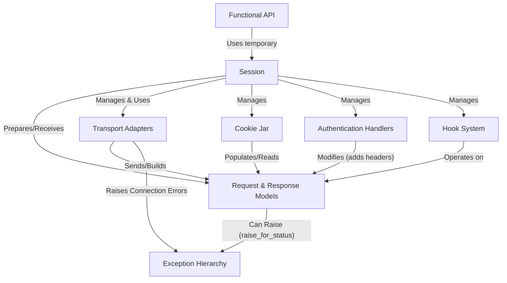

# Tutorial: Requests

> This tutorial is AI-generated! To learn more, check out [AI Codebase Knowledge Builder](https://github.com/The-Pocket/Tutorial-Codebase-Knowledge)

Requests[View Repo](https://github.com/psf/requests/tree/0e322af87745eff34caffe4df68456ebc20d9068/src/requests) is a Python library that makes sending *HTTP requests* incredibly simple.
Instead of dealing with complex details, you can use straightforward functions (like `requests.get()`) or **Session objects** to interact with web services.
It automatically handles things like *cookies*, *redirects*, *authentication*, and connection pooling, returning easy-to-use **Response objects** with all the server's data.

