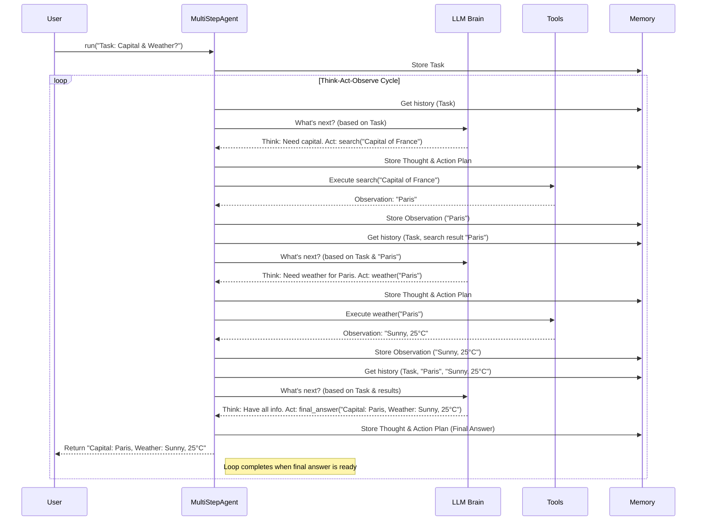

# Chapter 1: The MultiStepAgent - Your Task Orchestrator

Welcome to the SmolaAgents library! If you're looking to build smart AI agents that can tackle complex problems, you're in the right place.

Imagine you have a complex task, like "Research the pros and cons of electric cars and write a short summary." A single request to a simple AI might not be enough. It needs to search the web, read different articles, synthesize the information, and then write the summary. How does an AI manage such a multi-step process?

This is where the `MultiStepAgent` comes in! Think of it as the **project manager** for your AI task. It doesn't do all the work itself, but it directs the process, decides what needs to happen next, uses specialized helpers (called "Tools"), and keeps track of everything until the task is done.

## The Core Idea: Think, Act, Observe

The `MultiStepAgent` works by following a cycle, much like how humans solve problems. This cycle is often called **ReAct** (Reasoning and Acting):

1.  **Think (Reason):** The agent looks at the main goal (the task) and where it currently is in the process. Based on this, it thinks about what the *very next step* should be to get closer to the goal. Should it search for information? Should it perform a calculation? Should it write something down?
2.  **Act:** The agent performs the action it decided on. This usually involves using a specific **[Tool](03_tool.md)** (like a web search tool, a calculator, or a code execution tool) or generating text/code.
3.  **Observe:** The agent looks at the result of its action. What did the web search return? What was the output of the code? This new information ("observation") helps it decide what to do in the next "Think" phase.

The agent repeats this **Think -> Act -> Observe** cycle over and over, step-by-step, until it believes it has fully completed the task and has a final answer.

## How It Works: Coordinating the Team

The `MultiStepAgent` doesn't work in isolation. It coordinates several key components:

1.  **The Language Model (LLM):** This is the "brain" of the operation. The agent consults the LLM during the "Think" phase. It sends the current task, the history of actions and observations, and asks the LLM, "What should I do next?". We'll explore this more in [Chapter 2: Model Interface](02_model_interface.md).
2.  **Tools:** These are specialized functions the agent can use to perform actions. Examples include searching the web, running Python code, fetching weather information, or even generating images. The agent chooses which tool to use (if any) during the "Act" phase based on the LLM's suggestion. Learn all about them in [Chapter 3: Tool](03_tool.md).
3.  **Memory:** This is like the agent's notepad. It keeps track of the original task, the plan (if any), every action taken, and every observation received. This history is crucial for the agent (and the LLM) to understand the progress and decide the next steps. We'll dive into this in [Chapter 4: AgentMemory](04_agentmemory.md).

## A Simple Example: Getting the Capital and Weather

Let's revisit our simple task: **"What is the capital of France, and what is its current weather?"**

Here's how a `MultiStepAgent`, equipped with a `search` tool and a `weather` tool, might handle it:

1.  **Step 1 (Think):** The agent sees the task. It realizes it needs two pieces of information: the capital and the weather *for* that capital. First, it needs the capital.
2.  **Step 1 (Act):** It decides to use the `search` tool with the query "Capital of France".
3.  **Step 1 (Observe):** The `search` tool returns "Paris". The agent stores "Capital is Paris" in its [Memory](04_agentmemory.md).
4.  **Step 2 (Think):** The agent checks its memory. It has the capital (Paris) but still needs the weather.
5.  **Step 2 (Act):** It decides to use the `weather` tool with the location "Paris".
6.  **Step 2 (Observe):** The `weather` tool returns something like "Sunny, 25°C". The agent stores this observation in its [Memory](04_agentmemory.md).
7.  **Step 3 (Think):** The agent reviews its memory. It now has both the capital ("Paris") and the weather ("Sunny, 25°C"). It has all the information needed to answer the original task.
8.  **Step 3 (Act):** It decides it's finished and uses a special built-in tool called `final_answer` to provide the complete result.
9.  **Step 3 (Observe):** The `final_answer` tool packages the result, like "The capital of France is Paris, and the current weather there is Sunny, 25°C." The cycle ends.

## Let's See Some Code (Basic Setup)

Okay, enough theory! How does this look in code? Setting up a basic `MultiStepAgent` involves giving it its "brain" (the model) and its "helpers" (the tools).

```python
# --- File: basic_agent.py ---
# Import necessary components (we'll explain these more in later chapters!)
from smolagents import MultiStepAgent
from smolagents.models import LiteLLMModel # A simple way to use various LLMs
from smolagents.tools import SearchTool, WeatherTool # Example Tools

# 1. Define the tools the agent can use
# These are like specialized workers the agent can call upon.
search_tool = SearchTool()   # A tool to search the web (details in Chapter 3)
weather_tool = WeatherTool() # A tool to get weather info (details in Chapter 3)
# Note: Real tools might need API keys or setup!

# 2. Choose a language model (the "brain")
# We'll use LiteLLMModel here, connecting to a capable model.
# Make sure you have 'litellm' installed: pip install litellm
llm = LiteLLMModel(model_id="gpt-3.5-turbo") # Needs an API key set up
# We'll cover models properly in Chapter 2

# 3. Create the MultiStepAgent instance
# We pass the brain (llm) and the helpers (tools)
agent = MultiStepAgent(
    model=llm,
    tools=[search_tool, weather_tool]
    # By default, a 'final_answer' tool is always added.
)

print("Agent created!")

# 4. Give the agent a task!
task = "What is the capital of France, and what is its current weather?"
print(f"Running agent with task: '{task}'")

# The agent will now start its Think-Act-Observe cycle...
final_answer = agent.run(task)

# ... and eventually return the final result.
print("-" * 20)
print(f"Final Answer received: {final_answer}")
```

**Explanation:**

1.  **Import:** We bring in `MultiStepAgent` and placeholders for a model and tools.
2.  **Tools:** We create instances of the tools our agent might need (`SearchTool`, `WeatherTool`). How tools work is covered in [Chapter 3: Tool](03_tool.md).
3.  **Model:** We set up the language model (`LiteLLMModel`) that will power the agent's thinking. More on models in [Chapter 2: Model Interface](02_model_interface.md).
4.  **Agent Creation:** We initialize `MultiStepAgent`, telling it which `model` to use for thinking and which `tools` are available for acting.
5.  **Run Task:** We call the `agent.run()` method with our specific `task`. This kicks off the Think-Act-Observe cycle.
6.  **Output:** The `run` method continues executing steps until the `final_answer` tool is called or a limit is reached. It then returns the content provided to `final_answer`.

*(Note: Running the code above requires setting up API keys for the chosen LLM and potentially the tools).*

## Under the Hood: The `run` Process

When you call `agent.run(task)`, a sequence of internal steps takes place:

1.  **Initialization:** The agent receives the `task` and stores it in its [AgentMemory](04_agentmemory.md). The step counter is reset.
2.  **Loop:** The agent enters the main Think-Act-Observe loop. This loop continues until a final answer is produced or the maximum number of steps (`max_steps`) is reached.
3.  **Prepare Input:** Inside the loop, the agent gathers its history (task, previous actions, observations) from [AgentMemory](04_agentmemory.md) using `write_memory_to_messages`.
4.  **Think (Call Model):** It sends this history to the [Model](02_model_interface.md) (e.g., `self.model(messages)`), asking for the next action (which tool to call and with what arguments, or if it should use `final_answer`).
5.  **Store Thought:** The model's response (the thought process and the intended action) is recorded in the current step's data within [AgentMemory](04_agentmemory.md).
6.  **Act (Execute Tool/Code):**
    *   The agent parses the model's response to identify the action (e.g., call `search` with "Capital of France").
    *   If it's a [Tool](03_tool.md) call, it executes the tool (e.g., `search_tool("Capital of France")`).
    *   If it's the `final_answer` tool, it prepares to exit the loop.
    *   *(Note: Different agent types handle this 'Act' phase differently. We'll see this in [Chapter 7: AgentType](07_agenttype.md). For instance, a `CodeAgent` generates and runs code here.)*
7.  **Observe (Get Result):** The result from the tool execution (or code execution) is captured as the "observation".
8.  **Store Observation:** This observation (e.g., "Paris") is recorded in the current step's data in [AgentMemory](04_agentmemory.md).
9.  **Repeat:** The loop goes back to step 3, using the new observation as part of the history for the next "Think" phase.
10. **Finish:** Once the `final_answer` tool is called, the loop breaks, and the value passed to `final_answer` is returned by the `run` method. If `max_steps` is reached without a final answer, an error or a fallback answer might occur.

Here's a simplified diagram showing the flow:



## Diving Deeper (Code References)

Let's peek at some relevant code snippets from `agents.py` to see how this is implemented (simplified for clarity):

*   **Initialization (`__init__`)**: Stores the essential components.
    ```python
    # --- File: agents.py (Simplified __init__) ---
    class MultiStepAgent:
        def __init__(
            self,
            tools: List[Tool], # List of available tools
            model: Callable,    # The language model function
            max_steps: int = 20, # Max cycles allowed
            # ... other parameters like memory, prompts, etc.
        ):
            self.model = model
            self.tools = {tool.name: tool for tool in tools}
            # Add the essential final_answer tool
            self.tools.setdefault("final_answer", FinalAnswerTool())
            self.max_steps = max_steps
            self.memory = AgentMemory(...) # Initialize memory
            # ... setup logging, etc.
    ```

*   **Starting the process (`run`)**: Sets up the task and calls the internal loop.
    ```python
    # --- File: agents.py (Simplified run) ---
    class MultiStepAgent:
        def run(self, task: str, ...):
            self.task = task
            # ... maybe handle additional arguments ...

            # Reset memory if needed
            self.memory.reset()
            self.memory.steps.append(TaskStep(task=self.task)) # Record the task

            # Start the internal execution loop
            # The deque gets the *last* item yielded, which is the final answer
            return deque(self._run(task=self.task, max_steps=self.max_steps), maxlen=1)[0].final_answer
    ```

*   **The Core Loop (`_run`)**: Implements the Think-Act-Observe cycle.
    ```python
    # --- File: agents.py (Simplified _run) ---
    class MultiStepAgent:
        def _run(self, task: str, max_steps: int, ...) -> Generator:
            final_answer = None
            self.step_number = 1
            while final_answer is None and self.step_number <= max_steps:
                action_step = self._create_action_step(...) # Prepare memory for this step

                try:
                    # This is where the agent type decides how to act
                    # (e.g., call LLM, parse, execute tool/code)
                    final_answer = self._execute_step(task, action_step)
                except AgentError as e:
                    action_step.error = e # Record errors
                finally:
                    self._finalize_step(action_step, ...) # Record timing, etc.
                    self.memory.steps.append(action_step) # Save step to memory
                    yield action_step # Yield step details (for streaming)
                    self.step_number += 1

            if final_answer is None:
                # Handle reaching max steps
                ...
            yield FinalAnswerStep(handle_agent_output_types(final_answer)) # Yield final answer
    ```

*   **Executing a Step (`_execute_step`)**: This calls the `step` method which specific agent types (like `CodeAgent` or `ToolCallingAgent`) implement differently.
    ```python
    # --- File: agents.py (Simplified _execute_step) ---
    class MultiStepAgent:
        def _execute_step(self, task: str, memory_step: ActionStep) -> Union[None, Any]:
            # Calls the specific logic for the agent type
            # This method will interact with the model, tools, memory
            final_answer = self.step(memory_step)
            # ... (optional checks on final answer) ...
            return final_answer

        # step() is implemented by subclasses like CodeAgent or ToolCallingAgent
        def step(self, memory_step: ActionStep) -> Union[None, Any]:
            raise NotImplementedError("Subclasses must implement the step method.")
    ```

These snippets show how `MultiStepAgent` orchestrates the process, relying on its `model`, `tools`, and `memory`, and delegating the specific "how-to-act" logic to subclasses via the `step` method (more on this in [Chapter 7: AgentType](07_agenttype.md)).

## Conclusion

The `MultiStepAgent` is the heart of the SmolaAgents library. It provides the framework for agents to tackle complex tasks by breaking them down into a **Think -> Act -> Observe** cycle. It acts as the central coordinator, managing interactions between the language model (the brain), the tools (the specialized helpers), and the memory (the notepad).

You've learned:

*   Why `MultiStepAgent` is needed for tasks requiring multiple steps.
*   The core ReAct cycle: Think, Act, Observe.
*   How it coordinates the Model, Tools, and Memory.
*   Seen a basic code example of setting up and running an agent.
*   Gotten a glimpse into the internal `run` process.

Now that we understand the orchestrator, let's move on to understand the "brain" it relies on.

**Next Chapter:** [Chapter 2: Model Interface](02_model_interface.md) - Connecting Your Agent to an LLM Brain.

---

Generated by [AI Codebase Knowledge Builder](https://github.com/The-Pocket/Tutorial-Codebase-Knowledge)
