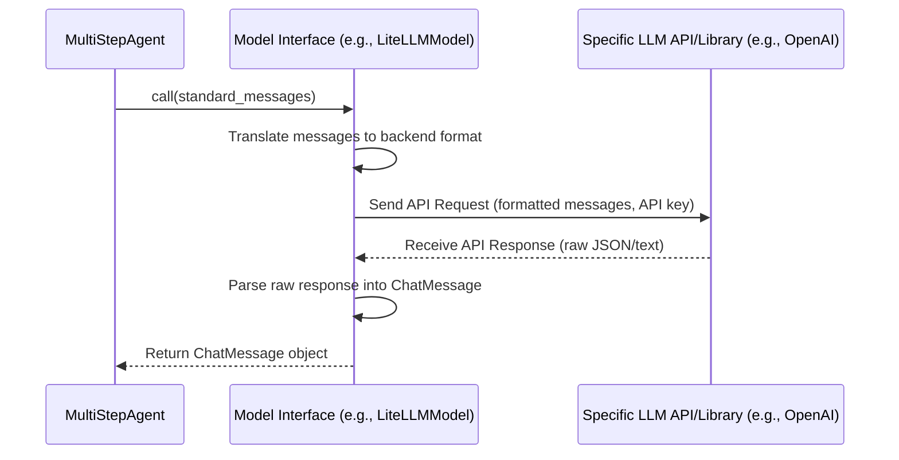

# Chapter 2: Model Interface - Your Agent's Universal Translator

Welcome back! In [Chapter 1: The MultiStepAgent - Your Task Orchestrator](01_multistepagent.md), we met the `MultiStepAgent`, our AI project manager. We learned that it follows a "Think -> Act -> Observe" cycle to solve tasks. A crucial part of the "Think" phase is consulting its "brain" – a Large Language Model (LLM).

But wait... there are so many different LLMs out there! OpenAI's GPT-4, Anthropic's Claude, Google's Gemini, open-source models you can run locally like Llama or Mistral... How can our agent talk to all of them without needing completely different code for each one?

This is where the **Model Interface** comes in!

## The Problem: Too Many Remotes!

Imagine you have several TVs at home, each from a different brand (Sony, Samsung, LG). Each TV comes with its own specific remote control. To watch TV, you need to find the *right* remote and know *its specific buttons*. It's a hassle!

  

Different LLMs are like those different TVs. Each has its own way of being "controlled" – its own API (Application Programming Interface) or library with specific functions, required inputs, and ways of giving back answers. If our `MultiStepAgent` had to learn the specific "remote control commands" for every possible LLM, our code would become very complicated very quickly!

## The Solution: The Universal Remote (Model Interface)

Wouldn't it be great if you had *one* universal remote that could control *all* your TVs? You'd just press "Power", "Volume Up", or "Channel Down", and the universal remote would figure out how to send the correct signal to whichever TV you're using.

  -> Controls ->   

The **Model Interface** in `SmolaAgents` is exactly like that universal remote.

*   It's an **abstraction layer**: a way to hide the complicated details.
*   It provides a **consistent way** for the `MultiStepAgent` to talk to *any* supported LLM.
*   It handles the "translation" behind the scenes:
    *   Taking the agent's request (like "What should I do next?").
    *   Formatting it correctly for the specific LLM being used.
    *   Sending the request (making the API call or running the local model).
    *   Receiving the LLM's raw response.
    *   Parsing that response back into a standard format the agent understands (including things like requests to use [Tools](03_tool.md)).

So, the `MultiStepAgent` only needs to learn how to use the *one* universal remote (the Model Interface), not the specific commands for every LLM "TV".

## How It Works: The Standard `__call__`

The magic of the Model Interface lies in its simplicity from the agent's perspective. All Model Interfaces in `SmolaAgents` work the same way: you "call" them like a function, passing in the conversation history.

Think of it like pressing the main button on our universal remote.

1.  **Input:** The agent gives the Model Interface a list of messages representing the conversation so far. This usually includes the system prompt (instructions for the LLM), the user's task, and any previous "Think -> Act -> Observe" steps stored in [AgentMemory](04_agentmemory.md). Each message typically has a `role` (like `user`, `assistant`, or `system`) and `content`.
2.  **Processing (Behind the Scenes):** The *specific* Model Interface (e.g., one for OpenAI, one for local models) takes this standard list of messages and:
    *   Connects to the correct LLM (using API keys, loading a local model, etc.).
    *   Formats the messages exactly how that LLM expects them.
    *   Sends the request.
    *   Waits for the LLM to generate a response.
    *   Gets the response back.
3.  **Output:** It translates the LLM's raw response back into a standard `ChatMessage` object. This object contains the LLM's text response and, importantly, might include structured information if the LLM decided the agent should use a [Tool](03_tool.md). The agent knows exactly how to read this `ChatMessage`.

## Using a Model Interface

Let's see how you'd actually *use* one. `SmolaAgents` comes with several built-in Model Interfaces. A very useful one is `LiteLLMModel`, which uses the `litellm` library to connect to hundreds of different LLM providers (OpenAI, Anthropic, Cohere, Azure, local models via Ollama, etc.) with minimal code changes!

**Step 1: Choose and Initialize Your Model Interface**

First, you decide which LLM you want your agent to use. Then, you create an instance of the corresponding Model Interface.

```python
# --- File: choose_model.py ---
# Import the model interface you want to use
from smolagents.models import LiteLLMModel
# (You might need to install litellm first: pip install smolagents[litellm])

# Choose the specific LLM model ID that litellm supports
# Example: OpenAI's GPT-3.5 Turbo
# Requires setting the OPENAI_API_KEY environment variable!
model_id = "gpt-3.5-turbo"

# Create an instance of the Model Interface
# This object is our "universal remote" configured for GPT-3.5
llm = LiteLLMModel(model_id=model_id)

print(f"Model Interface created for: {model_id}")
# Example Output: Model Interface created for: gpt-3.5-turbo
```

**Explanation:**
*   We import `LiteLLMModel`.
*   We specify the `model_id` we want to use (here, `"gpt-3.5-turbo"`). `litellm` knows how to talk to this model if the necessary API key (`OPENAI_API_KEY`) is available in your environment.
*   We create the `llm` object. This object now knows how to communicate with GPT-3.5 Turbo via the `litellm` library, but it presents a standard interface to the rest of our code.

**Step 2: Give the Model to the Agent**

Remember from Chapter 1 how we created the `MultiStepAgent`? We simply pass our `llm` object (the configured universal remote) to it.

```python
# --- Continued from choose_model.py ---
# (Requires imports from Chapter 1: MultiStepAgent, SearchTool, etc.)
from smolagents import MultiStepAgent
from smolagents.tools import SearchTool # Example Tool

# Define some tools (details in Chapter 3)
search_tool = SearchTool()
tools = [search_tool]

# Create the agent, giving it the model interface instance
agent = MultiStepAgent(
    model=llm,  # <= Here's where we plug in our "universal remote"!
    tools=tools
)

print("MultiStepAgent created and configured with the model!")
# Example Output: MultiStepAgent created and configured with the model!
```

**Explanation:**
*   The `MultiStepAgent` doesn't need to know it's talking to GPT-3.5 Turbo specifically. It just knows it has a `model` object that it can call.

**Step 3: How the Agent Uses the Model (Simplified)**

Inside its "Think" phase, the agent prepares the conversation history and calls the model:

```python
# --- Simplified view of what happens inside the agent ---
from smolagents.models import ChatMessage, MessageRole

# Agent prepares messages (example)
messages_for_llm = [
    {"role": MessageRole.SYSTEM, "content": "You are a helpful agent. Decide the next step."},
    {"role": MessageRole.USER, "content": "Task: What is the capital of France?"},
    # ... potentially previous steps ...
]

# Agent calls the model using the standard interface
# This is like pressing the main button on the universal remote
print("Agent asking model: What should I do next?")
response: ChatMessage = agent.model(messages_for_llm) # agent.model refers to our 'llm' instance

# Agent gets a standard response back
print(f"Model suggested action (simplified): {response.content}")
# Example Output (will vary):
# Agent asking model: What should I do next?
# Model suggested action (simplified): Thought: I need to find the capital of France. I can use the search tool.
# Action:
# ```json
# {
#  "action": "search",
#  "action_input": "Capital of France"
# }
# ```
```

**Explanation:**
*   The agent prepares a list of `messages_for_llm`.
*   It simply calls `agent.model(...)` which executes `llm(messages_for_llm)`.
*   The `LiteLLMModel` (`llm`) handles talking to the actual OpenAI API.
*   The agent receives a `ChatMessage` object, which it knows how to parse to find the next action (like using the `search` tool, as suggested in the example output).

## Under the Hood: How the "Universal Remote" Works

Let's peek behind the curtain. What happens when the agent calls `model(messages)`?

**Conceptual Steps:**

1.  **Receive Request:** The specific Model Interface (e.g., `LiteLLMModel`) gets the standard list of messages from the agent.
2.  **Prepare Backend Request:** It looks at its own configuration (e.g., `model_id="gpt-3.5-turbo"`, API key) and translates the standard messages into the specific format the target LLM backend (e.g., the OpenAI API) requires. This might involve changing role names, structuring the data differently, etc.
3.  **Send to Backend:** It makes the actual network call to the LLM's API endpoint or runs the command to invoke a local model.
4.  **Receive Backend Response:** It gets the raw response back from the LLM (often as JSON or plain text).
5.  **Parse Response:** It parses this raw response, extracting the generated text and any structured data (like tool calls).
6.  **Return Standard Response:** It packages this information into a standard `ChatMessage` object and returns it to the agent.

**Diagram:**

Here's a simplified sequence diagram showing the flow:



**Code Glimpse (Simplified):**

Let's look at `models.py` where these interfaces are defined.

*   **Base Class (`Model`):** Defines the common structure, including the `__call__` method that all specific interfaces must implement.
    ```python
    # --- File: models.py (Simplified Model base class) ---
    from typing import List, Dict, Optional
    from .tools import Tool # Reference to Tool concept

    @dataclass
    class ChatMessage: # Simplified representation of the standard response
        role: str
        content: Optional[str] = None
        tool_calls: Optional[List[dict]] = None # For tool usage (Chapter 3)
        # ... other fields ...

    class Model:
        def __init__(self, **kwargs):
            self.kwargs = kwargs # Stores model-specific settings
            # ...

        # The standard "button" our agent presses!
        def __call__(
            self,
            messages: List[Dict[str, str]],
            stop_sequences: Optional[List[str]] = None,
            tools_to_call_from: Optional[List[Tool]] = None,
            **kwargs,
        ) -> ChatMessage:
            # Each specific model interface implements this method
            raise NotImplementedError("Subclasses must implement the __call__ method.")

        def _prepare_completion_kwargs(self, messages, **kwargs) -> Dict:
            # Helper to format messages and parameters for the backend
            # ... translation logic ...
            pass
    ```

*   **Specific Implementation (`LiteLLMModel`):** Inherits from `Model` and implements `__call__` using the `litellm` library.
    ```python
    # --- File: models.py (Simplified LiteLLMModel __call__) ---
    import litellm # The library that talks to many LLMs

    class LiteLLMModel(Model):
        def __init__(self, model_id: str, **kwargs):
            super().__init__(**kwargs)
            self.model_id = model_id
            # LiteLLM typically uses environment variables for API keys

        def __call__(
            self,
            messages: List[Dict[str, str]],
            stop_sequences: Optional[List[str]] = None,
            tools_to_call_from: Optional[List[Tool]] = None,
            **kwargs,
        ) -> ChatMessage:
            # 1. Prepare arguments using the helper
            completion_kwargs = self._prepare_completion_kwargs(
                messages=messages,
                stop_sequences=stop_sequences,
                tools_to_call_from=tools_to_call_from,
                model=self.model_id, # Tell litellm which model
                # ... other parameters ...
                **kwargs,
            )

            # 2. Call the actual backend via litellm
            # This hides the complexity of different API calls!
            response = litellm.completion(**completion_kwargs)

            # 3. Parse the response into our standard ChatMessage
            # (Simplified - actual parsing involves more details)
            raw_message = response.choices[0].message
            chat_message = ChatMessage(
                role=raw_message.role,
                content=raw_message.content,
                tool_calls=raw_message.tool_calls # If the LLM requested a tool
            )
            # ... store token counts, raw response etc. ...
            return chat_message
    ```

**Explanation:**
*   The `Model` class defines the contract (the `__call__` method).
*   `LiteLLMModel` fulfills this contract. Its `__call__` method uses `_prepare_completion_kwargs` to format the request suitable for `litellm`.
*   The core work happens in `litellm.completion(...)`, which connects to the actual LLM service (like OpenAI).
*   The result is then parsed back into the standard `ChatMessage` format.

The beauty is that the `MultiStepAgent` only ever interacts with the `__call__` method, regardless of whether it's using `LiteLLMModel`, `TransformersModel` (for local models), or another interface.

## Conclusion

The Model Interface is a vital piece of the `SmolaAgents` puzzle. It acts as a universal translator or remote control, allowing your `MultiStepAgent` to seamlessly communicate with a wide variety of Large Language Models without getting bogged down in the specific details of each one.

You've learned:

*   Why a Model Interface is needed to handle diverse LLMs.
*   The "universal remote" analogy.
*   How the standard `__call__` method provides a consistent way for the agent to interact with the model.
*   How to choose, initialize, and provide a Model Interface (`LiteLLMModel` example) to your `MultiStepAgent`.
*   A glimpse into the internal process: translating requests, calling the backend LLM, and parsing responses.

Now that our agent has a brain (`MultiStepAgent`) and a way to talk to it (`Model Interface`), how does it actually *do* things based on the LLM's suggestions? How does it search the web, run code, or perform other actions? That's where our next component comes in!

**Next Chapter:** [Chapter 3: Tool](03_tool.md) - Giving Your Agent Capabilities.

---

Generated by [AI Codebase Knowledge Builder](https://github.com/The-Pocket/Tutorial-Codebase-Knowledge)