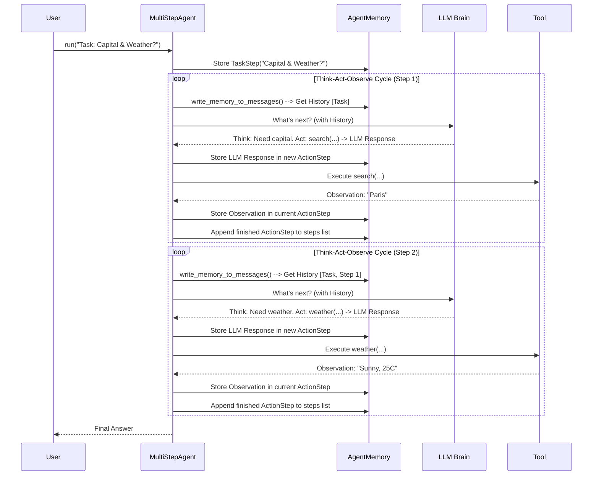

# Chapter 4: AgentMemory - The Agent's Notepad

Welcome back! In [Chapter 3: Tool](03_tool.md), we equipped our agent with "superpowers" – tools like web search or calculators that let it interact with the world and perform actions. We saw how the agent's "brain" (the LLM) decides which tool to use, and the agent executes it.

But wait... how does the agent remember what it has already done? If it searches for the capital of France in Step 1, how does it remember "Paris" when deciding what to do in Step 2 (like finding the weather in Paris)?

This is where **AgentMemory** comes in. Think of it as the agent's dedicated notepad or, even better, a **ship's logbook**.

## The Problem: An Agent with Amnesia

Imagine a captain sailing a ship on a long voyage. After each hour, they completely forget everything that happened before – the course they set, the islands they passed, the storms they weathered. How could they possibly reach their destination? They'd be lost!

 ❓ "Where am I? What was I doing?"

An agent without memory is like that forgetful captain. It might perform a single action correctly, but it wouldn't understand the context. It wouldn't know:

*   What the original goal (task) was.
*   What steps it has already taken.
*   What results (observations) it got from those steps.
*   What errors it might have encountered.

Without this history, the agent can't make informed decisions about what to do next. It can't build upon previous results or learn from mistakes within the same task.

## The Solution: The Ship's Logbook (`AgentMemory`)

The `AgentMemory` is the component that solves this problem. It automatically records every significant event during the agent's "voyage" (its execution run).

 📜 "Log Entry: Searched 'Capital of France'. Result: 'Paris'."

Just like a ship's logbook helps the captain navigate, the `AgentMemory` helps the agent maintain context and proceed effectively.

## What Does the `AgentMemory` Store?

The `AgentMemory` keeps a chronological record of the agent's journey. For each run, it typically stores:

1.  **System Prompt:** The initial instructions given to the agent's LLM brain (we'll see more in [Chapter 5: PromptTemplates](05_prompttemplates.md)).
2.  **Initial Task:** The main goal the user gave the agent (e.g., "What is the capital of France, and what is its current weather?").
3.  **Steps:** A list detailing each cycle of the agent's operation:
    *   **Planning (Optional):** If the agent makes plans, the plan itself is recorded.
    *   **Thinking:** The LLM's reasoning process and the action it decided to take (e.g., "Thought: I need the capital. Action: Use `search` tool").
    *   **Action:** The specific [Tool](03_tool.md) called and the arguments used (e.g., `search("Capital of France")`). This could also be code execution for code-based agents.
    *   **Observation:** The result received after performing the action (e.g., "Paris").
    *   **Errors:** If something went wrong during the step (e.g., a tool failed), the error is noted.

This detailed history allows the agent (specifically, the LLM guiding it) to look back at any point and understand the full context before deciding the next move.

## How is `AgentMemory` Used? (Mostly Automatic!)

The good news is that you, as the user, usually don't need to interact directly with `AgentMemory`. The `MultiStepAgent` manages it automatically behind the scenes!

Here's the key interaction:

1.  **Before "Thinking":** When the agent needs to decide the next step (the "Think" phase), the `MultiStepAgent` asks the `AgentMemory` to format the recorded history (task, previous actions, observations, errors) into a sequence of messages. This happens via a method often called `write_memory_to_messages`.
2.  **Consulting the Brain:** This formatted history is sent to the LLM via the [Model Interface](02_model_interface.md). This gives the LLM the full context it needs to provide a sensible next step. ("Okay, based on the task 'Capital and Weather', and the fact we just found 'Paris', what should we do now?").
3.  **After "Acting" and "Observing":** Once the agent performs an action and gets an observation (or an error), the `MultiStepAgent` records this new information as a new step in the `AgentMemory`.

So, the memory is constantly being read from (to inform the LLM) and written to (to record new events).

## Example Revisited: Capital and Weather Logbook

Let's trace our "Capital of France and Weather" example from [Chapter 1: MultiStepAgent](01_multistepagent.md) and see what the `AgentMemory` logbook might look like (simplified):

**(Start of Run)**

1.  **System Prompt:** Recorded (e.g., "You are a helpful assistant...")
2.  **Task:** Recorded (`task: "What is the capital of France, and what is its current weather?"`)

**(Step 1)**

3.  **Think/Action:** Recorded (`thought: "Need capital.", action: search("Capital of France")`)
4.  **Observation:** Recorded (`observation: "Paris"`)

**(Step 2)**

5.  **Think/Action:** Recorded (`thought: "Have capital (Paris), need weather.", action: weather("Paris")`)
6.  **Observation:** Recorded (`observation: "Sunny, 25°C"`)

**(Step 3)**

7.  **Think/Action:** Recorded (`thought: "Have capital and weather. Task complete.", action: final_answer("The capital of France is Paris, and the current weather there is Sunny, 25°C.")`)
8.  **Observation:** Recorded (Result of `final_answer` is the final output).

**(End of Run)**

Now, before Step 2 started, the agent would read entries 1-4 from memory to give context to the LLM. Before Step 3, it would read entries 1-6. This prevents the agent from forgetting what it's doing!

## Under the Hood: Memory Structure

How does `SmolaAgents` actually implement this?

**Core Idea:** The `AgentMemory` object holds a list called `steps`. Each item in this list represents one distinct event or phase in the agent's run. These items are usually instances of specific "Step" classes.

**Key Step Types (Simplified from `memory.py`):**

*   `SystemPromptStep`: Stores the initial system prompt text.
*   `TaskStep`: Stores the user's task description (and potentially input images).
*   `PlanningStep` (Optional): Stores any explicit plans the agent generates.
*   `ActionStep`: This is the most common one, recording a single Think-Act-Observe cycle. It contains fields for:
    *   `step_number`
    *   `model_input_messages`: What was sent to the LLM for thinking.
    *   `model_output_message`: The LLM's raw response (thought + action plan).
    *   `tool_calls`: Which [Tool](03_tool.md) was called (name, arguments). Stored as `ToolCall` objects.
    *   `observations`: The result returned by the tool.
    *   `error`: Any error that occurred.
    *   `start_time`, `end_time`, `duration`: Timing information.
*   `FinalAnswerStep`: A special step indicating the final result returned by the agent.

**Interaction Flow:**

Here's how the `MultiStepAgent` uses `AgentMemory`:



**Code Glimpse (Simplified):**

Let's look at some relevant pieces from `memory.py` and `agents.py`.

*   **Memory Step Dataclasses (`memory.py`):** Define the structure of log entries.

    ```python
    # --- File: memory.py (Simplified Step Structures) ---
    from dataclasses import dataclass
    from typing import List, Any, Dict

    @dataclass
    class ToolCall: # Represents a tool invocation request
        name: str
        arguments: Any
        id: str # Unique ID for matching responses

    @dataclass
    class MemoryStep: # Base class for all memory entries
        def to_messages(self, **kwargs) -> List[Dict[str, Any]]:
            # Each step type knows how to format itself for the LLM
            raise NotImplementedError

    @dataclass
    class TaskStep(MemoryStep):
        task: str
        # ... (potentially images)
        def to_messages(self, **kwargs) -> List[Dict[str, Any]]:
            # Format: {"role": "user", "content": [{"type": "text", "text": "New task: ..."}]}
            # ... simplified ...
            return [{"role": "user", "content": f"New task:\n{self.task}"}]

    @dataclass
    class ActionStep(MemoryStep):
        step_number: int
        # model_input_messages: List = None # What was sent to LLM
        model_output: str | None = None # LLM's thought/action text
        tool_calls: List[ToolCall] | None = None # Parsed tool calls
        observations: str | None = None # Tool results or code output
        error: Any | None = None # Any error encountered
        # ... other fields like timing ...

        def to_messages(self, **kwargs) -> List[Dict[str, Any]]:
            # Formats the LLM output, tool calls, observations/errors
            # into messages for the next LLM call.
            messages = []
            if self.model_output:
                 messages.append({"role": "assistant", "content": self.model_output})
            if self.tool_calls:
                 # Simplified representation
                 messages.append({"role": "tool_call", "content": f"Calling: {self.tool_calls[0].name}(...)"})
            if self.observations:
                 messages.append({"role": "tool_response", "content": f"Observation:\n{self.observations}"})
            if self.error:
                 messages.append({"role": "tool_response", "content": f"Error:\n{self.error}"})
            return messages

    # ... potentially other step types like SystemPromptStep, PlanningStep ...
    ```

*   **AgentMemory Class (`memory.py`):** Holds the list of steps.

    ```python
    # --- File: memory.py (Simplified AgentMemory) ---
    from typing import List, Union

    @dataclass
    class SystemPromptStep(MemoryStep): # Simplified
        system_prompt: str
        def to_messages(self, **kwargs): # Simplified
             return [{"role": "system", "content": self.system_prompt}]

    class AgentMemory:
        def __init__(self, system_prompt: str):
            # Initialize with the system prompt
            self.system_prompt = SystemPromptStep(system_prompt=system_prompt)
            # The main logbook - a list of steps taken
            self.steps: List[Union[TaskStep, ActionStep, PlanningStep]] = []

        def reset(self):
            """Clears the memory for a new run."""
            self.steps = []

        def replay(self, logger, detailed: bool = False):
             """Utility to print the memory steps nicely."""
             # ... implementation uses logger to print each step ...
             pass
    ```

*   **Agent Using Memory (`agents.py`):** How `MultiStepAgent` reads and writes.

    ```python
    # --- File: agents.py (Simplified MultiStepAgent interactions) ---
    from .memory import AgentMemory, TaskStep, ActionStep, ToolCall # Import memory components

    class MultiStepAgent:
        def __init__(self, ..., memory: Optional[AgentMemory] = None):
            # ... setup model, tools ...
            self.system_prompt = self.initialize_system_prompt() # Define system prompt
            # Create the memory instance
            self.memory = memory if memory is not None else AgentMemory(self.system_prompt)
            # ... setup logger, monitor ...

        def run(self, task: str, ...):
            # ... setup ...
            if reset: # Option to clear memory before a new run
                self.memory.reset()

            # Record the initial task in memory
            self.memory.steps.append(TaskStep(task=self.task))

            # Start the internal execution loop (_run)
            # ... calls _run ...
            final_result = # ... get result from _run ...
            return final_result

        def _run(self, task: str, max_steps: int, ...) -> Generator:
            # ... loop initialization ...
            while final_answer is None and self.step_number <= max_steps:
                # ... (handle planning steps if enabled) ...

                # Create a placeholder for the current step's data
                action_step = self._create_action_step(...)

                try:
                    # === Execute one step (Think -> Act -> Observe) ===
                    # This method internally calls write_memory_to_messages,
                    # calls the model, executes the tool, and populates
                    # the 'action_step' object with results.
                    final_answer = self._execute_step(task, action_step)

                except AgentError as e:
                    # Record errors in the memory step
                    action_step.error = e
                finally:
                    # Finalize timing etc. for the step
                    self._finalize_step(action_step, ...)
                    # === Store the completed step in memory ===
                    self.memory.steps.append(action_step)
                    # ... yield step details ...
                    self.step_number += 1
            # ... handle finish ...
            yield FinalAnswerStep(final_answer)


        def write_memory_to_messages(self, summary_mode: Optional[bool] = False) -> List[Dict[str, str]]:
            """
            Reads history from memory and formats it for the LLM.
            """
            messages = self.memory.system_prompt.to_messages(summary_mode=summary_mode)
            # Go through each step recorded in memory
            for memory_step in self.memory.steps:
                # Ask each step to format itself into messages
                messages.extend(memory_step.to_messages(summary_mode=summary_mode))
            return messages

        def _execute_step(self, task: str, memory_step: ActionStep) -> Union[None, Any]:
            self.logger.log_rule(f"Step {self.step_number}", level=LogLevel.INFO)
            # === THINK ===
            # 1. Get history from memory
            messages_for_llm = self.write_memory_to_messages()
            memory_step.model_input_messages = messages_for_llm # Record input to LLM

            # 2. Call the LLM brain
            llm_response = self.model(messages_for_llm, ...) # Call Model Interface
            memory_step.model_output_message = llm_response # Record LLM response

            # 3. Parse LLM response for action
            # (Specific parsing logic depends on AgentType - ToolCallingAgent, CodeAgent)
            tool_name, arguments = self._parse_action(llm_response) # Simplified
            memory_step.tool_calls = [ToolCall(name=tool_name, arguments=arguments, id=...)]

            # === ACT & OBSERVE ===
            # 4. Execute the action (tool call or code)
            observation = self._execute_action(tool_name, arguments) # Simplified

            # 5. Record observation
            memory_step.observations = str(observation)

            # 6. Check if it's the final answer
            if tool_name == "final_answer":
                 return observation # Return the final answer to stop the loop
            else:
                 return None # Continue to the next step

        # ... other methods like _create_action_step, _finalize_step ...
    ```

**Key Takeaways from Code:**
*   Memory holds a list of `Step` objects (`self.memory.steps`).
*   The agent adds new `TaskStep` or `ActionStep` objects to this list as it progresses (`self.memory.steps.append(...)`).
*   Before calling the LLM, `write_memory_to_messages` iterates through `self.memory.steps`, calling `to_messages()` on each step to build the history.
*   Each step (like `ActionStep`) stores details like the LLM's output (`model_output`), tool calls (`tool_calls`), and results (`observations` or `error`).

## Conclusion

`AgentMemory` is the agent's essential logbook, providing the context needed to navigate complex, multi-step tasks. It diligently records the initial task, system instructions, and every action, observation, and error along the way.

You've learned:

*   Why memory is crucial for agents (avoiding amnesia).
*   The "ship's logbook" analogy.
*   What kind of information `AgentMemory` stores (task, system prompt, steps with thoughts, actions, observations, errors).
*   How the `MultiStepAgent` uses memory automatically: reading history before thinking, and writing results after acting/observing.
*   The basic structure of `AgentMemory` and its `Step` objects (`TaskStep`, `ActionStep`).

While you often don't need to manipulate memory directly, understanding its role is key to understanding how agents maintain context and achieve complex goals. The content of this memory directly influences the prompts sent to the LLM. How can we customize those prompts? Let's find out!

**Next Chapter:** [Chapter 5: PromptTemplates](05_prompttemplates.md) - Customizing Your Agent's Instructions.

---

Generated by [AI Codebase Knowledge Builder](https://github.com/The-Pocket/Tutorial-Codebase-Knowledge)