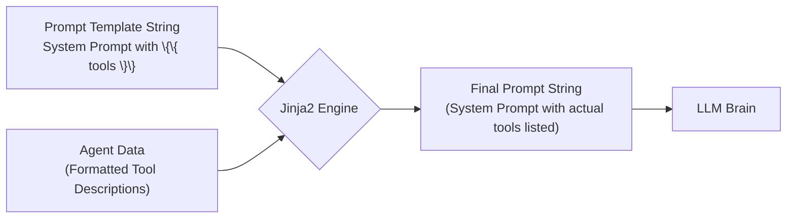

# Chapter 5: PromptTemplates - Crafting Your Agent's Script

Welcome back! In [Chapter 4: AgentMemory](04_agentmemory.md), we learned how our agent uses its "logbook" (`AgentMemory`) to remember the task, its past actions, and observations. This memory is crucial for deciding the next step.

But how exactly does the agent *use* this memory to talk to its LLM brain ([Chapter 2: Model Interface](02_model_interface.md))? How does it tell the LLM:
*   "Here's your overall job..."
*   "Here are the tools ([Chapter 3: Tool](03_tool.md)) you can use..."
*   "Here's the specific task..."
*   "Here's what happened so far..."
*   "Now, tell me what to do next!"

Simply dumping the raw memory might confuse the LLM. We need a structured way to present this information – like giving someone clear, consistent instructions. This is where **PromptTemplates** come in!

## The Problem: Giving Clear Instructions Every Time

Imagine you have a very capable assistant, but you need to explain their role and the current task *every single time* you talk to them. You'd want a standard way to do this, right? You'd probably have a template:

*   "Good morning! Remember, your main goal is [Overall Goal]."
*   "For this specific task, [Task Description], you have these resources available: [List of Resources]."
*   "So far, we've done [Summary of Progress]."
*   "What should we do next?"

If you just improvised every time, your instructions might be inconsistent, confusing, or miss important details.

Our AI agent faces the same challenge. It needs to send instructions (prompts) to the LLM at various points (like the very beginning, before each step, maybe when planning). These instructions need to include:
*   The agent's basic persona and rules.
*   Descriptions of the available [Tools](03_tool.md).
*   The current `task`.
*   Relevant parts of the [AgentMemory](04_agentmemory.md).

How can we manage these instructions effectively and dynamically include the specific details for the current situation?

## The Solution: Mad Libs for Agents! (`PromptTemplates`)

Remember Mad Libs? The game where you have a story template with blanks like `[NOUN]`, `[VERB]`, `[ADJECTIVE]`, and you fill them in to create a funny story?


**PromptTemplates** in `SmolaAgents` work a lot like that!

*   They are a collection of **pre-written instruction templates**.
*   These templates have **placeholders** (like `{{ task }}` or `{{ tools }}`) for information that changes with each run or step.
*   They use a powerful templating engine called **Jinja2** (common in web development) to fill in these blanks.
*   The `MultiStepAgent` automatically picks the right template, fills in the blanks with current data (like the task description, tool list from [Chapter 3: Tool](03_tool.md), or memory summary from [Chapter 4: AgentMemory](04_agentmemory.md)), and sends the final, complete prompt to the LLM.

This ensures the LLM gets clear, consistent, and context-rich instructions every time.

## What's Inside the `PromptTemplates` Collection?

The `PromptTemplates` object is essentially a structured dictionary holding different template strings for different situations. The main ones are:

1.  **`system_prompt`**: This is the **master instruction manual** given to the LLM at the very beginning of the conversation. It tells the LLM:
    *   Its overall role or personality (e.g., "You are a helpful assistant that uses tools...").
    *   The rules it must follow (e.g., "Always think step-by-step," "Use the `final_answer` tool when done.").
    *   **Crucially, the descriptions of the available `{{ tools }}` and `{{ managed_agents }}` (if any).** This is how the LLM learns what capabilities the agent has!
    *   The format it should use for its response (e.g., "Provide your reasoning in a 'Thought:' section and the action in a 'Code:' section").

2.  **`planning`**: This group contains templates used only if the agent's planning feature is turned on (often for more complex tasks). It includes templates for:
    *   Generating an initial plan based on the `{{ task }}` and `{{ tools }}`.
    *   Updating the plan based on progress stored in memory.
    *(Planning is a bit more advanced, so we won't focus heavily on these templates here).*

3.  **`final_answer`**: These templates are used in specific scenarios, like when the agent hits its maximum step limit (`max_steps`) and needs the LLM to try and generate a final answer based on the conversation history (`{{ task }}`, memory).

4.  **`managed_agent`**: If you build agents that can call *other* agents (like team members), these templates define how the calling agent instructs the "managed" agent (`{{ name }}`, `{{ task }}`) and how the result (`{{ final_answer }}`) is reported back.

The most important one for understanding basic agent behavior is the **`system_prompt`**. It sets the stage for the entire interaction.

## How It Works: Filling in the Blanks with Jinja2

Let's imagine a simplified `system_prompt` template:

```jinja
You are a helpful assistant.
Your task is to achieve the goal described by the user.
You have access to the following tools:
{{ tools }}

Think step-by-step and then choose a tool to use or use the final_answer tool.
```

Now, let's say our agent is created with a `SearchTool` and our `GreetingTool` from [Chapter 3: Tool](03_tool.md).

1.  **Agent Starts:** The `MultiStepAgent` needs to prepare the initial message for the LLM.
2.  **Get Template:** It retrieves the `system_prompt` template string.
3.  **Get Data:** It gets the list of actual tool instances (`[SearchTool(...), GreetingTool(...)]`). It formats their names and descriptions into a string. Let's say this formatted string is:
    ```
    - web_search: Searches the web...
    - greet_person: Greets a person by name...
    - final_answer: Use this when you have the final answer...
    ```
4.  **Fill Blanks (Render):** It uses the Jinja2 engine to replace `{{ tools }}` in the template with the formatted tool descriptions.
5.  **Final Prompt:** The resulting prompt sent to the LLM would be:

    ```text
    You are a helpful assistant.
    Your task is to achieve the goal described by the user.
    You have access to the following tools:
    - web_search: Searches the web...
    - greet_person: Greets a person by name...
    - final_answer: Use this when you have the final answer...

    Think step-by-step and then choose a tool to use or use the final_answer tool.
    ```

This final, complete prompt gives the LLM all the context it needs to start working on the user's task.

Here's a diagram of the process:



The agent uses similar logic for other templates, inserting `{{ task }}`, snippets from [AgentMemory](04_agentmemory.md), etc., as needed.

## Using `PromptTemplates` in `SmolaAgents`

The good news is that `SmolaAgents` handles most of this automatically!

*   **Defaults:** When you create an agent like `CodeAgent` or `ToolCallingAgent`, it comes pre-loaded with sophisticated default `PromptTemplates` tailored for that agent type. These defaults live in YAML files within the `SmolaAgents` library (e.g., `prompts/code_agent.yaml`, `prompts/toolcalling_agent.yaml`). These files define the `system_prompt`, `planning` prompts, etc., with all the necessary placeholders.

*   **Automatic Loading:** The agent's `__init__` method loads these default templates unless you explicitly provide your own.

Let's look at a simplified snippet from `agents.py` showing how a `CodeAgent` might initialize its system prompt:

```python
# --- File: agents.py (Simplified CodeAgent __init__ and initialize_system_prompt) ---
import yaml
import importlib.resources
from .tools import Tool # From Chapter 3
from .agents import MultiStepAgent, populate_template, PromptTemplates # Helper function

class CodeAgent(MultiStepAgent):
    def __init__(
        self,
        tools: list[Tool],
        model: callable,
        prompt_templates: PromptTemplates | None = None, # Allow custom templates
        # ... other parameters ...
    ):
        # 1. Load default templates if none provided
        if prompt_templates is None:
            # Find the default 'code_agent.yaml' file
            default_yaml_path = importlib.resources.files("smolagents.prompts").joinpath("code_agent.yaml")
            # Load the templates from the YAML file
            prompt_templates = yaml.safe_load(default_yaml_path.read_text())

        # 2. Call the parent class init, passing the templates along
        super().__init__(
            tools=tools,
            model=model,
            prompt_templates=prompt_templates, # Use loaded or provided templates
            # ... other parameters ...
        )
        # ... rest of CodeAgent setup ...
        # self.system_prompt is set later using initialize_system_prompt

    def initialize_system_prompt(self) -> str:
        """Creates the final system prompt string by filling the template."""
        # 3. Get necessary data (tools, managed agents, authorized imports)
        formatted_tools = # ... format self.tools for the template ...
        formatted_managed_agents = # ... format self.managed_agents ...
        authorized_imports = # ... get list of allowed imports for CodeAgent ...

        # 4. Use the populate_template helper to fill in the blanks
        system_prompt_string = populate_template(
            template=self.prompt_templates["system_prompt"], # Get the template string
            variables={ # Provide the data for the placeholders
                "tools": formatted_tools,
                "managed_agents": formatted_managed_agents,
                "authorized_imports": authorized_imports,
                # ... other potential variables ...
            }
        )
        return system_prompt_string

    # ... other CodeAgent methods ...

# --- Helper function used internally (Simplified from agents.py) ---
from jinja2 import Template, StrictUndefined

def populate_template(template: str, variables: dict) -> str:
    """Renders a Jinja2 template string with given variables."""
    compiled_template = Template(template, undefined=StrictUndefined)
    try:
        # This does the magic of replacing {{ placeholder }} with actual values
        return compiled_template.render(**variables)
    except Exception as e:
        raise Exception(f"Error rendering Jinja template: {e}")

```

**Explanation:**

1.  **Load Defaults:** If the user doesn't provide custom `prompt_templates` when creating a `CodeAgent`, it loads the defaults from the `code_agent.yaml` file.
2.  **Store Templates:** The loaded templates (either default or custom) are stored within the agent instance (via the `super().__init__` call).
3.  **Get Data:** When the agent needs the final system prompt (e.g., during `run`), the `initialize_system_prompt` method gathers the current list of tools, managed agents, etc.
4.  **Render Template:** It calls the `populate_template` helper function. This function uses Jinja2's `Template(...).render(...)` to take the `system_prompt` template string and the collected `variables` (tools, etc.) and produces the final, ready-to-use prompt string.

*For beginners, you usually don't need to write your own templates. The defaults are designed to work well.* However, understanding that these templates exist and how they work helps you understand *why* the agent behaves the way it does and how it knows about its tools.

If you *do* want to see what these templates look like, you can inspect the `.yaml` files inside the `smolagents/prompts/` directory in the library's source code. For example, here's a small part of a typical `system_prompt` for a `CodeAgent`:

```yaml
# --- Snippet from prompts/code_agent.yaml ---
system_prompt: |-
  You are an expert assistant who can solve any task using code blobs.
  # ... (lots of instructions and examples) ...

  You only have access to these tools:
  
  - {{ tool.name }}: {{ tool.description }}
      Takes inputs: {{tool.inputs}}
      Returns an output of type: {{tool.output_type}}
  

  
  You can also give tasks to team members.
  # ... (instructions for managed agents) ...
  
  - {{ agent.name }}: {{ agent.description }}
  
  

  Here are the rules you should always follow:
  # ... (more rules) ...
  You can use imports in your code, but only from the following list of modules: {{authorized_imports}}
  # ... (rest of the prompt) ...
```


You can see the `{{ tools }}`, `{{ managed_agents }}`, and `{{ authorized_imports }}` placeholders ready to be filled in. The `` syntax is Jinja2's way of looping through lists (like the list of tools).


## Conclusion

`PromptTemplates` are the unsung heroes that shape the conversation between the agent and its LLM brain. They act like customizable scripts or Mad Libs templates, ensuring the LLM receives clear, consistent instructions filled with the specific details it needs (like the task, available tools, and memory context).

You've learned:


*   Why structured prompts are necessary for guiding LLMs effectively.
*   The "Mad Libs" analogy for `PromptTemplates`.
*   How Jinja2 is used to fill placeholders like `{{ task }}` and `{{ tools }}`.
*   The main types of prompts stored (`system_prompt`, `planning`, `final_answer`).
*   That `SmolaAgents` provides sensible default templates, especially the crucial `system_prompt`.
*   How the agent automatically renders these templates with current data before sending them to the LLM.


Understanding `PromptTemplates` helps you grasp how the agent frames its requests to the LLM. While you might stick to the defaults initially, knowing this mechanism exists opens the door to customizing agent behavior later on.

One of the most powerful tools often described in these prompts, especially for `CodeAgent`, is the ability to execute Python code. How is that done safely? Let's find out!

**Next Chapter:** [Chapter 6: PythonExecutor](06_pythonexecutor.md) - Running Code Safely.

---

Generated by [AI Codebase Knowledge Builder](https://github.com/The-Pocket/Tutorial-Codebase-Knowledge)
