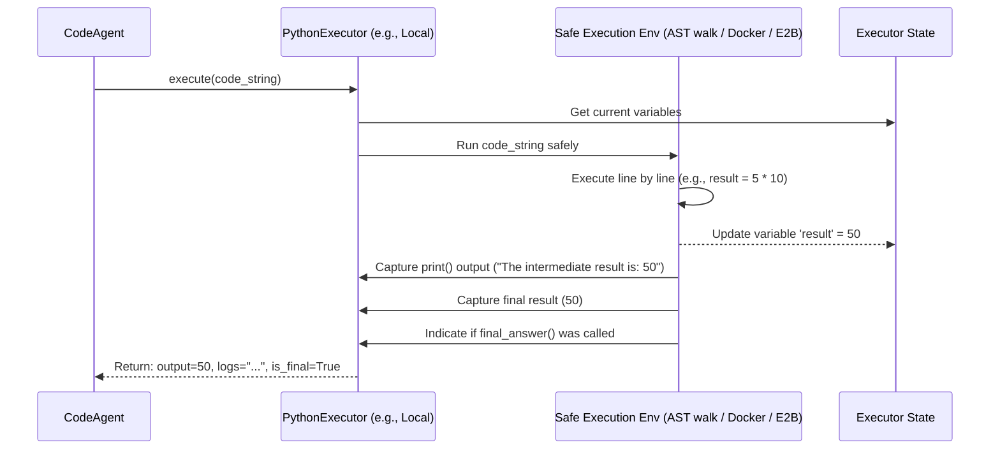

# Chapter 6: PythonExecutor - Running Code Safely

Welcome back! In [Chapter 5: PromptTemplates](05_prompttemplates.md), we saw how agents use templates to create clear instructions for their LLM brain. These instructions often involve asking the LLM to generate code, especially for agents like `CodeAgent`, which are designed to solve problems by writing and running Python.

But wait... running code generated by an AI? Isn't that risky? What if the AI generates code that tries to delete your files, access sensitive information, or just crashes?

This is a very valid concern! You wouldn't want an AI assistant to accidentally (or intentionally!) cause harm to your computer. We need a secure way to run this generated code.

This is exactly the problem the **`PythonExecutor`** solves!

## The Problem: Running Untrusted Code

Imagine you have a brilliant but slightly unpredictable scientist (the `CodeAgent`) who comes up with new experiments (Python code snippets) to solve problems. You want the results of these experiments, but you can't let the scientist run them directly in your main lab (your computer) because they might spill dangerous chemicals or break expensive equipment.

 ➡️ 🔥💻 (Danger!)

Directly executing AI-generated code is like letting that unpredictable scientist run wild. We need a controlled environment.

## The Solution: The Secure Laboratory (`PythonExecutor`)

The `PythonExecutor` acts like a **secure, isolated laboratory** or a **sandbox** for the code generated by the `CodeAgent`.

 <-> 👨‍🔬 CodeAgent

Think of it this way:

1.  **Isolation:** The `PythonExecutor` creates a safe space, separate from your main system, where the code can run. If the code tries to do something harmful, the damage is contained within this sandbox and doesn't affect your computer.
2.  **Execution:** It takes the Python code snippet provided by the `CodeAgent` and runs it within this safe environment.
3.  **State Management:** Just like a real lab keeps track of ongoing experiments, the `PythonExecutor` can remember variables and the state *between* different code snippets run in sequence. If one snippet calculates `x = 5`, the next snippet run by the same executor will know the value of `x`.
4.  **Capture Results:** It carefully observes what happens inside the sandbox, capturing any output produced by the code (like results from `print()` statements) and the final result of the code snippet.
5.  **Handle Errors:** If the code crashes or produces an error, the `PythonExecutor` catches the error message instead of letting it crash the whole agent.

Essentially, the `PythonExecutor` allows the `CodeAgent` to "run experiments" safely and report back the findings (or failures) without endangering the outside world.

## How Does the `CodeAgent` Use It? (Mostly Automatic!)

For beginners, the great news is that the `CodeAgent` handles the `PythonExecutor` automatically! When you create a `CodeAgent`, it usually sets up a `PythonExecutor` behind the scenes.

```python
# --- File: create_code_agent.py ---
from smolagents import CodeAgent
from smolagents.models import LiteLLMModel # From Chapter 2
# Assume we have some tools defined, maybe a search tool
from smolagents.tools import DuckDuckGoSearchTool

search_tool = DuckDuckGoSearchTool()

# Choose a language model
llm = LiteLLMModel(model_id="gpt-4-turbo") # Needs API key setup

# Create the CodeAgent
# It automatically creates a PythonExecutor internally!
agent = CodeAgent(
    model=llm,
    tools=[search_tool],
    # By default, executor_type="local" is used
)

print("CodeAgent created with an internal PythonExecutor.")

# Now, when you run the agent:
# task = "Calculate the square root of 1764 and tell me the result."
# result = agent.run(task)
# print(f"Result: {result}")
# --> The agent will generate code like "import math; result = math.sqrt(1764); final_answer(result)"
# --> It will pass this code to its PythonExecutor to run safely.
# --> The executor runs it, captures the result (42.0), and returns it to the agent.
# --> The agent then uses the final_answer tool.
```

**Explanation:**

*   When we create `CodeAgent`, we don't explicitly create a `PythonExecutor`. The `CodeAgent`'s initialization logic does this for us.
*   By default, it uses a `LocalPythonExecutor`, which runs the code in a restricted local environment.
*   When `agent.run()` is called, and the LLM generates Python code, the `CodeAgent` automatically passes that code to its internal `python_executor` instance for execution.

## Local vs. Remote Execution

`SmolaAgents` offers different types of executors for varying levels of security and environment needs:

1.  **`LocalPythonExecutor` (Default):**
    *   Runs the code within the same Python process as your agent, but uses clever techniques (like parsing the code's Abstract Syntax Tree - AST) to restrict dangerous operations (like file system access or arbitrary imports).
    *   It's the simplest to set up (usually requires no extra installation).
    *   It's generally safe for many tasks, but a very complex or malicious piece of code *might* potentially find ways around the restrictions (though this is difficult).

2.  **`DockerExecutor`:**
    *   Runs the code inside a separate Docker container. Docker provides strong isolation from your main system.
    *   Requires Docker to be installed and running on your machine.
    *   Offers better security than the local executor.

3.  **`E2BExecutor` (Environment-to-Behavior):**
    *   Uses a cloud service (E2B.dev) to provide secure, sandboxed cloud environments for code execution.
    *   Requires an E2B account and API key.
    *   Offers very strong security and avoids needing Docker locally, but relies on an external service.

**How to Choose?**

*   **Beginners:** Stick with the default `LocalPythonExecutor`. It's usually sufficient and requires no extra setup.
*   **Need Higher Security:** If you're running potentially riskier code or need stronger guarantees, consider `DockerExecutor` (if you have Docker) or `E2BExecutor`.

You can specify the executor type when creating the `CodeAgent`:

```python
# Example: Using a Docker executor (if Docker is installed and running)
docker_agent = CodeAgent(
    model=llm,
    tools=[search_tool],
    executor_type="docker" # Tell the agent to use Docker
    # You might need to pass executor_kwargs for specific configurations
)

# Example: Using E2B (requires E2B setup and API key in environment)
# pip install 'smolagents[e2b]'
e2b_agent = CodeAgent(
    model=llm,
    tools=[search_tool],
    executor_type="e2b" # Tell the agent to use E2B
)
```

For the rest of this chapter, we'll mostly focus on the concepts common to all executors, using the default `LocalPythonExecutor` as the main example.

## Under the Hood: How Execution Works

Let's trace what happens when `CodeAgent` decides to run a piece of code:

1.  **Agent (Think):** The LLM generates a response containing Python code, like:
    ```python
    # Thought: I need to calculate 5 * 10.
    result = 5 * 10
    print(f"The intermediate result is: {result}")
    final_answer(result)
    ```
2.  **Agent (Act - Parse):** The `CodeAgent` extracts the Python code block.
3.  **Agent (Act - Execute):** The `CodeAgent` calls its `python_executor` instance, passing the code string. `output, logs, is_final = self.python_executor(code_string)`
4.  **Executor (Prepare):** The `PythonExecutor` (e.g., `LocalPythonExecutor`) gets ready. It knows the current state (variables defined in previous steps).
5.  **Executor (Run Safely):**
    *   `LocalPythonExecutor`: Parses the code into an Abstract Syntax Tree (AST). It walks through the tree, evaluating allowed operations (math, variable assignments, safe function calls) and blocking dangerous ones (like `os.system`). It executes the code within the current `state`.
    *   `DockerExecutor`/`E2BExecutor`: Sends the code to the remote environment (Docker container or E2B sandbox) for execution.
6.  **Executor (Capture):** It intercepts any output sent to `print()` (captured in `logs`) and gets the final value returned by the code block (if any, captured in `output`). It also checks if the special `final_answer()` function was called (indicated by `is_final`).
7.  **Executor (Update State):** If the code assigned variables (like `result = 50`), the executor updates its internal `state` dictionary.
8.  **Agent (Observe):** The `CodeAgent` receives the `output`, `logs`, and `is_final` flag from the executor. This becomes the "Observation" for the current step. If `is_final` is true, the agent knows the task is complete.

**Diagram:**



## Code Glimpse: Where is the Executor Used?

Let's look at simplified snippets showing the key interactions.

*   **`CodeAgent` Initialization (`agents.py`):** Creates the executor instance.

    ```python
    # --- File: agents.py (Simplified CodeAgent __init__) ---
    from .local_python_executor import LocalPythonExecutor, PythonExecutor
    from .remote_executors import DockerExecutor, E2BExecutor

    class CodeAgent(MultiStepAgent):
        def __init__(
            self,
            # ... model, tools, etc. ...
            executor_type: str | None = "local", # Default is local
            executor_kwargs: Optional[Dict[str, Any]] = None,
            additional_authorized_imports: Optional[List[str]] = None,
            max_print_outputs_length: Optional[int] = None,
            # ... other kwargs ...
        ):
            # ... setup basic agent parts ...
            self.executor_type = executor_type or "local"
            self.executor_kwargs = executor_kwargs or {}
            self.additional_authorized_imports = additional_authorized_imports or []
            self.max_print_outputs_length = max_print_outputs_length

            # Create the appropriate executor instance based on type
            self.python_executor: PythonExecutor = self.create_python_executor()

            # ... rest of setup ...
            # Send initial state/tools to executor if needed
            if getattr(self, "python_executor", None):
                self.python_executor.send_variables(variables=self.state)
                self.python_executor.send_tools({**self.tools, **self.managed_agents})


        def create_python_executor(self) -> PythonExecutor:
            """Helper method to create the executor instance."""
            match self.executor_type:
                case "e2b":
                    return E2BExecutor(self.additional_authorized_imports, self.logger, **self.executor_kwargs)
                case "docker":
                    return DockerExecutor(self.additional_authorized_imports, self.logger, **self.executor_kwargs)
                case "local":
                    return LocalPythonExecutor(
                        self.additional_authorized_imports,
                        max_print_outputs_length=self.max_print_outputs_length,
                    )
                case _:
                    raise ValueError(f"Unsupported executor type: {self.executor_type}")
    ```
    *   The `CodeAgent` takes `executor_type` and related arguments.
    *   The `create_python_executor` method instantiates the correct class (`LocalPythonExecutor`, `DockerExecutor`, or `E2BExecutor`).
    *   Initial tools and state might be sent to the executor using `send_tools` and `send_variables`.

*   **`CodeAgent` Step Execution (`agents.py`):** Uses the executor instance.

    ```python
    # --- File: agents.py (Simplified CodeAgent step) ---
    from .utils import parse_code_blobs # Helper to extract code
    from .local_python_executor import fix_final_answer_code # Helper

    class CodeAgent(MultiStepAgent):
        def step(self, memory_step: ActionStep) -> Union[None, Any]:
            # ... (Agent thinks, gets LLM response with code) ...
            model_output = chat_message.content

            # Parse the code from the LLM response
            try:
                # parse_code_blobs finds ```python ... ``` blocks
                # fix_final_answer ensures `final_answer = x` becomes `final_answer(x)`
                code_action = fix_final_answer_code(parse_code_blobs(model_output))
            except Exception as e:
                # Handle parsing errors
                raise AgentParsingError(...)

            # === Execute the code using the PythonExecutor ===
            self.logger.log_code(title="Executing parsed code:", content=code_action, ...)
            try:
                # THE CORE CALL to the executor
                output, execution_logs, is_final_answer = self.python_executor(code_action)

                # Store results in memory step
                memory_step.observations = f"Execution logs:\n{execution_logs}\nLast output:\n{output}"
                memory_step.action_output = output

            except Exception as e:
                # Handle execution errors reported by the executor
                raise AgentExecutionError(...)

            # Return the output if it's the final answer, otherwise None
            return output if is_final_answer else None
            # ...
    ```
    *   The `step` method gets code from the LLM.
    *   It calls `self.python_executor(code_action)`. This triggers the executor's `__call__` method.
    *   It receives the `output`, `logs`, and `is_final_answer` flag back from the executor.

*   **`LocalPythonExecutor` Execution (`local_python_executor.py`):** The core logic for local execution.

    ```python
    # --- File: local_python_executor.py (Simplified LocalPythonExecutor __call__) ---
    from .local_python_executor import evaluate_python_code # The safe evaluation function
    from .tools import Tool # For type hinting

    class LocalPythonExecutor(PythonExecutor):
        def __init__(self, additional_authorized_imports, max_print_outputs_length=None):
            self.custom_tools = {} # Stores functions defined in code
            self.state = {} # Stores variables
            self.max_print_outputs_length = max_print_outputs_length or 50000
            self.additional_authorized_imports = additional_authorized_imports
            self.authorized_imports = # ... combine base and additional imports ...
            self.static_tools = None # Will hold agent tools + safe builtins

        def __call__(self, code_action: str) -> Tuple[Any, str, bool]:
            """Runs the code using the safe evaluate_python_code function."""
            output, is_final_answer = evaluate_python_code(
                code=code_action,
                static_tools=self.static_tools, # Tools provided by the agent
                custom_tools=self.custom_tools, # Functions defined during execution
                state=self.state, # Current variables
                authorized_imports=self.authorized_imports, # Allowed imports
                max_print_outputs_length=self.max_print_outputs_length,
            )
            # Get captured print logs from the state
            logs = str(self.state.get("_print_outputs", ""))
            return output, logs, is_final_answer

        def send_variables(self, variables: dict):
            """Adds external variables to the executor's state."""
            self.state.update(variables)

        def send_tools(self, tools: Dict[str, Tool]):
            """Makes agent tools available to the executed code."""
            # Combine agent tools with safe Python builtins (like len, str, math functions)
            from .local_python_executor import BASE_PYTHON_TOOLS
            self.static_tools = {**tools, **BASE_PYTHON_TOOLS.copy()}

    # --- Also in local_python_executor.py ---
    def evaluate_python_code(code, static_tools, custom_tools, state, authorized_imports, ...):
        """
        Safely evaluates code by parsing to AST and walking the tree.
        - Parses `code` string into an Abstract Syntax Tree (AST).
        - Initializes `state['_print_outputs']` to capture prints.
        - Defines a `final_answer` wrapper to signal completion.
        - Iterates through AST nodes using `evaluate_ast`.
        - `evaluate_ast` recursively handles different node types (assignments, calls, loops etc.)
            - It uses `state` to read/write variables.
            - It checks calls against `static_tools` and `custom_tools`.
            - It enforces `authorized_imports`.
            - It blocks dangerous operations (e.g., direct `eval`, certain imports).
        - Returns the final `result` and `is_final_answer` flag.
        - Captures print outputs in `state['_print_outputs']`.
        - Handles errors gracefully.
        """
        # ... implementation details ...
        try:
            expression = ast.parse(code) # Parse code to AST
            # ... setup state, wrap final_answer ...
            for node in expression.body:
                 result = evaluate_ast(node, state, static_tools, custom_tools, authorized_imports) # Evaluate node-by-node
            # ... capture logs, handle exceptions ...
            return result, is_final_answer
        except FinalAnswerException as e:
             # ... capture logs ...
             return e.value, True # Special exception for final_answer
        except Exception as e:
             # ... capture logs, wrap error ...
             raise InterpreterError(...)

    def evaluate_ast(expression: ast.AST, state, static_tools, custom_tools, authorized_imports):
        """Recursive function to evaluate a single AST node safely."""
        # ... checks node type (ast.Assign, ast.Call, ast.Import, etc.) ...
        # ... performs the corresponding safe operation using state and tools ...
        # ... raises InterpreterError for disallowed operations ...
        pass
    ```
    *   The `LocalPythonExecutor`'s `__call__` method relies heavily on `evaluate_python_code`.
    *   `evaluate_python_code` parses the code into an AST and evaluates it node by node using `evaluate_ast`, maintaining `state` and respecting allowed `tools` and `authorized_imports`.
    *   The `send_variables` and `send_tools` methods prepare the `state` and available functions for the executor.

## Conclusion

The `PythonExecutor` is a critical safety component in `SmolaAgents`, especially when using `CodeAgent`. It provides a secure sandbox (local or remote) to execute AI-generated Python code, preventing potential harm while still allowing the agent to leverage code for complex calculations, data manipulation, and interacting with tools.

You've learned:

*   Why safe code execution is essential when dealing with AI-generated code.
*   The "secure laboratory" analogy for `PythonExecutor`.
*   Its key responsibilities: isolation, execution, state management, and capturing output/errors.
*   How `CodeAgent` uses it automatically (usually the `LocalPythonExecutor` by default).
*   The difference between `LocalPythonExecutor`, `DockerExecutor`, and `E2BExecutor`.
*   The basic flow of execution: Agent -> Executor -> Safe Environment -> State -> Executor -> Agent.
*   Where the executor is created and used within the `CodeAgent` code.

While you might not interact with the `PythonExecutor` directly very often as a beginner, understanding its role is crucial for trusting your agents and knowing how they perform code-based actions safely.

So far, we've seen `CodeAgent` and `ToolCallingAgent`. Are these the only types of agents? How can we define different agent behaviors?

**Next Chapter:** [Chapter 7: AgentType](07_agenttype.md) - Defining Agent Behaviors.

---

Generated by [AI Codebase Knowledge Builder](https://github.com/The-Pocket/Tutorial-Codebase-Knowledge)