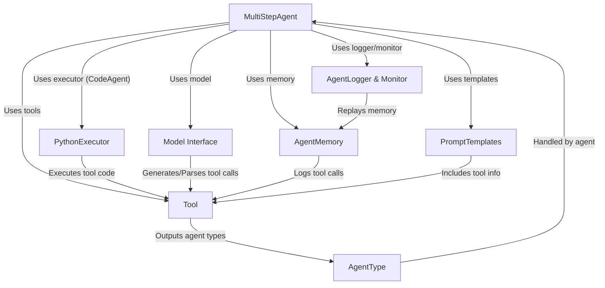

# Tutorial: SmolaAgents

> This tutorial is AI-generated! To learn more, check out [AI Codebase Knowledge Builder](https://github.com/The-Pocket/Tutorial-Codebase-Knowledge)

`SmolaAgents`[View Repo](https://github.com/huggingface/smolagents/tree/076cca5e8a130d3fa2ff990ad630231b49767745/src/smolagents) is a project for building *autonomous agents* that can solve complex tasks.
The core component is the **MultiStepAgent**, which acts like a project manager. It uses a **Model Interface** to talk to language models (LLMs), employs **Tools** (like web search or code execution) to interact with the world or perform actions, and keeps track of its progress and conversation history using **AgentMemory**.
For agents that write and run Python code (`CodeAgent`), a **PythonExecutor** provides a safe environment. **PromptTemplates** help structure the instructions given to the LLM, while **AgentType** handles different data formats like images or audio. Finally, **AgentLogger & Monitor** provides logging and tracking for debugging and analysis.

