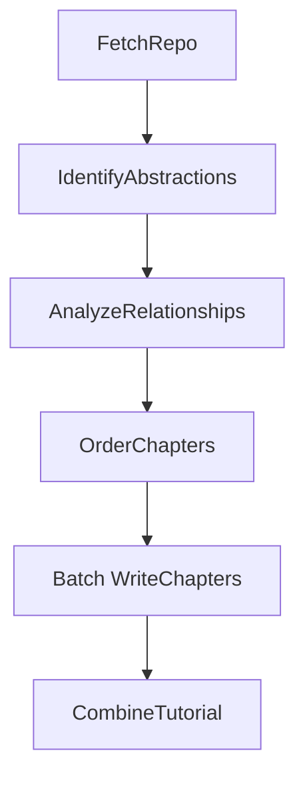

# System Design: Codebase Knowledge Builder

> Please DON'T remove notes for AI

## Requirements

> Notes for AI: Keep it simple and clear.
> If the requirements are abstract, write concrete user stories

**User Story:** As a developer onboarding to a new codebase, I want a tutorial automatically generated from its GitHub repository or local directory, optionally in a specific language. This tutorial should explain the core abstractions, their relationships (visualized), and how they work together, using beginner-friendly language, analogies, and multi-line descriptions where needed, so I can understand the project structure and key concepts quickly without manually digging through all the code.

**Input:**
- A publicly accessible GitHub repository URL or a local directory path.
- A project name (optional, will be derived from the URL/directory if not provided).
- Desired language for the tutorial (optional, defaults to English).

**Output:**
- A directory named after the project containing:
    - An `index.md` file with:
        - A high-level project summary (potentially translated).
        - A Mermaid flowchart diagram visualizing relationships between abstractions (using potentially translated names/labels).
        - An ordered list of links to chapter files (using potentially translated names).
    - Individual Markdown files for each chapter (`01_chapter_one.md`, `02_chapter_two.md`, etc.) detailing core abstractions in a logical order (potentially translated content).

## Flow Design

> Notes for AI:
> 1. Consider the design patterns of agent, map-reduce, rag, and workflow. Apply them if they fit.
> 2. Present a concise, high-level description of the workflow.

### Applicable Design Pattern:

This project primarily uses a **Workflow** pattern to decompose the tutorial generation process into sequential steps. The chapter writing step utilizes a **BatchNode** (a form of MapReduce) to process each abstraction individually.

1.  **Workflow:** The overall process follows a defined sequence: fetch code -> identify abstractions -> analyze relationships -> determine order -> write chapters -> combine tutorial into files.
2.  **Batch Processing:** The `WriteChapters` node processes each identified abstraction independently (map) before the final tutorial files are structured (reduce).

### Flow high-level Design:

1.  **`FetchRepo`**: Crawls the specified GitHub repository URL or local directory using appropriate utility (`crawl_github_files` or `crawl_local_files`), retrieving relevant source code file contents.
2.  **`IdentifyAbstractions`**: Analyzes the codebase using an LLM to identify up to 10 core abstractions, generate beginner-friendly descriptions (potentially translated if language != English), and list the *indices* of files related to each abstraction.
3.  **`AnalyzeRelationships`**: Uses an LLM to analyze the identified abstractions (referenced by index) and their related code to generate a high-level project summary and describe the relationships/interactions between these abstractions (summary and labels potentially translated if language != English), specifying *source* and *target* abstraction indices and a concise label for each interaction.
4.  **`OrderChapters`**: Determines the most logical order (as indices) to present the abstractions in the tutorial, considering input context which might be translated. The output order itself is language-independent.
5.  **`WriteChapters` (BatchNode)**: Iterates through the ordered list of abstraction indices. For each abstraction, it calls an LLM to write a detailed, beginner-friendly chapter (content potentially fully translated if language != English), using the relevant code files (accessed via indices) and summaries of previously generated chapters (potentially translated) as context.
6.  **`CombineTutorial`**: Creates an output directory, generates a Mermaid diagram from the relationship data (using potentially translated names/labels), and writes the project summary (potentially translated), relationship diagram, chapter links (using potentially translated names), and individually generated chapter files (potentially translated content) into it. Fixed text like "Chapters", "Source Repository", and the attribution footer remain in English.



## Utility Functions

> Notes for AI:
> 1. Understand the utility function definition thoroughly by reviewing the doc.
> 2. Include only the necessary utility functions, based on nodes in the flow.

1.  **`crawl_github_files`** (`utils/crawl_github_files.py`) - *External Dependency: requests, gitpython (optional for SSH)*
    *   *Input*: `repo_url` (str), `token` (str, optional), `max_file_size` (int, optional), `use_relative_paths` (bool, optional), `include_patterns` (set, optional), `exclude_patterns` (set, optional)
    *   *Output*: `dict` containing `files` (dict[str, str]) and `stats`.
    *   *Necessity*: Required by `FetchRepo` to download and read source code from GitHub if a `repo_url` is provided. Handles API calls or SSH cloning, filtering, and file reading.
2.  **`crawl_local_files`** (`utils/crawl_local_files.py`) - *External Dependency: None*
    *   *Input*: `directory` (str), `max_file_size` (int, optional), `use_relative_paths` (bool, optional), `include_patterns` (set, optional), `exclude_patterns` (set, optional)
    *   *Output*: `dict` containing `files` (dict[str, str]).
    *   *Necessity*: Required by `FetchRepo` to read source code from a local directory if a `local_dir` path is provided. Handles directory walking, filtering, and file reading.
3.  **`call_llm`** (`utils/call_llm.py`) - *External Dependency: LLM Provider API (e.g., Google GenAI)*
    *   *Input*: `prompt` (str), `use_cache` (bool, optional)
    *   *Output*: `response` (str)
    *   *Necessity*: Used by `IdentifyAbstractions`, `AnalyzeRelationships`, `OrderChapters`, and `WriteChapters` for code analysis and content generation. Needs careful prompt engineering and YAML validation (implicit via `yaml.safe_load` which raises errors).

## Node Design

### Shared Store

> Notes for AI: Try to minimize data redundancy

The shared Store structure is organized as follows:

```python
shared = {
    # --- Inputs ---
    "repo_url": None, # Provided by the user/main script if using GitHub
    "local_dir": None, # Provided by the user/main script if using local directory
    "project_name": None, # Optional, derived from repo_url/local_dir if not provided
    "github_token": None, # Optional, from argument or environment variable
    "output_dir": "output", # Default or user-specified base directory for output
    "include_patterns": set(), # File patterns to include
    "exclude_patterns": set(), # File patterns to exclude
    "max_file_size": 100000, # Default or user-specified max file size
    "language": "english", # Default or user-specified language for the tutorial

    # --- Intermediate/Output Data ---
    "files": [], # Output of FetchRepo: List of tuples (file_path: str, file_content: str)
    "abstractions": [], # Output of IdentifyAbstractions: List of {"name": str (potentially translated), "description": str (potentially translated), "files": [int]} (indices into shared["files"])
    "relationships": { # Output of AnalyzeRelationships
         "summary": None, # Overall project summary (potentially translated)
         "details": [] # List of {"from": int, "to": int, "label": str (potentially translated)} describing relationships between abstraction indices.
     },
    "chapter_order": [], # Output of OrderChapters: List of indices into shared["abstractions"], determining tutorial order
    "chapters": [], # Output of WriteChapters: List of chapter content strings (Markdown, potentially translated), ordered according to chapter_order
    "final_output_dir": None # Output of CombineTutorial: Path to the final generated tutorial directory (e.g., "output/my_project")
}
```

### Node Steps

> Notes for AI: Carefully decide whether to use Batch/Async Node/Flow. Removed explicit try/except in exec, relying on Node's built-in fault tolerance.

1.  **`FetchRepo`**
    *   *Purpose*: Download the repository code (from GitHub) or read from a local directory, loading relevant files into memory using the appropriate crawler utility.
    *   *Type*: Regular
    *   *Steps*:
        *   `prep`: Read `repo_url`, `local_dir`, `project_name`, `github_token`, `output_dir`, `include_patterns`, `exclude_patterns`, `max_file_size` from shared store. Determine `project_name` from `repo_url` or `local_dir` if not present in shared. Set `use_relative_paths` flag.
        *   `exec`: If `repo_url` is present, call `crawl_github_files(...)`. Otherwise, call `crawl_local_files(...)`. Convert the resulting `files` dictionary into a list of `(path, content)` tuples.
        *   `post`: Write the list of `files` tuples and the derived `project_name` (if applicable) to the shared store.

2.  **`IdentifyAbstractions`**
    *   *Purpose*: Analyze the code to identify key concepts/abstractions using indices. Generates potentially translated names and descriptions if language is not English.
    *   *Type*: Regular
    *   *Steps*:
        *   `prep`: Read `files` (list of tuples), `project_name`, and `language` from shared store. Create context using `create_llm_context` helper which adds file indices. Format the list of `index # path` for the prompt.
        *   `exec`: Construct a prompt for `call_llm`. If language is not English, add instructions to generate `name` and `description` in the target language. Ask LLM to identify ~5-10 core abstractions, provide a simple description for each, and list the relevant *file indices* (e.g., `- 0 # path/to/file.py`). Request YAML list output. Parse and validate the YAML, ensuring indices are within bounds and converting entries like `0 # path...` to just the integer `0`.
        *   `post`: Write the validated list of `abstractions` (e.g., `[{"name": "Node", "description": "...", "files": [0, 3, 5]}, ...]`) containing file *indices* and potentially translated `name`/`description` to the shared store.

3.  **`AnalyzeRelationships`**
    *   *Purpose*: Generate a project summary and describe how the identified abstractions interact using indices and concise labels. Generates potentially translated summary and labels if language is not English.
    *   *Type*: Regular
    *   *Steps*:
        *   `prep`: Read `abstractions`, `files`, `project_name`, and `language` from shared store. Format context for the LLM, including potentially translated abstraction names *and indices*, potentially translated descriptions, and content snippets from related files (referenced by `index # path` using `get_content_for_indices` helper). Prepare the list of `index # AbstractionName` (potentially translated) for the prompt.
        *   `exec`: Construct a prompt for `call_llm`. If language is not English, add instructions to generate `summary` and `label` in the target language, and note that input names might be translated. Ask for (1) a high-level summary and (2) a list of relationships, each specifying `from_abstraction` (e.g., `0 # Abstraction1`), `to_abstraction` (e.g., `1 # Abstraction2`), and a concise `label`. Request structured YAML output. Parse and validate, converting referenced abstractions to indices (`from: 0, to: 1`).
        *   `post`: Parse the LLM response and write the `relationships` dictionary (`{"summary": "...", "details": [{"from": 0, "to": 1, "label": "..."}, ...]}`) with indices and potentially translated `summary`/`label` to the shared store.

4.  **`OrderChapters`**
    *   *Purpose*: Determine the sequence (as indices) in which abstractions should be presented. Considers potentially translated input context.
    *   *Type*: Regular
    *   *Steps*:
        *   `prep`: Read `abstractions`, `relationships`, `project_name`, and `language` from the shared store. Prepare context including the list of `index # AbstractionName` (potentially translated) and textual descriptions of relationships referencing indices and using the potentially translated `label`. Note in context if summary/names might be translated.
        *   `exec`: Construct a prompt for `call_llm` asking it to order the abstractions based on importance, foundational concepts, or dependencies. Request output as an ordered YAML list of `index # AbstractionName`. Parse and validate, extracting only the indices and ensuring all are present exactly once.
        *   `post`: Write the validated ordered list of indices (`chapter_order`) to the shared store.

5.  **`WriteChapters`**
    *   *Purpose*: Generate the detailed content for each chapter of the tutorial. Generates potentially fully translated chapter content if language is not English.
    *   *Type*: **BatchNode**
    *   *Steps*:
        *   `prep`: Read `chapter_order` (indices), `abstractions`, `files`, `project_name`, and `language` from shared store. Initialize an empty instance variable `self.chapters_written_so_far`. Return an iterable list where each item corresponds to an *abstraction index* from `chapter_order`. Each item should contain chapter number, potentially translated abstraction details, a map of related file content (`{ "idx # path": content }`), full chapter listing (potentially translated names), chapter filename map, previous/next chapter info (potentially translated names), and language.
        *   `exec(item)`: Construct a prompt for `call_llm`. If language is not English, add detailed instructions to write the *entire* chapter in the target language, translating explanations, examples, etc., while noting which input context might already be translated. Ask LLM to write a beginner-friendly Markdown chapter. Provide potentially translated concept details. Include a summary of previously written chapters (potentially translated). Provide relevant code snippets. Add the generated (potentially translated) chapter content to `self.chapters_written_so_far` for the next iteration's context. Return the chapter content.
        *   `post(shared, prep_res, exec_res_list)`: `exec_res_list` contains the generated chapter Markdown content strings (potentially translated), ordered correctly. Assign this list directly to `shared["chapters"]`. Clean up `self.chapters_written_so_far`.

6.  **`CombineTutorial`**
    *   *Purpose*: Assemble the final tutorial files, including a Mermaid diagram using potentially translated labels/names. Fixed text remains English.
    *   *Type*: Regular
    *   *Steps*:
        *   `prep`: Read `project_name`, `relationships` (potentially translated summary/labels), `chapter_order` (indices), `abstractions` (potentially translated name/desc), `chapters` (list of potentially translated content), `repo_url`, and `output_dir` from shared store. Generate a Mermaid `flowchart TD` string based on `relationships["details"]`, using indices to identify nodes (potentially translated names) and the concise `label` (potentially translated) for edges. Construct the content for `index.md` (including potentially translated summary, Mermaid diagram, and ordered links to chapters using potentially translated names derived using `chapter_order` and `abstractions`). Define the output directory path (e.g., `./output_dir/project_name`). Prepare a list of `{ "filename": "01_...", "content": "..." }` for chapters, adding the English attribution footer to each chapter's content. Add the English attribution footer to the index content.
        *   `exec`: Create the output directory. Write the generated `index.md` content. Iterate through the prepared chapter file list and write each chapter's content to its corresponding `.md` file in the output directory.
        *   `post`: Write the final `output_path` to `shared["final_output_dir"]`. Log completion.